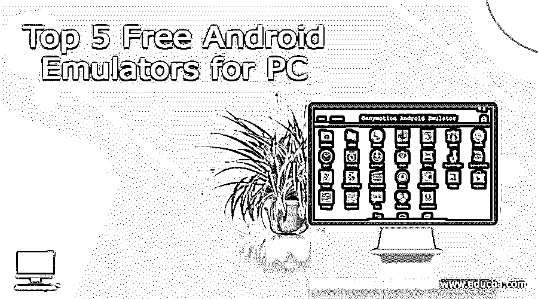
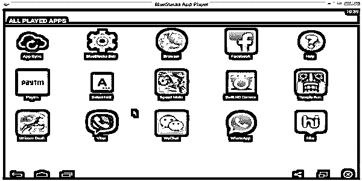
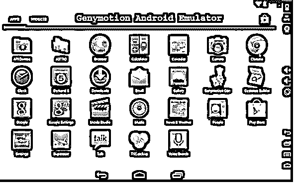
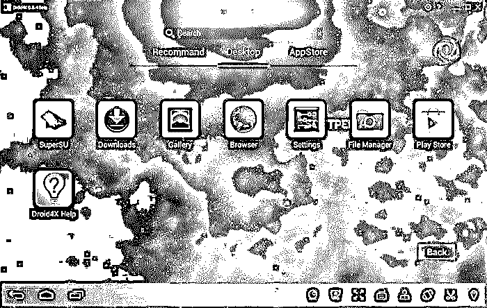
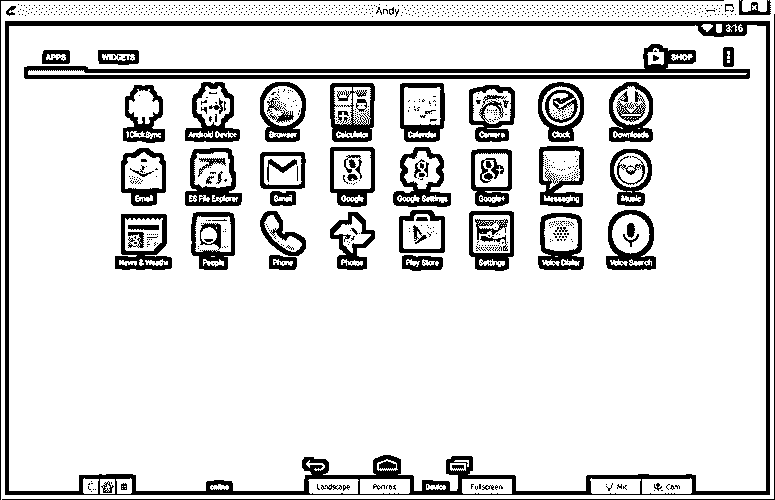
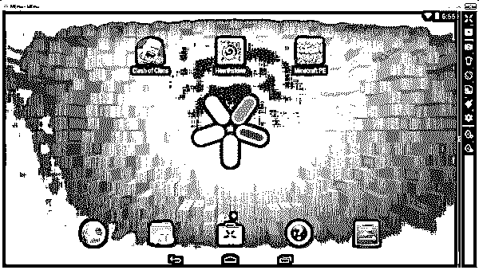

# 前 5 名免费的 Android 模拟器

> 原文：<https://www.educba.com/free-android-emulators-for-pc/>

Android 无疑是最受欢迎的智能手机操作系统，因为它拥有最多种类的应用程序和游戏。如果你没有 Android 设备，你仍然可以在你的 Windows 甚至 Mac 电脑或者装有 Android 模拟器的笔记本电脑上享受 Android 体验。

## 谁用安卓模拟器？

游戏开发商安装 Android 模拟器来测试应用程序或游戏，然后才正式在市场上发布。游戏玩家也可能喜欢安装 android 模拟器，因为它们可以增强游戏体验，并让你用鼠标或键盘控制游戏。或者用户可能只是安装它们来管理和组织他们的智能手机，备份或传输手机数据，或者下载比手机内存允许的更多的应用程序和游戏。正是因为这个原因，模拟器被命名为“app player”。模拟器还可以让你将 Android 手机上的应用程序和游戏与电脑同步。

<small>网页开发、编程语言、软件测试&其他</small>

### android 模拟器是如何工作的？

仿真器是一种程序，它允许主机系统执行客户系统的功能，并像客户系统一样工作。这意味着，即使 Android 智能手机或平板电脑没有连接到 Windows 电脑系统，你仍然可以在上面运行 Android。因此，你可以通过虚拟的 Android 设备从 Google Play 商店下载无限量的应用程序，这些应用程序将显示在你的电脑屏幕上。因此，你的个人电脑可以同时运行 Windows 操作系统和 Android 操作系统。

有各种各样的 Android 模拟器可供使用。但是每一个在某些方面都比另一个重要。本文列出了 PC 上的 5 大 Android 模拟器，以及它们独特的特性和缺点(如果有的话)。

1.  [T0】 Bluestacks Android Computer Simulator

我们将用于 Windows PC 的[**blue stacks**](https://alltechfeed.com/bluestacks-app-player-windows-7-8-1-pc-laptop-mac-os-x/)**Android Emulator**放在最顶端，原因很简单，它是全球超过 1.3 亿人的首选。它已经赢得了数以百万计的心，由于它的一些独家功能，可能是不存在于其他 Android 模拟器。

Bluestacks 可以让你在电脑上使用 WhatsApp，随时与朋友保持联系。在桌面上发送或接收 WhatsApp 消息、图片和视频。

凭借其最新的"**layer kake "**技术，即使是图形密集型游戏也能在您的台式机或笔记本电脑上无缝运行。它提供了全屏观看的乐趣，并增强了游戏体验。想象一下在你的电脑上玩部落冲突！

*   **易于安装&设置**–blue stacks 易于安装，只需在 Windows 操作系统上点击一下即可安装。你只需访问 Bluestacks 网站，并从那里下载应用程序。接下来，安装它，你就可以开始了。它有分裂-在线安装程序，以及低互联网连接的离线安装程序。

| Bluestacks Android 平台拥有超过 150 万个应用和游戏。 |

*   **用户友好—**blue stacks 拥有出色的界面。可以浏览、选择、安装大量游戏。可以从主屏幕顶部的栏中访问已安装的游戏。您也可以通过 Bluestacks 下载应用程序，并直接从谷歌 Play 商店安装。

*   **第三方 APK–**使用 Bluestacks 安装第三方 APK 和安卓应用程序非常简单。只需双击 APK 文件来安装它们。这排除了对其他第三方虚拟化(如 VirtualBox)的需求。

*   **多任务:**在 PC 上使用 Android 智能手机意味着可以同时使用 1 个以上的 app。例如，您可能正在玩游戏，同时也在 Whtsapp 聊天上接收消息。

不利的一面是，Bluestacks 的生产力功能有点迟钝，所以下载一些生产力应用程序是个好主意。

2.  ### Elf dust! Dust! Dust! Dust! Dust! Dust! Dust! Dust! Dust! Dust! Dust! Dust! Dust! Dust! Dust! Dust

我们的第二选择是 [**GenyMotion**](https://www.genymotion.com/) **，**一款针对 PC 的高级 Android 仿真器。它取代 Bluestacks 的一个领域是速度。它是在 x86 架构上构建的，这使得它比 Bluestacks 更快。在 Windows PC 上安装 GenyMotion 后，您需要在 Android 设备上安装它。它很好地适应了 Linux 和 Mac OS，除了 Windows。

Genymotion 主要是一个针对 Android 应用程序开发者的模拟器，因为它是测试 Android 应用程序及其行为的理想工具。它创造了理想的 Android 环境，因此用户可以在其上开发和测试他们的应用程序。它与 Android 完全兼容，以至于在你的 PC 上使用 GenyMotion 时，它开始像你的 Android 设备一样工作。因此，您可以呆在办公桌上，执行手机的所有功能，例如接听电话、发送短信、修改 GPS 位置、网络和电池电量。让我们详细了解一下 GenyMotion 可以为您的 Android 设备执行的所有功能:

*   **GPS:** 对于已经开发的应用程序来说，在谷歌位置上添加一个 GPS 小工具就可以很好地工作。
*   **电池:**为了确定每个新开发的 app 的电池使用情况，
*   **摄像头:**将你的笔记本电脑摄像头变成 Android 视频源。
*   **插件**:使用 Eclipse、Android Studio 等插件和 Android SDK tools 等测试工具，与 GenyMotion 配合使用毫不费力。
*   **浏览器** **兼容性测试**:一个网站在一个浏览器中的运行效率可能不如在另一个浏览器中。GenyMotion 允许开发者在不同的浏览器中测试运行网站。

现在让我们来看看 GenyMotion 的其他一些独特功能:

*   将文本从 windows 桌面计算机复制并粘贴到 GenyMotion 仿真器中，或者从仿真器复制并粘贴到您的 PC 上。
*   应用程序可以安装使用命令提示符或拖放功能。
*   [OpenGL](https://www.educba.com/opengl-in-android/) 和硬件加速支持是 GenyMotion 的一些高级特性。

然而有一个限制是你需要在你的系统上安装 Virtual Box 来运行它。

3.  [T0】 Droid4x Android computer simulator

在我的列表中排名第三的免费模拟器是 [Droid4x Android 模拟器](https://droid4x.en.lo4d.com/windows)。它因其性能、UX、用户友好的界面、兼容性、游戏可控性和图形而得分。与任何其他 PC 模拟器相比，它具有更多的功能。它与 Android 设备紧密结合，你在手机上做的所有事情都可以在电脑上完成。

让我们来看看它的一些独特功能:

*   **出色的表现**

Droid4x 表现出色。它拥有令人惊叹的游戏体验，屏幕更大，性能更快，比市场上任何其他 android 模拟器都要好。它还提供了惊人的图形体验。事实上，出色的图形可以说是它最大的优点。

*   **惊人的游戏可控性**

Droid 4x 是第一款支持多点触控的模拟器。有了它，你可以从你的 Android 手机上控制任何游戏或应用程序。这意味着，你的手机变成了你的游戏控制器，甚至可以让你在台式电脑上玩动作游戏，体验比在手机上玩更好..这个功能对游戏玩家来说很神奇。他们也可以使用电脑键盘或游戏杆来玩和控制游戏。这还不是全部！可以配置键盘控制。鼠标滚轮可用于放大或缩小。可能需要安装其中的一些功能。

*   **视频截图**

*   这是一个非常酷的功能。在玩游戏或使用应用程序时，您可以录制屏幕并在您的社交网络上共享。
*   对于涉及摇动手机的 Android 应用程序，Droid4X Android Emulator 有一个“摇动”选项，同样有效。
*   Droid4x 安卓模拟器可以调整到任意大小。
*   使您能够在 PC 和仿真器之间使用复制和粘贴命令。

4.  ### Andy Android Computer Simulator

排名第四的是免费模拟器 Andy。它运行几乎所有类型的 Android 应用程序，如生产力应用程序、启动应用程序和游戏应用程序。它在你的电脑和手机之间架起了一座桥梁。如果需要，它还允许您安装 root 访问权限。

安迪为用户提供了使用游戏和其他应用程序的全面体验。它很稳定，但有时会变得有点慢。有了 [Andy](https://andy-android-emulator.en.lo4d.com/windows) ，你可以轻松使用第三方启动器和小工具。

让我们来看看它的特性，其中大部分特性，您可以在上面讨论的模拟器中找到

*   游戏模拟器: Andy 是游戏玩家的理想选择，因为它主要是为在更大的 windows 屏幕上玩游戏而设计的。

*   **轻松移动控制:**您可以充分利用游戏中的多点触控或陀螺元素。用你的手机控制屏幕，把它当作操纵杆或控制器，就像我们在 Droid4x 中看到的那样。然而，安迪是第一个想出这个功能的人。
*   **通过浏览器安装:**这确实是安迪最好用的功能。它使您能够通过主机的桌面浏览器将任何应用程序直接安装到您的 Andy 仿真器中。
*   **定时更新**:定期发送更新，让用户了解[移动计算的最新趋势](https://www.educba.com/mobile-computing-applications-and-services/)。还提供手臂支撑，
*   提供桌面和移动设备之间的平滑同步，使您无需触摸即可操作手机。
*   **兼容性:** Andy 与您的 PC 100%兼容，让您可以选择在 PC 上玩所有流行的手机游戏。
*   启动推送通知，并为用户提供无限的存储容量。
*   它会自动将常用的应用程序放在桌面上

不利的一面是，安装可能不像 Bluestacks 那么简单，你必须安装一个虚拟的盒子来使用 Andy。此外，它不支持多人模式。

5.  ### MEmu emulator for PC

最后一个但绝对不是最不重要的是[MEmu](https://www.memuplay.com/)——免费的 Windows PC 模拟器。它的 USP 是它能够运行你的 Android 智能手机应用程序和应用程序，不仅可以在你的 Windows 桌面或笔记本电脑上运行，也可以在平板电脑等其他 Windows 设备上运行。有了 MEmu，你可以在 Windows 平台上运行 Android，而不需要安装任何其他 OS。

只需轻轻一点，MEmu 就可以轻松安装在您的电脑上，运行您的应用程序，没有任何麻烦。

*   **定制:**您可以定制各种规格，如内存、root 模式、CPU 等。
*   **控制器映射:**使用映射分辨率映射操纵杆或键盘等控制器，丰富您的游戏体验。
*   **多窗口:** MEmu 允许你通过打开多个 MEmu 窗口进行多任务。你可以一边玩你最喜欢的游戏，一边看电视直播。
*   **生产力:**在生产力方面，Memu 的排名比 bluestacks 好。它向你推荐应用程序和游戏，并把它们放在 MEmu market 上。或者，你可以从 Google play 商店下载你选择的应用程序
*   **GPS:** 使用 GPS 定位来实现 Android 和 Windows 之间的文件共享。
*   **多玩家模式**:让你轻松创建任意多的玩家。
*   **Plug & Play:** 你可以将& Play MEmu 与它的便携式版本相连接，这样你就可以从 USB 端口启动 MEmu，而无需安装任何软件..
*   **安卓系统创建:**鼠标一点创建一个新的安卓系统。这个功能可以让你在 Android 上同时创建、删除或运行各种功能。
*   安装 APK 不能比这更简单！安装 APk 只需使用拖放功能。

其他一些免费的 Android 模拟器，我想包括在这个列表中的有:Windroy，Youwave 和 Nox。

如前所述，并不缺乏 Android 模拟器，但是你选择什么，完全取决于你的需求。无论是玩游戏还是开发和测试游戏都是你的主要动机；无论你是追求高性能还是轻量级系统；对你来说，安装简单是否比下载应用简单更重要:这些因素将在很大程度上影响你对模拟器的选择。

希望这些信息能帮助你选择一个最适合你的目的。

### 推荐文章

因此，这里有一些相关的文章，这将有助于您获得更多关于 Android 手机应用程序的细节，所以只需浏览下面给出的链接

1.  [面向 PC 的 Android 模拟器](https://www.educba.com/free-android-emulators-for-pc/)
2.  [安卓安全应用](https://www.educba.com/android-security-applications/)
3.  [安卓软件](https://www.educba.com/android-software/)
4.  [安卓生产力](https://www.educba.com/android-productivity/)

