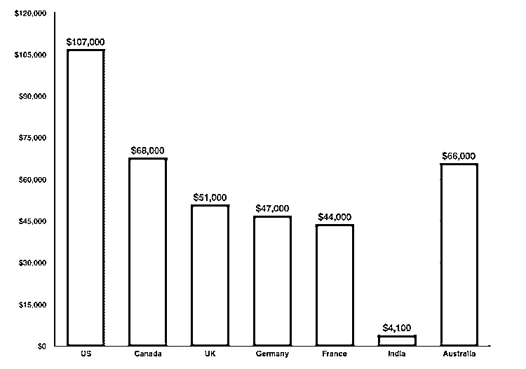
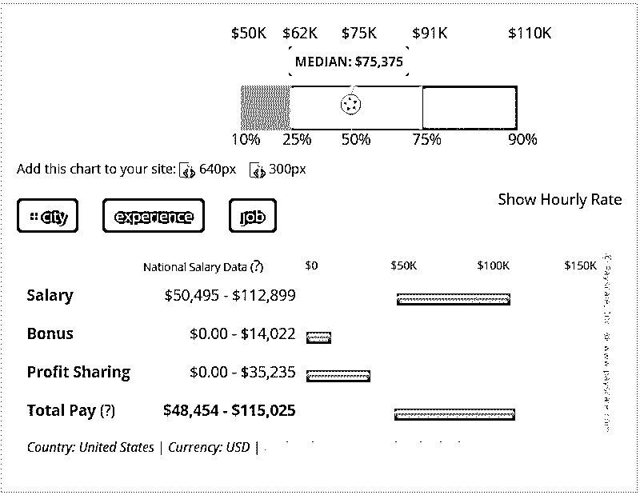

# Android 开发职业

> 原文：<https://www.educba.com/careers-in-android-development/>

## Android 开发职业介绍

移动市场此刻正在汹涌澎湃。这种扩张增加了对移动应用程序开发人员的需求，目前，他们有很多就业机会。2018 年是智能手机市场充满活力的一年。随着 [Android 应用开发商](https://www.educba.com/application-platforms/)占据市场份额——在所有移动操作系统中占据近 80%—[软件系统开发商](https://www.educba.com/system-software-tools/)等人在该平台上的长期表现更加光明。

以下是 Android 开发职业可以改变你的轨迹的几个原因:

<small>网页开发、编程语言、软件测试&其他</small>

*   目前全球有 14 亿活跃的 Android 开发设备，Android 以 82 的国际市场份额主导智能手机市场。
*   Inc .最近的一篇文章指出，除了当前的 Android 开发工作之外，还宣布了 83，649 个额外的[应用程序开发](https://www.educba.com/android-apps-development-tools/)工作，因此 Android 开发在他们的“2016 年 10 大最热门工作”名单中排名第二。
*   美国劳工统计局继续预测应用程序开发人员就业市场将出现令人难以置信的增长，预计未来 5 年将超过百分之二。

### Android 应用开发教育

你不能从床上爬起来，把自己和 Android 开发职业联系在一起。严肃的企业只会雇佣合格的专业人员来设计他们的应用程序。你必须精通广泛的编程语言，并且拥有学位。[移动计算](https://www.educba.com/mobile-computing-applications-and-services/)、[、](https://www.educba.com/data-science-vs-software-engineering/)工程科学和软件系统工程可能适合你，如果你不希望你的学位的主要目标是专门从事移动应用开发的话。
大多数雇主要求移动应用程序开发人员至少拥有软件系统工程、移动应用程序开发、移动计算、工程科学或类似的以编程为中心的研究领域的学位。android 开发职位的招聘经理将希望检查已完成的 android 应用程序开发人员的样本组合。随后的本科生和研究生学位课程通过积极的课程来满足这些需求，学生可以为领先的移动平台制作各种应用程序，并通过专门的课程将自己展示为移动开发人员职位的高候选人，在这些课程中，积极的移动开发从业者可以帮助您将整个课程中创建的应用程序组装成特定行业的产品组合、简历和求职信。

在移动开发教育项目中需要的适销技能包括
【面向对象编程(OOP)
[Java 编程](https://www.educba.com/java-programming-language-features/)(Java SE/ME/EE)
[JavaScript](https://www.educba.com/web-development-frameworks/)、HTML、CSS
Objective-C 和 C++编程、用户界面(UI)风格
游戏&模拟编程
移动应用组合汇编
数据库&操作系统基础知识移动媒体推广。

然而，市场上并没有几种移动应用程序开发证书，但是由于工作领域持续增长，我们将会看到每种特定于供应商和供应商中立的移动开发证书的涌入。目前针对移动应用开发人员的认证包括:

*   ATC [安卓认证应用开发者](https://www.educba.com/application-platforms/)
*   IBM 认证移动应用开发人员–work light v 6.0
*   SAP 认证开发助理–SAP Sybase 无线平台一对一. 1 移动应用开发人员
*   移动开发协会认证开发者(MDICD)
*   Logical Operations 的移动应用程序开发大师(MMAD)

### Android 开发中的职业道路

在这里，它清楚地表明，在 Android 开发的职业生涯是一个有前途的职业方法的专业人士，联合国机构只是喜欢制作应用程序。

拥有移动开发技能的 IT 专业人士是炙手可热的神器，刻不容缓。Android 开发方面的职业需求。更热。与移动技术领域的其他专业人士相比，雇主正在更快、更多地招聘 Android 应用程序开发人员。与 CyberCoders 的首席技术官马特·米勒(Matt Miller)一致，“对于专门研究并了解 Android 软件包的移动程序员来说，现在是提升你的 Android 技能和就业形象的最佳时机。”

无论是大企业还是小企业，都在不断招聘应用程序开发人员。移动应用程序开发通常是不愉快的，然而坚韧和专注的开发人员可以重新访问远远超过他们所放置的内容。

### 大型机中的工作职位

移动设备市场正以危险的速度增长。一些评论家甚至将 2010 年的 android 应用程序开发者运动与 20 世纪 90 年代中期的网络爆炸相提并论。这种增长正在满足对移动应用程序开发者的巨大需求。移动设备的兴起为每家公司和自由职业的移动应用程序开发人员创造了大量就业机会，因为智能手机和平板电脑不断改变着人们交流、做生意、购物和获取新闻的方式。

印度共和国目前有大约 2.2 亿明智的电话用户。其中大部分——大约 80%——是安卓用户。到 2020 年，明智的手机用户数量预计将达到 8.1 亿。此外，Android 应用程序开发人员和用户的数量也将随着这一增长而循环增长。

根据招聘经理和 IT 招聘人员的说法，对热门移动应用程序开发人员的需求仍然远远超过供应。许多雇用移动应用程序开发人员的最广泛的行业包括游戏工作室、旨在为购物者创建品牌应用程序的广告和推广公司、承认移动是强大的内容营销的媒体公司、希望为移动用户提供核心服务的政府机构和金融机构、软件系统开发公司和土地代理机构。

Android 应用程序开发的就业市场预计将在 2024 年创造超过 135，000 个新职位。

您在移动应用程序开发方面的专业知识和指导可以让您胜任一系列受欢迎的工作角色，包括:

*   移动应用开发者
*   android 应用开发者
*   iPhone/iOS 应用程序开发者
*   Windows Mobile 应用开发人员
*   软件工程师
*   Java 应用开发人员
*   目标 C 开发人员

### Android 开发人员工资

我们并不一直希望承认现金是多么重要，但是，让我们诚实。现金非常重要。根据 SHRM 人力资源管理协会最近的一项研究，“工作满意度的三大驱动因素是对最低级别员工的尊重、薪酬和优势。”因此，然而，android 开发者的情况如何呢？我们会看到什么？android 开发者的成本在 52.4 万美元到 13.6 万美元之间。那就好！如果你想更深入地挖掘，点击 PAYSA 模块，你会得到从角色和技能到股权和奖金的所有信息。(年均奖金？一万五千美元。不算太寒酸！)

根据 Indeed.com-
移动应用程序开发人员和相关职位平均工资:
移动软件系统工程师:9.4 万美元
移动应用程序开发人员:9.4 万美元
Android 应用程序开发人员:9.7 万美元
高级 Android 开发人员:10.7 万美元
高级移动开发人员:11.1 万美元
Javascript Jquery 开发人员:12.4 万美元

Conclusion or Career Outlook

我想你知道那个著名的关于树木和声音的哲学思想实验:“如果一棵树在森林里倒下，没有人在旁边听它，它会发出声音吗？”就个人而言，我认为解决方案是…好吧，无论如何，目的是如果一个 Android 应用程序不在 Google Play 商店中，没有人会去使用它。然而，让你的新应用进入 Google Play 商店几乎是不可能的，对吗？你会独自想象它的价值。然而实际上，它一点也不贵。事实上，它只卖 25 美元。所以，卷起袖子，准备成为一名 Android 应用开发者吧。

### 推荐文章

这是 Android 开发职业的指南。在这里，我们讨论了 Android 开发中的简介、教育、职业道路、工作职位、工资和职业前景。您也可以看看下面的文章，了解更多信息——

1.  软件开发人员的职业
2.  [商业智能职业](https://www.educba.com/career-in-business-intelligence/)
3.  [商业管理职业](https://www.educba.com/career-in-business-management/)
4.  [社交媒体职业](https://www.educba.com/career-in-social-media/)

