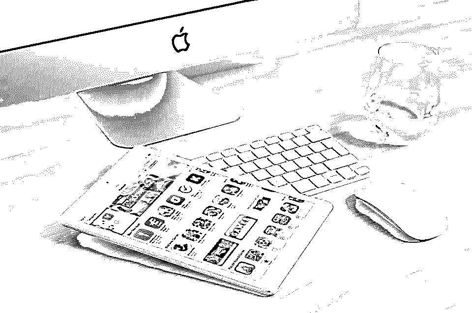
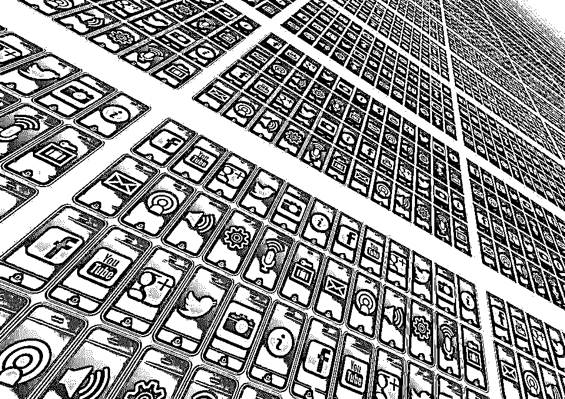

# Android 应用开发工具

> 原文：<https://www.educba.com/android-apps-development-tools/>

## 如何创建 Android 应用程序开发工具？

所以你想创造出震撼的 Android 应用开发工具？你不是唯一一个。在这里，领先的应用程序开发者揭示了他们成功的秘密。希望这些惊人的提示能帮助你开始，并以最好的方式创建 Android 应用程序开发工具。领先的 Android 设计者和开发者可以从这些简单的技巧中受益。新手和初学者也可以！

### 创建 Android 应用程序开发工具的技巧

以下是一些提示:

<small>网页开发、编程语言、软件测试&其他</small>

#### 1.创建完全使用硬件的应用程序

这是一个艰难的市场，所以你需要创建直观的应用程序开发工具。要做到这一点，最好使用手机按钮来防止屏幕混乱。Android 应用程序的编程按钮应该以这样一种方式完成，用户可以理解和期望某种类型的功能和操作效率。最常见的错误是反向链接——每个 Android 设备上都有物理的返回按钮。

您的 Android 应用程序应该以这样一种方式设计，以确保 Android 应用程序在一组假定的硬件周围的功能。这种情况的一个实例是可追踪的，所有第一代设备中都有。现在，这些都是可选的，开发人员必须重新考虑保持这个应用程序的需求。

#### 2.从顶端开始，一路向下

尽管迎合任何屏幕分辨率都是不切实际的，但创建以多设备兼容性为目标的 Android 应用程序是很重要的。为跨设备的多个客户端设计是确保您的应用程序在许多平台上都有用的最佳方式。

#### 3.让应用变得直观

至于手持设备的界面，Android 应用程序的设计应该是直观和用户友好的。该应用程序也应该是愉快的使用和简单的使用和全面的设计。

#### 4.不以像素为单位工作

Android 设备上的屏幕尺寸从 QVGA 到 WXGA 不等，可以节省大量瓷砖来创建使用 DIP 或密度无关像素的 Android 应用程序开发工具。从事像素工作的设计师可能需要重新思考他们穿越矢量的方式。

#### 5.优化可扩展性

轻松创建 Android 应用程序开发工具，并通过增强可扩展性来平滑跨多种设备的开发过程。开发人员可以使用可扩展的用户界面元素创建定制的角、块、标签和按钮。因此，这使得应用程序用户友好，易于应用。

#### 6.为触摸屏设计时要小心

如果你是为触摸屏环境设计的，不要引入太多的面板，在屏幕上制造混乱。按钮和链接的大小和形状以及它们在屏幕上的位置应该是这样的，应用程序可以流畅无缝地操作。

#### 7.避免过度设计

虽然创建 Android 应用程序开发工具应该包含创新功能，但要确保新功能只有在现有功能得到完善并能让大多数用户受益的情况下才能添加。检查该功能对老手机的资源密集度是否合适。尝试为用户提供负担得起的选项。

#### 8.不要忽视舒适因素

用户重复熟悉的导航模式，这些模式来自其他应用和安卓操作系统本身。如果从应用程序安装开始就需要了解它，确保你遵循一个模式。

#### 9.挑战现有的想法

最重要的考虑之一是，当 Android 应用程序开发工具被创建时，规范可能会受到挑战。想出新的做事方法，你就会有一个创新的用户应用程序。跳出框框思考的经典例子包括 Swype 键盘、径向拖动按钮等等。

#### 10.创建一个成功的应用不是一蹴而就的

随着开发的缓慢和稳定，应用程序变得用户友好。为特定的受众制作应用程序，以及具有挑战性和互动性的应用程序，以便使用和分享。

#### 11.了解 android 市场

Android 的市场份额比 iOS 更大，消息应用也很受欢迎，但无论你是在制作免费的动态壁纸应用还是歌曲共享应用，你都需要了解市场结构和洞察力。

#### 12.看到全貌

这包括从硬件加速到 OpenGL、位图加载、home launchers 和电池寿命。覆盖位图，在画布上绘画，并确保电池不会被应用程序耗尽。

#### 13.尽你所能工作

流畅的体验和无缝的功能构成了一个成功的 Android 应用的基石。Android 应用程序如果设计得好，可以节省内存和绘图时间。避免后台任务，只画较少的位图。在设计你的应用之前，你需要后退一步，看看目标平台的工作方式。品牌必须跨部门实施，如果应用程序跨平台呈现不同，请确保您拥有正确的工具，能够使用单一代码库，并具有高比例的代码可重用性。

#### 14.应用程序逻辑的代码重用

跨平台工具确保代码的可重用性。100%的代码可重用性是不合理的，因为这意味着对应用程序用户界面的控制更少，而应用程序在目标平台上看起来是一样的。高复用性是考虑应用内逻辑的重要因素。

#### 15.跨平台应用程序的代码应该是完全抽象的

在开发跨平台应用程序时，代码构建应该完全抽象，确保 Android 应用程序的编程逻辑与其运行的屏幕或平台完全不同。Android 应用程序编程模块是平台无关的，可以跨平台重用。使用架构来确保 UI 和逻辑无缝且独立地流动。

#### 16.回想一下，标签可以是浅的或深的

iOS 选项卡具有内置的导航控制器，允许在每个选项卡中进行多级导航。但是，Android 标签很浅。它们也缺少标签导航。安卓版脸书应用以一种复杂的方式解决了这个问题。FB 试图实现类似 iOS 的功能，提供标签导航。最重要的是，导航没有被强制放在 Android 标签中，这样做会让应用程序感觉很尴尬。

#### 17.明确目标平台

清楚地了解目标平台是很重要的，确保应用程序可用的最好方法是仔细理解每个平台的用户界面指南。直到使用日常操作系统，并且必须考虑行为和视觉的相似性和差异。在阅读了大量关于理解平台、设计更好的用户界面以及知道在第三方模块中寻找什么的信息后，查看 Android 指南。

#### 18.与您的设计团队合作

图形艺术家应该了解每个平台及其导航范例和视觉语言。如果团队中有程序员或图形艺术家，您需要理解每个平台都有一种显示数据、布局屏幕和确保导航的固有方式。移动平台是不同的，所以你需要确保你的应用在不同的平台上看起来都很好。

#### 19.签出模块

Android 可以用来提供全面的、顶级的跨平台 API。本机模块开发框架确保了额外的特性和功能。这确保了应用程序的整体质量得到提高，用户体验得到改善。学习模块可以提高应用程序的质量，改善用户体验。

#### 20.明智地选择你的目标平台

你的个人偏好应该会影响跨平台应用的设计、功能和质量。Android 应用程序开发工具有自己的平台，有其优势和局限性。它们非常适合构建最好的应用平台。

#### 21.确保您测试了应用程序

应用程序具有跨平台和特定于平台的代码和组件，确保在 Android 版本上的工作不会依赖于质量。发现哪些对象位置偏离了字体需要调整的地方，以及应用程序崩溃的可能性。

#### 22.了解用户的想法

在构建应用程序时，用户是一个重要的考虑因素。目标平台的用户确保他或她对平台如何工作有很好的理解。作为一个应用程序用户，你可以体验它，检查其他 Android 应用程序编程，尽可能诚实地进行比较和分析。

#### 23.问正确的问题

在测试应用程序时，问问自己是否会使用它，如果应用程序感觉正确并且符合标准。如果你能正确有效地创建 Android 应用程序，不仅你，你的用户也会喜欢它。

#### 24.整理好你的应用

你的应用应该按照用户必须遵守的内容和任务来组织。通过应用程序的导航应该是可预测的和直观的。新老用户都应该能够轻松理解所有的功能和设计。要考虑的事情包括用法、定义导航、层次结构、模式和组合模式。

当用户从一个视图移动到下一个视图时，可以使用图像、内容以及动作来观察场景。故事可以讲述一个人包含的内容，引导用户走上强调某些行为的道路。内容应该组织成逻辑信息块，显示项目之间的明确关系。

#### 25.确保应用程序有简单的导航

你需要确保用户通过特定的选择或更大的自由探索范围从一个场景被引导到下一个场景。重要的内容和任务必须根据应用程序量身定制，以确保易于导航。

导航确保内容组织有序，易于查找。它包含经常访问的站点、设置和特定操作。要选择最适合应用程序的导航类型，请确定应用程序的目标受众、典型路径和应该执行的操作，并确定用户的角色。普通用户任务的优先级应该为高、中或低。在用户界面中，应该突出那些经常使用并且具有高优先级的路径。

确定用户在应用程序中选择的不同路径，并用它来定义你的导航。将复杂的事情分成更简单的活动，这些活动更常用，更容易理解，或者更好地满足用户的目标。导航确保内容放置在层次结构中。最突出和最容易访问的是将用户连接到层次结构中较低的场景。

#### 26.导航层次应该设计得很好

导航层次结构的较高级别与其下的级别相关联。例如，主屏幕是应用程序中其他屏幕的父屏幕或前身。当应用程序中应该有更深层次的导航时，用户会从较高层次下降到较低层次。具有相同父场景的场景需要横向导航。虽然集合是共享同一父项的多个项目，但链接允许用户在不相邻或不链接的屏幕之间快速移动。交叉链接将用户带到应用程序中的任何地方。外部链接是应用程序之外的资源，可以引导用户深入应用程序。

#### 27.瞄准最好的应用

使用锚点导航和动作，努力实现引人入胜的响应性布局。淡化不重要的目的地，突出重要的目的地。使用浮动操作按钮提升主要操作。具有简单导航的 Android 应用程序编程可能会在应用程序内容中嵌入导航，这样会减少显示内容的可用空间。所以这对 Android 来说是完美的

具有强主视图的应用程序或在主视图中执行常见任务的应用程序。

#### 28.请记住，移动应用程序使用多个导航级别

移动应用程序使用双重或两级导航——导航抽屉和标签。桌面应用程序也使用两级导航。如果产品或应用程序有三级导航，它需要与嵌套导航和标签以及导航抽屉配对。这些基本上是谷歌提供的在应用程序中轻松导航的提示。

### 结论

从应用程序的外观到导航的难易程度，制作一个完美的应用程序需要考虑无数的因素。需要记住的一件重要事情是，所有的 Android 应用程序开发工具都是一项正在进行的工作。随着技术的变化和科学的进步，随着时间的推移，应用程序的构建只会变得越来越简单和复杂。

### 推荐文章

这一直是 android 应用程序开发工具的指南，它们有自己的平台，有它们的优势和局限性。以下是与 android 应用开发工具相关的外部链接

1.  [移动应用开发工具](https://www.educba.com/mobile-apps-development-tools/)
2.  [手机应用分析工具](https://www.educba.com/mobile-app-analytics-tools/)
3.  [安卓生产力应用](https://www.educba.com/android-productivity-apps/)
4.  [安卓生产力](https://www.educba.com/android-productivity/)

