# 免费安卓应用 APK

> 原文：<https://www.educba.com/free-android-apps-apk/>

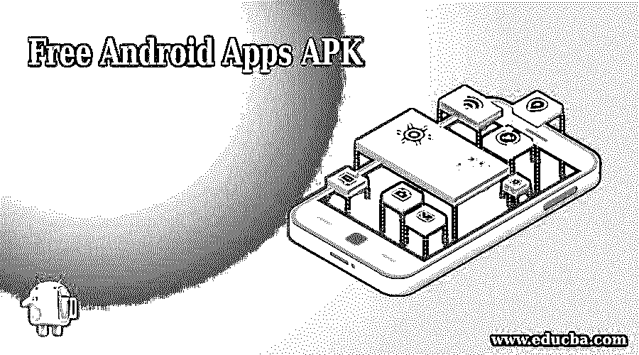

## APK 最佳免费安卓应用

在免费安卓应用网站上，有许多不同种类的免费安卓应用，从健身到娱乐。但是哪个安卓[应用](https://www.educba.com/bundle/mobile-app-courses/ "Apps")值得呢？想知道如何做出正确的选择？以下是有史以来十大免费安卓应用 apk 以及它们是如何工作的。所以，用这些神奇的应用程序来提升你的“幸福指数”……看着你的生活变得更容易。这些 Android 应用程序中有许多是免费的，可以在多种设备上运行，所以你可以随心所欲，几秒钟之内就能让生活变得更加轻松。

### 最佳免费安卓应用 apk

以下是你必须尝试的 10 个最好的免费安卓应用列表；

<small>网页开发、编程语言、软件测试&其他</small>

*   [斯特拉瓦](https://www.strava.com/ "Strava")
*   [Evernote](https://evernote.com/?var=1 "Evernote")
*   [口袋](https://getpocket.com/ "Pocket")
*   [潜望镜](https://www.periscope.tv/ "Periscope")
*   [Whatsapp](https://web.whatsapp.com/ "Whatsapp")
*   [Instagram](https://www.instagram.com/?hl=en "Instagram")
*   [Snapseed](https://play.google.com/store/apps/details?id=com.niksoftware.snapseed&hl=en "Snapseed")
*   [谷歌照片](https://www.google.com/photos/about/ "Google Photos")
*   [谷歌地图](https://www.google.com/maps/ "Google Maps")
*   [城市文件夹](https://citymapper.com/ "Citymapper")

### 应用程序#1- Strava

* * *

 

#### 突出

*   最佳智能手机健身工具
*   允许用户跟踪绩效、设定目标并获得每日进度报告
*   这个 Android 应用程序有许多功能，例如可以找到路线和运动员。

[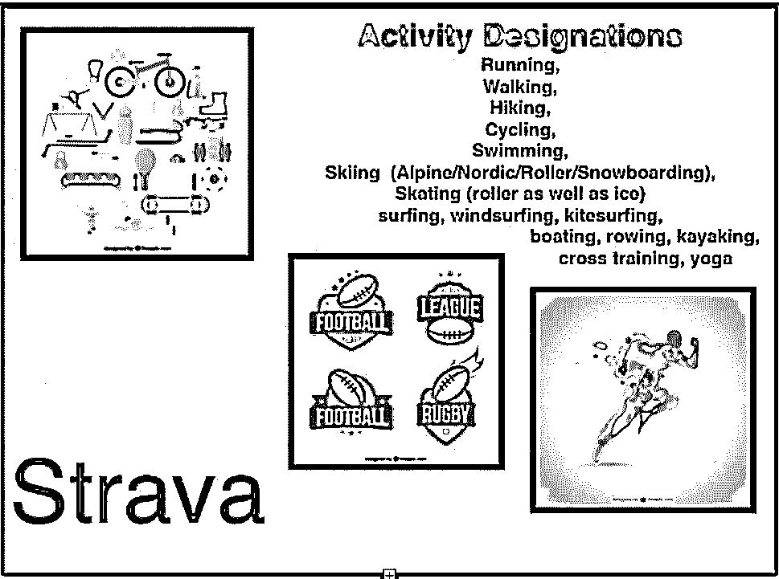

](https://cdn.educba.com/academy/wp-content/uploads/2015/11/IMAGE-2.jpg) 

*   它提供了基于特定路线时间的排名
*   这包括最佳男-KOM/山之王和最佳女-QOM/山之女王。
*   地图缩放级别决定了搜索中将显示哪些路线
*   App 还包括定期挑战，在许多情况下还有特别的奖励
*   薪资构成开启了许多功能

[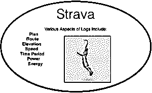

](https://cdn.educba.com/academy/wp-content/uploads/2015/11/IMAGE-4.jpg) 

#### 表演怎么下载？

*   GPS 设备
*   移动装置
*   从文件
*   用手

### App #2- Evernote

* * *

[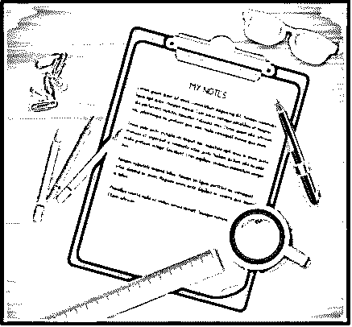

](https://cdn.educba.com/academy/wp-content/uploads/2015/11/IMAGE-6.jpg) 

*   这是世界上最好的笔记应用程序
*   允许用户保存写作想法，并在多个设备间同步
*   它还可以创建待办事项列表和记录语音提醒

#### Evernote 是一个跨平台的免费 android 应用程序 apk

*   做笔记
*   组织
*   归档

#### 它是如何工作的？

该应用程序允许用户创建笔记。这些笔记可以采取各种形式:

*   格式化文本
*   完整/部分网页
*   摘录
*   照片
*   语音备忘录
*   手写笔记

#### 突出

 

然后，笔记可以以各种形式整理到笔记本中，包括编辑、标记、注释和导出。

笔记也可以有文件附件。

Evernote 可以跨多个操作系统工作。

它提供免费的在线备份和同步服务

> **口号:你一生工作的空间**

### 应用程序#3-口袋

* * *

如果你有口袋的话，没有网络连接是塞翁失马焉知非福。

此应用程序允许您离线保存所有这些在线资源:

*   文章
*   新闻报道
*   博客
*   录像
*   邮件
*   多得多…..

[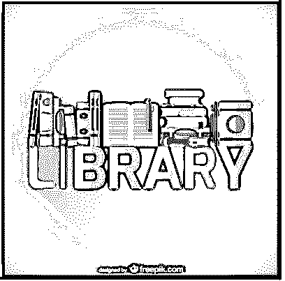

](https://cdn.educba.com/academy/wp-content/uploads/2015/11/IMAGE-10.jpg) 

该应用程序最初是为桌面设计的，可在多种操作系统和设备上运行，包括:

*   OSX

*   [iOS](https://www.educba.com/ios-or-android-which-is-best/ "iOS or Android Which is Best?")
*   机器人
*   [Windows Phone](https://www.educba.com/top-best-2019-windows-phone-apps/ "Top Best 2016 Windows Phone Apps")
*   黑莓
*   神户电子阅读器
*   网络浏览器

#### 突出

*   文章或网页可以保存在云上供离线阅读，并发送到所有设备上同步的应用程序中的用户列表。
*   这款应用最初是在 2007 年作为 Mozilla Firefox 浏览器扩展推出的
*   只有 URL 被保存到设备上，
*   Pocket 简化了数据的分类和保存，以备后用
*   这款口袋被《时代》杂志评为 2013 年 50 大免费安卓应用之一
*   Twitter、Google Currents 等应用也使用这个应用的 API。
*   一个口袋早先被称为后来阅读。
*   保存的文章可以在有此应用程序的设备之间同步。

### 应用程序#4-潜望镜

* * *

#### 突出

*   这是 Twitter 的实时视频流应用
*   喜欢推特，只因为它有视觉效果  
*   用户可以创建实时流
*   他们还可以观看和评论其他人的流
*   您甚至可以在 24 小时内重播视频流

[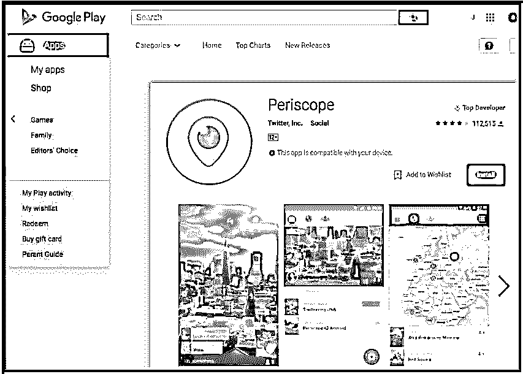

](https://cdn.educba.com/academy/wp-content/uploads/2015/11/IMAGE-12.jpg) 

#### 它是如何工作的？

*   Periscope 允许用户在全球范围内直播视频
*   一旦你上线，关注者就可以加入，评论并给你发爱心
*   你得到的红心越多，它们在屏幕上的位置就越高。

#### 特征

重播

1.  潜望镜可以让你在广播结束后重播。
2.  重播可以带红心和评论播出
3.  它们也可以在任何时候被删除

私人的

1.  让您选择要向谁发出邀请
2.  允许您自定义广播的受众

分享

1.  Periscope 广播可以在 Twitter 上分享，只需轻轻点击鸟图标。
2.  你甚至可以在推特上发布链接，这样粉丝就可以在应用程序上观看视频

通知

1.  Periscope 通过建议你应该使用 Twitter 网络关注的人来提供帮助。

### 第五大应用——WhatsApp

* * *

#### 突出

*   强大的即时消息服务
*   接收手机短信，并通过 Wi-FI 发送

[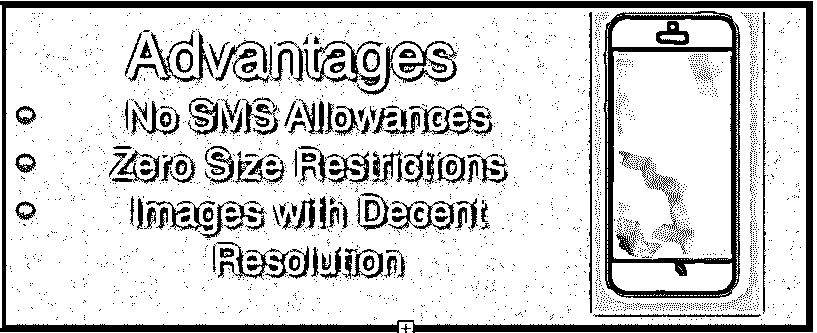

](https://cdn.educba.com/academy/wp-content/uploads/2015/11/IMAGE-13.jpg) 

#### 其他一些优势

*   适用于 android 和智能手机
*   使用手机的互联网连接
*   第一年免费/之后每年收费 0.99 美元
*   给人们发消息和打电话
*   从短信切换到 WhatsApp

#### 对用户的好处

*   使用 WhatsApp 意味着你可以通过 Wi-Fi 免费打电话和发信息，所以不需要额外付费。
*   [多媒体](https://www.educba.com/best-free-multimedia-software/ "6 Best Free Multimedia Software")发送、接收和制作视频和语音信息
*   发送照片和高分辨率图像的方式
*   使用互联网连接与其他国家的人免费通话
*   与联系的人进行群聊
*   PC/笔记本电脑浏览器也可以接收 WhatsApp 消息
*   国际电话不收费
*   没有用户名，个人识别码或密码
*   24/7 全天候连接
*   与联系人的快速连接
*   离线消息

您可以共享位置和联系人，更改自定义壁纸和通知声音，浏览聊天记录，并一次向多个联系人发送消息。

### 应用程序#6- Instagram

* * *

#### 突出

 

*   快速拍照的最佳应用
*   允许用户向图像添加滤镜
*   允许用户与世界分享图像
*   数字显示:全世界有 3-4 亿人使用 Instagram
*   你不需要把自己局限于快照，因为照片可以添加到 FB、Twitter 和 Tumblr，只需轻轻一点手指。

#### 对用户的优势

*   捕捉并分享您所有的特别时刻
*   将视频和照片转变成一门专门的艺术
*   关注他人
*   被跟踪
*   立即查看来自朋友的新照片和视频

#### 你可以

*   编辑照片
*   自定义视频
*   使用定制设计的过滤器
*   使用多达 10 种工具改进照片
*   关注他人并在社交网络/社交媒体网站上分享照片和视频。

[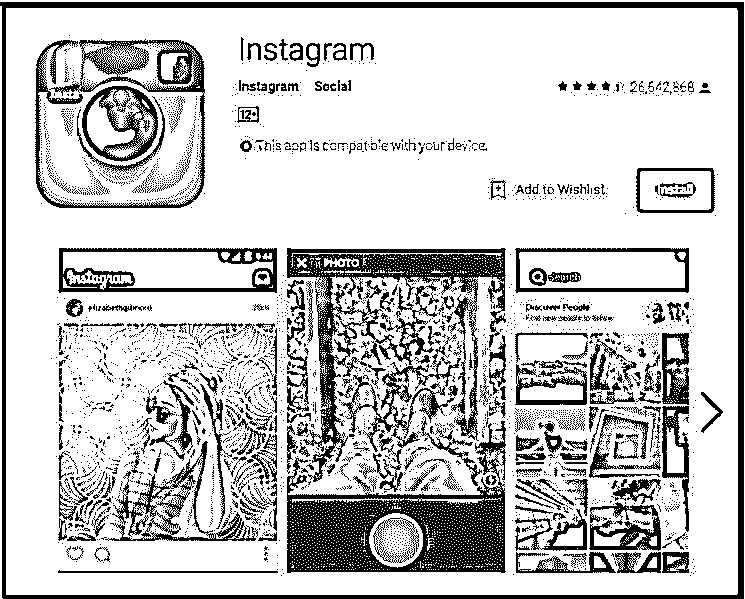

](https://cdn.educba.com/academy/wp-content/uploads/2015/11/IMAGE-15.jpg) 

### 应用 7- Snapseed

* * *

#### 突出

1.  谷歌的免费照片编辑应用
2.  允许用户编辑所有类型的照片和图像
3.  允许您添加特殊效果，如滤镜

[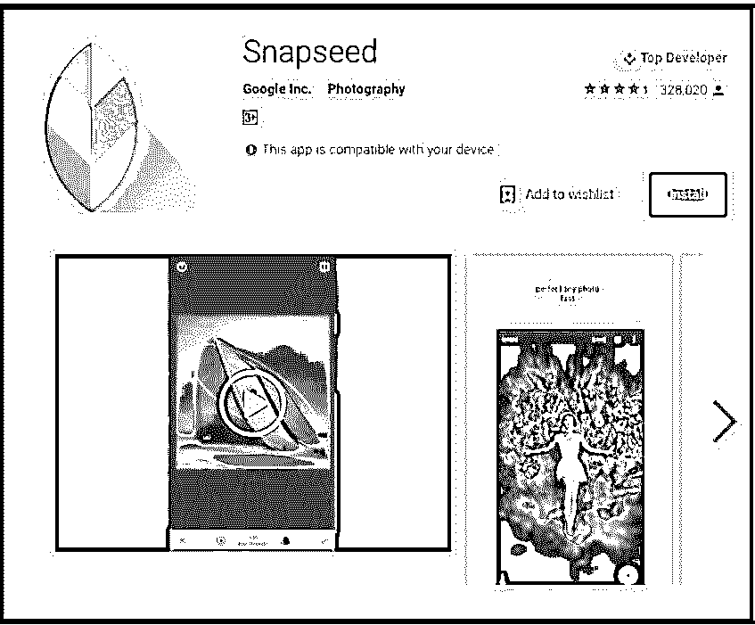

](https://cdn.educba.com/academy/wp-content/uploads/2015/11/IMAGE-16.jpg) 

#### 它是如何工作的？

*   手指轻轻一点，您就可以润饰、添加、编辑或重新编辑照片和图像。
*   专业照片编辑只需几分钟即可完成

#### 应用程序使用的工具

原始开发，调整图像，细节，裁剪，旋转，变换，画笔，选择性调整，愈合，晕影。

**解码工具:**

1.  原始开发-调整 DNG 原始图像中的白平衡、阴影和高光
2.  调整图像-创建深度和活力，并调整亮度，对比度，饱和度和更多
3.  细节-锐化或增强图像
4.  裁剪-将图片裁剪到所需的大小
5.  笔刷-仅在图像的特定区域应用效果
6.  修复-去除图像中的瑕疵
7.  晕影-调整图像亮度和效果

#### 通过添加样式

*   镜头模糊
*   魅力焕发
*   色调对比
*   HDR 风景
*   戏剧
*   垃圾音乐
*   粒状效果
*   过时的
*   复古
*   轮盘戏中黑色数字的
*   黑色和白色
*   框架

### 应用# 8——谷歌照片

* * *

现场有这么多照片应用程序，是什么让 Google 相册如此特别？嗯，考虑到它为照片和你所有的视频提供了无限的免费存储空间。另一大优点是，它可以从免费的 android 应用程序网站获得，可以在 Android、iOS 和计算机上使用。
[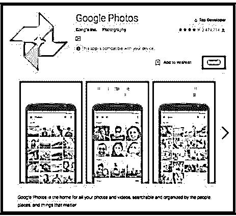

T6】](https://cdn.educba.com/academy/wp-content/uploads/2015/11/IMAGE-17.jpg)

#### 这个 App 怎么用？

*   提供了基本的编辑工具，以及照片和视频存储工具。
*   你可以使用这款应用程序按人物、事物和地点组织照片和视频——这些定义明确的类别可以帮助你很好地记住和管理信息。
*   可搜索的照片可以很容易地找到您选择的确切图像
*   您所有的照片和视频都可以自动备份和保存，并可以从多个设备上访问
*   您可以存储无限量的原始大小的视频和高分辨率照片
*   您可以使用此设备来节省智能手机或笔记本电脑的空间
*   您甚至可以从照片中创建动画 GIF 图像、拼贴画、电影、视频剪辑等等
*   编辑照片将允许您应用滤镜，添加或删除颜色，并对图像的结构进行更改
*   你只需轻轻一点就可以变换照片，[使用视频编辑工具](https://www.educba.com/video-editing-tools/)让[的展示更好](https://www.educba.com/ms-powerpoint-presentation/ "8 Tips for Creating Amazing PowerPoint Presentations")
*   你还可以通过链接与任何人分享应用程序中的照片
*   Chromecast 允许你在一个广泛的平台上分享你的照片。

### 应用 9——谷歌地图

* * *

#### 突出

[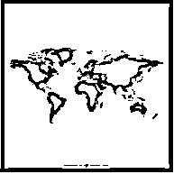

](https://cdn.educba.com/academy/wp-content/uploads/2015/11/IMAGE-18.jpg) 

*   最佳自由映射选项
*   过境方向
*   提供实时交通信息
*   确保语音导航 GPS 导航
*   提供高分辨率街景图像
*   让用户获得场地/地方的外部和内部的照片。

这是免费 android 应用程序网站上最神奇的应用程序，用于为个人或专业用途绘制和创建地图。它使导航更加容易和快捷。只需点击一下鼠标，你就可以得到你需要的所有信息。在几分钟内从一个地方到另一个地方。查看距离世界各地最近或最便捷的乘车或步行路线。获取任何酒店、餐厅、酒吧、酒吧、商店、博物馆、画廊等的最新地址、电子邮件和电话号码。

谷歌地图是一款安卓应用，它让每个人的生活都变得更加轻松，从上班族到网页设计师。使用此应用程序创建有吸引力的定制地图，可以在智能手机和多种设备(如电脑和平板电脑)之间共享。编辑和存储地图以备后用，甚至可以查看你第一次去的新餐馆或电影院的位置。

Android 手机和平板电脑以及台式机和笔记本电脑的谷歌地图可以轻松找到城镇中的所有区域/位置。这款应用还能让你绘制出从你现在的位置到你想去的地方的最短路线，而且在每个免费的 android 应用网站上都可以很容易地找到。

#### 好处

*   220 个国家和地区的精确而详细的地图
*   为司机/步行者/骑自行车的人提供语音导航 GPS
*   近 15，000 个城市的公交路线和复杂地图
*   生活交通状况、事故报告和自动改道
*   在几分钟内找到最佳路线
*   从酒店到博物馆的街景+室内图像

#### 使用该应用程序的提示

*   获得更好的位置，更准确的方向！
*   增强语音导航
*   报告错误路线

[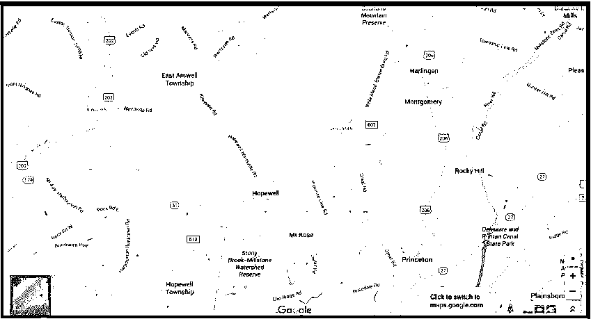

](https://cdn.educba.com/academy/wp-content/uploads/2015/11/IMAGE-19.jpg) 

### 应用程序#10-城市地图

* * *

#### 突出

*   如果你到达一个新的城市，你需要的应用程序是 city mapper——公交、地铁、铁路。
*   为用户提供全球城市公共交通的实时信息
*   它帮助用户使用不同的交通方式规划路线
*   帮助处理和管理中断和取消
*   简而言之，这是一款适合城市旅行者的重要应用

 

–NYT 称其为旅行者和游客的“最佳”应用。
——这款城市交通应用正在被改造成具有实时数据功能的应用
——几乎不需要任何时间就能从一个地方到达另一个地方的完美方式

**覆盖地点/区域/城市**

美国+加拿大纽约、旧金山、洛杉矶、华盛顿、芝加哥、波士顿、费城、多伦多、蒙特利尔、温哥华
国际伦敦、巴黎、香港、新加坡、曼彻斯特、伯明翰、里昂、汉堡、柏林、布鲁塞尔、里斯本、Rndstad、阿姆斯特丹、马德里、米兰、罗马、墨西哥城、圣保罗、Rndstad。

#### 这个 App 怎么用？

*   这个很酷的免费 android 应用程序 apk 是一个多重旅程规划。它使用实时数据。
*   该应用程序涵盖了所有的交通方式，包括地铁、地铁、公交车、自行车、自行车、火车、电车、无轨电车、渡轮、出租车、拼车和步行路线。
*   还有很重要的一点，这个 app 尊重你的隐私，保证用户匿名。
*   该应用的集成和合作伙伴包括 Twitter、Yelp、优步和 Foursquare。
*   你可以访问公交地图，也可以通过这个应用程序接收状态提醒。
*   你可以使用短信、WhatsApp、电子邮件或 Twitter，或者任何其他社交网站分享你的位置，这款应用程序有一个特殊功能，叫做“在某个地方见我”
*   路线和目的地的天气更新也在那里。
*   你甚至可以计算走路/跑步时燃烧的卡路里。

### 结论——为了更好的明天，今天就试用一款应用

应用程序是与世界保持联系的最佳方式，即使你离线。看看这些最新的免费 Android 应用程序 apk 是多么容易通知你，点击按钮或鼠标访问联系信息。从预约日程安排到自动视频录制，这些应用程序都可以在免费的 android 应用程序网站上找到，它使用先进的技术让生活变得更简单。许多这类应用都配备了嵌入式二维码扫描仪和免费聊天工具。让这些应用成为空前热门的是它们独特的收益和回报组合。所以，今天就下载这些 android 手机应用程序，观看技术一次性解决你的所有问题。让生活更简单。选择这些令人惊叹的最新免费 Android 应用程序 apk，并使用它们来查找位置、联系朋友或与人联系。

### 推荐文章

这是有史以来十大免费 Android 应用 apk 以及它们如何工作的指南。通过这篇文章来学习和尝试这些新的 Android 手机应用。以下是与免费 android 应用 apk 相关的外部链接。

1.  [免费安卓应用](https://www.educba.com/free-android-apps-apk/)
2.  [安卓 VPN 应用](https://www.educba.com/android-vpn-app/)
3.  [Adobe Premiere vs 索尼维加斯](https://www.educba.com/adobe-premiere-vs-sony-vegas/)
4.  [WebSockets vs WebRTC](https://www.educba.com/websockets-vs-webrtc/)

