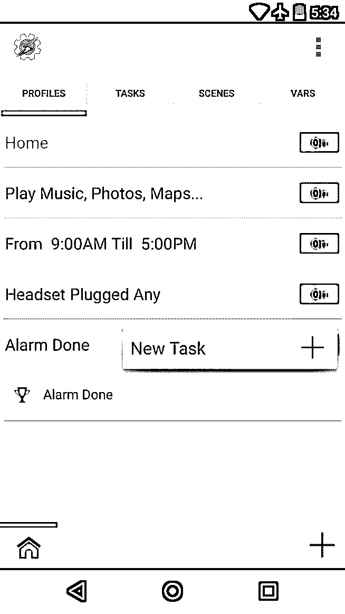
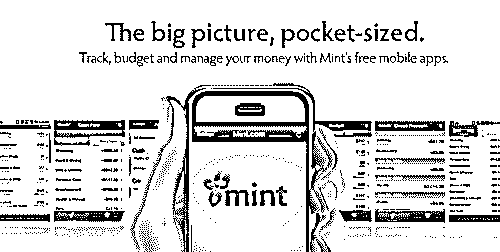
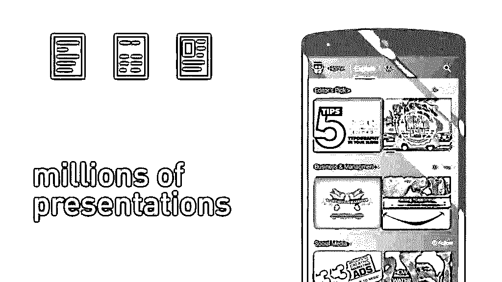
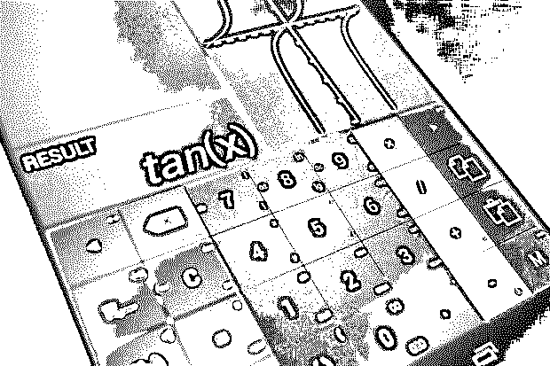
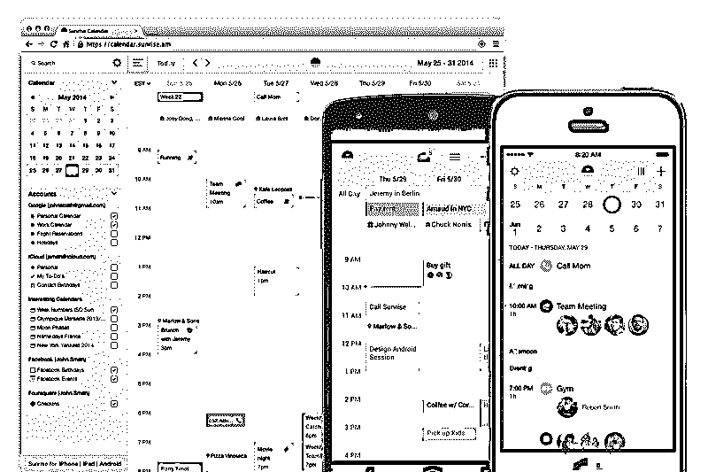
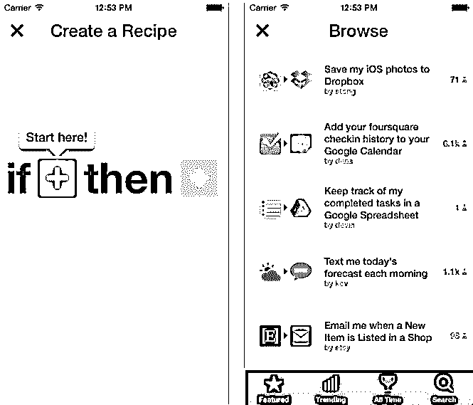

# 面向大学生的 Android 应用程序(教育)

> 原文：<https://www.educba.com/best-educational-android-apps-for-college-students/>

## 大学生安卓应用介绍

随着 android 操作系统的出现，生活变得更加顺畅，在很大程度上也更加舒适。今天，您可以获得几乎所有需求的最新 android 应用程序。

无论是测量卡路里燃烧量还是执行银行活动，以及许多其他活动，您都可以使用智能手机中的 android 应用程序轻松管理指尖上的一切。随着人们越来越依赖操作系统，越来越多的 android 应用程序出现在各种活动中。有各种很酷的 android 应用程序供学生们在忙碌的生活中使用。

<small>网页开发、编程语言、软件测试&其他</small>

这里提到了学生用的最好的安卓应用，现在很多人在青少年时期和之后都在使用。

### 每个研究学院都有安卓应用

以下是每个学习学院不同的 android 应用程序:

#### 1.包包包包包包包包包包包包包包包包包包包包包包包包包包包包包包包包包包包包包包包

如果你有忘记事情的习惯，那么 Tasker 绝对适合你。它就像一个提醒你的装置，或者是一个根据你的环境自动运行的工具。它能感知你的环境，并据此做出反应。只要在特定的环境下输入你想做的动作，它就会自动做所有的事情。

 

*图片来源:谷歌 playstore*

*举个简单的例子，如果你在图书馆，却忘记了将手机调成静音，应用软件 Tasker 会帮你调成静音。同样，如果你在健身房，你的健身房有 Wi-Fi，设置应用程序，这样当你进入健身房时，你的手机的 Wi-Fi 将被打开。*

这个应用程序看起来和听起来都像是一个智能的奇迹，操作起来非常有趣。但是，是的，如果你能以适当的方式使用它，你的许多麻烦肯定能很容易地得到解决。你可以把这个应用程序作为你的朋友，他总是把你从由于你的智能手机而可能在不同地方面临的尴尬处境中解救出来。

#### 2.铸造

如果你是一名学生，这并不意味着你没有财务管理。据说青少年在掌握金钱方面更加警觉和活跃。他们有有限的资金和大量的活动要管理。每个月你可能会有一个朋友的生日，你可能需要钱来做你的项目或者做一些其他的个人用途。无论如何，你的父母都希望你管理好给你的零用钱。

 

*图片来源:谷歌 playstore*

这就是应用程序能够真正帮助你的地方。它可以作为你的私人会计，跟踪你的财务活动。这有助于你维持一个预算，知道你的零花钱是多少，以及你需要管理这笔钱的费用是多少。一些一直在使用 Mint 应用程序的学生也声称，正是由于 Mint，他们才能够节省一些钱，即使是在花了很多钱之后。

如果你关心你所有财务细节的安全和保护，那么你应该知道 Mint 带有密码保护。因此，没有你的允许，没有人可以窥视你的预算计划。

#### 3.仔细的

这是最好的大学生安卓应用的另一个重要部分。这种情况在你身上一定发生过很多次，你一定忘了完成你的作业，在最后一刻你匆忙完成它们。现在你有了一个个人设备来提醒你即将到来的作业和考试日期。

只需输入你提交作业的日期，以及你的考试日期，应用程序就会在截止日期前几天提醒你。当你有了这个应用程序来记住关于你的作业和考试的事情时，你还需要什么来使你的生活舒适？

如果你认为这个应用程序只是提醒你关于你的作业和考试日期，那么再等等。它还为您提供了许多其他功能，您一定已经在 android 应用程序 Tasker 中注意到了。

如果你在上课前忘记了让手机静音，这个应用程序会帮你做到。你所需要做的就是在应用程序中输入你的班级的位置，并激活每次将手机静音的提醒。所以，下一次当你在课堂上忘记让你的手机静音时，你不必担心你的手机突然响起，因为当你走出教室门时，应用程序[好学](https://sur.ly/i/studiousapp.com/)一定总是让你的手机静音。

#### 4.幻灯片共享

今天，大多数大学学习材料都是以演示文稿的形式出现的。这种特殊的形式易于理解和维护。为了让你更容易地学习所有这些材料，有一个 android 应用程序 [SlideShare](https://www.slideshare.net/mobile_app_promo "Slideshare app") 。

 

*图片来源:谷歌 playstore*

SlideShare 最初是一个演示托管平台，现已被社交网站 LinkedIn 接管。也正是在这次合并之后，SlideShare 推出了可以在智能手机上运行的 android 应用程序。你可以在任何时间和任何地方简单地借助这个特殊的应用程序来浏览你的演示文稿。

在这个应用程序中你唯一得不到的是创建新文件或演示文稿的便利。这主要是因为该应用程序可能是为学生浏览和研究他们的学习材料和演示文稿而开发的。

但是你不仅可以在这个应用程序中打开你的演示文稿，还可以查看内容并与其他需要的朋友分享。此外，您可以通过该应用程序将演示文稿保存在您的设备上，以便您也可以在离线模式下学习。

#### 5.沃尔夫拉姆阿尔法

大多数学生今天忘记了查阅字典或百科全书来查找他们不知道的东西。现在学生考虑的一个非常简单的方法是在谷歌上搜索信息。但是你现在可以通过 android 应用程序 [WolframAlpha](https://products.wolframalpha.com/mobile/ "Wolfram Alpha App") 更容易地搜索信息。它实际上是关于各种主题的信息和公式的汇编。

 

*图片来源:谷歌 playstore*

通过组合来自不同数据源的信息，应用程序拥有关于特定主题的可靠信息。

例如，如果你想了解主题“A ”,那么你可以在谷歌上找到许多关于这个主题的描述。但是 WolframAlpha 应用程序必须结合不同来源的各种描述，并为您提供一个简洁的描述。

当你在谷歌搜索的时候，你可能会得到一些让你困惑的点和链接。如果你正在寻找一个可靠的应用程序，在那里你可以很容易地获得从天体物理学到社会统计学和许多其他主题的信息，那么 WolframAlpha 应该是一个准确的名字。你可以在你的 android 设备上安装这个应用程序，它就像是你的一个伴侣，你可以依靠它来搜索你想要的关于任何主题的任何信息。

#### 6.Calcu

许多人认为 iOS 的应用程序很好看，与 android 应用程序相比有所不同。但是看看 android 应用程序的计算结果，你可能会想再考虑一下。

 

*图片来源:谷歌 playstore*

Calcu 可以作为 android 应用程序的一个完美例子，这些应用程序看起来很漂亮，功能也很好。如果你是一名学生，那么在你的智能手机上安装这个应用程序并不是必须的，但它也是对你的巨大支持。现在你可能会想，智能手机已经有一个计算器，那么这个应用程序的需求是什么。

因此，要回答这个问题，我们可以知道 Calcu 的一些特性。

*   该应用程序体积小，设计简单、时尚。因此，您不必绞尽脑汁去理解应用程序的工作原理。

*   其次，与你的移动计算器不同，Calcu 应用程序既有普通计算器的功能，也有科学计算器的功能。

*   此外，该应用程序的最重要的功能之一是，它可以存储您的计算历史，因为您可能会在不久的将来需要它。

#### 7.日出

与 calculator 类似，您的智能手机中也有日历，但 Google Play 商店中仍有许多日历应用程序。其中一个为学生开发的日历应用程序是 Sunrise。

 

*图片来源:谷歌 playstore*

这个特殊的应用程序与其他 android 日历应用程序有很大不同。您将在该应用程序中获得许多其他 android 日历应用程序中没有的功能。除了简洁的界面，该应用程序还为您提供了许多这样的功能，这些功能可以在许多方面对学生有所帮助。

日历应用 Sunrise 与脸书和 LinkedIn 等社交服务相集成，用于记录各种事件。除了提醒你和提醒你各种事件，它还提供了其他功能。

*   你可以用应用程序的主屏幕小部件来装饰你的智能手机。

#### 8.IFTTT

IFTTT 实际上代表你使用的日常用语“如果这样，那么那样”。android 应用程序 [IFTTT](https://ifttt.com/explore "IFTTT") 可以让你在两件事情之间建立这样的联系，这样你就不必为各种情况而烦恼了。

 

*图片来源:谷歌 playstore*

你所要做的就是向应用程序输入所需的命令，应用程序就会自动开始工作，这样你就不必在各种情况下面对任何类型的问题。

例如，如果要下雨了，你知道网络会中断，那么就在 IFTTT 中输入这个命令。通过这种方式，每当要下雨或有下雨的预报时，应用程序会提醒你即将下雨，这样你就可以提前几个小时发送所有重要的邮件，以避免糟糕的网络状况。

*同样，如果你在 IFTTT 应用程序中输入了从社交网络的特定文件夹中自动上传图片的信息，那么当你点击一张图片并将其保存在该文件夹中时，它就会自动上传。*

因此，您将能够使用 IFTTT 应用程序有效地管理您的生活。

#### 9.Evernote

Evernote 是众所周知的 android 应用程序之一，目前已被许多用户使用。这是一个允许你在智能手机上执行大量功能的应用程序。它有助于你拍照；轻松记笔记和许多其他工具，这样你就不必时不时地在智能手机中搜索所有这些工具。

 

*图片来源:谷歌 playstore*

此外，它还有一个功能，你可以用自己的笔迹做笔记。此外，在这里您可以同时使用手写和打字。此外，您可以在这里添加图表和其他图示。

不时会有大量的 android 应用程序被开发出来。但是，如果你想知道最适合学生使用的安卓手机应用程序，那么上述应用程序绝对可以被列出来。除了上面提到的这些应用，谷歌 Play 商店还有许多其他 android 应用可供学生使用。其中一些应用程序是 Scribd、CliffsNotes、Mathway、EasyBib、SelfControl 和许多其他应用程序。

我希望这篇关于学生应用的信息对你有所帮助！

### 推荐文章

这是给大学生的安卓应用指南。在这里，我们讨论了基本概念，并提供了 9 条对学生有用的应用程序信息。您也可以浏览我们推荐的其他文章，了解更多信息——

1.  [安卓应用基础](https://www.educba.com/android-apps-development/)
2.  [安卓启动器应用](https://www.educba.com/android-quick-launcher/)
3.  [最佳安卓应用开发者新手指南(进阶)](https://www.educba.com/android-apps-development/)
4.  [移动安全应用](https://www.educba.com/mobile-security-apps/)

