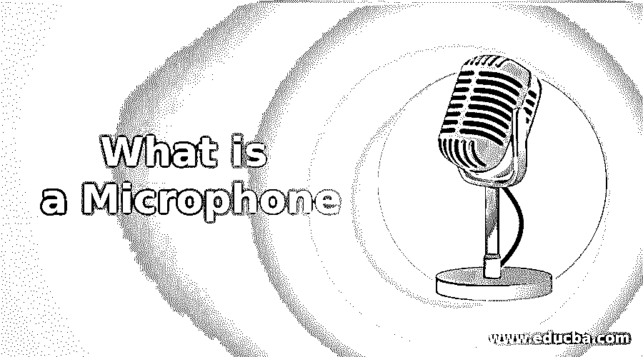
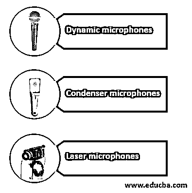

# 什么是麦克风

> 原文：<https://www.educba.com/what-is-a-microphone/>

## 麦克风简介

麦克风被定义为一种用于将声音振动转换为电信号并将它们转换为某种记录介质的设备。麦克风广泛用于不同类型的音频设备中，并且还用于包括语音记录和语音的通信目的。设计麦克风的主要目的包括记录声音。它是根据用途而设计的，可以分为多种形式。

### 什么是麦克风？

它被定义为人耳的机械娱乐。声波在空气中传播，到达耳朵。这是使用传感器，它可以调整在不同的方向。全向灵敏度在所有角度都是相等的。它可以放在房间里，可以有任何方向，可以传递声音。在双向扬声器中，声音可以从前端或后端发出。声音无法从侧端获取。它被用来代替扬声器。这与高频声音是兼容的。

<small>网页开发、编程语言、软件测试&其他</small>

### 不同的麦克风

在下一节中，我们将介绍一些不同的话筒:

#### 1.动态麦克风

动圈话筒是一种使用振膜、线圈和磁铁作为部件的话筒。

#### 2.电容式麦克风

电容器的功能与隔膜略有不同，隔膜用于移动电容器金属板，然后产生电流。

#### 3.激光麦克风

激光是一种麦克风，可以捕捉表面的振动，也可以捕捉远处的声音。由于振动，激光开始反射回来，然后这些变化进一步转化为声波。

这是为特殊目的服务的。例如，如果任何新闻记者使用麦克风，那么他们更喜欢使用单向麦克风，因为它们可以从唯一的方向获取声音，并消除来自所有其他方向的声音。

### 麦克风是如何工作的？

声能在空气中传播。直到 19 世纪，还没有一种装置可以用来向其他地方发出声音。麦克风就是为此目的而设计的，用于将声音信号转换成电信号，并可用于将声波传输到更远的距离。

在以下步骤中，其工作描述如下:

1.  当用户在里面说话时，用户自身产生的声波会将能量传递给它。麦克风听到的声音是空气和周围环境中的能量振动。
2.  振膜是麦克风中的一种组件。它的一部分很小，固定在里面。当用户对着它说话时，由于声波的作用，振膜开始来回移动。
3.  还有一个线圈也直接连接到振膜，振膜也像振膜一样来回移动。
4.  一个小的永久磁铁也在那里，它产生磁场，因为线圈而被切割。由于磁场的作用，这个连接到振膜的线圈开始前后移动，因此电流开始在麦克风中流动。
5.  麦克风中的电流产物从设备流出到放大器或某种录音类型的设备。然后放大器放大用户的声音，并可以从那个小设备传输到一大群观众。

### 麦克风的优势

有各种各样的类型，基本上是为一些特殊目的而设计的，并且有自己的优点。麦克风的一些优点描述如下:

#### 1.语音命令

语音命令是残疾人使用的一种麦克风。在使用耳机时，嘴和耳机之间的距离保持不变，但由于电线的原因，移动变得困难。手持设备用于演讲，移动变得容易，因为现在有了电线，但用户的一只手被占用了。

#### 2.表演

用户用它来做演讲、舞台表演和音乐会。在所有这些情况下，无线被广泛使用，因为移动变得容易。然而，它的工作范围有限，电池寿命也有限。

#### 3 .手机

这也用于 it，它内置在手机上。用户可以因此与另一个用户交谈。并且麦克风不需要大量改变，因为它是内置在移动电话中的。用户可以携带移动电话到任何地方，并且可以用它来听一些东西。

#### 4.无线电报

无线电传用于需要对一大群人讲话的场合。它在新闻机构和法庭中发布，这些地方需要在同一时间向大量观众发表演讲。这种麦克风电池寿命长，非常安全。

### 麦克风的历史

当需要面对一大群观众时，就需要提高人们的声音。为了达到这个目的，使用了扩音器。第一个麦克风是由英国的大卫·爱德华·休斯发明的。第一个麦克风是碳基的。碳是当今麦克风的基本原型，广泛应用于不同领域。1916 年，发明了 E.C .冷凝器。1923 年，线圈式麦克风问世。年复一年，许多不同的组织有针对性地开发了麦克风。

### 结论

这是一种用来放大声音的设备，可以用于公开演讲和音乐会。根据用户需求，有不同类型的 it 可用于不同的场景。用户对着它说话，听到自己声音的放大版本。

### 推荐文章

这是一个什么是麦克风的指南。在这里，我们将讨论话筒的介绍、工作原理、优点和历史。您也可以浏览我们的其他相关文章，了解更多信息——

1.  [传感器类型](https://www.educba.com/types-of-sensors/)
2.  [安卓架构](https://www.educba.com/android-architecture/)
3.  [电脑线缆的种类](https://www.educba.com/types-of-computer-cables/)
4.  【JavaScript 如何工作

