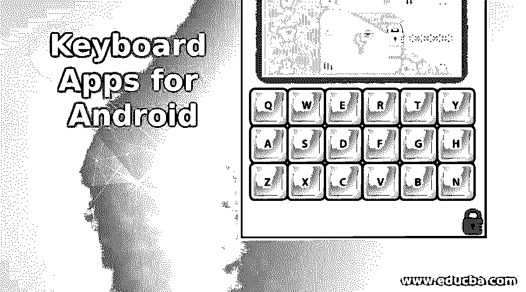

# 安卓键盘应用

> 原文：<https://www.educba.com/keyboard-apps-for-android/>

## Android 键盘简介

通过更换你的普通键盘，你也可以让你的安卓应用看起来棒极了。只需几个步骤就可以改变键盘的外观和手感。市场上有各种类型和服务，包括键盘应用。您不必坚持使用设备预装的键盘。大多数用于安卓手机或平板电脑的第三方键盘应用程序都可以在谷歌 Play 商店使用。这样的钥匙只是基于个性化和娱乐性。自动校正和最佳打字是两个关键目标。然而，许多键都依赖于这两者。如今，大多数用户已经普遍使用谷歌 Gboard 和 Windows SwiftKey。在本教程中，我们介绍了一些适用于 Android 设备的最佳应用。

### 安卓 9 大键盘应用

以下是各种键盘安卓应用列表

<small>网页开发、编程语言、软件测试&其他</small>

#### 1.Go 键盘

最好的 Android 键盘设备列表也是可用的。这个键盘包含各种各样的主题、GIF、字体、表情符号等。这将促进和简化你的打字习惯。Go keyboard 自带内置词典，让你了解任何语言中任何单词的含义。要解锁你的锁屏，你需要滑动。下载 Go Keyboard 是免费的，但包含广告。您的高级版本将为您提供无广告的体验。

#### 2.斜线键盘

Slash 是一种独特的键盘，比简单地键入文本效果更好。这提供了一个嵌入式谷歌搜索来查找各种各样的服务。它包括 Twitter、谷歌地图、表情符号、亚马逊、YouTube、Gyphy 和 Spotify。要开始搜索，只需点击“/”按钮。当您浏览时，您键入的文本区域会自动添加。然而，这种键盘的缺点是自动更正功能很强。

#### 3.弗莱克西

Fleksy 是 Android 最常用的按钮之一。它包含了你需要的一切，包括网站搜索、主题、滑动和手势控制、GIF 和 meme 支持、扩展等等。它的许多主题是免费的，但很少有人付费。然而它并不贵。它有一个神奇的自动纠正功能。可以免费下载，虽然有些主题上线了。

#### 4.快速键

SwiftKey 是 Android 最常见、最受欢迎的应用之一。它包括各种主题，文本预测，配置选项，帐户同步，自动更正，等等。该键盘支持 100 多种语言。键盘和大部分功能是免费的，但它的大部分主题必须付费。

#### 5.语法上

语法是 Android 新的键盘应用之一。它提供了一个在线服务来检查你的语法、拼写和标点符号。这是完全正确的，通过键入电子邮件或其他文书工作来保持安静。安卓和 iOS 都有语法键盘。键盘有一个干净的外观，旨在纠正您在当前期间的错误。键盘软件可以完全免费下载。

#### 6.纸板

谷歌的 Gboard 是谷歌官方键盘应用。很简单，但是很快。键盘上有一些简单的功能，如自动校正，各种适应性功能等。谷歌表示，它内置了一个谷歌搜索界面，因此你可以在不离开键盘空间的情况下找到一些东西。键盘使阅读、检查 GIF 和键入语音变得更加容易。

#### 7.简单键盘

一个简单的键盘是一个轻量级，开源的 Android 键盘应用程序，以其简单性和风格而闻名。它可以帮助你改变你的主题和键盘颜色，以及选择语言的不同选项。如果你想要一个简单的裸机键盘，它就是为你准备的。您的拼写或其他内容不会在此屏幕上测试。它适用于存储空间和安全问题较少的设备。

#### 8.Typany 键盘

一个新推出的 Android 键盘程序是 Typany 键盘。你可以将表情符号制造商和手动绘制的图片发送给你的联系人。它提供集成的翻译和 bangs 文本，使输入和编辑单词变得简单。贴纸，主题，表情符号，还有更多。像自我纠正、短语预测和各种键盘布局等功能也包括在内。支持 90 多种语言。

#### 9.铬酸盐键盘

Chrooma 键盘在风格和可用性上与谷歌的键盘相似。尽管如此，它还提供了其他配置选项，包括夜间模式、分拇指打字模式和常规表情符号。这种键盘速度快，易于使用，并提供语法检查功能。在表情符号色度键盘的顶部，你可以使用额外的一行。Chrooma 的高级版可以让您对其进行更多的定制。

### 推荐文章

这是一个安卓键盘应用指南。在这里，我们还讨论了介绍和各种键盘 android 应用程序以及解释。您也可以看看以下文章，了解更多信息–

1.  [安卓简介](https://www.educba.com/introduction-to-android/)
2.  [每位博主 19 款安卓谷歌应用](https://www.educba.com/android-google-apps-for-every-blogger/)
3.  [安卓软件](https://www.educba.com/android-software/)
4.  [安卓](https://www.educba.com/android/)

