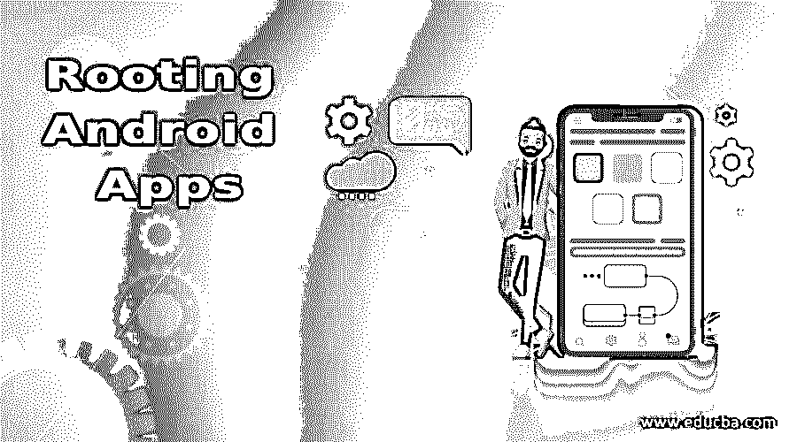
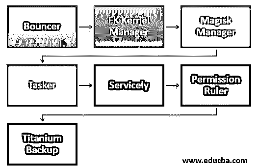

# 扎根安卓应用

> 原文：<https://www.educba.com/rooting-android-apps/>

## Android 应用生根简介

支持任何安卓用户的手机都是一种过去式。这是你在更广阔的变化世界中迈出的第一大步。不幸的是，没有简单的方法可以找到任何 Android 设备的根。有些设备可以“一键”根。顾名思义，这样做非常容易。我们将展示一些今天的单击根方法。XDA 不推荐下面显示的一次点击根方法。通常这些系统是基于恶意软件的，并且通常是由不诚实的开发者构建的。在使用它们之前，请阅读下面的评论，并考虑其他用户提出的指控。

### 7 大安卓应用

现在，我们将看到一些根深蒂固的 android 应用程序，如下所示:

<small>网页开发、编程语言、软件测试&其他</small>

#### 1.保镖

Bouncer 在技术上不是根应用。但这是 root 用户认为我们想要的应用类型。它帮助你以比 Android 更大的粒度来处理你的权限，而不会太复杂。您可以触发它，然后在应用程序请求许可的几分钟后取消 Bouncer 的许可。因此，通过最大权限，你可以使用手机上的所有应用程序，但要确保没有权限是永久启用的。Permission Ruler 几乎做了同样的事情，但是以另一种方式，所以我们认为在这种情况下你会希望有更多的选择。

#### 2.FK 内核管理器

内核管理器是一个 Franco 内核安装的根程序。这使得一系列用户可以调整控制器，包括 CPU 频率、GPU 频率、预定义的色温等。它还支持一系列设备，尤其是一加和谷歌。这不是某个 ROM 或者内核售后的唯一应用。但如果它与你的设备兼容，那当然是最好的。它也是目前少数活跃在 Play Store 开发中的公司之一。它价值 3.49 美元，推荐给那些想要更多控制的人。

#### 3\. Magisk Manager

Magisk 是最常见和最强大的根应用程序之一。它也很新。它最大的特点就是你可以非常有效的隐藏它。当你在 roots 时，你可以使用像 Pokemon Go 或网飞这样的应用程序。它还有许多其他功能，包括添加附加功能的模块。这是一个真正的根应用程序是必要的。Google Play 已经没有了。因此，必须从 XDA 开发商那里获得 APK。软件也在积极发展。这意味着它经常获得新的功能、设计和修复。

#### 4.许可标尺

对于根应用程序来说，许可标尺有点像一颗未加工的钻石。除了手动管理您的授权，您需要 root 来做任何事情。然而，这个应用程序用心做了一些特别的事情。它会在计算机关闭时禁用所有程序的设置。所以，当你在你的口袋里，他们不能在后台做不可思议的事情。这是他的主要角色，而且很简单。暂停应用程序，否则你的所有应用程序都将被删除，你必须在卸载应用程序之前手动重新激活它。该软件可以免费使用。

#### 5.服务地

是一款控制后台服务的服务 app。这将使您能够做一些事情，防止脸书运行在屏幕后面。这是一个停止流氓应用程序和设备的无端唤醒的停顿。根据设备的不同，它还可以提高性能和电池寿命。由于 Android 的 doze 模式的变化，它现在变得不那么重要了。对于那些想把他们的程序推得更快一点的人来说，这还是可以的。Greenify 也很好用，但没那么好。

#### 6.包包包包包包包包包包包包包包包包包包包包包包包包包包包包包包包包包包包包包包包

名为 Tasker 的根应用是我们列表中的下一个应用。这个强大的应用程序可以为你的电话做任何你想做的事情。这是一个模糊但准确的描述，因为你的想象力是唯一的限制。许多应用程序不需要根许可证。然而，如果你有它，它增加了其他功能。它对修补者和那些有独特智能手机需求的人特别有用。然而，要有耐心，因为学习的曲线非常陡峭。不管有没有碱，都是有用的。如果使用 Google Play Pass，可以免费使用。

#### 7.钛备份

Titanium Backup 长期以来一直位于许多根列表的顶端，不包括它几乎是对它的亵渎。您可以使用此应用程序卸载和备份您的应用程序和应用程序数据。多年来，这个应用程序发誓从闪光器。这是所有新的根用户都推荐的。如果你有勇气，就立刻去得到它。有史以来最受欢迎的根应用可能在前三名。

### 结论

在这篇文章中，我们看到了各种各样的 rooting android 应用程序来 root 你的手机，删除不必要的应用程序，为有用的应用程序腾出空间，以及阻止广告。你可以根据自己的需要选择任何一种。我希望这篇文章对你有所帮助。

### 推荐文章

这是一个扎根安卓应用的指南。在这里，我们还讨论了介绍和 7 大植根于 android 应用程序以及解释。您也可以看看以下文章，了解更多信息–

1.  [安卓事实](https://www.educba.com/android-facts/)
2.  [为您的 Android 设备生根发芽](https://www.educba.com/rooting-your-android-device-phone/)
3.  [扎根安卓。](https://www.educba.com/rooting-android/)
4.  [Android 设备管理器跟踪器](https://www.educba.com/android-device-manager-tracker/)

