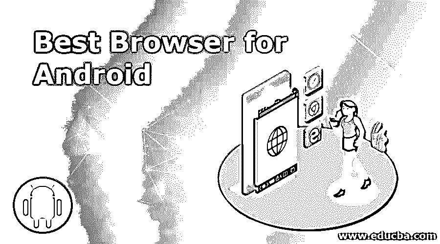
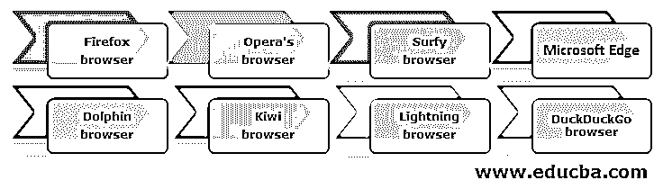

# 安卓最佳浏览器

> 原文：<https://www.educba.com/best-browser-for-android/>

## Android 最佳浏览器介绍

对于任何安卓设备，网络浏览器应用都扮演着重要角色。选择合适的浏览器应用程序，它包含出色的功能，为您提供卓越的性能，可以改变您的整个导航体验。为 Android 设备选择合适的移动应用有点困难，因为有很多应用可用，而且网络的面貌在不断变化。基于它们的特性和功能，在本文中，我们将讨论一些最好的 Android 设备浏览器。这使您可以选择合适的浏览器来满足您的 Android 应用程序要求。根据用户评估和软件测试，谷歌 Chrome 浏览器是一款出色的 Android 设备浏览器。但是 Opera 和 Firefox 的移动版本都为其用户提供了出色的支持。

### Android 最佳浏览器列表

让我们来看看一些最好的 Android 浏览器，如下所示

<small>网页开发、编程语言、软件测试&其他</small>

#### 1.火狐浏览器

对于 Firefox 来说，这款浏览器的速度非常快，而且非常安全。您可以通过浏览器自定义阻止加载项。随着建立跟踪安全，应用程序保护您的隐私。火狐提供了两种浏览器，分别是火狐浏览器和火狐焦点界面。Firefox 浏览器包含标准和最流行的设备同步、跟踪保护、集成密码管理等等。Firefox Focus 通常被称为隐私浏览器，提供保护和隐私。

#### 2.Opera 的浏览器

此外，Opera 浏览器是移动用户最喜欢的浏览器之一。它为 Android 提供了两种独立的浏览器。第一个是知名的 Opera 浏览器，第二个是 Opera Mini。经典的 Opera 浏览器具有部分广告拦截、视频压缩和仪表板功能。这些功能加快了网站的加载速度。一个轻量级和更小的替代方案是 Opera Mini 浏览器。Opera 还提供一个集成的免费 VPN，为你提供一个虚拟 IP 地址来监控你的位置。

#### 3.冲浪浏览器

Surfy 浏览器只是另一个奇妙的 Android 浏览器。它提供了基本的功能，如历史，书签和众多的搜索提供商。这也有先进的功能，包括主题，广告拦截器，文本到语音，有趣的工具栏变化，等等。浏览器 Surfy 表示，该软件提供文本到语音的功能，如果你愿意，可以阅读网页。我们提供了指纹和密码来保护您的浏览器。它提供了一个匿名模式，以防止隐私和位置。Surfy 浏览器允许你通过选择一种颜色或你喜欢的图片来自动改变你的背景。该软件阻止对网站的监控。

#### 4.微软 Edge

老实说，微软 Edge 是一个很好的网络客户端。它包括 QR 码阅读器、hub 功能、语音搜索和隐私浏览模式等功能。微软 Launcher 和 Windows 10 是这款应用的理想解决方案。Microsoft Edge 包含侧重于密码管理器、广告拦截器和翻译服务等扩展的软件。该软件可以有效地与您的手机同步。

#### 5.海豚浏览器

在 Android 设备上，海豚浏览器已经获得了巨大的人气。它包括广告拦截、隐私保护匿名模式、多标签、个性化搜索、快速下载、flash 支持和手势控制等强大功能。该程序 HTML5 包括高速加载屏幕、flash 等。

#### 6.奇异果浏览器

奇异果浏览器是一个较新的 Android 浏览器，在网页上加载非常好。它包括 100%对比度夜间模式、弹出窗口拦截器、原生广告拦截器和加密劫持安全等功能。Chromium 和 WebKit 是基于 Kiwi 浏览器的。它声称在浏览网页时速度非常快。这个软件通过阻止缓慢和暴力的追踪器来保护你的隐私。这个应用肯定会是最好的选择之一。

#### 7.闪电浏览器

lighting 浏览器是 Android 最好也是最受欢迎的。它具有简单的设计和易于使用的体验。这个应用程序提供了许多功能，如主题，区块，隐私，阅读，等等。它提供了一个匿名浏览模式来保护你的隐私和位置。

Lightning 浏览器有免费版和付费版。免费下载版本提供无限开放标签和个性化广告拦截。通过阻止自定义广告，您的浏览活动提高了速度和安全性。付费版提供了一些额外的功能，包括全屏，历史，书签，广告块，阅读模式，搜索建议，等等。

#### 8.DuckDuckGo 浏览器

客户端 DuckDuckGo 给予其用户完全的隐私。它让你可以通过网络浏览器控制你的个人数据。当你搜索和浏览互联网时，浏览器 DuckDuckGo 给你一定程度的隐私。这个保密级别让你知道你有多安全。该应用程序为您提供常规浏览功能，包括标签、自动和书签。该软件监控广告。为了让你在 tap 上删除你所有的数据和标签，除了上面提到的隐私安全，还有火图标。

### 推荐文章

这是一个安卓最佳浏览器指南。在这里，我们讨论一下在 Android 中使用的最佳浏览器。您可以根据自己的需求选择上述任何一种浏览器。您也可以阅读以下文章，了解更多信息——

1.  [安卓架构](https://www.educba.com/android-architecture/)
2.  [安卓 VPN 应用](https://www.educba.com/vpn-applications-for-android/)
3.  [安卓文件管理器](https://www.educba.com/android-file-manager/)
4.  [安卓生产力](https://www.educba.com/android-productivity/)

