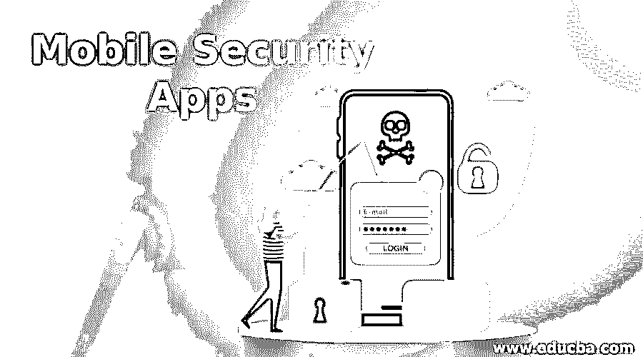

# 移动安全应用

> 原文：<https://www.educba.com/mobile-security-apps/>

## 移动安全应用简介

移动数据保护软件通过攻击、网络安全和数据备份来保护移动设备及其数据。为了允许安全的移动访问网络和系统，其员工将使用移动数据保护工具。专业用户可以使用软件来保护个人数据和数据。为了确保稳定的通信、实现安全性并限制第三方应用程序的使用，企业将需要移动数据安全工具。一些企业对数据进行加密，以防止被入侵的计算机被访问。其他人可以使用该程序进行例行审计，跟踪威胁，并开发稳定的大门。移动数据保护解决方案提供数据安全、网络安全和 web 安全设备的重叠功能。但是，移动数据保护工具明确讨论了移动设备保护。

### 移动数据安全软件列表

移动数据安全软件列表如下:

<small>网页开发、编程语言、软件测试&其他</small>

#### 1.帕洛阿尔托网络公司

GlobalProtect 保护移动员工免受来自下一代防御网络的目标攻击、规避流量、图像、恶意网站、访问和控制流量以及已知和未知威胁。

#### 2.Avast 移动安全

结合许多其他风险，avast 是一个为您的 android 手机提供安全的伟大应用程序。Avast 是世界上最受欢迎的免费 android 杀毒软件之一，它会通知您间谍软件、隐私泄露和广告软件。新的 android 恶意软件检测率约为 99.9%，在过去四周内检测到约 100%。

#### 3.Sophos 防病毒和安全

Sophos 是安卓最好的免费杀毒软件之一。用户界面可能不会给你留下深刻的印象。它的特点一定会让你放松心情。支持丢失和被盗安全的远程访问使用户能够清洁、锁定、响铃和定位他们的设备。Sophos 有一个新的 100%恶意软件检测率，以区别于其他产品。如果你选择功能而不是可爱的界面，Sophos 确实是同类应用中最好的。

#### 4\. Applock

这个软件非常容易使用。通过要求用户设置 pin/motif 来访问该功能，AppLock 可以保护单个应用程序免受入侵。你可以锁定你的短信、地址、Gmail 或任何应用。不要把你的应用程序锁和你手机的内置锁做比较。您电脑上的一把锁就集成在这把锁中。你什么都做不了。AppLock 仍会锁定您选择的应用程序。如果您想防止入侵者访问您的应用程序，但不想为您的计算机保留任何密码，您可以使用 applock。

#### 5.安全呼叫

这意味着没有人能够听到你的电话。安全电话为您的私人电话提供端到端的保护，防止入侵者使电话过热。它使用普通的手机应用程序拨打和接听电话。其点对点网络，安全的端到端加密，防止第三方调用像这个应用的开发者被窃取。

#### 6.应用运营

App Ops 的基本功能是删除某一组权限。很多程序都有额外的条款，与它们的功能没有太大关系。你可以用 app 操作屏蔽这些不必要的授权。在您的计算机上安装应用程序时，您必须授予系统所有方面的权限。如果您拒绝权限，该应用将不会被激活。App ops 适用于无需特定权限集合即可激活软件的情况。

#### 7.查找我的设备

“查找我的设备”是一个增强的 android 设备管理器，可以响铃、搜索和远程锁定您的 android 设备。如果系统偶然永久失控，您也可以擦除系统的全部数据。谷歌也是迄今为止设置最简单的，它能让你通过别人的 android 系统管理器登录，并随时从你的电脑上删除数据。

#### 8.奥尔博特

Orbot 是一个 android 程序，它可以伪造你通过 tor 网络的所有流量，这是 tor 项目的一部分。vpn 使用单个服务器，而 tor 会通过多个隧道路由你以防止跟踪。Orbot 提供完全私有的移动通信链接。数据是加密的，重新冻结的数据在到达最后解密的网络之前会被加密和复制几次，以防止用户跟踪它。

#### 9.Salesforce 盾

每个行业的执行和治理标准都是特定的。salesforce shield 提供了一个强大的工具包，可以满足任何需要进一步控制的组织的内部或法规实施标准。为了在关键业务应用程序中创建新的信任、责任、法规遵从性和治理级别，IT 部门和开发人员现在可以使用点击式工具。

### 推荐文章

这是一个移动安全应用指南。在这里，我们还将讨论移动安全应用的介绍和列表，包括 applock、secure call 和 app ops。您也可以看看以下文章，了解更多信息–

1.  [网络安全工具](https://www.educba.com/cyber-security-tools/)
2.  [安全测试](https://www.educba.com/security-testing/)
3.  [手机应用 vs 网站](https://www.educba.com/mobile-apps-vs-website/)
4.  [移动应用](https://www.educba.com/mobile-applications/)

