# 每个苹果粉丝都应该知道的 iOS 8 的 5 个小技巧

> 原文：<https://www.educba.com/5-tips-of-ios-8-every-apple-fan-should-know/>

## 每个苹果粉丝都应该知道的 iOS 8 的 5 个小技巧

2014 年 6 月 2 日，苹果公司在 2014 年 WWDC 全球开发者大会上发布了 iOS 8。iOS 8 于 2014 年 9 月 17 日正式发布。据报道，iOS 8 已经安装在 83%的兼容苹果设备上。iOS 8 有几个版本，每个版本都修复了一些错误。在 iOS 8 版本的初始发布中出现了 WiFi 问题。这导致 WiFi 连接突然中断，让用户陷入困境。苹果公司推出了后续版本，在短时间内修复问题。截至今天，iOS 8.3 已于 2015 年 4 月 8 日发布。你也可以从苹果官方网站获得 iOS 8.4 测试版。

如果你属于 27%的 iOS 用户(iOS 7 及以下),那么一定要升级到 iOS 8。让你惊讶的是，它是免费的！!在升级到 iOS 8 之前，请确保您的设备兼容。

<small>网页开发、编程语言、软件测试&其他</small>

以下是 iOS 8 兼容设备列表:

**1。iPhone :**

*   iPhone 4s 和 iPhone 5
*   iPhone 5c、iPhone 5s、iPhone 6 和 iPhone 6 plus

**2。iPad :**

*   iPad 2、iPad (3 代代)、iPad (4 代代)、iPad Mini (1 代代)
*   iPad Air、iPad Air 2、iPad Mini 2 和 iPad Mini 3

**3。iPod Touch :**

*   iPod Touch(第 5 代代)

你可以在上面列出的所有兼容设备上安装 iOS 8。然而，iPhone 4s、iPhone 5、iPad 2、iPad (3 第代)、iPad (4 第代)和 iPad Mini (1 第代)都是 32 位设备，很快就会过时。

苹果最近强迫开发者在 App Store 上发布 64 位而非 32 位版本的应用。这个链接[苹果开发者](https://developer.apple.com/news/?id=12172014b "Apple Developer")会给你更多关于 64 位和 iOS 8 对应用更新要求的细节。

### 改进的电子邮件–IOS 8

以下是一些改进的电子邮件——IOS 8:

#### 形容词（adjective 的缩写）手势

苹果在 iOS 8 邮件应用中引入了新的手势。Mail 支持内嵌滑动手势来标记、存档和删除邮件和线索。

向左滑动以获得更多、标志和垃圾桶选项(如屏幕截图 1 所示)。您可以标记一封电子邮件，以便与其他邮件区分开来。选择回收站直接删除邮件。“更多”按钮显示菜单，包括回复、转发、标记、标记为已读、移至垃圾邮件、移至文件夹和设置提醒通知(如屏幕截图 2 所示)

[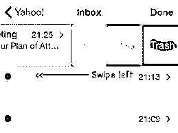

](https://cdn.educba.com/academy/wp-content/uploads/2015/07/1.jpg) 

Screenshot 1

[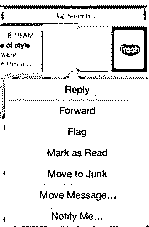

](https://cdn.educba.com/academy/wp-content/uploads/2015/07/2.jpg) 

Screenshot 2

此外，长时间的向左滑动会直接删除所有信息。

向右滑动会提示选项将其标记为未读(如屏幕截图 3 所示)，而长时间向右滑动会自动设置为阅读状态，无需点击。

[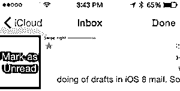

](https://cdn.educba.com/academy/wp-content/uploads/2015/07/3.png) 

Screenshot 3

#### b.通知

苹果在 iOS 8 中提供了对“通知我”提醒的支持。您可以将提醒配置为在 Mail 收到重要邮件回复时播放。撰写邮件时，只需点击主题行中出现的蓝色铃铛图标(如屏幕截图 4 所示)。

 

Screenshot 4

你也可以通过向右滑动并选择“更多”来设置提醒。这将打开包含“通知我”的提示(如屏幕截图所示)

### 安装第三方键盘–IOS 8

现在你可以在 iOS 8 中使用第三方键盘，而不是你的 iPhone/iPad 设备的无聊默认键盘

[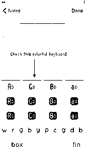

](https://cdn.educba.com/academy/wp-content/uploads/2015/07/5.png) [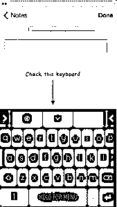

T11】](https://cdn.educba.com/academy/wp-content/uploads/2015/07/6.png)

#### 形容词（adjective 的缩写）如何安装新键盘？

App Store 上有几种不同的第三方键盘，如 Swift Key(免费)、Fleksy 和 Swype(售价 0.99 美元)。您可以像安装 App Store 中的任何应用程序一样安装第三方键盘。

一旦你成功安装了键盘，你必须在使用前添加它。您可以使用以下步骤添加新键盘(如屏幕截图 5 所示):

设置->通用->键盘->键盘->添加新键盘

[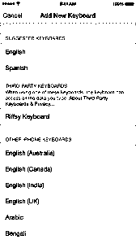

](https://cdn.educba.com/academy/wp-content/uploads/2015/07/7.png) 

Screenshot 5

#### b.打开新键盘

安装第三方键盘应用程序后，您可以看到您打开的可用键盘列表。这可能会要求您提供对 iOS 设备的完全访问权限。

使用第三方键盘的风险在于，它可能会向第三方开发者提供个人信息。然而，iOS 8 不允许第三方键盘访问您的个人信息，除非您允许完全访问。

为了使用第三方键盘，您需要授予您添加的每个键盘的完全访问权限。

进入设置->通用->键盘->键盘，点击你想给完全访问的键盘。如果您没有安装任何第三方键盘，完整访问部分将不会出现。

#### 碳（carbon 的缩写）切换到第三方键盘

使用应用程序时，您可以切换到任何第三方键盘。只需选择应用程序中的文本字段。您可以在键盘上看到地球仪图标(如屏幕截图 6 所示)。这允许您在第三方键盘列表之间切换。

 

Screenshot 6

#### d.使用第三方键盘

您可以使用以下步骤管理第三方键盘:

设置->通用->键盘->键盘->编辑

在此部分中，您可以安排键盘的顺序和移除键盘。您也可以通过从 App Store 删除已安装的相应应用程序来删除第三方键盘。这也将从设置中删除相应的键盘。

### 在 iPad、iPod touch 或 Mac 上接听电话——IOS 8

iOS 8 允许您使用连续性连接 iPhone、iPad、iPod touch 和 Mac。连续性使您可以在 iPhone、iPad、iPod touch 和 Mac 等设备之间高效移动。这包括诸如切换、电话呼叫和即时热点等功能。

例如，你在 Mac 上写了一封电子邮件，突然你在 iPhone 上接听了一个重要的电话，邮件只写了一半。通话结束时，您可以从 Mac 上留下的地方开始发送电子邮件。

当 iPhone 在同一个 Wi-Fi 网络上时，iOS 8 允许您从 iPad、iPod touch 或 Mac 拨打和接听手机电话。

您可以通过以下步骤实现这一点:

形容词（adjective 的缩写）假设你有一个 ID 为 user@educba.com 的 iCloud 账户。现在，在所有设备(iPhone、iPad、iPod touch 和 Mac)上登录 iCloud 帐户。

b.注意所有设备都要有 iOS 8，Mac 要用 OS X Yosemite。

碳（carbon 的缩写）此外，所有设备都应该在同一个 Wi-Fi 网络中(比如 eduCBA_WiFi)。

d.现在使用 user@educba.com I cloud 帐户登录 FaceTime。这将允许所有设备接听您的电话。

要在 Mac、iPad 或 iPod touch 上打电话，只需在通讯录、日历或 Safari 浏览器中点击一个电话号码(如屏幕截图 7 所示)。

[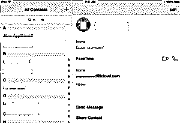

](https://cdn.educba.com/academy/wp-content/uploads/2015/07/9.png) 

Screenshot 7

在 iPad 或 iPod touch 上接听电话与在 iPhone 上一样，只需滑动即可(如截图 8 所示)。

 

Screenshot 8

当您在 iPhone 上收到来电时，可以在 Mac 上看到通知。你可以接听电话，将其发送到语音邮件，或从 Mac 本身向呼叫者发送消息(如屏幕截图 9 所示)。

 

Screenshot 9

要在 iPad 或 iPod touch 上关闭 iPhone 手机通话，请从“设置”->“face time”中关闭 iPhone 手机通话(如屏幕截图 10 所示)

[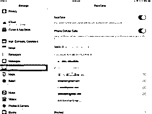

](https://cdn.educba.com/academy/wp-content/uploads/2015/07/12.jpg) 

Screenshot 10

在 Mac 上，打开 FaceTime 应用程序，然后进入 FaceTime ->偏好设置。现在点击设置，取消 iPhone 手机通话选项。

### 快速输入–IOS 8

iOS 8 提供了一个新的预测打字功能，称为 QuickType。当您键入时，它会在键盘上方显示单词建议。这是自第一台 iPhone 设备发布以来键盘最大的变化。

它还能预测你接下来可能会说什么。不管你对谁说。使用 QuickTypes，你只需轻敲几下就可以写出完整的句子，从而节省时间和精力。iOS 8 会考虑您在撰写邮件、信息或任何文本时使用的风格。

[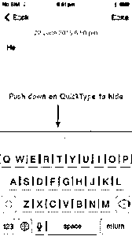

](https://cdn.educba.com/academy/wp-content/uploads/2015/07/13.jpg) 

Screenshot 11

[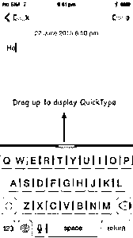

](https://cdn.educba.com/academy/wp-content/uploads/2015/07/14.jpg) 

Screenshot 12

您可以通过按下 QuickTypes 栏来隐藏它。为了显示键盘上方出现的 QuickTypes 上推栏(如屏幕截图 11 和 12 所示)。

iOS 8 预测文本引擎针对苹果设备支持的所有语言进行了优化。这意味着您可以看到所有您的地区语言的建议单词和短语。支持的语言包括针对美国、英国、加拿大和澳大利亚的英语、法语、德语、意大利语、葡萄牙语、简体中文、繁体中文和日语

您可以在屏幕截图 13 中看到使用第三方键盘的法语 QuickTypes。

[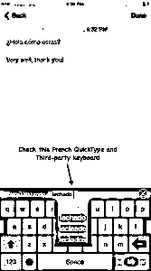

](https://cdn.educba.com/academy/wp-content/uploads/2015/07/15.png) 

Screenshot 13

在一段时间内，iOS 8 预测文本引擎将学习你的沟通方式

还知道你最喜欢的短语，并建议下一个可能的逻辑单词。

### 跟踪您的健康状况–IOS 8

苹果已经在 iOS 8 中宣布了健康应用程序和以开发者为中心的 HealthKit API。

这将创建一个集中的安全位置来存储您的健康相关统计数据。这些统计数据可以是你的心率、血压、血糖水平、消耗的卡路里和胆固醇(如截图 14 所示)。

[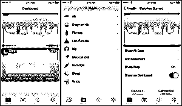

](https://cdn.educba.com/academy/wp-content/uploads/2015/07/16.jpg) 

Screenshot 14

您还可以从您的锁定屏幕(如屏幕截图 15 所示)创建一个包含重要健康信息(如您的血压或心率)的紧急卡。这张急救卡可以帮助你在紧急情况下与你的家庭医生分享重要的医疗状况。

[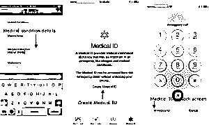

](https://cdn.educba.com/academy/wp-content/uploads/2015/07/17.png) 

Screenshot 15

以开发者为中心的 HealthKit API 允许开发者[开发应用](https://www.educba.com/mobile-app-development-tool/ "How to Make a Mobile App")来访问你的健康数据。例如，您可以允许血压应用程序的数据自动与您的家庭医生共享，或者您的应用程序可以确定今天走了多少步(如屏幕截图 16 所示)。

[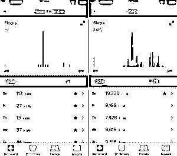

](https://cdn.educba.com/academy/wp-content/uploads/2015/07/18.png) 

Screenshot 16

这里有几个令人兴奋的应用程序，已经在 AppStore 上集成了 HealthKit，Nike 和 MayoClinic 可以用来将健康统计数据存储到集中式健康应用程序中。另一个 Withings 的血压监测应用程序用于监测血压，这已经成为苹果 [WWDC](https://www.educba.com/highlights-of-wwdc-2015-keynote/ "Highlights of WWDC 2015 keynote") 展示的一部分。此外，Jawbone 的 UP Coffee 应用程序可以用来确定你的咖啡因摄入量。

### 推荐文章

这里有一些相关的文章，可以帮助你了解更多关于 iOS 8 的细节，所以只要浏览下面的链接就可以了

1.  [使用 iOS 8 获得更长电池续航时间的 14 种简单方法](https://www.educba.com/14-easy-ways-to-get-more-battery-life-with-ios-8/)
2.  [每个苹果粉丝都应该知道的 iOS 8 的 5 个小技巧](https://www.educba.com/5-tips-of-ios-8-every-apple-fan-should-know/)
3.  [数据科学 vs 软件工程](https://www.educba.com/data-science-vs-software-engineering/)

