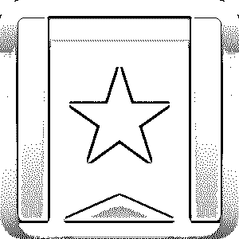
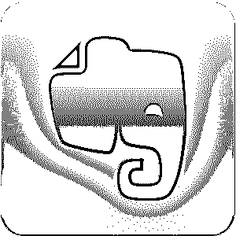
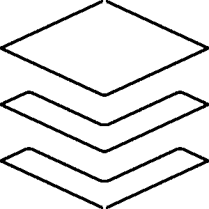
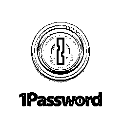
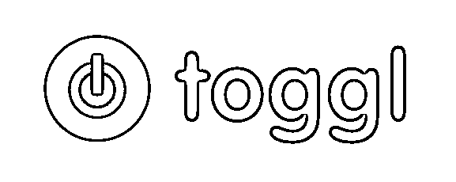
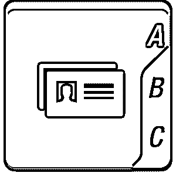
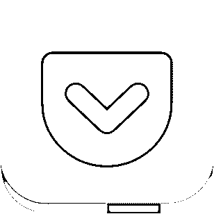
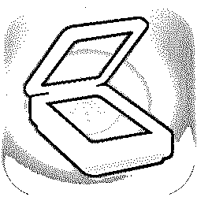
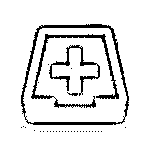

# iOS 应用程序

> 原文：<https://www.educba.com/ios-apps/>

## iOS 应用程序简介

我们都希望优化利用时间，提高效率。iOS 电子邮件应用程序帮助我们增强信心，让我们觉得更有成效。

我们无时无刻不在使用 iOS 电子邮件应用，这无疑是工作时最大的干扰因素。但是我们能改变这种情况，把同样的手机变成生产力工具吗？我们当然可以。如今，iOS 应用商店上的大量 iOS 电子邮件应用程序都可以下载到你的智能手机上，让你的生活更有效率。这个 iOS 应用商店实际上让你在一定程度上探索自己富有成效的一面成为可能；你可能从来没有做过。iOS 应用程序对于自由职业者来说尤其方便，因为 iOS 电子邮件应用程序也可以帮助他们组织工作。

<small>网页开发、编程语言、软件测试&其他</small>

所以，在本文中，你可以从 iOS 应用商店免费下载 iOS 应用。将提高您工作效率的十大 iOS 应用列表。

#### 1 .仙境

排名第一的是 Wunderlist——手机的组织者。顾名思义，它可以帮助我们列清单。名单？你可能会问。列出要完成的任务是保持专注和有条理的最好方法。

注册免费的神童帐户。为你的每项任务创建一个新的 iOS 电子邮件应用列表。你在 iOS 应用中创建的每一个列表都会自动保存在云中，你可以从你的任何设备上访问它。它还可以让你安排和重新安排你的任务，并帮助你保持有组织性。

*   **提高工作效率—**假设 iOS 应用程序创建一个列表来完成一个项目。完成清单上的一项后参考清单，并专注于下一项。它发展你的计划项目。
*   **易于使用的 Android iOS 应用–**在秒列表中添加新的 Android iOS 应用，并通过其 3D Touch 快速操作快速浏览您的列表。
*   **出色的 iOS 应用程序设计—**它的新外观和 iOS 应用程序设计看起来令人惊叹。

**其他组织者 iOS 应用:**胡萝卜

在今年的苹果全球开发者大会(WWDC)上，苹果首席执行官蒂姆·库克宣布 iOS 应用商店中已经有 90 万个应用。

#### 2.Evernote

在你的包里放一个记事本和一支笔是通行的吗？毕竟都 2022 年了！你的一体化设备，你的智能手机，几乎扮演着每一个角色，那么为什么不是记事本呢？

Evernote 是你快速记录的记事本。快速记下笔记，它会自动同步到云，这意味着您永远不会丢失它，并且可以从任何其他设备访问它。你甚至可以同步你的照片，信息，待办事项，快速笔记等。，到云端。

*   **扫描手写笔记:**有了 Evernote，你甚至可以扫描手写的笔记，它会破译无法阅读的文字。
*   **设置提醒:**你可以创建 iOS 应用程序任务，并将提醒设置为总是提前。
*   **扫描名片:**扫描名片，并在需要时随时访问它们，而不必在成堆的名片中翻来翻去。
*   免费的。

**其他记事本 iOS app:**置顶笔记，一记笔记，记奶。

#### 3.缓冲器

你在 Twitter、Pinterest、脸书和 LinkedIn 等社交网站上活跃吗？当你突然有查看你的 Twitter 账户并在那里留言的冲动时会发生什么？你放下所有的工作，被网络——魔法师——吸引。

你一定想了无数次，“但愿”——有办法可以分享你的内容，而不必中断你的工作。你可能也经历了一天中思想的涌入，这可能不是分享它们的最合适的时间。这就是 Buffer 为您实现的目标。它使您能够在给定的时间分享您的内容，并安排在以后发布。

buffer 最棒的地方在于它被集成到了浏览器中，其他活动和 iOS 应用程序的设计都可以在不离开活动应用程序的情况下使用。

*   **单点管理系统:** iOS apps for android 可以帮助您同时从一个点管理您的各种社交网络帐户。适用于 Android 的 iOS 应用程序还会显示您所有账户的信息。
*   **直接分享:**你可以直接从你的网页浏览器分享链接和下载到缓冲区。
*   您可以使用 buffer 进行计划和发布。
*   您可以从 iOS 应用程序商店免费下载 iOS 应用程序

其他选择: SugarSync

#### 4.1 密码

这些肯定是最需要的 iOS 应用程序，然而，可能没有人想到这一点。iOS 应用程序是 1 密码，是所有其他密码的关键。

它为我们在网上使用的所有服务创建了多个账户，并且每次我们需要登录时都忘记密码。那我们该怎么办？搜索保存在桌面上的那个文件的用户名和密码；跟踪当时服务商发来的 iOS 邮件应用？这可能并不总是可行的。

不过，iOS 应用有一个解决这个问题的办法。为什么不为你所有的网站设置一个单一的密码。这似乎是一个可行的解决方案，但也有一个问题。像网上银行使用的敏感密码怎么办？

1Password 可以回答所有这些问题。iOS 应用程序是一个一站式商店，你可以保存你所有的密码，这些密码由一个只有你知道的主密码保护。

*   **密码创建:** 1Password，不仅能保存您的密码，还能为您创建强密码，让黑客无法入侵。
*   你不仅可以保存你的网络密码，还可以保存其他敏感信息，如车库、汽车、门等的锁码。

**其他密码管理器应用:**通用密码管理器

#### 5.托格尔

有什么比有一个工具告诉你你在哪里花了大部分时间，然后帮助你更好地利用时间，更有效地利用时间更有效率呢？使用时间跟踪工具这是完全可能的，我们今天将讨论 Toggl。

这个时间追踪工具在线工作，追踪你宝贵时间的每一刻。然后它会向你报告，这样你就可以更好地分析和计划你的时间。你还可以用它来衡量和[提高员工的生产力](https://www.educba.com/improve-productivity-in-office/)。它确保你宝贵的赚钱时间的每一分钟都被明智地消耗掉。它帮助你确定你的优先事项并保持专注。

*   使用 Toggl 实时跟踪时间。
*   这是一个基于云的时间跟踪工具。
*   在报告上保留一个标签，描述您在 iOS 应用程序中使用的时间。否则，从 web 导出整个时间表。
*   它利用你的任务和项目，通过任务计时器或物理时间跟踪。
*   您可以记录个人或团队的工作时间。
*   iOS 应用程序为个人和公务创建单独的时间表；活动。
*   免费下载 iOS 应用程序，稍后升级到付费版本以解锁更多功能。

**其他时间追踪应用:**小时，及时，HoursTracker

#### 6.ABBYY 名片阅读器

谁会否认名片的重要性呢？你们中的大多数人会在工作抽屉的每个角落都堆满这些卡片。但这些小矩形纸的问题是，你可以在不需要它们的情况下保留它们很多年，但今天你丢失了其中的一个，你将不得不把你的办公室翻个底朝天，寻找它。否则你会发现除了你要找的那张牌之外的所有其他牌。

为这些名片保留和开发 iOS 应用程序，同时又减少其数量的最佳方式是什么？你的智能手机足够智能来解决这个问题吗？答案是肯定的。一个叫艾比的名片阅读器和组织者。

这是 Linkedin 的一款免费 iOS 应用，当你在手机上使用该应用点击名片照片时，它会保留所有细节，如多个电话号码、地址和其他细节。它扫描信息，并将其保存在不同的标题下，如您的联系人列表。

*   使用 OCR 或光学字符识别技术。易于导航的界面。
*   识别各种字体和符号。
*   针对读卡器未正确读取的区域编辑扫描的卡片。
*   突出显示它无法识别的文本。
*   在 iOS 应用程序功能中添加一种语言，可以用 21 种语言中的任何一种扫描名片。您一次最多可以激活三种语言。

**其他读卡器应用:**全接触读卡器

#### 7.龙听写

你的生产时间有多少是用在输入信息、电子邮件、笔记、提醒和状态更新上的？我们甚至没有意识到，但在我们花在智能手机上的总时间中，至少有三分之一的生产时间花在了打字上。有时，打字会很单调和无聊。我们许多人私下都希望有一个办公室助理来帮我们做听写。这可以通过你的 iPhone 上的一个简单的应用程序来实现。

龙听写 iOS 应用程序创建文本信息，状态更新和 iOS 电子邮件应用程序，而你只是在你的声音听写。iOS apps free 令人惊讶的是，当你说出来的时候，文字就出现在屏幕上。

*   **更快:**龙听写 iOS 应用是一种和我们说话一样快的类型。我们肯定比不上它的打字速度。它快了五倍。
*   节省时间:当你的手机为你打字的时候，你可以做一些其他的事情，节省很多时间。

它可以与你手机上所有其他需要打字的应用程序合作，无论是电子邮件、脸书、推特还是记事本。

#### 8.口袋

我们用口袋来装我们以后可能需要的东西。口袋 iOS 应用程序也做类似的事情。它可以让你在手机或 i-pad 上保存你在网上看到的故事和 iOS 应用新闻文章，以便你以后有更多空闲时间时可以阅读它们。因此，有了口袋，你就可以保存和管理自己的阅读清单。

用口袋。当你看到有趣的内容时，只需按下浏览器上的袖珍按钮。它将被保存到云中。这意味着您可以直接从浏览器或其他 iOS 应用程序中保存文章。

*   **在线和离线阅读:**在线或离线阅读保存的文章。它会同步到您的所有设备，以支持离线阅读。
*   **保存任何内容:**保存文本、链接、音频、视频或图片。
*   调整字体设置以适应您的舒适。
*   浏览保存的文章列表，在空闲时间阅读。更有效地利用你的生产时间。

**其他阅读 app:**Digg

#### 9.微型扫描仪专业版:PDF 文档扫描

微型扫描仪是所有专业人士的必备之物。想象一下你在扫描所有重要文件时所增加的时间。现在只需一次点击就可以完成！

iOS 应用程序可以使用这个方便的应用程序扫描你的 i-phone 或 i-pad 上的任何东西。这个 iOS 应用程序可以将你的手机转换成扫描仪，并以 PDF 格式保存你的重要文档。

*   快速又省事。
*   它是便携式的。
*   扫描可以保存为图像或 pdf 格式。
*   将扫描组织到不同的文件夹中。

直接在电子邮件上共享您的扫描或将它们保存到云中。

#### 10.分类电子邮件急救

iOS 电子邮件应用是企业生活的重要组成部分。尽管它们很重要，但它们也是破坏宝贵时间的最大来源，因为不需要的邮件会劫持你的收件箱，给你压力，让你很难立即关注最紧急的邮件。此外，很难决定哪些重要的 iOS 电子邮件应用程序应该首先回复，因为所有这些应用程序都可能需要立即关注。

一个电子邮件管理器应用程序就是这样，还有更多。它帮助你更快更轻松地清理你的收件箱。Triage 帮助你浏览电子邮件，决定你希望采取的行动——查看、回复、保存或删除，并相应地指示应用程序。

读者必须明白，Triage 不是一项电子邮件服务，而只是一个电子邮件组织者，它将帮助你保持收件箱整洁，并使你能够及时回复电子邮件。

*   与各种主要的电子邮件服务配合良好，如 iCloud、Gmail、Yahoo Mail 和 IMAP 电子邮件服务。
*   允许您配置任意数量的帐户。
*   整理和归档电子邮件。
*   吸引人的界面，视觉上吸引人，易于使用。

**其他 iOS 电子邮件应用** : Inky

根据一项研究，普通企业用户每天收发大约 95 封电子邮件。

### 推荐文章

这是一个指南，你可以从 iOS 应用商店免费下载免费的 iOS 应用，以及它的十大 iOS 应用列表。您也可以阅读以下文章，了解更多信息——

1.  [如何安装 iOS？](https://www.educba.com/install-ios/)
2.  [iOS 应用测试](https://www.educba.com/ios-app-testing/)
3.  [IOS 文件管理器](https://www.educba.com/ios-file-manager/)
4.  [安卓是什么？](https://www.educba.com/what-is-android/)

