# iOS 8 延长电池续航时间的 14 种简单方法

> 原文：<https://www.educba.com/14-easy-ways-to-get-more-battery-life-with-ios-8/>

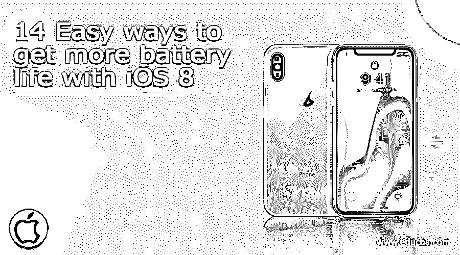

## iOS 8 延长电池续航时间的 14 种简单方法

今天，手机的使用正处于高峰期。人们对手机的依赖程度如此之高，以至于他们甚至不带现金，也没有登机卡。考虑到移动设备如此高的可靠性，知道如何延长 iPhone 设备的电池寿命是很重要的。

当你外出参加周末聚会时，如果没有充电线或没有电源连接，这些技巧也将帮助你让你的 iPhone 持续更长一点时间。

<small>网页开发、编程语言、软件测试&其他</small>

### 提高 iOS 8 电池续航时间的技巧和窍门

以下是一些可以用来延长 iOS 8 电池寿命的技巧和窍门。

1.  启用低功耗模式
2.  检查电池使用情况
3.  管理后台应用刷新
4.  切换到飞行模式
5.  停止位置跟踪应用程序
6.  保持低亮度
7.  使用自动锁定节省电池
8.  保留主要电子邮件帐户
9.  禁用蓝牙
10.  禁用无线网络
11.  调低音量
12.  避免高端游戏
13.  关闭 iCloud
14.  禁用应用程序自动更新

#### 1.启用低功耗模式

苹果公司在 [*WWDC 2015 主题演讲*上宣布了一项新的省电功能*低功耗模式*。除了这一功能，苹果还表示，iOS 9 应该可以帮助你的电池持续额外的一个小时，甚至不需要电池节省模式。](https://www.educba.com/highlights-of-wwdc-2015-keynote/ "Highlights of WWDC 2015 keynote")

如果你的 iOS 8 设备电池电量低于*20%*电量，你会收到一条系统弹出消息，警告你电池电量低，并提供*低电量模式*(如截图 1 所示)。如果您希望开启*低功耗模式*，只需从弹出消息中选择即可。

一旦启用低功耗模式，它将*减少整个系统中的动画*，减少屏幕变暗之前的时间，并尽一切可能延长电池寿命。

如果您希望随时启用低功耗模式，那么您可以通过*设置*来实现(如截图 3 所示)。该功能仅在今年秋季即将推出的 iOS 9 中可用。您可以通过查看屏幕右上方的电池指示灯来确定是否激活了低功耗模式。

Android 应用高级课程

正常情况下，*绿色*表示电池电量充足，*红色*表示电池电量不足，*黄色*表示启用低电量模式(如截图 2 和 3 所示)。

[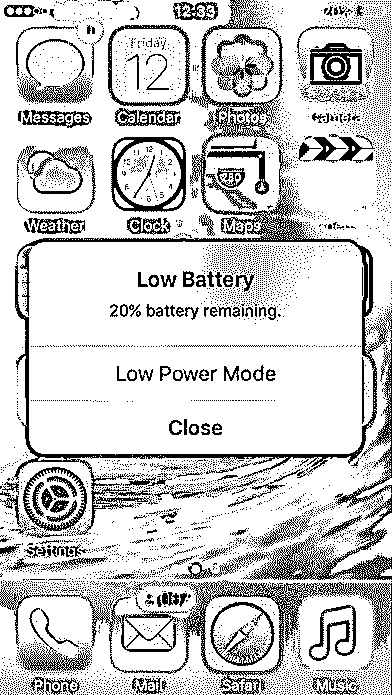

](https://cdn.educba.com/academy/wp-content/uploads/2015/09/1.png) 

Screenshot 1

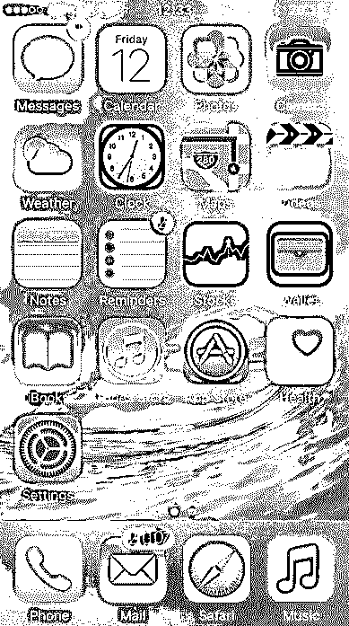

Screenshot 2

[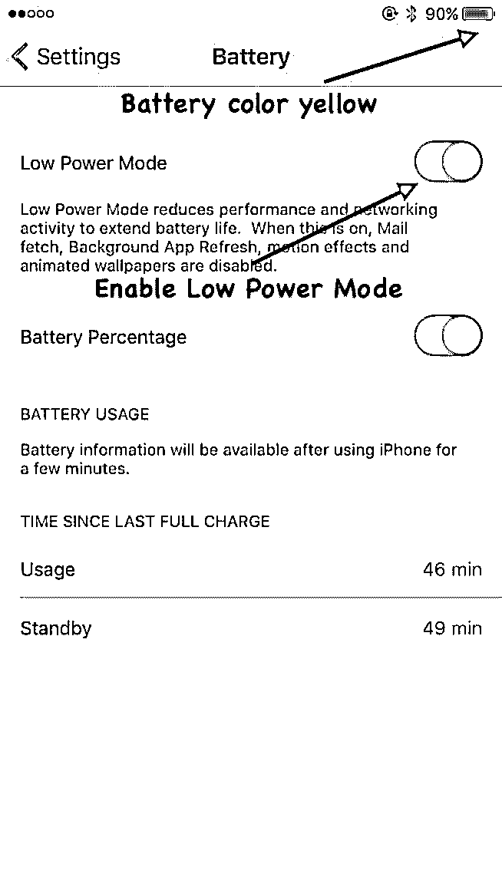

](https://cdn.educba.com/academy/wp-content/uploads/2015/09/3.jpg) 

Screenshot 3

#### 2.检查电池使用情况

确定你的 iPhone 的电池是否有问题的最好方法是检查*设置*中的*电池使用*统计。只需在应用程序上点击一下即可打开设置。然后导航为*常规- >使用- >电池使用*。

你可以在电池使用视图中查看你的*使用量*和*待机时间*(如截图 4 所示)。使用时间是指自上次充电后您使用手机的时间。在大多数情况下，使用时间远低于待机时间。

您可以通过记录使用和待机时间来测试 iPhone 的电池，然后按下开/关将设备置于睡眠模式。现在，五分钟后，检查使用和待机时间的变化。如果使用时间增加了一分钟，待机时间增加了五分钟，那么你的设备工作正常。

如果您的使用时间增加超过一分钟，那么您的手机可能有问题，无法进入睡眠状态。这也表明你有电池耗尽的问题。

您还可以检查特定应用程序消耗您的设备电池的百分比，分为两类，即*过去 24 小时*和*过去 7 天*(如截图 4 所示)。根据这些统计数据，您可以删除消耗更多电池的应用程序。

[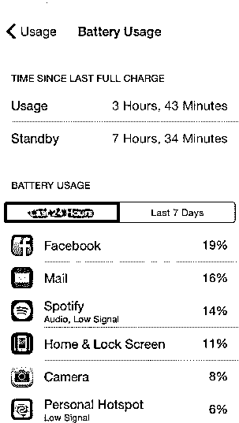

](https://cdn.educba.com/academy/wp-content/uploads/2015/09/4.png) 

Screenshot 4

#### 3.管理后台应用刷新

iOS 8 有一个称为后台应用刷新的功能，即使在后台模式下，应用的内容也会刷新。

例如，你打开一个新闻应用，过了一段时间后，你切换到另一个应用。在这个过程中，新闻应用进入后台状态，而第二个应用处于*前台状态*。即使在后台状态下，新闻应用的内容也会自动刷新。因此，当你切换回新闻应用程序时，你可以获得最新的新闻内容。

这个特性在某些情况下很有用，但是大多数时候这只是浪费处理能力和电池的使用。

你可以手动关闭后台应用刷新，以延长设备的电池寿命。使用以下步骤实现这一点:

设置->常规->后台应用刷新

您可以在此视图中启用/禁用后台应用刷新。如果您想仅针对*特定应用*禁用该功能，则可以通过选择该应用并禁用该功能来提供该功能(如屏幕截图 5 所示)。

[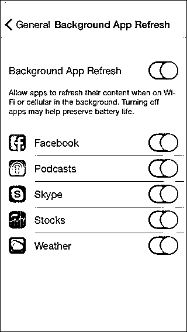

](https://cdn.educba.com/academy/wp-content/uploads/2015/09/5.jpg) 

Screenshot 5

#### 4.切换到飞行模式

*飞行模式*启用后*会暂停您设备的大部分信号传输*功能，因此您无法拨打或接听电话或接收任何消息。

您的 iOS 8 设备会持续检查附近的蜂窝和 Wi-Fi [网络](https://www.educba.com/course/general-networking-and-security-types-of-network/)，从而降低电池电量。如果您从一个地方移动到另一个地方，设备会尝试连接最近的基站，从而消耗 bat

如果你确定你不需要任何发送/接收电话，接入互联网，然后你可以切换到飞行模式。以下是启用飞行模式的备选方案:

**A】使用控制中心(如屏幕截图 6 所示):**

1.  通过向上滑动手势打开*控制中心*
2.  点击*飞机*图标

**B】使用设置(如截图 7 所示):**

1.  点击主屏幕上的*设置*应用程序
2.  启用*飞行模式*

启用飞行模式后，您可以在设备的左上角看到一个飞机图标(如屏幕截图 6 和 7 所示)。

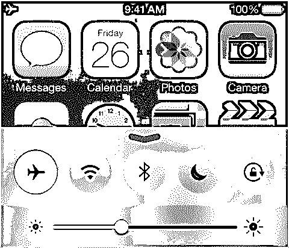

Screenshot 6

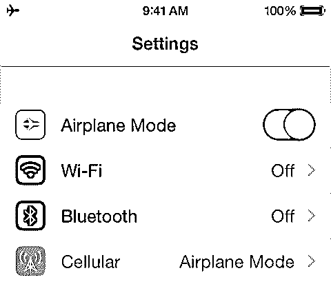

Screenshot 7

即使只需连接设备 Wi-Fi 网络即可启用飞行模式，您也可以使用数据。

#### 5.停止位置跟踪应用程序

可能会有这样一种情况，您已经尝试了所有可能的尝试来提高电池电量，但仍然面临着电池快速耗尽的问题。所以真正的罪魁祸首可能是从后台模式调用基于位置的服务的应用程序。

脸书、推特、谷歌地图等应用。需要您的当前位置，因此从后台模式调用定位服务。您可以*禁用不想共享您当前位置的应用程序的位置服务*。

使用以下步骤禁用/启用定位服务(如屏幕截图 8 和 9 所示):

1.  从主屏幕打开设置应用程序
2.  挖掘隐私
3.  点击定位服务
4.  对您不想共享的所有或任何特定应用程序禁用定位服务

[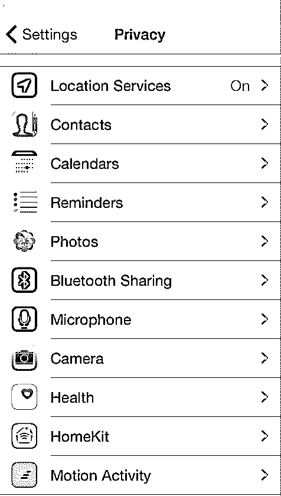

](https://cdn.educba.com/academy/wp-content/uploads/2015/09/8.png) 

Screenshot 8

[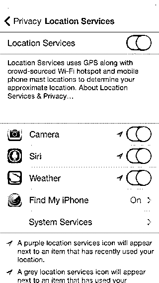

](https://cdn.educba.com/academy/wp-content/uploads/2015/09/9.jpg) 

Screenshot 9

#### 6.保持低亮度

*亮度*与电池电量直接相关。如果亮度设置为满，则电池将很快耗尽，反之亦然。在视网膜设备的情况下，亮度消耗的电池几乎是非视网膜设备的两倍。

您可以通过调整设备的亮度来延长电池寿命。以下是设置亮度的两种方法:

**A】使用控制中心(如屏幕截图 6 所示):**

1.  通过向上滑动手势打开控制中心
2.  通过拖动滑块来设置亮度

**B】使用设置(如截图 10 所示):**

1.  点击主屏幕上的设置应用程序
2.  点击显示和亮度
3.  通过拖动滑块来设置亮度

向前拖动滑块时，设备的亮度会增加，向后拖动滑块时，亮度会降低。有自动亮度调节功能，可自动调节设备的亮度。然而，苹果声称自动亮度是为了节省你的设备的电池电量，这在某种程度上可能是真的。

[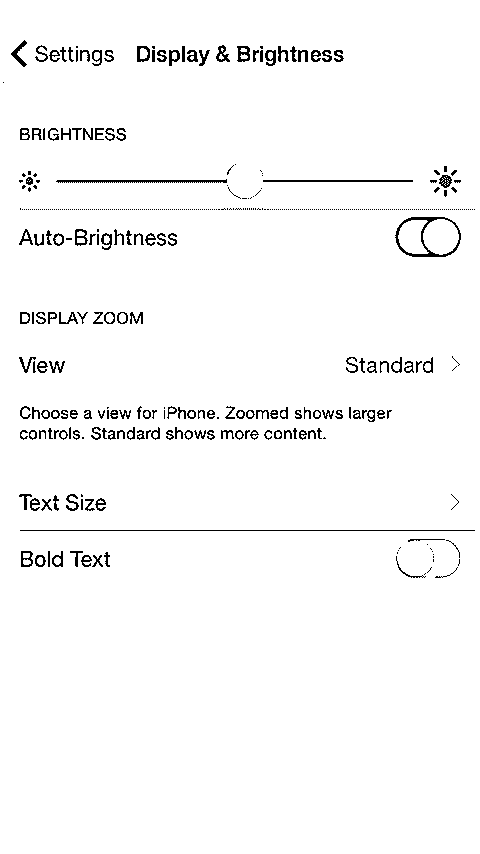

](https://cdn.educba.com/academy/wp-content/uploads/2015/09/10.png) 

Screenshot 10

#### 7.使用自动锁定节省电池

一个基本事实是，当你的 iPhone 设备屏幕打开(即解锁)时，它正在消耗电池电量。不使用时，您应该锁定设备屏幕。这将节省电池电量，虽然这可能是相当小的数额。只需按一次电源键就可以锁定 iOS 8 设备屏幕。

您还可以使用以下步骤为 iPhone 设备启用*自动锁定[功能](https://www.educba.com/iphone-new-phone/ "10 Amazing Stuffs about your iPhone")* [(如截图 10 和 11 所示):](https://www.educba.com/iphone-new-phone/ "10 Amazing Stuffs about your iPhone")

1.  从主页打开设置应用程序屏幕截图
2.  选择常规
3.  选择自动锁定
4.  从列表中选择时间间隔

可用的时间间隔有 *1、2、3、4 和 5 分钟*。如果你不想锁定设备屏幕，那么勾选底部的*永不*选项(如屏幕截图 11 所示)。

[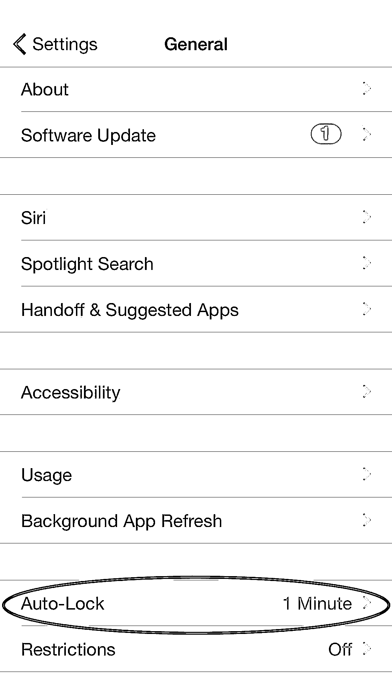

](https://cdn.educba.com/academy/wp-content/uploads/2015/09/11a.jpg) 

Screenshot 11

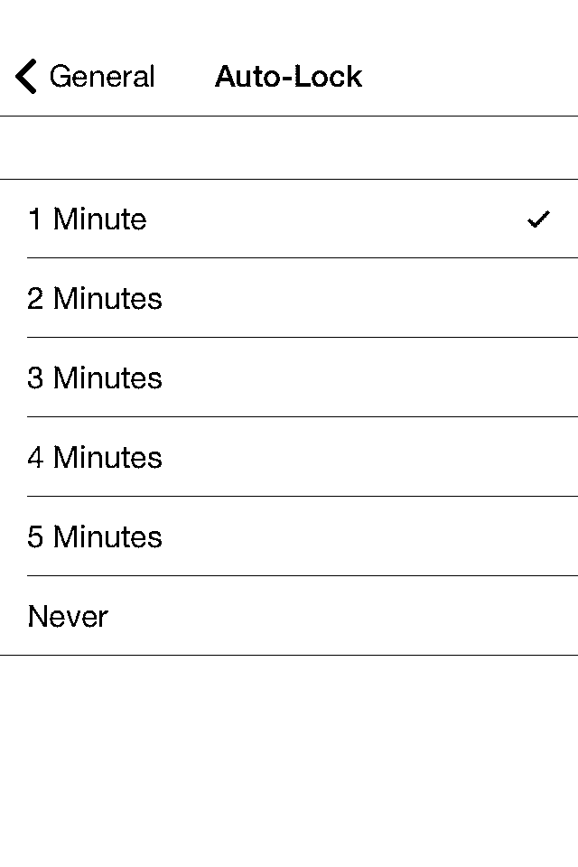

Screenshot 11

#### 8.保留主要电子邮件帐户

如果您在 iPhone 设备上配置了几个电子邮件帐户，如 Gmail、Yahoo、AOL、outlook 等，那么设备可能会经常没电。这是因为每个电子邮件帐户都试图连接服务器以获取更新，从而消耗电池寿命。

建议保留那些在 iPhone 设备上重要配置的电子邮件帐户。您可以通过在设置中添加/删除帐户来管理这些电子邮件帐户(如屏幕截图 12 和 13 所示)。

设置->邮件、通讯录、日历->选择帐户->删除帐户

[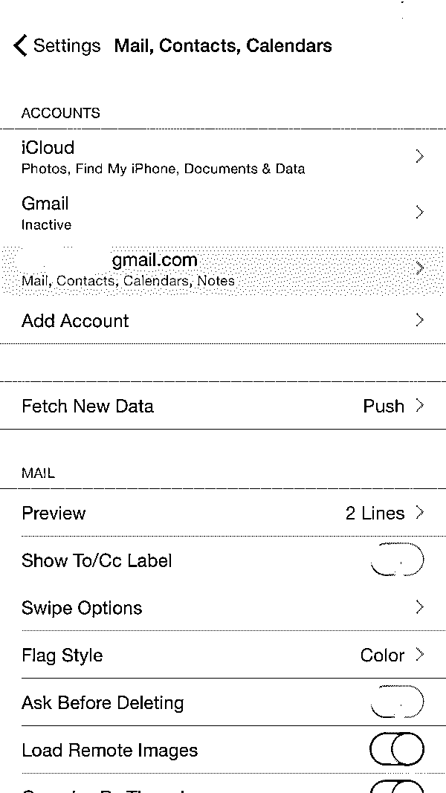

](https://cdn.educba.com/academy/wp-content/uploads/2015/09/12.png) 

Screenshot 12

[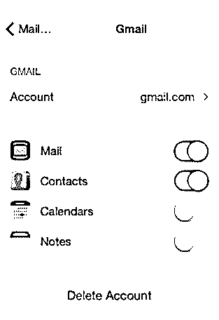

](https://cdn.educba.com/academy/wp-content/uploads/2015/09/13.jpg) 

Screenshot 13

#### 9.禁用蓝牙

一旦蓝牙工作完成，你就会忘记关掉它，这种情况经常发生。例如，将文件从您的 iPhone 传输到另一台设备，在通过蓝牙连接到 iPhone 的耳机上播放音乐。蓝牙通常被认为是电池消耗器。

您可以通过在不使用蓝牙时将其关闭来延长电池寿命。以下是关闭蓝牙的两种方法:

**A】使用控制中心(如屏幕截图 6 所示):**

1.  通过向上滑动手势打开控制中心
2.  点击蓝牙关闭

**B】使用设置(如截图 14 所示):**

1.  点击主屏幕上的设置应用程序
2.  点击常规
3.  蓝牙
4.  关闭蓝牙

[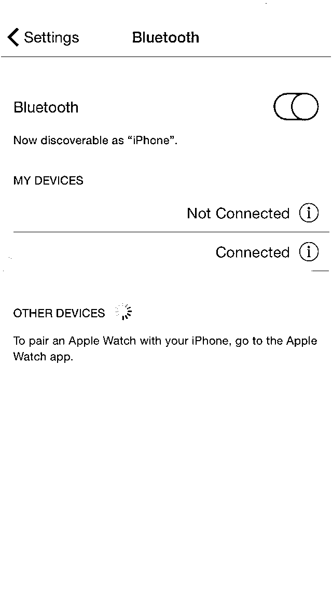

](https://cdn.educba.com/academy/wp-content/uploads/2015/09/14.png) 

Screenshot 14

#### 10.禁用无线网络

打开 Wi-Fi 后，它会开始在覆盖范围内寻找可用的网络，从而消耗设备电量。如果 Wi-Fi 信号很差，那么您的 iPhone 设备将需要更多的电力来传输和接收数据。如果您不再需要 Wi-Fi，建议将其禁用，因为设备会在后台模式下搜索 Wi-Fi 网络。

您可以通过在不使用 Wi-Fi 时将其关闭来延长电池寿命。以下是关闭 Wi-Fi 的两种方法:

**A】使用控制中心(如屏幕截图 6 所示):**

1.  通过向上滑动手势打开*控制中心*
2.  点击 Wi-Fi*关闭*

**B】使用设置(如截图 15 所示):**

1.  点击主屏幕上的*设置*应用程序
2.  点击 WiFi*关闭*

[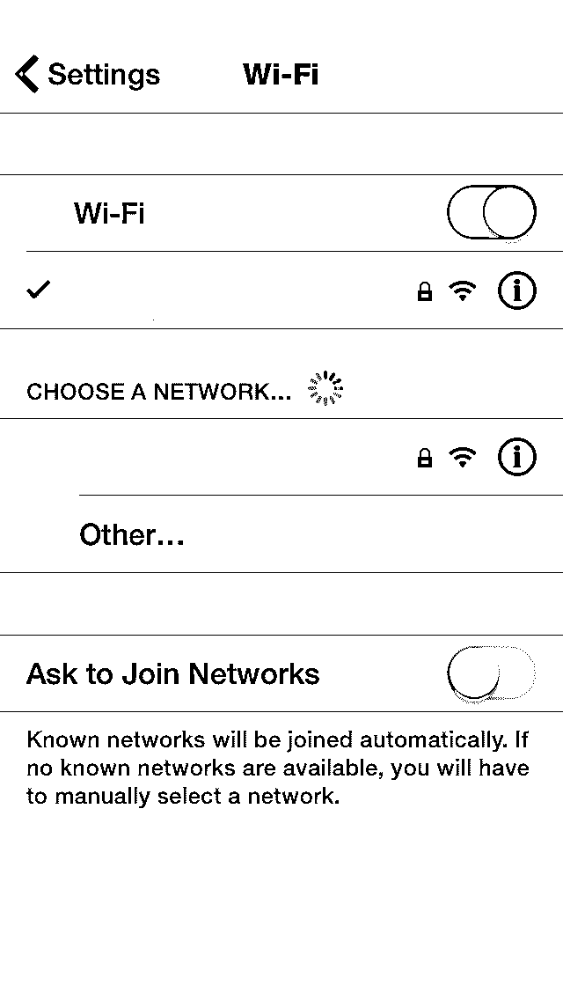

](https://cdn.educba.com/academy/wp-content/uploads/2015/09/15.png) 

Screeenshot 15

#### 11.调低音量

调低 iPhone 设备的音量可以延长 iPhone 的电池寿命！这似乎让你吃惊，但这是真的。如果你在 iPhone 设备上播放电影或音乐，只需调低音量。这可以通过按下设备侧面的音量减小按钮来实现(如屏幕截图 16 所示)。

使用耳机播放音乐，而不是使用扬声器播放音乐，可以节省设备电池的电量。甚至音乐设置，即均衡器也占用大量的功率。你可以如下关闭均衡器(如屏幕截图 17 所示):

1.  从主屏幕打开设置
2.  音乐
3.  EQ 关闭

    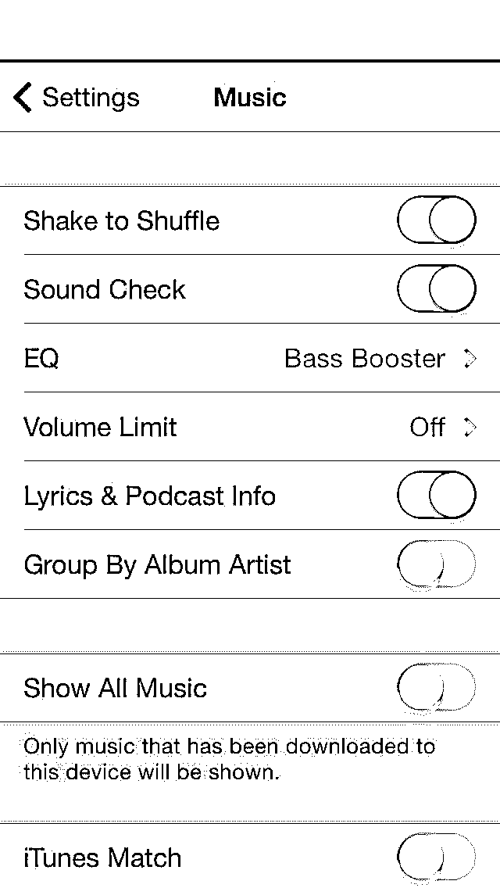

    

    截图 17

    

[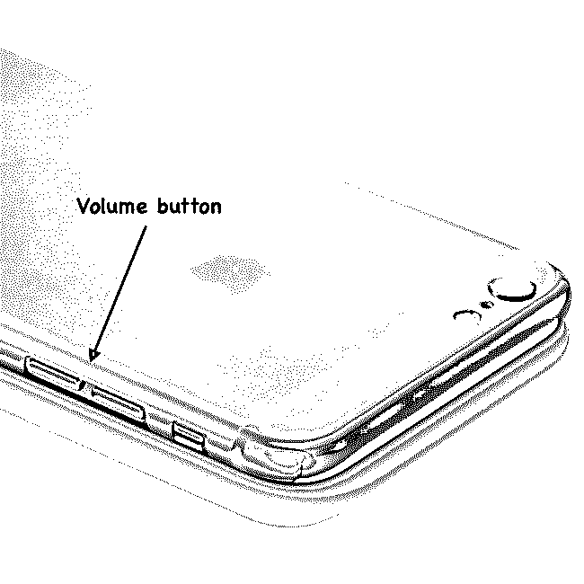

](https://cdn.educba.com/academy/wp-content/uploads/2015/09/16.jpg) 

Screenshot 16

#### 12.避免高端游戏

玩高端游戏(比如神庙逃亡、地铁冲浪、FIFA 等)是一个基本的认识。)可以消耗更多改进的电池电量。这是因为这些高端游戏会创建大量线程，消耗更多内存、处理器周期和 GPU 单元。

即使是需要你的位置的游戏也会更快地耗尽电池，因为 GPS 是持续监控的。因此，当你旅行时不带充电器或电池电量低时，建议避免玩高端游戏(如截图 18 所示)。

 

Screenshot 18

#### 13.关闭 iCloud

iCloud 是云存储，你所有的数据(来自 iPhone、iPad、Macbook 等)都可以存储在中央和远程位置。这有助于创建数据备份，并且在需要时可以立即使用。

在之前的一篇文章中，您已经熟悉了如何使用 iCloud 创建 iPhone 设备的备份。在 iCloud 上执行 iPhone 备份时，会消耗大量的电池电量和数据。如果电池电量不足，建议关闭 iCloud。

您可以使用以下步骤关闭此功能(如屏幕截图 19、20 和 21 所示):

1.  点击主屏幕上的设置应用程序。
2.  轻按 iCloud
3.  轻按 iCloud Drive
4.  关闭 iCloud Drive

[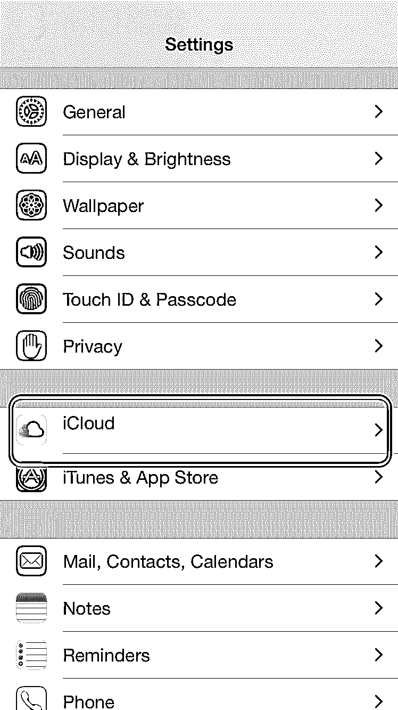

](https://cdn.educba.com/academy/wp-content/uploads/2015/09/19.png) 

Screenshot 19

[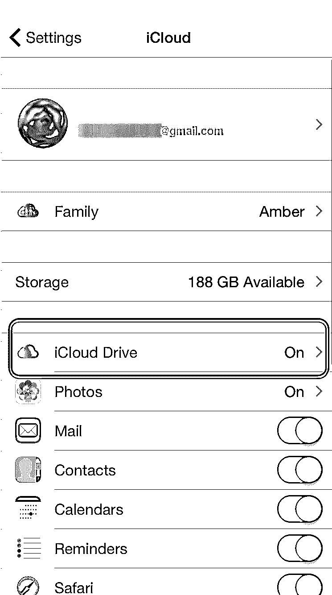

](https://cdn.educba.com/academy/wp-content/uploads/2015/09/20.png) 

Screenshot 20

[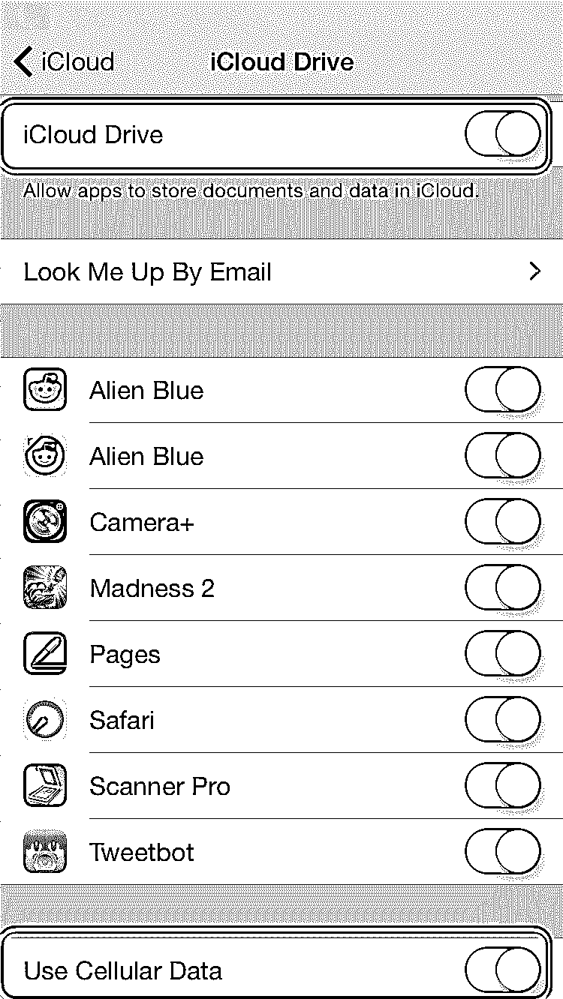

](https://cdn.educba.com/academy/wp-content/uploads/2015/09/21.png) 

Screenshot 21

#### 14.禁用应用程序自动更新

iOS 7 中引入了自动更新功能，允许您的应用程序更新，而无需手动告诉他们这样做。这个功能的优点是应用程序将总是最新的。然而，它的局限性是会耗尽你的电池，因为更新应用程序需要大量的数据和电池电量。

有些人更喜欢在特定情况下更新应用程序，即选定的应用程序仅在需要时更新。如果您想停止自动更新功能，您可以使用以下步骤(如屏幕截图 22 所示) :

1.  点击主屏幕上的设置应用程序。
2.  轻按 iTunes & App Store
3.  关闭自动下载的更新

[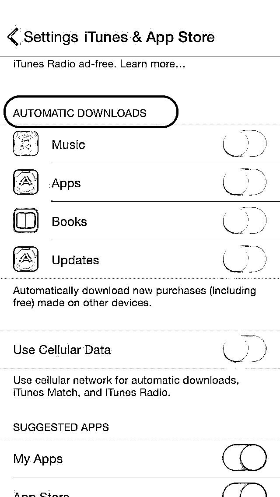

](https://cdn.educba.com/academy/wp-content/uploads/2015/09/22.jpg) 

Screenshot 22

### 推荐文章

这是一个指南，介绍了 14 种简单的方法来延长 iOS 8 的电池寿命。在这里，我们讨论了提高 iOS 8 电池寿命的 14 个技巧和诀窍的基本概念。您也可以浏览我们推荐的其他文章，了解更多信息——

1.  [安卓应用开发者](https://www.educba.com/android-apps-development/)
2.  [面向初学者的 Android 应用开发](https://www.educba.com/android-app-development-for-beginners/)
3.  [免费安卓应用](https://www.educba.com/free-android-apps-apk/)
4.  [安卓电子邮件应用](https://www.educba.com/email-apps-for-android/)

