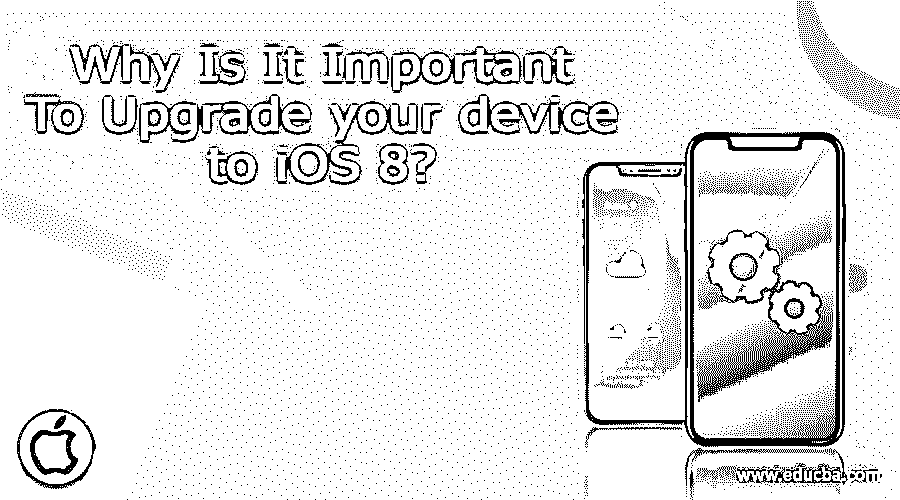
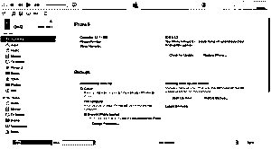
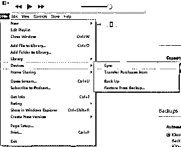
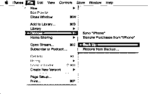
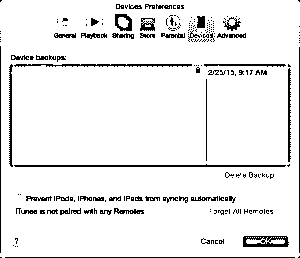
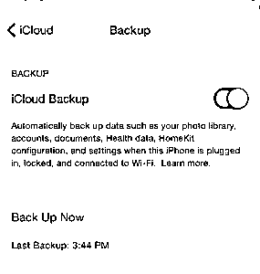
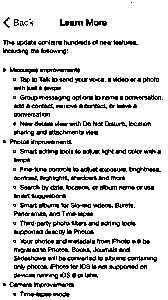
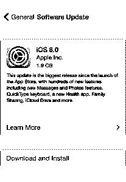
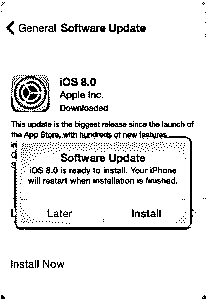
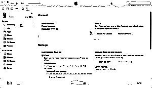

# 为什么将设备升级到 iOS 8 很重要？

> 原文：<https://www.educba.com/upgrade-your-device-to-ios-8-for-free/>

## 为什么将设备升级到 iOS 8 很重要？

**将你的设备升级到 iOS 8**——苹果公司在 2014 年 6 月 2 日举行的 2014 年 WWDC 全球开发者大会上发布了 iOS 8。这是苹果公司设计的 iOS [移动操作系统](https://www.educba.com/applications-software-developer/ "Mobile Operating Systems to Build Applications")的第八次重大发布，iOS 8 于 2014 年 9 月 17 日正式发布。据报道，iOS 8 已经安装在 85%的兼容苹果设备上。iOS 8 被称为*“自引入 App-Store 以来对 iOS 最大的改变”*。ios 8 有几个版本，每个版本都修复了 iOS 8 的错误。在 iOS 8 版本的初始发布中出现了 WiFi 问题。这导致 WiFi 连接突然中断，让用户陷入困境。苹果公司推出了后续版本，在短时间内修复问题。让我们检查一下 iOS 8 的版本历史。在这篇文章中，我们将会看到为什么将你的设备升级到 iOS 8 非常重要。

### iOS 8 版本历史

1.i *OS 8.0 beta 1* 于 2014 年 6 月 2 日在公司所在地加州*举行的全球开发者大会*上发布。它是为开发者发布的。术语 beta 指的是包含 bug 的软件，将来一定会有修正 bug 的版本。iOS 8 有几个面向开发者的测试版。这些测试版本有错误修复和增强。 *iOS 8.0 的最后一个测试版是 2014 年 8 月 19 日发布的 beta 5* 。

<small>网页开发、编程语言、软件测试&其他</small>

2. *iOS 8.1 beta 1* 于 2014 年 9 月 29 日发布。此版本包括 iPhone 6 和 iPhone 6 Plus 的 Apple Pay 支持等功能，解决了 Wi-Fi 性能问题，修复了 Safari 的问题。紧接着是 *iOS 8.1 beta 2* 发布。这个版本的每个版本都有修正问题的颠覆。 *iOS 8.1.3* 于 2015 年 1 月 27 日正式发布。

3. *iOS 8.2* 引入了对 [Apple watch](https://www.educba.com/apple-watch-first-generation/ "5 Things must know about Apple Watch") 的支持，以及对 iOS 8 健康应用的一些改进。它还增加了稳定性和错误修复。这是 2015 年 3 月 9 日发布的。

4.苹果在 2015 年 4 月 8 日发布了 *iOS 8.3* 。这个版本包括改进的性能、错误修复和重新设计的 ioS 8 表情键盘。此版本中包含的更改如下所述:

形容词（adjective 的缩写）改进了信息、应用程序启动、控制中心和第三方键盘的性能

b.Wi-Fi 和蓝牙修复

碳（carbon 的缩写）方向和旋转固定

5. *iOS 8.4* 于 2015 年 6 月 30 日发布。本次更新介绍了 [*苹果音乐*](https://www.educba.com/all-you-need-to-know-about-apple-music/ "All you need to know about Apple Music") 这是革命性的音乐服务，24 / 7 全球电台。这一特性在 [*全球开发者大会(WWDC)* *2015 主题演讲*](https://www.educba.com/highlights-of-wwdc-2015-keynote/ "Highlights of WWDC 2015 keynote") 中得到了强调。它还包括对 iBooks 的改进和错误修复。

### iOS 8 兼容设备

如果你属于 25%的 iOS 用户(iOS 7 及以下),那么一定要升级到 iOS 8。让你惊讶的是，它是免费的！!在升级到 iOS 8 之前，请确保您的设备兼容。

以下是 iOS 8 兼容设备列表:

**1。iPhone :**

–iPhone 4s 和 iPhone 5

–iPhone 5c、iPhone 5s、iPhone 6 和 iPhone 6 plus

**2。iPad :**

–IP ad2、iPad(第三代)、iPad(第四代)、iPad Mini(第一代)

–iPad Air、iPad Air 2、iPad Mini 2 和 iPad Mini 3

**3。iPod Touch :**

–iPod Touch(第五代产品)

你可以在上面列出的所有兼容设备上安装 iOS 8。然而，iPhone 4s、iPhone 5、iPad 2、iPad(第 3 代)、iPad(第 4 代和 iPad Mini(第 1 代代)都是 32 位设备，很快就会过时。苹果最近强迫开发者在 App Store 上发布 64 位而非 32 位版本的应用。这是因为 iPhone 5 之后推出的设备都是 64 位设备。

### 升级前的备份设备

在将你的 iPhone、iPad 或 iPod touch 更新到 iOS 8 之前，总是建议你将你的设备备份到 iCloud 或 iTunes。在开始备份之前，确定备份选项，即 iCloud 或 iTunes。

您可以根据它们各自提供的功能做出更好的决定。以下是 iCloud 和 iTunes 备份功能。

#### 1。iTunes

*   它允许您在 Mac 电脑或个人电脑上存储备份。
*   储存空间的大小完全取决于 Mac 电脑或个人电脑上的可用空间。
*   它为备份提供 ioS 8 [加密](https://www.educba.com/encryption-process/ "The Process of Encryption")，因此你可以安全地存储它。默认情况下，它是关闭的。您需要启用它来加密备份。

#### 2。iCloud

*   它允许您在云中存储备份，即在某个安全的远程位置。
*   可用的存储容量高达 1 TB。注意，前 5 GB 对所有苹果用户都是免费的。但是，如果您需要额外的商店，那么您需要购买它。
*   在 iCloud 上进行的备份总是加密的，并且是安全的。

### 如何使用 iCloud 或 iTunes 备份设备？

让我们看看如何使用 iCloud 或 iTunes 备份您的设备。

#### A .使用 iTunes 执行备份

1.通过点击 iTunes 图标或在 spot light/搜索菜单中搜索 iTunes 来打开 *iTunes* 。

2.现在，使用设备附带的数据线将设备(iPhone、iPad 或 iPod touch)连接到电脑。屏幕截图 1 显示了将设备连接到系统时出现的典型 iTunes 屏幕。

 

Screenshot 1

3.您可以存储从 iTunes store 或 App store 下载的内容。点击“文件”->“设备”>“从[设备连接的]”转移购买项目(如屏幕截图 2 所示)。如果您在 windows 系统上工作，那么文件菜单可能不可见。按 Alt 键使文件菜单可见。

 

Screenshot 2

4.完成第 3 步后，单击文件->设备->备份(如屏幕截图 3 所示)。请注意，如果您使用的是 windows 系统，则文件菜单可能不可见。按 Alt 键使文件菜单可见。

 

Screenshot 3

5.如果第 4 步成功，那么您可以通过单击 iTunes Preferences -> Device 来查看设备的备份(如屏幕截图 4 所示)。备份应显示您的设备名称以及备份的日期和时间。

 

Screenshot 4

#### B .使用 iCloud 执行备份

您可以使用 iCloud 来备份设备。以下是相同的步骤:

1.将您的设备连接到 Wi-Fi 网络。在此过程中，请确保网络信号足够好，能够更快地传输数据。

2.点击设置-> iCloud ->存储和备份

3.关闭的话打开 *iCloud backup* (截图 5 所示)。

 

Screenshot 5

4.点击*立即备份。*确保您连接到 Wi-Fi 网络，直到备份过程完成。

5.成功完成第 4 步后，您可以通过单击“设置”->“I cloud”->“存储”->“管理存储”来检查备份，然后选择您的设备。您所进行的备份应该显示在详细信息中，包括备份的时间和大小。

一旦您按照上面步骤 3 中的指示打开了 iCloud 备份，iCloud 就可以每天自动备份您的设备。如果满足以下条件，这种每日自动备份是可能的:

*   设备已连接到 Wi-Fi 网络
*   设备屏幕被锁定，即设备上没有执行任何活动。
*   设备已连接到电源

### 从另一种设备传输数据的限制

可能会出现这样的情况:您备份了 iPhone 设备，并试图在 iPad 设备上恢复备份。在这种情况下，从备份设备传输数据会受到限制。

以下是不会传输的数据列表:

*   邮件和邮件中的附件
*   照片
*   语音备忘录
*   不兼容的应用程序(例如，基于 iPhone 的应用程序不会传输到您的 iPad)

您可以通过无线方式或使用 iTunes 将设备更新到 iOS 8。

#### 1。无线更新您的设备

你可以使用更简单的无线方式将设备升级到 iOS 8。这也被称为更新*【空中】*。以下是实现这一目标的步骤:

I .将您的设备连接到电源。这是*可选的*方法，但*推荐*一种，因为你的设备在更新时可能会没电，从而给你带来很大的麻烦。

二。选择设置->通用->软件更新(如截图 6 所示)。如果你想了解更多关于 iOS 8 的功能，点击*了解更多*。这将推送一个包含 iOS 8 功能详细描述的新视图(如截图 7 所示)。

 

Screenshot 7

 

Screenshot 6

三。点击下载并安装。当您的设备连接到 Wi-Fi 和电源时，iOS 8 的更新将会自动下载。

四。这将弹出*软件更新*的警报。点击*安装*到[立即安装 ioS](https://www.educba.com/install-ios/) 8 或*稍后*一段时间后安装(如截图 8 所示)。如果您的设备受密码保护，则在继续安装之前会提示您输入密码。

 

Screenshot 8

安装前，请注意您有足够的可用磁盘空间。如果安装所需的磁盘空间不可用，那么您可以*使用 iTunes* 更新您的设备，或者*手动从设备中删除一些内容*。

#### 2。使用 iTunes 更新您的设备

更新设备的另一种方法是使用 iTunes。以下是步骤:

I .在更新之前，确保你电脑上的 iTunes 是最新的版本。

二。使用数据线将您的设备连接到计算机。

三。打开 iTunes 并选择您的设备。

四。打开*摘要*标签。选择*检查更新*(如截图 9 所示)。

动词 （verb 的缩写）点击*下载并更新*

如果系统提示您可用磁盘空间不足，则您必须手动从设备中删除内容。

 

Screenshot 9

