# iPhone 新手机

> 原文：<https://www.educba.com/iphone-new-phone/>

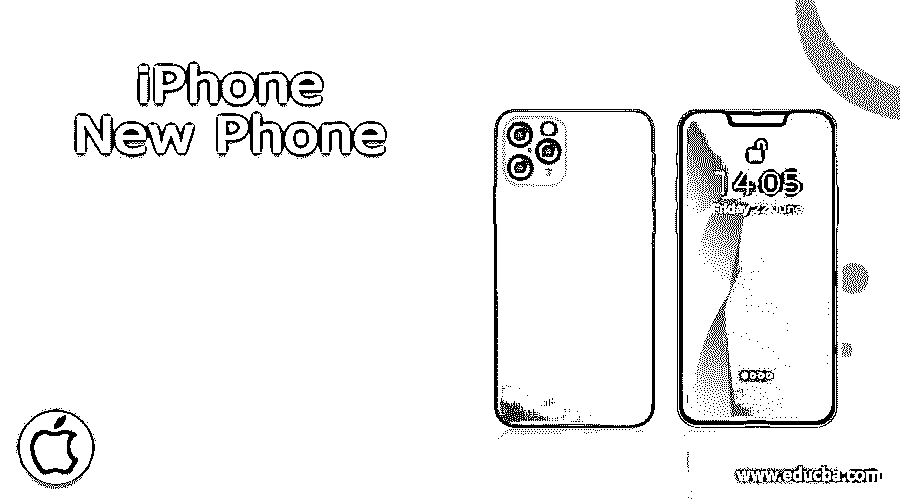

## iPhone 新手机介绍

如果你是一个技术极客，对苹果产品着迷，那么 iPhone 新手机可能是你测试新功能的剧本。iPhone 新手机从各个角度看都有特定的原因，有隐藏的功能。

以下列表显示了苹果公司推出的新一代 iPhone 手机:

<small>网页开发、编程语言、软件测试&其他</small>

#### 类别 1:

*   iPhone 6 和 iPhone 6 plus(最新款)
*   iPhone 5c，iPhone 5S
*   iPhone 4S 和 iPhone 5

#### 类别 2:

*   iPhone 4
*   iPhone 3GS，iPhone 3G，iPhone(第一代)

类别 1 中的 iPhone 新手机列表支持苹果发布的最新 iOS 版本，即 iOS 8.4。另一方面，类别 2 中的 iPhone 新手机列表已经过时，即它们不能运行苹果公司发布的最新版本的 iOS，因为硬件与 iOS 发布的功能不兼容。大多数 iPhone 用户可能不知道最新的 iPhone 新手机提供的功能。

以下是你的 iPhone 可以做到的十个 iPhone 新功能，普通用户可能很熟悉，但大多数人对此一无所知。

### iPhone 新手机的有用提示和技巧

以下是一些提示和技巧:

#### 1.截图

可能会有需要你截图网站、邮件、消息或者任何 app 状态的情况。在 iPhone 新手机上截图非常简单。只需同时按住 home 键和开/关键。

[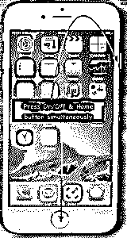

](https://cdn.educba.com/academy/wp-content/uploads/2015/07/1.png) 

如果截图成功捕获，您可以注意到图像被保存在相机胶卷中以及快门声。截图将保存在您的相机胶卷位置。这种在 iPhone 新手机上截图的方法也适用于 iPad 设备。

#### 2.为睡觉时间的音乐设置定时器

如果你的耳朵在睡觉时听音乐，那么这个建议是给你的！

大多数音乐爱好者都会在睡前播放音乐时睡着。这会耗尽您的设备电池。你可以设置定时器在睡觉时关闭音乐。

以下是设置音乐定时器的步骤。

*   打开时钟应用程序，只需轻轻一点。
*   选择右下角的计时器按钮。
*   为音乐播放的持续时间设置一个计时器。
*   点击“计时器结束时”。
*   向下滚动到底部。点击“停止播放”。

[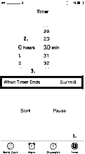

](https://cdn.educba.com/academy/wp-content/uploads/2015/07/2.png) 

#### 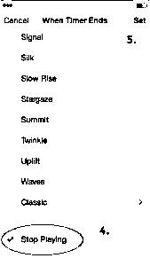

#### 3.教 siri 如何发音

Siri 是苹果设备(iPhone/iPad)内置的人工智能个人助理，可以使用语音命令简化你的任务。

Siri 有时会发音错误，尤其是人名。现在，您可以告诉 Siri 如何正确发音一个名称或短语。Siri 会听你念一个名字或短语的方式，然后根据你说的话给你几个发音选项。

以下是教 Siri 正确发音姓名或短语的步骤:

*   打开，Siri。
*   说，“这不是你怎么读[姓名/短语]”。Rahul Kumar 不是这样发音的。
*   Siri 会让你发每个单词的音。
*   现在，你需要为每个单词选择一个正确的发音。
*   Siri 将通过说出[名称/短语]来确认您选择的内容。

 

#### [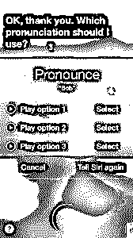

](https://cdn.educba.com/academy/wp-content/uploads/2015/07/51.png) 

#### 4.多张照片拍摄

可能会有这样的情况，你想在短时间内拍摄多张照片。比如新闻发布会，野生动物摄影，惊艳瞬间等。您可以使用 iPhone/iPad 设备中的内置相机拍摄 n 张照片。

要拍摄多张照片，请使用以下步骤:

*   在应用程序上轻轻一点就可以打开相机。
*   按住相机的快门按钮。
*   这将自动激活突发模式。
*   完成拍摄后，释放快门按钮。

[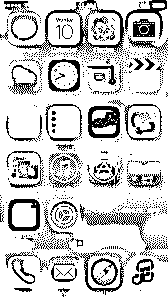

](https://cdn.educba.com/academy/wp-content/uploads/2015/07/6.jpg) 

[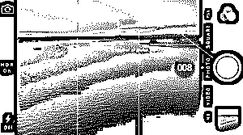

](https://cdn.educba.com/academy/wp-content/uploads/2015/07/71.png) 

你的设备(iPhone/iPad)会快速连续地拍摄大量照片。这些照片将保存在相机图库中。您可以看到相机在连拍模式下拍摄的照片总数。

#### 5.设置字母密码而不是数字

iOS 7 中的默认密码设置只允许四位数的数字字符串，也称为简单密码。如果你真的担心你的设备的安全性，那么选择复杂的密码。

[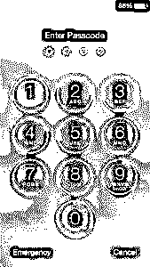

](https://cdn.educba.com/academy/wp-content/uploads/2015/07/8.jpg) 

复杂密码包括字母、数字和特殊字符。它可以比四位字符长得多。

要设置复杂密码，请使用以下步骤:

*   前往“设置”->“通用”->“密码锁定”(或“触控 ID 与密码”)
*   关闭“简单密码”设置

如果您还没有设置密码，那么您必须选择“转向密码”。

On”选项出现在设置屏幕的顶部。

 

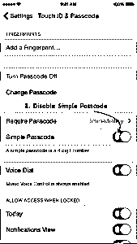

系统会提示您输入复杂的密码(包括数字、字母和特殊字符)。系统会提示您输入两次密码，第一次，您点击“下一步”继续，第二次，您点击“完成”。

一旦您配置了复杂密码，您的新密码锁定屏幕将提供完整的文本和数字键盘来输入密码。

[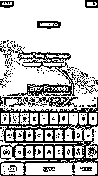

](https://cdn.educba.com/academy/wp-content/uploads/2015/07/11.jpg) 

#### 6.查看短信的时间戳

iOS 7 提供了查看单个文本 iPhone 技巧信息的时间戳的功能。你可以通过向左滑动来查看任何对话的时间戳。时间戳将出现在屏幕的右侧。

这是一个非常棒的特性，可以对用户隐藏时间戳细节，只在用户感兴趣的时候显示。

例如，典型的 iMessage 对话可能是什么样子。向左快速滑动，您现在可以看到每封邮件的发送时间。以前版本的 iOS 会将这些消息分组到同一个时间戳下。

[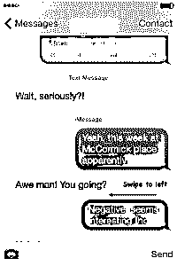

](https://cdn.educba.com/academy/wp-content/uploads/2015/07/12.png) 

[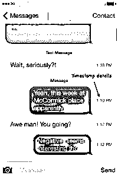

](https://cdn.educba.com/academy/wp-content/uploads/2015/07/13.png) 

#### 7.使用飞行模式的升压设备充电

您可以通过启用飞行模式来增强设备充电。有一些应用运行在后台模式(如脸书，Instagram，系统内置应用，亚马逊等。)消耗电池。此外，运行 Wi-Fi、手机信号和蓝牙的收音机都是耗电电池，因此增加了设备充电的时间。

新的 iPhone 功能有飞行模式功能；一旦激活了飞行模式，你的 iPhone 就会关闭无线网络和手机网络连接。这意味着您将无法再拨打或接听电话、短信、电子邮件或浏览互联网。因此，设备的充电速度提高了 1.5 倍。

您可以从“设置”中启用飞行模式。

[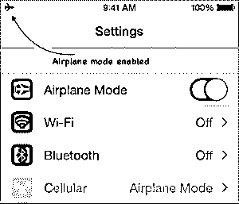

](https://cdn.educba.com/academy/wp-content/uploads/2015/07/14.png) 

转到设置->飞机模式并打开开关控制(变成绿色)

在这款手机的新手机中，你还可以从主屏幕底部向上滑动，打开控制中心并启用飞行模式。

[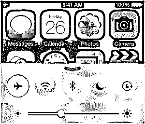

](https://cdn.educba.com/academy/wp-content/uploads/2015/07/151.png) 

当启用飞行模式时，您可以在屏幕的状态栏上看到飞机符号。

#### 8.共享当前位置

有时，有必要与他人分享您的当前位置(例如:去一个新地方旅行，与陌生人一起旅行等)。

在早期版本的 iOS (7 及更低版本)中，您只能使用“地图”应用程序来共享位置。这不能给出恒定的位置信息。地图应用程序是苹果公司的内置应用程序，方便苹果地图及其服务。

使用 iOS 8，您可以与同时使用 iMessage 应用程序的任何人共享特定的位置信息以及连续的位置数据。

以下是使用 iMessage 应用程序共享位置信息的步骤:

打开设备(iPhone 或 iPad)上的“信息”应用程序。请注意，您的设备应该安装 iOS 8 或更高版本。

[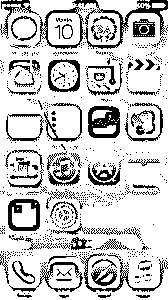

](https://cdn.educba.com/academy/wp-content/uploads/2015/07/16.png) 

打开您想要在其中共享您的位置的消息主题。可以是个人，也可以是团体。

[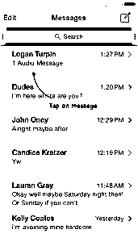

](https://cdn.educba.com/academy/wp-content/uploads/2015/07/171.png) 

现在点击右上角的详细信息。

[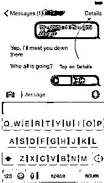

](https://cdn.educba.com/academy/wp-content/uploads/2015/07/181.png) 

点击发送我的当前位置。

[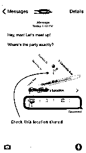

](https://cdn.educba.com/academy/wp-content/uploads/2015/07/19.jpg) 

#### 9.发送自毁音频和视频消息

苹果已经在 messages 应用中加入了自毁消息。您可以发送带有过期时间的音频和视频消息。这确实是苹果提供的一个非常重要的功能。它可以让您从第三方设备发送安全消息或机密消息。

然而，只有当两个人(发送者和接收者)都使用 iOS 8 时，该功能才有效。如果任何人或双方都在使用旧版本的 iOS，那么这些功能将不起作用。这为人们的隐私提供了一些安全感，因为音频/视频将在一段时间后被删除。

您可以使用以下方法设置音频和视频消息的过期时间:

*   转到设置->信息
*   在音频消息部分设置过期时间
*   在视频消息部分设置过期时间

您有两个选项来设置到期时间，即两分钟或从不。

[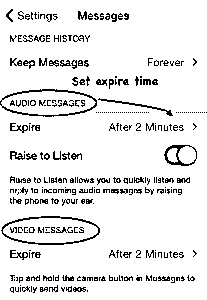

](https://cdn.educba.com/academy/wp-content/uploads/2015/07/20.png) 

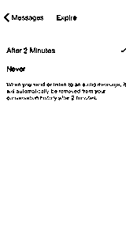

#### 10.轻松添加网页后缀

您可以通过长按句点(点符号)键来加快网址的键入速度。你可以快速插入常用的域名。com，。网，。组织，。edu 等。

只需将手指移至您想要键入的后缀，然后抬起手指输入即可。这可能不是在每个应用程序中都有效，但在 Safari web 浏览器中肯定有效。

这是苹果公司提供的快速输入 URL 的伟大功能。

 

### 推荐文章

这是 iPhone 新手机指南。在这里，我们讨论了 iPhone 新手机的介绍和有用的提示和技巧。您也可以阅读以下文章，了解更多信息——

1.  [关于 iPhone SE 你需要知道的 4 件事](https://www.educba.com/all-you-need-to-know-about-iphone-se/)
2.  [有史以来最棒的 6 款免费 iPhone 应用(杰出)](https://www.educba.com/top-6-best-iphone-apps-of-all-time/)
3.  [十大实用技巧&amp；关于你的 iPhone (iOS)的小技巧](https://www.educba.com/iphone-new-phone/)
4.  [iPhone vs Android](https://www.educba.com/iphone-vs-android/)

