# Apple Watch 第一代

> 原文：<https://www.educba.com/apple-watch-first-generation/>

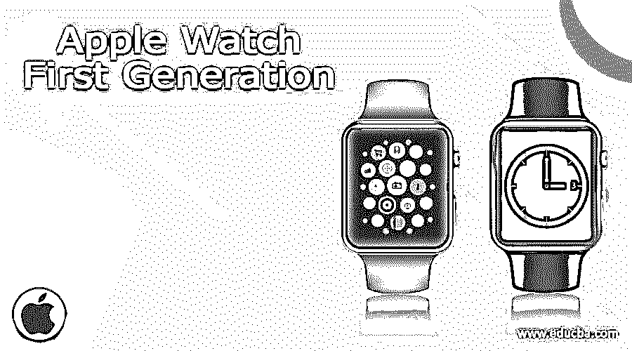

## **Apple Watch 第一代功能提示和技巧—**

Apple Watch 第一代是由苹果公司开发的一款可穿戴设备。它比普通手表能提供的更多，因此被称为智能手表。这款手表集成了与健康相关的功能，如行走或跑步的距离、消耗的卡路里量、咖啡因摄入量、血压、心跳，在某些情况下还包括睡眠质量。

2014 年 9 月 9 日首次推出，在发布会上与 iPhone 6 一同推出。苹果在 2015 年 4 月 24 日正式发布了一款手表。

<small>网页开发、编程语言、软件测试&其他</small>

它与 iOS 集成，因此您可以很好地连接您的苹果产品和服务，如 Mac，iPhone，iTunes 帐户等。Apple Watch 第一代是苹果公司开发的唯一一款属于可穿戴技术的产品。这款智能手表设备有三种不同的类别(如屏幕截图 A、B 和 C 所示):

1.  观看体育比赛
2.  苹果手表
3.  苹果手表版

[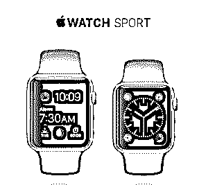

](https://cdn.educba.com/academy/wp-content/uploads/2015/08/1.png) 

Screenshot A

[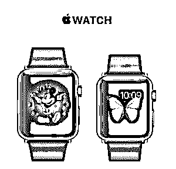

](https://cdn.educba.com/academy/wp-content/uploads/2015/08/2.png) 

Screenshot B

[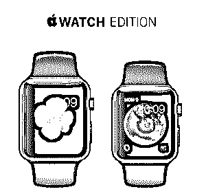

](https://cdn.educba.com/academy/wp-content/uploads/2015/08/3.png) 

Screenshot C

这三款腕表都以其表身来区分。运动版由*铝*制成，手表由*不锈钢*制成，手表版有*18k 金*。每个都有两个版本，即 *38 mm* 和*42mm*apple watch case。与 32 毫米型号相比，apple watch 第一代 42 毫米型号具有更大的屏幕和 apple watch 电池。

### 配置:

让我们检查一下 Apple watch 第一代的配置。

*   根据你购买的苹果手表的型号和版本，第一代苹果手表的价格可能在 350 美元(T2)到 1 万美元(T4)之间

*   **背部**部分由运动款*复合*和手表/手表版款*陶瓷*组成

*   有两种**版本**可供选择 *38 毫米*和 *42 毫米*

*   **38 毫米的尺寸**为 *6 * 33.3 * 10.5 毫米*(长*宽*高格式)，42 毫米的尺寸*为 42 * 35.9 * 10.5 毫米*

*   **运动版车型的屏幕**由*强化离子 X 玻璃*和手表组成，手表版车型由*蓝宝石水晶*组成

*   **38 毫米的电池**是 *205 毫安*42 毫米的是 *246 毫安。*充电一次可持续 18 小时

*   **OS** 使用的是应用*手表 OS 2.0* 已经在 WWDC 2015 主题演讲上公布。

*   **存储**为 *8 GB* 分配为 2 GB 用于音乐，75 MB 用于照片

### 让我们来看看 Apple Watch 第一代提供的功能:

#### 1.iPhone4S 上的语音控制功能

Siri 是苹果公司为 iOS 平台打造的智能个人助理*，你可以使用 Siri 从苹果设备获得帮助。从 iPhone 4S 开始，这在 iPhone 上可用。如果你熟悉 iPhone 上的 Siri，那么在 Apple Watch 第一代上使用这一功能将是一件容易的事情。*

**下面是在 Apple Watch 初代上使用 Siri 的*步骤* :**

–抬起手腕，靠近嘴。

–长按 Apple Watch 第一代上的数字表冠(位于手表右侧),激活 Siri。

–向 Siri 询问任何您想问的问题。例如，嘿 Siri，提醒我在午餐时间后参加会议。

**Siri 可能无法在你的苹果手表第一代上运行。这可能是由于以下任何一个原因:**

–您已从另一个视图按下数字表冠导航至表盘。

–Apple Watch 第一代的麦克风可能被堵住了。这存在于外壳的侧面。如果你有羊毛衣服覆盖手表的侧面，它可能不会激活 Siri。

[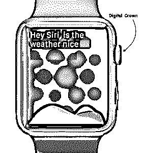

](https://cdn.educba.com/academy/wp-content/uploads/2015/08/4.png) 

Screenshot 1

#### 2.时间旅行

有时智能手表会因为体积小而变得难以操作。苹果已经通过提供名为**数字表冠的酷功能解决了这个问题。**

它是手表右边缘的一个旋钮(如截图 1 所示)，类似于 iPhone 设备的 home 键。当您按下数字表冠时，您将返回到*主屏幕*。你可以通过转动数字表冠来*缩放*到任何应用或者*滚动*通过界面中的选项。

苹果在 [*WWDC 2015 主题演讲*](https://www.educba.com/highlights-of-wwdc-2015-keynote/ "Highlights of WWDC 2015 keynote") 上宣布了*时间旅行*—*手表 2* 的新功能。时间旅行可以让你看到未来事物的列表，比如今天晚上，会议安排在午餐后等等。

它还可以让你看到已经发生的事情，如昨天的天气，参加的会议等。顺时针方向旋转*数字表冠，你可以穿越未来；逆时针方向*旋转*数字表冠，你可以穿越过去。进行时间旅行时，您可以通过单按数字表冠返回当前时间。*

[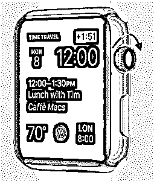

](https://cdn.educba.com/academy/wp-content/uploads/2015/08/5.png) 

Screenshot 2

#### 3.Apple Pay

苹果公司推出了名为苹果支付的移动支付和数字钱包服务。它允许用户使用兼容设备进行支付。以下是符合 Apple Pay 规范的设备列表:

*   iPhone 6，iPhone 6 Plus
*   iPhone 5、iPhone 5s 和 iPhone 5c
*   iPad Air 2，iPad mini 3
*   Apple Watch 第一代

Apple Pay 用来与 apple watch 第一代销售系统进行无线通信的服务是*近场通信(NFC)* 天线、苹果触控 ID 和 Passbook。

[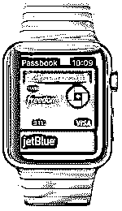

](https://cdn.educba.com/academy/wp-content/uploads/2015/08/6.png) 

Screenshot 3

要使用 iPhone 在商店付款，只需将您的设备靠近非接触式读卡器，手指放在触控 ID 上(适用于 iPhone 6 和 iPhone 6 plus)。使用这个你甚至不用看屏幕就能知道你的付款细节。当支付成功时，会出现轻微振动和蜂鸣声。

您可以使用 Apple Watch 第一代进行支付，只需*双击侧面按钮*(简称数字表冠)，并将 Apple Watch 第一代的显示屏*靠近非接触式读卡器*(如截图 4 所示)。您可以通过轻轻点击和蜂鸣来确认支付信息。

[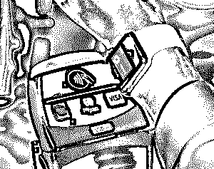

](https://cdn.educba.com/academy/wp-content/uploads/2015/08/7.png) 

Screenshot 4

#### 4.阅读邮件

WatchOS 可以让你马上在 Apple Watch 上阅读邮件。由于屏幕尺寸的原因，在 Apple Watch 上处理电子邮件似乎相当不可行。然而，可能有一种情况，你需要最早阅读电子邮件，因此 Apple Watch 的这一功能可以拯救你。

[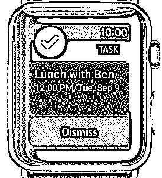

](https://cdn.educba.com/academy/wp-content/uploads/2015/08/8.png) 

Screenshot 5

你可以直接通过苹果手表的功能来阅读电子邮件。它支持*数据检测器*，允许你点击电话号码或地址，从电子邮件中自动启动应用程序。

以下是从 Apple Watch 上阅读电子邮件的步骤:

1.  按数字表冠并导航至主屏幕
2.  找到邮件应用程序图标
3.  只需轻轻一点就能打开邮件
4.  使用数字表冠滚动收件箱，顺时针向下滚动，逆时针向上滚动。你也可以使用你的手指，即，在屏幕上向上拖动你的手指向上滚动，向下拖动手指向下滚动。
5.  在你想阅读的电子邮件上轻轻一点
6.  可以从电子邮件正文本身执行诸如将电子邮件标记为未读、标记它或丢弃它之类操作。

如果你想立即回复邮件，那么你必须切换到 iPhone 或 Mac 设备，这是因为苹果手表上的电子邮件是只读模式。有些电子邮件不会显示在 Apple Watch 设备上。

在这种情况下，你必须切换到 iPhone 或 Mac 设备。iOS 8 提供 *Handoff* 功能。这项功能允许你在另一个设备上打开相同的邮件，比如 iPhone 或 Mac，这样你就可以立即回复邮件。

对于 iPhone 设备，您可以在屏幕的左下角看到 Handoff mail 应用程序图标(如屏幕截图 6 所示)。另一方面，在 OS X Yosemite 中，你可以在 apple watch dock 的前面看到 Handoff mail 应用程序图标(如截图 7 所示)。

[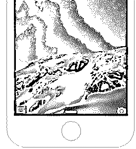

](https://cdn.educba.com/academy/wp-content/uploads/2015/08/9.png) 

Screenshot 6

 

Screenshot 7

#### 5.床头几

在 WWDC 2015 主题演讲中宣布的 WatchOS 2 为 apple watch 引入了名为*的床头柜模式*的新功能。这使得你可以在苹果手表睡觉时充电的同时，将苹果手表用作*计时器*。这可以取代你的床头闹钟。在床头柜模式下，apple watch 会切换到风景模式，这样可以更好地查看时间。

该模式的可配置性为零，即*开启*或*关闭*。当处于*状态时，您可以在中间看到一个数字时钟，下面是日期和时间的详细信息，右上角有一个显示充电百分比的电池指示器，如果您设置了闹钟，左上角有一个闹钟图标(如截图 8 所示)。*

[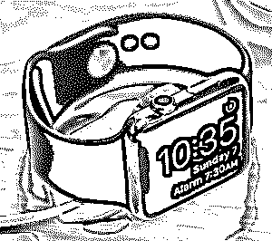

](https://cdn.educba.com/academy/wp-content/uploads/2015/08/11.png) 

Screenshot 8

**Note:** [Become an iPhone App Developer](https://www.educba.com/career-tracks/become-an-iphone-app-developer/)
Become an iOS developer that turns ideas into a tangible app. Developing and enhancing a world-class iOS mobile application. Get hands-on experience in using the best technologies for app creation.

#### 6.FaceTime 通话

FaceTime 允许你从设备上进行*视频通话*。苹果在 2015 年 WWDC 主题演讲中宣布了 Apple Watch 的 FaceTime 功能。

这款新的 FaceTime 摄像头将内置于 Apple Watch 的*顶部边框*中，用户可以在移动中通过手腕拨打和接听 FaceTime 电话。即将推出的*手表 2* 将为*基于 Wi-Fi 的通话*提供新的 FaceTime 音频功能。

它还允许 Apple Watch 用户通过任何配对的 iPhone 或 iPad 设备直接拒绝或接听 FaceTime 视频电话(如截图 9 所示)。

[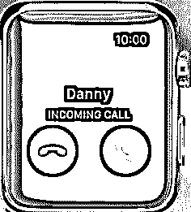

](https://cdn.educba.com/academy/wp-content/uploads/2015/08/12.png) 

Screenshot 9

#### 7 .**。健康和健身跟踪**

Apple Watch 功能包括新的*健康和健身功能*，可以帮助跟踪你的健康状况。这个功能真的很棒，手腕上有所有与健康相关的统计数据。它可以计算*的步数*，你的*咖啡因摄入量*，*计算你的卡路里*，*脉搏*，甚至监控你的*心率。*

[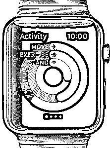

](https://cdn.educba.com/academy/wp-content/uploads/2015/08/13.png) 

Screenshot 10

你可以用*活动*为 Apple Watch 设置*一个卡路里目标*(如截图 11 所示)。这个目标只包含活动卡路里，不包含静止卡路里。Apple Watch 的功能将区分你仅仅活着燃烧的卡路里和你通过快走或在健身房锻炼燃烧的卡路里。

Apple Watch 功能中的活动应用程序允许您随时查看*健康统计数据*。它跟踪三个区域，即*移动、站立和锻炼*(如截图 10 所示)。它们中的每一个都由活动应用程序中的彩色环表示。该环指示 apple watch 在您已实现的目标下的量。如果环完全闭合，那么它表明你已经实现了你的特定目标。

[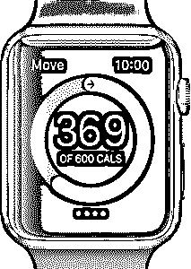

](https://cdn.educba.com/academy/wp-content/uploads/2015/08/14.png) 

Screenshot 11

你甚至可以在活动应用程序中看到当天的总步数。

Apple Watch 的功能有*一个内置的心率传感器*，可以在锻炼过程中计算卡路里(如截图 12 所示)。默认情况下，Apple Watch 功能会每隔*十分钟*检查一次你的心率。但是，您可以在活动应用程序中更改此设置。您可以通过此活动应用程序随时手动检查心率。

[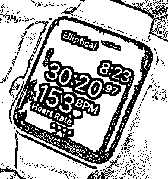

](https://cdn.educba.com/academy/wp-content/uploads/2015/08/15.png) 

Screenshot 12

#### 8.运输

公交系统可以让你通过提供方向来平稳地导航你的城市。点击运输应用程序打开它。它会给你一个按钮来获取你家或办公室的方向，另一个按钮提供你最近旅行的地点。

屏幕的其余部分滚动显示最近的公共交通站点，仅显示交通选项(如地铁、公共汽车、火车等。).

一旦你从 Transit 那里得到想要的方向，整个旅程就会以一种简单、简洁的方式显示在一个屏幕上。如果您有兴趣了解某个特定位置的更多信息，只需点击该特定步骤即可调出地图。

Transit 的优点是它在一个滚动屏幕上显示了整个步骤列表。

[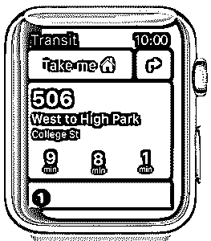

](https://cdn.educba.com/academy/wp-content/uploads/2015/08/16.png) 

Screenshot 13

[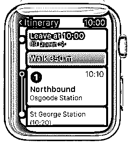

](https://cdn.educba.com/academy/wp-content/uploads/2015/08/17.png) 

Screenshot 14

第一张图片来源:pixabay.com

### 推荐文章

这里有一些相关的文章，可以帮助你获得更多关于 Apple Watch 第一代的细节，所以只要浏览下面的链接就可以了

1.  [Apple Watch 第一代](https://www.educba.com/apple-watch-first-generation/)
2.  [特色苹果电视](https://www.educba.com/apple-tv-features/)
3.  【2015 年苹果事件
4.  [每个苹果粉丝都应该知道的 iOS 8 的 5 个小技巧](https://www.educba.com/5-tips-of-ios-8-every-apple-fan-should-know/)

