# 苹果 2015 活动综述

> 原文：<https://www.educba.com/summary-of-apple-event-2015/>

 

## 苹果 2015 活动综述

苹果发布会于 2015 年*9 月 9 日*在旧金山传奇的*比尔格拉汉姆市政礼堂举行。来自世界各地的人们参加了这次苹果的活动。这次苹果发布会主要是宣布几个不同类别的*新产品。**

让我们来看看苹果活动公告的细节。

<small>网页开发、编程语言、软件测试&其他</small>

### 苹果事件

以下是一些苹果事件:

#### 1.苹果手表

上个月，苹果手表面向全球消费者发售。Apple Watch 的使用让生活变得简单，使用它的人开始喜欢上它。他们喜欢*轻松回复*和*接收来自喜爱应用的电话*和*通知*的方式。在 Apple Watch 上使用 *Siri* 是一个奇妙的功能，它可以帮助*获取方向并发送* *快速信息。* *Apple Pay* 允许顾客直接从手腕在商户进行支付。

下面是一位 Apple Watch 用户的反馈。

***“一个改变人生的装置……我已经瘦了差不多 30 磅……手表启发了我***

***从某种程度上来说，我从来没有去日常健身运动过。***

***——丹尼斯·***

Apple Watch 的顾客满意度是 *97%* 这太不可思议了。在 6 月份 Apple Watch 推出后，该操作系统被预览为 watchOS 2。

在 watchOS 2 中有漂亮的*新手表表面*和*第三方复杂功能*。这个第三方复杂事件可以包含头条新闻、时间、天气详情、航班详情等。

[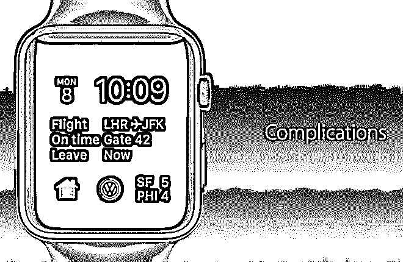

](https://cdn.educba.com/academy/wp-content/uploads/2015/12/Complications-for-watchOS-2.png) 

*图片来源:apple.com*

*时间旅行*功能允许您通过向前旋转数字表冠在零件内*旅行。*这将让您看到可能的温度/天气详情、未来会议详情等。*公交*已经被添加到苹果地图中，更容易找到公共交通细节。

[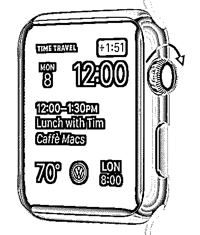

](https://cdn.educba.com/academy/wp-content/uploads/2015/12/Time-Travel.png) 

*图片来源:apple.com*

AppStore 上已经有超过*万款苹果* *手表应用。开发人员可以利用原生应用做更多事情，例如显示应用中的视频、访问硬件、麦克风、扬声器或健康传感器。下面是一些在 watchOS 2 上开发的奇妙应用的例子。*

i. *脸书信使*(即将在 Apple Watch 上推出)允许你发送文本和音频信息，并从你的手腕上分享位置。

二。it translate 应用程序可以让你看到和听到近 90 种不同语言的翻译。

三。 *GoPro* app 可以让你把 Apple Watch 当成你的 GoPro 行动相机的小取景器。

四。Airstrip 应用程序(专注于医疗)允许医生密切关注患者的生命体征、实时心率和其他细节。

动词 （verb 的缩写）Sense4Baby 应用程序可以在家监控未出生婴儿的心跳。它还允许母亲直接从她的手腕向医生发送她未出生婴儿的健康统计数据。

Apple Watch 现在有两种新的表面，即*金色*和*玫瑰金*，并有*38 毫米*和 *43 毫米尺寸*。这款与其他 Apple Watch 版本价格相同。

苹果公司宣布了一款用于 Apple Watch 的*(产品)红色运动表带*。苹果公司将(产品)红色品牌商品收益的特定部分捐赠给全球基金，以帮助非洲大陆抗击*艾滋病毒和艾滋病*。

[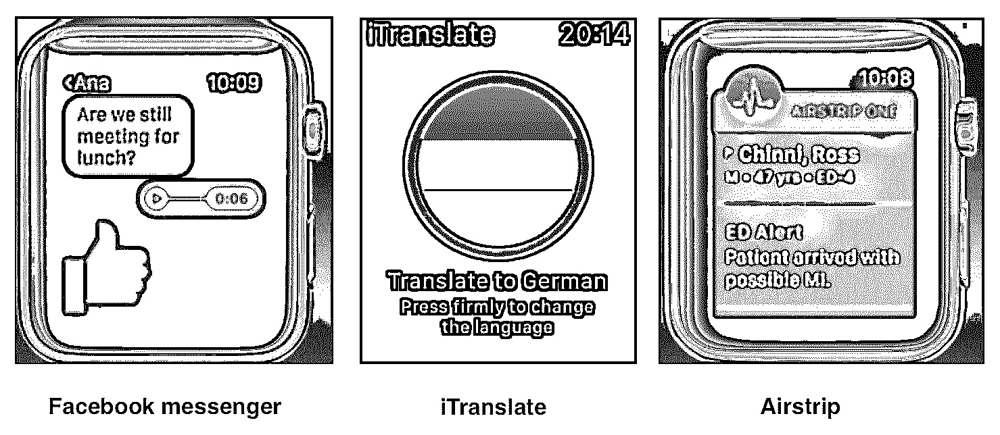

](https://cdn.educba.com/academy/wp-content/uploads/2015/12/New-apps-for-watchOS-2.png) 

<address>*Image Source: apple.com*</address>

[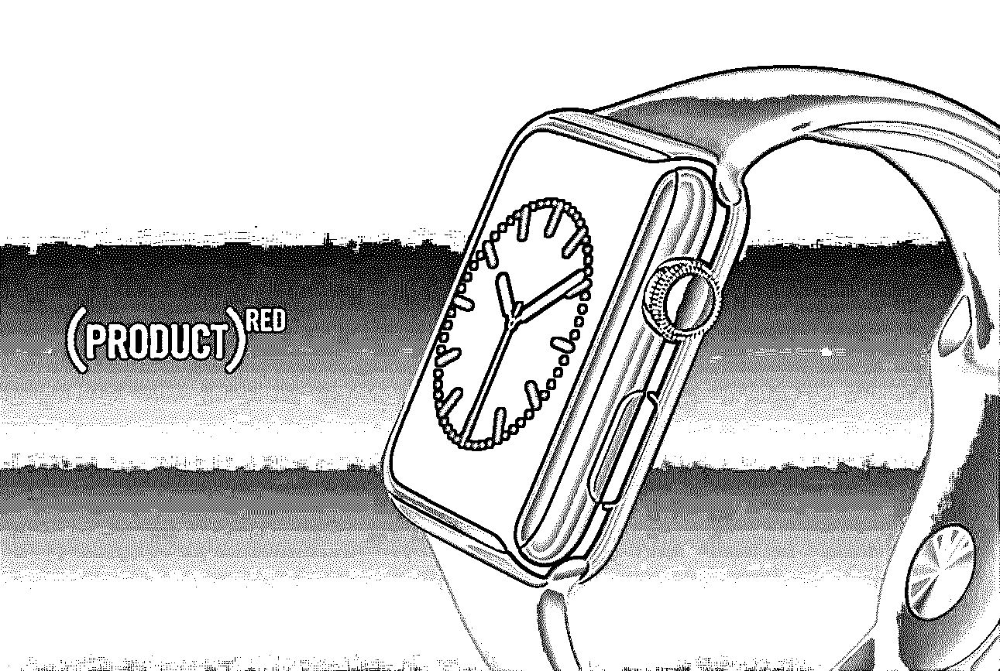

](https://cdn.educba.com/academy/wp-content/uploads/2015/12/PRODUCT-RED-Sport-Band.png) 

图片来源:apple.com

轻松更换表带是 Apple Watch 的一个显著特点。苹果将在其零售店为 Apple Watch 发布*新色调的表带。在苹果活动上宣布的新手表型号与 2015 年 9 月 16 日起的 *watchOS 2 在同一天上市。**

#### 2.iPad–苹果事件

苹果公司已经宣布了 *iPad Pro，*被认为是自 iPad 发布以来*最大的*。这是苹果公司有史以来最强大的和最有能力的 iPad。它有一个巨大的屏幕，自发布以来一直是最大的 iPad。

它的对角线尺寸大约为 12.9 英寸(T1)，像素为 2732 * 2048(T3)，可以容纳大约 560 万像素(T5)(甚至比配备 retina 显示屏的 15 英寸 Macbook pro 的像素还要多)。

 

*图片来源:apple.com*

与所有其他 [iOS 设备](https://www.educba.com/upgrade-your-device-to-ios-8-for-free/ "Upgrade your device to iOS 8 for free!")相比，它提供了*高性能*。照片在 iPad pro 中看起来很棒，细节丰富，色彩丰富。文件可以用休闲字体阅读。在 iPad pro 上看电影的体验棒极了。它拥有苹果有史以来最先进的显示屏。

它有一些令人难以置信的创新和技术用于建造它。以下是相同的重点:

–*定制时序控制器*(与 iMac retina 5K 显示器中使用的相同)，可快速驱动像素

–*照片校准*，帮助校准照片轴上对比度。

–它由*氧化物 TFT、*制成，有助于以均匀的颜色和亮度快速排列像素。

–*增加了可变刷新率*，有助于在像素快速移动时节能。

–内置一个 *A9X 3 第三代64 位芯片*。这为*提供了两倍于 A8X* 的内存带宽和两倍于*的存储性能*。它比与桌面级 CPU 相同的 A8X 处理器快 1.8 倍。*图形性能比 A8X 处理器快 2 倍*，与控制台级 GPU 相同。

–它比上个月出货的 80%的便携式电脑都要快。

–它拥有 *10 小时的全天电池续航时间*

–它有*四个扬声器*在四周平衡，有助于产生刻板的声音。

–它配有 *12.9 英寸视网膜显示屏*

–它有一个带 FaceTime 高清摄像头的*800 万像素 iSight 摄像头*

–它支持高达 150 Mbps 的 4G LTE 网络

–它内置了一个很棒的触控 ID

–它很脆弱，宽度尺寸*为 6.9 毫米*，与宽度尺寸为 6.1 毫米的 iPad Air 相比，这是非常出色的

iPad Pro 有一个名为*智能键盘的附件键盘，*取代了软键盘。它不同于以前使用的其他键盘。它覆盖着*织物*，有助于在打字时感受每个按键。每个键都有一个*圆顶开关，与 Macbook Pro 中使用的*相同。

它可以使用智能*连接器*(iPad Pro 两侧的三个圆圈)连接到 iPad Pro。这种智能连接器携带*电力和数据，并磁性连接。*这款智能键盘专为 iPad Pro 设计。

*[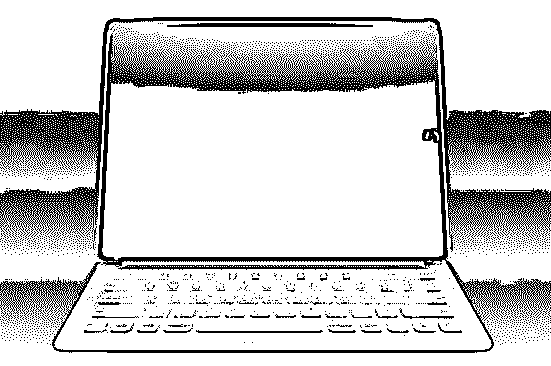

](https://cdn.educba.com/academy/wp-content/uploads/2015/12/Smart-Keyboard-for-iPad-Pro.png)* 

*图片来源:apple.com*

苹果推出了另一款名为 *Apple Pencil 的新配件，*专门为 iPad Pro 设计。它主要是为了解决在 iPad Pro 上绘图时的细节和精度问题。您可以在 iPad pro 上轻轻移动铅笔来绘制浅色笔画，在 iPad Pro 上稍微用力按压来绘制深色笔画。你可以用铅笔顶部的连接器给它充电。

iPad Pro 支持 Microsoft Office。你可以使用 iOS 9 的分屏多任务功能并排查看 *MS Word 和 MS Excel* *。微软 Office 对 Apple Pencil 的支持非常出色。Powerpoint 拥有近 20 种不同对象的形状识别元素。*

Adobe 的 *Comp 应用程序和*T2 的【Photoshop Fix】应用程序将在 iPad Pro 的 iOS 9 中支持 iPad 的分屏多任务处理。Photoshop Fix 应用程序将提供人脸检测功能，可以处理高达 5000 万像素的图像。草图*应用*将针对 iPad Pro 设备进行优化，并将支持 Apple Pencil 的使用。这些产品将于 2015 年 10 月上市。

[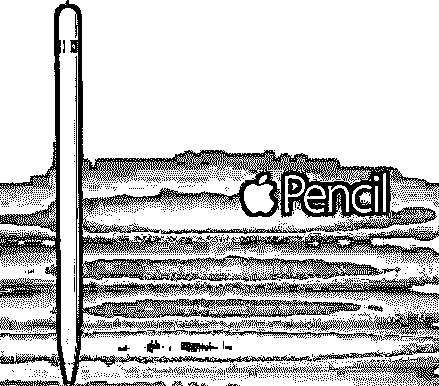

](https://cdn.educba.com/academy/wp-content/uploads/2015/12/Apple-Pencil.png) 

*图片来源:apple.com*

[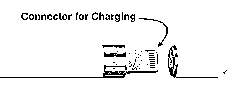

](https://cdn.educba.com/academy/wp-content/uploads/2015/12/Connector-for-Charger.png) 

*图片来源:apple.com*

苹果正在与几家大型医疗公司和大学合作，将几个有趣的第三方应用程序引入 iPad Pro。在苹果活动上展示的一个这样的应用是 *3D 4 Medical。*这款应用利用 iPad Pro 的图形功能，通过在 3D 模型上向患者展示他们受伤的*图片，帮助医生教育患者。*这款应用*允许医生放大详细的解剖模型*来显示骨骼、肌肉和皮肤的动画。

在 iPad 的制造过程中，环保被考虑在内。以下是一些统计数据:

1.  *无汞 LED 背光显示屏*
2.  *无砷显示玻璃*
3.  *无 BFR*
4.  *不含铍*
5.  *不含聚氯乙烯*
6.  *可回收铝*

iPad Pro 有三种涂装，分别是*银、*和*太空灰*。iPad Pro 的定价为*、32gb 799 美元、128 GB 949 美元(均支持 WiFi 功能)*和*、128 GB 1079 美元(支持 WiFi 和蜂窝功能)。【iPad Pro 配件的定价，即 *Apple Pencil 为 99 美元，*和*智能键盘为 169 美元。* iPad Pro 及其配件将于今年 11 月开始上市。*

#### 3.苹果电视–苹果事件

电视在我们的生活中起着巨大的作用。它在一起享受生活中占有重要的位置。电视的未来在于应用程序。[新款苹果电视](https://www.educba.com/apple-tv-features/ "All you Need to Know About Apple TV")拥有*强大的硬件，现代操作系统*，独特的用户体验*，优秀的开发者工具*和广泛的应用商店收藏。

[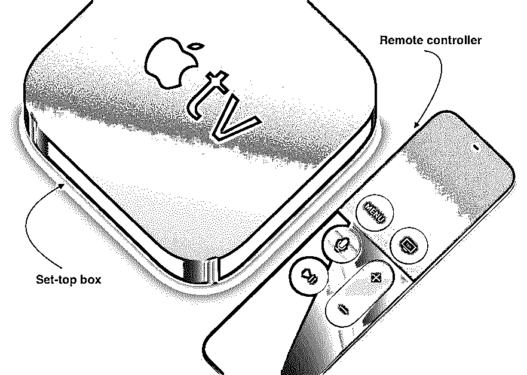

](https://cdn.educba.com/academy/wp-content/uploads/2015/12/Apple-TV-Set-top-box.png) 

*图片来源:apple.com*

新的苹果电视有一个功能强大的机顶盒，带有一个革命性的遥控器。该机顶盒具有以下配置:

*   *64 位 A8 芯片*
*   *蓝牙 4.0*
*   *11 带 MIMO 的交流 Wi-Fi*
*   *红外接收器配置*
*   机顶盒背面的*电源、HDMI、*和*以太网*

[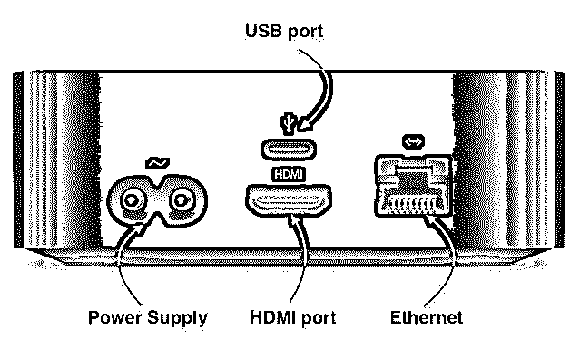

](https://cdn.educba.com/academy/wp-content/uploads/2015/12/Set-top-box-Back-side.png) 

*图片来源:apple.com*

你可以使用遥控器的 *Siri* 或*触摸表面*与新的 Apple TV 互动。新的遥控器顶部有玻璃表面触摸，使其移动起来流畅而精确。

遥控器具有以下配置:

*   *蓝牙 4.0*
*   *音量控制*
*   *加速度计和陀螺仪*
*   *每次收费最多 3 个月*
*   *底部用于充电的闪电连接器*

您只需按住遥控器上的 Siri 按钮，就可以使用 Siri 与电视互动。Siri 将*在 *iTunes、网飞、Hulu、HBO、Showtime、*上搜索内容*以及更多稍后将添加的内容。

苹果为新的 Apple TV 专门添加了一个*惊人的屏幕保护程序，*，它将按时间显示屏幕保护程序，即白天的屏幕保护程序将在白天显示，反之亦然。iPhone 上的 iOS 功能已经被整合到 Apple TV 中，使其具有*漂亮的用户界面*和*的互动性。*您可以使用 Siri 根据演员、导演或日期搜索电影。

Siri 会在需要时提供影片的详细信息，如影片及其演员阵容。你甚至可以问 Siri 男演员/女演员在看电影时的最后一句话是什么。Siri 甚至允许你在观看电影时向前或向后移动。它甚至可以让你在观看电影的过程中获得天气信息和体育比分等细节。

[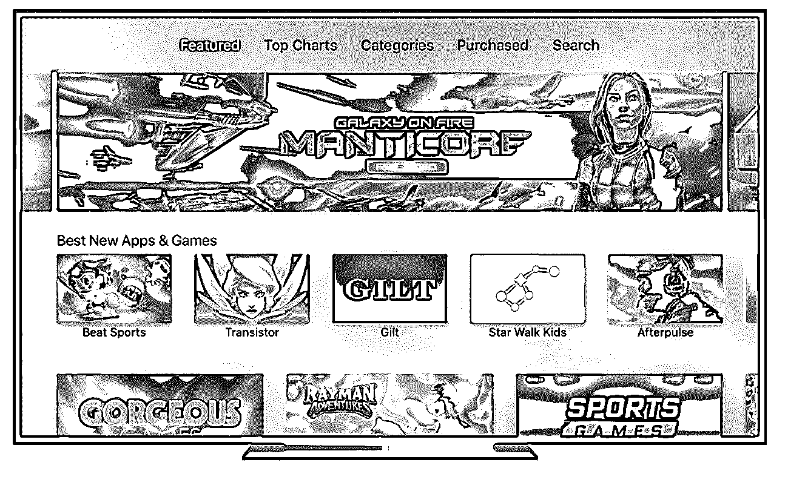

](https://cdn.educba.com/academy/wp-content/uploads/2015/12/New-Apple-TV-with-tvOS.png) 

*图片来源:apple.com*

苹果公司为苹果电视推出了新的操作系统*，*叫做 *tvOS* 。在这个 tvOS 上开发应用非常棒。开发者可以使用 *Xcode* 和其他框架，如 *GameKit、CoreGraphics、MediaToolbox、Metal、*等。，在他们的 tvOS 应用中。

新的苹果电视将为用户的客厅带来独特的游戏体验。该公司展示的第一次体验是一次 *co-op Crossy Road* 体验，让一名玩家使用新的 Apple TV 遥控器，另一名玩家使用 iPhone 或 iPod touch 来控制游戏中的各种角色。苹果还展示了来自 *Harmonix* 的名为 *Beats Sports 的即将到来的比赛。*

这款游戏在音乐节奏流派上采取了*“Wii Sports”*的角度，让用户随着音乐的节拍打网球之类的游戏。它允许多达 T2 的玩家同时用 iPhone 或 iPod touch 玩游戏。

新的苹果电视可以让你通过简单的遥控点击，轻松地从 GILT 购买衣服。它显示了一个类似 iTunes 的服装选择转盘，包括尺码和价格。据估计，吉尔特大约 80%的移动销售额来自 iOS 设备。这款新电视还包括从 *MLB 传输体育内容的新功能。电视*和 *NBA 联盟通行证。*

苹果电视的定价为:32gb 149 美元，64 GB 闪存 199 美元，T4 199 美元。新款苹果电视将于今年 10 月在 80 多个国家上市，到今年年底将在大约 100 个国家上市。

#### 4.iPhone–苹果事件

消费者已经接受了来自世界各地的 iPhones。这种设备不仅在美国，而且在所有国家都在飞速发展。根据统计报告，上个季度，iPhone 与其他行业相比增长了三倍半。中国的*增长惊人，与该行业其他国家相比，增幅约为 75%。* iPhone 6 一直是苹果推出的最受欢迎的 iPhone 设备。

苹果在苹果活动期间推出了 *iPhone 6S 和 iPhone 6S Plus* 。iPhone 6S 有四种颜色，即*银、金、太空灰、玫瑰金。*这款手机有两种尺寸，即*4.7 英寸的 iPhone 6S 和 5.5 英寸视网膜显示屏的 iPhone 6S Plus。多点触控功能*在 iPhone 6S 和 iPhone 6S plus 中被带到了一个新的高度，称为 *3D Touch* (也称为 *Force Touch* )。

这种新的 3D 触摸将成为多点触摸的未来。它有新的手势 *peek* 和 *pop* 以及熟悉的手势。它在主屏幕*上工作，给你经常做的事情提供快捷方式。*它也适用于内部应用，即*轻轻按压以查看*和*继续按压以弹出您正在包装的内容物*。

iPhone 6S 和 iPhone 6S Plus 是建立在第三代 64 位 A9 芯片上的。它拥有全新的*晶体管架构*，并且*针对现实世界进行了优化，与 A8 芯片相比*；它提供了比桌面级 CPU 性能快 70%的 CPU 进程。另一方面，*图形任务的速度比*快 90%,相当于控制台级 GPU。

它有一个直接嵌入芯片的 *M9 运动协处理器*，它可以帮助跟踪健康和健身等事情，并且始终开启。这款新的 iPhone 设备包含第二代*和第三代触控 ID* ，识别指纹的速度快了两倍。

[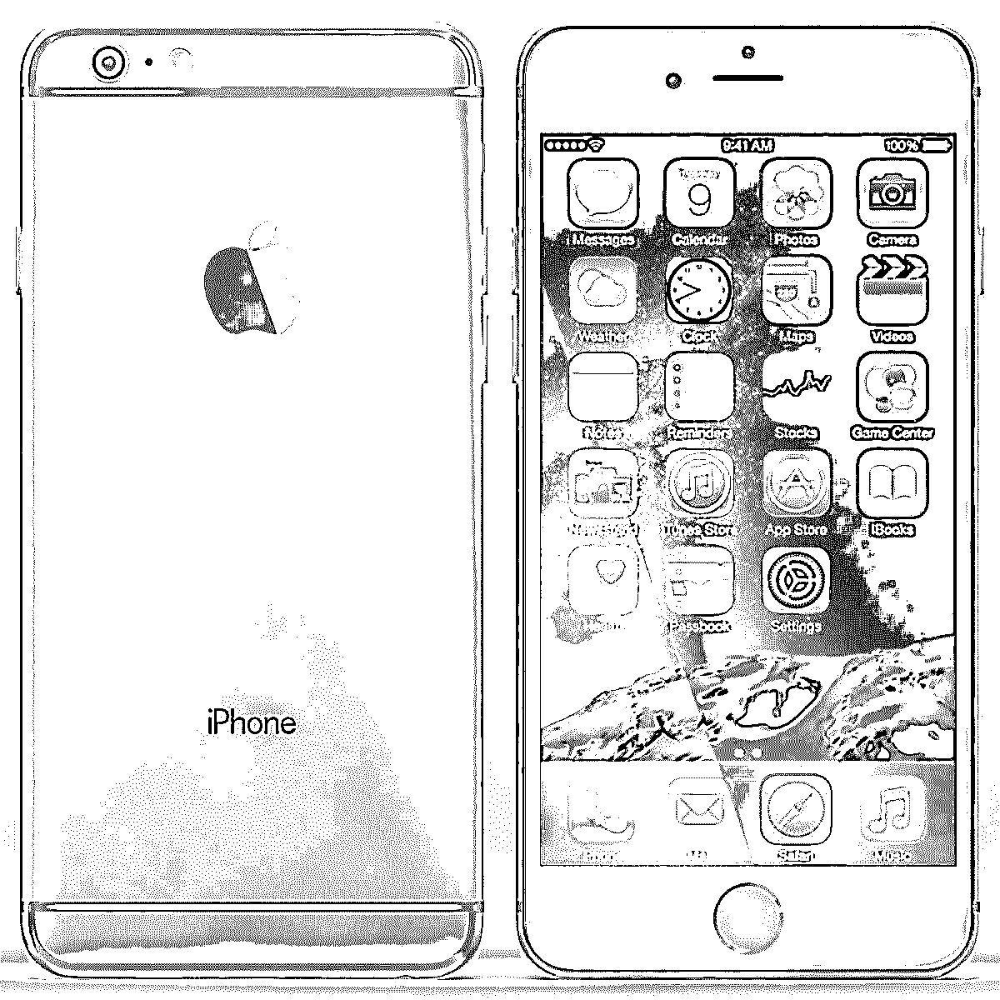

](https://cdn.educba.com/academy/wp-content/uploads/2015/12/iPhone-6-S-space-grey-colour.jpg) 

*图片来源:apple.com*

它有一个令人难以置信的全新的 12 MP iSight 摄像头。 iPhone 6S 和 iPhone 6S plus 可以拍摄出细节丰富的惊艳照片。这个新设备可以拍摄高清甚至 *4K 视频*。4K 的视频拥有 800 万像素的更高的细节度。它还有一个*500 万像素的 FaceTime 高清摄像头*，可以用来拍摄令人难以置信的细节自拍！它还有一个巨大的*真色调闪光灯*，有助于匹配光线的氛围，以提供更准确的闪光灯颜色。前置摄像头也可以使用这种闪光灯(使用视网膜闪光灯和 True Tone)来生成亮度提高 3 倍的高质量自拍。

3D touch on photos 提供了一个名为 *Live Photos* 的全新功能。现场照片是 *12 MP 高质量的静止图像*，延长了捕捉的瞬间。这是高效的帧到帧技术。在相机模式下，*特有的三个同心圆状按钮*表示启用了实时照片。默认情况下，*启用实时照片，*您无需采取额外的步骤来执行实时照片。这项新功能适用于所有苹果设备，如 OS X El Capitan、iPad、iPhone，甚至 Apple Watch。

iPhone 6S 和 6S Plus 配备了很棒的新配件，即与 iPhone 金属饰面相匹配的*充电底座*、拥有五种不同颜色的*新皮革颜色*以及拥有十一种不同颜色的*硅盖*。iPhone 6S 和 iPhone 6S Plus 的价格配置如下:

#### 5.–*iPhone 6s:*

1.  *16gb:199 美元*
2.  64gb:299 美元
3.  *128 GB:399 美元*

#### 6.–*iPhone 6s Plus*

1.  *16 GB:299 美元*
2.  64gb:399 美元
3.  *128 GB:499 美元*

[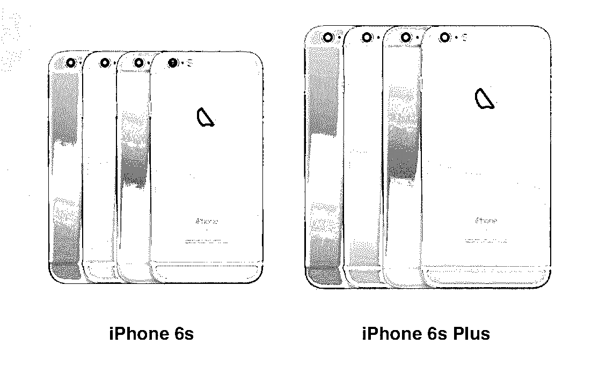

](https://cdn.educba.com/academy/wp-content/uploads/2015/12/iPhone-6s-and-iPhone-6s-colour-variants.png) 

*图片来源:apple.com*

这些和 iPhone 6 和 6 Plus 的一样。这些新设备将于 2015 年 9 月 12 日在美国上市，并将于今年年底在其他国家上市。

### 推荐文章

这里有一些相关的文章，可以帮助你了解苹果活动的更多细节，所以请浏览下面的链接

1.  [特色苹果电视](https://www.educba.com/apple-tv-features/)
2.  [iOS 8 每个苹果粉丝都应该知道](https://www.educba.com/5-tips-of-ios-8-every-apple-fan-should-know/)
3.  [Apple Watch 第一代](https://www.educba.com/apple-watch-first-generation/)

