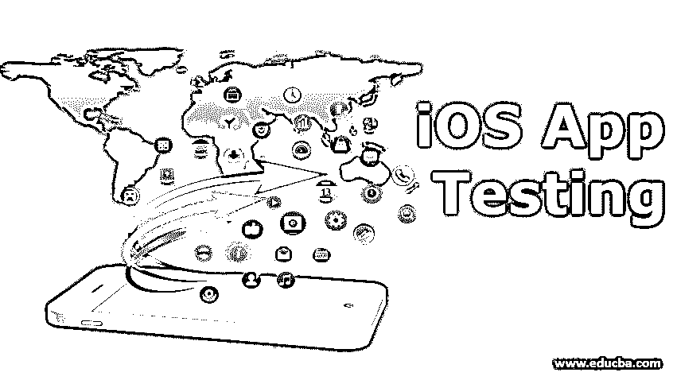

# iOS 应用测试

> 原文：<https://www.educba.com/ios-app-testing/>

## iOS 应用测试简介

iOS 应用程序测试是苹果公司开发的一种独特的移动操作系统，适用于其产品，通常被称为 iDevices。当 iOS 为 iPhones 开发时，内置的操作系统被用来支持 iPads 和触摸设备。iOS 因其安全无崩溃的应用程序、用户友好的支持和操作的灵活性而广受欢迎。区域或语言障碍不会限制 iOS。这是 iOS 在过去十年支持四十种语言的发展中非常出名的最重要的因素。苹果有一个封闭的安全系统，而安卓有一个开放的系统。因此，为了高效率和快速运行，iOS 必须定期进行测试。

### 为什么要进行 iOS 应用测试？

可用或尚未发布的设备的结构应该有一个清晰的视图，并成为测试的源床。类似的设备不需要对操作系统的测试进行深入分析，因为它是一个锁定的系统，但仍然需要最少的测试床时间来进行操作系统测试。苹果有各种各样的自动工具，并为我们提供学习技巧。Android 系统的全球定位系统很容易受到数据攻击，但在 iOS 系统中很难发送消息或通知。Android 中的 GPS 测试需要 3 天时间来执行假代码以发送假位置。但在 iOS 中，发送 GPS 的[伪码需要几分之一秒。](https://www.educba.com/what-is-gps/)

<small>网页开发、编程语言、软件测试&其他</small>

主要测试不是强制性的，通过地面测试来测试全球定位系统，运输伪造的 GPS 数据是明智的，既省时又省钱。苹果 iOS 有保存应用程序的严格准则，这有助于在提交过程后被拒绝。

Android 没有苹果 iOS 那样严格的政策。设备和操作系统的操作是安全的，并且减少了它在其中工作的错位应用。在 iOS 中，没有停止应用程序的规则。降低了测试的复杂性。在 iOS 应用程序测试之前，应考虑实施及其类型。基于实现的应用程序类型有基于 web 的应用程序、本地应用程序和混合应用程序。

### iOS 测试的类型

下面列出了不同类型的 iOS 应用程序测试。

#### 1.人工测试

在这里，我们讨论基于设备并使用仿真器来执行手动测试

##### 手动测试——基于设备

基于设备执行手动测试。这一类别下有系统测试、用户界面测试、安全测试和现场测试。

*   **系统测试:**在系统测试中，iOS 应用程序被整合到一个实际的苹果设备上，然后与用户界面进行用户交互，执行若干范围的用户操作。系统测试是从端到端操作执行的。每次测试都要根据 iOS 版本和可用的应用配置拼命实现。
*   **用户界面:**iOS 的用户界面有一个按键组件，分为输入、硬键、软键和屏幕。对触摸屏功能的测试，如三维触摸、按钮大小、滚动、形状、字体特征、按钮位置等，都属于这一部分。硬键是硬件键中存在的本地应用程序，例如 home 键和声音按钮。软键盘是键盘中笑脸符号的外观，适用于任何强制使用的情况。屏幕支持多种设备，在所有方向上进行测试，如测试过程中应选择分辨率。测试应该在纵向或横向模式下进行，以便在不同情况下使用键盘。只要有新的弹出窗口，列表就应该显示在新的屏幕上。当有任何应用程序崩溃通知应该作为查询消息发送。
*   **安全测试:**在安全测试中，发送一次性验证码是出于安全目的，以避免任何数据盗版。因为现在像银行交易这样的机密数据是通过手机银行完成的。
*   **现场测试:**现场测试用于测试应用在慢速网络覆盖下的性能和效率。

##### 手动测试——使用模拟器

使用模拟器的手动测试是一种分为单元测试、集成测试和 UI 测试的测试类型。

*   **单元测试:**在单元测试中，开发人员检查并执行源代码的模块，并分析其功能标准。它适用于单个组件。
*   **集成:**集成是为了测试连接模块的集成点。
*   UI 测试: UI 测试在应用程序上进行，但是太贵了。

#### 2.iOS 自动化测试

IOS 自动化分为四大类，即回归测试、BVT 测试、兼容性测试和性能测试。

*   **回归测试:**在对系统或应用程序进行任何更改以增强其操作后，执行一次回归测试。
*   **BVT 测试:** BVT 测试是一种自动化代码，在应用程序或系统崩溃时自动执行。它会在最短的时间内自动向用户发送报告。
*   **兼容性测试:**兼容性测试在不同版本的几个设备中进行，如 15 种类型的 iPhones 和 10 种版本的 iPad，以比较其功能，分析其性能并在未来的型号中更新。
*   **性能测试:**性能测试是检查应用程序的响应时间、加载时间、交互时间和空闲时间。

### 战略

iOS 测试中端到端的策略很少，如下所示:

质量分析是从事完整软件开发生命周期的技术团队的主要部分。因此，实施敏捷方法是 iOS 测试中的重要方法之一。有必要从需求阶段开始定义测试脚本。单元和功能测试是一种有效的方法，因为单元模型被执行，并且可以为整个系统的操作提供完全的效率。UX 测试是软件测试中的关键步骤检查客户体验是由 UXA 部署的，设计师适合其最终解释。

负载和性能测试是开发团队为测试自动化脚本及其压力管理而制定的特殊策略。进行运营商和网络测试是为了测试网络的波动及其对在网络上工作的应用的适应性。因此，遵循这些策略，应用程序是无错误的，并给用户一个无压力的体验。iOS 测试是一项具有挑战性的任务，但这是处理苹果应用程序以有效管理它们的正确方法。

### 推荐文章

这是 iOS 应用测试指南。在这里，我们以简单而详细的方式讨论了 iOS 应用测试的基本概念、类型和策略。您也可以浏览我们推荐的其他文章，了解更多信息——

1.  [健全性测试](https://www.educba.com/sanity-testing/)
2.  [域测试](https://www.educba.com/domain-testing/)
3.  [手机测试面试问题](https://www.educba.com/mobile-testing-interview-questions/)
4.  [互操作性测试](https://www.educba.com/interoperability-testing/)

