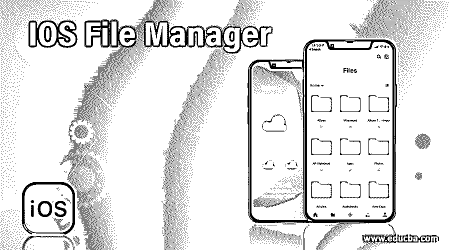

# IOS 文件管理器

> 原文：<https://www.educba.com/ios-file-manager/>

## IOS 文件管理器简介

iPhone 中最令人意想不到的是其低效的文件管理器。因此，他们发布了许多官方文件管理器应用程序，以便访问第三方云服务，如 Google Drive、Dropbox、box 和 OneDrive。但 iOS 中很少有文件管理器能处理 Keynote、Pages、Numbers 等信息，能做 PDF manager 应用的也很少。它还可以用来存储媒体内容，但它有一些限制，只能访问最小数量的内容。这些应用程序与 Android 手机上处理整个设备上所有文件类型的应用程序不同。它不能下载像 Android 应用程序那样简单的文件。但它发现在第三方解决方案中管理 iPhone 中的文件更有用，无需任何越狱。

### 7 大 IOS 文件管理器

虽然 iPad 和 iPhone 上的原生文件应用程序对一些用户来说是有效的，但 iPhone 系列的大多数用户并不觉得它对用户友好，因为它的内部文件系统。因此，实现了一些应用程序来提高文件管理器的效率。此类顶级应用程序包括 Documents by Readdle、File Master、File Pro、File Manager & Browser、FileApp、iExplorer、iFiles 2、Files United、File n Folders、iStorage 2HD、Total Files、MyMedia、File Manager、FE File Explorer 和 Pocket Drive。其中，流行的文件管理器应用程序将在本文下面进行解释。

<small>网页开发、编程语言、软件测试&其他</small>

#### 1.Readdle 文档

这是一个为 iOS 设备设计的文件管理器应用程序，用于管理 iPhone 上的所有信息。该应用程序具有广泛的功能，使人们能够访问全球 Apple Music 以及 iCloud 文件、图片、视频和 iCloud 音乐库。它可以打开。可以在 iPhone 上解压 ZIP 文档的 ZIP 文件。它使用户能够在 iPhone 上开发 FTP 服务器，可以与用户偏好的任何 FTP 客户端关联。它有内置的网络浏览器，可以下载任何文件，直接从网络空间加载到应用程序中，而无需打开任何其他新标签。

#### 2.FileApp

这是一个适合 iPad 和 iPhones 的文件管理器，它有一个吸引人的界面，可以根据日期、类型和大小自动组织文件。它显示应用程序上最近打开的文件。它可以开发新的图片，记录音频或视频或文本文件即时从应用程序。它使我们能够在应用程序本身中播放媒体内容、阅读 pdf 和查看图像。它使用户能够通过各种选项(如 FTP、HTTP 和桌面上的应用程序)将其文件传输到任何操作系统的个人计算机上。如果使用默认选项关闭了任何共享内容，用户可以打开它，甚至可以自定义用户名和密码，并以安全的方式保存所有文件。用户可以启用密码保护来解锁文件。

#### 3.文件中心

该应用程序非常适合 iOS 组件，在组织设备方面有过多的高级选项。它可以开发新文件，并从 iCloud Drive 即时导入或导出文件。应用程序中的排序选项使其独一无二，它可以通过蓝牙或 WiFi 传输将文件传输到个人笔记本电脑。在设置选项中，用户可以允许安全的 Wi-Fi 传输，以保护手机免受盗版攻击。它启用文件扩展名并转换幻灯片显示设置。它支持一个密码锁，以保护没有任何密码的移动访问。但是该应用程序不提供触控 ID 认证。与所有其他文件管理器应用程序相比，该应用程序提供了 iPhone 和 PC 之间可靠的文件传输。

#### 4.文件管理器

这是一个免费的应用程序，最适合 iOS 设备。它有一个清晰的界面，用于开发文件夹和文件。它可以将不同的云服务添加到应用程序中，从而轻松处理所有的云帐户。文件管理器应用程序支持 Dropbox、One Drive、WebDAV 和 Google Drive 等流行服务。它有自己的私人网络浏览器，可以安全地将文件下载到应用程序中，也可以用于网上冲浪。它启用密码锁定，使用户免受数据盗版。它支持触控 ID 认证，可以通过 Wi-Fi 同步或 iTunes 轻松地将文件从 iPhone 共享到 PC。但是用户对广告的中断感到烦恼，这在购买应用程序时得到了纠正。

#### 5.文件主文件

iPhone 中文件管理可用的高级选项是 File Master，它提供了与其他应用程序类似的多种功能。即使仪表板很无聊，但所有的基本功能都被安排在正确的地方，以提供方便的访问。它可以轻松创建新文件夹、文本文件，并提供简单的照片和文件传输。它有自己的私人网络浏览器，可以直接下载数据。该应用程序的安全性通过其 touch ID 和 pin 身份验证吸引了用户。它用于隐藏私人文件和个人数据。如果用户不关心应用程序设计，他可以选择提交一个主文件作为最佳选择。

#### 6.我的媒体

这是一个重要的 iPad 和 iPhone 下载管理器，包括一个内置的文件管理器和上面列出的所有功能。它包括一个内置的音频和视频播放器和独特的多媒体文件管理器。Mediacast 选项允许用户将多媒体内容转换为 Chromecast。私人浏览器用于浏览和存储数据。但用户会因为广告而感到恼火，而安装 Pro 版可以避免这些广告。

#### 7.袖珍驱动器

它类似于所有其他不包含任何特殊内容的应用程序。它用诱人的颜色和设计让用户的 iPhone 过于有条理。它包括一个私人的网络浏览器来安装任何补丁或用于文件下载。

### 结论

通过考虑所有的功能，如安全性和有吸引力的仪表板，用户可以选择他的文件管理应用程序。建议选择安全性高的应用程序，并且该应用程序应该没有广告，以避免盗版攻击。

### 推荐文章

这是一个 IOS 文件管理器的指南。在这里，我们讨论了 IOS 文件管理器的介绍，并简要说明了 7 大文件管理器的详细信息。您也可以浏览我们的其他相关文章，了解更多信息——

1.  [安卓文件管理器](https://www.educba.com/android-file-manager/)
2.  [Python 上下文管理器](https://www.educba.com/python-context-manager/)
3.  [Linux 创建文件](https://www.educba.com/linux-create-file/)
4.  [糟糕的项目经理](https://www.educba.com/bad-project-manager/)

