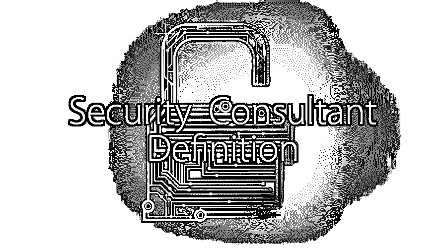

# 安全顾问定义

> 原文：<https://www.educba.com/security-consultant-definition/>

## 安全顾问定义介绍

安全顾问的定义是专门从事安全行业某个领域的个人或一组个人。安全顾问的定义是评估软件、网络和计算机系统的能力。安全顾问定义同时扮演攻击者和防御者的角色。他们直接与客户合作，根据客户的需求专门为客户制定安全计划。他们为不同类型的客户工作，从家庭到需要安全的大型企业。

### 安全顾问定义是什么意思？

有人雇佣安全顾问的定义来确定公司 IT 系统中的故障，并找到更好的解决方案来防止攻击和盗窃。

<small>网页开发、编程语言、软件测试&其他</small>

术语安全顾问的定义是一个更广泛的术语，包括

*   [信息安全顾问](https://www.educba.com/information-security-career-path/)
*   计算机安全顾问
*   数据库安全顾问
*   网络安全顾问

### 安全顾问职业是做什么的？

安全顾问职业生涯的首要任务是会见客户并讨论他们的问题。然后，安全顾问建议公司保护他们的数字资产、物理财产和个人安全，如建筑物、系统、数据库等。有专门从事不同领域的安全顾问职业。他们利用自己在相关领域的专业知识，建议公司安装必要的保护软件。

安全人员还进行严格的背景调查，以找出错误并改进安全系统。他们还为自然灾害和人为灾害提供专家解决方案。

### 安全顾问职业的责任

总是需要保护公司的隐私。特别是较大的公司对隐私有更多的需求，他们招聘安全顾问职业。下面是一家公司的安全顾问的职责。

*   找出一种有效的方法来保护公司的计算机、网络、软件、数据和信息免受任何威胁。
*   就发现的任何安全问题调查部门的员工和负责人
*   针对检测到的问题起草应急响应计划
*   研究安全标准、安全系统和认证协议。
*   进行漏洞测试、风险分析和安全评估。
*   协助缓解技术
*   为 IT 项目设计合适的安全系统
*   为将要安装的安全系统准备成本估算。
*   测试安全解决方案
*   向安全团队提供培训
*   就政策、程序和标准对员工和企业进行教育
*   实施和维护公司[安全政策](https://www.educba.com/security-policies/)
*   更新和升级公司的安全系统
*   提供事件响应和取证

### 人们为什么选择安全咨询？

喜欢研究和跳出框框思考的人喜欢选择这个职业。他们也喜欢创造和创新。

有些人喜欢在软件中寻找缺陷，他们也有很多机会从错误中学习。他们可以自由地处理问题并做出自己的决定。

### 如何以及从哪里开始？

安全顾问职业没有明确的教育途径。大多数安全顾问需要学士学位作为他们的最低资格。但是他们感兴趣的安全咨询领域的学位将是一个额外的优势。他们应该具备系统、安全、网络、协议和其他计算机相关主题的基础知识。安全顾问需要各种领域的知识，如网络、数据库和所有最新技术。安全顾问通常从安全领域的任何一个学科开始他们的职业生涯。一些安全顾问的职业是以前的警察、电子工程师、集成商甚至黑客。

一些流行的安全管理研究是情报管理、公共安全、国土安全和犯罪学。

在开始安全顾问职业生涯之前，以下是一些应该了解的话题

*   [网络应用安全](https://www.educba.com/web-application-security/)
*   网络安全评估
*   移动设备安全性
*   源代码审查
*   低级应用程序安全性
*   二元反转
*   研究与开发
*   像 c++(T1)、Java、Python、[Ruby(T3)或任何其他语言](https://www.educba.com/ruby-programming-practice/)

获得一些经验总是有帮助的。获得一些中级安全工作的经验，如

*   安全管理员
*   安全专家
*   安全分析师
*   安全工程师
*   安全审计员

此外，除了常规的实验室工作之外，尝试参与开源项目。这些项目工作将有助于[即兴发挥你的技能](https://www.educba.com/soft-skills-in-the-workplace/)，培养特定的兴趣并学习在市场上更受欢迎的新技术。随着新技术的引入，安全领域也在不断变化。人们需要跟上变化以适应竞争。

你可以通过像 Twitter 这样的社交媒体获得关于最新技术的知识。还有许多网站，如《进攻性安全》,提供了许多与该领域相关的信息。RSS 提要也可以在很大程度上帮助你收集信息。

### 所需的执照和证书

如果一个人想成为一名成功的安全顾问，那么他/她需要获得认证。因此，您需要获得认证，如认证保护专家、物理安全专家、认证安全顾问或认证信息安全系统专家。

### 安全顾问职业所需的技能

我们已经看到了安全顾问职业的工作职责。安全顾问的雇主希望他们具备一定的硬技能和软技能。下面列出了一些公司期望的硬技能。

*   IDS/IPS、渗透和漏洞测试
*   加密技术
*   Windows、Unix 和 Linux 操作系统
*   安全编码实践、[道德黑客](https://www.educba.com/ethical-hacking-software/)和威胁建模
*   应用程序安全性
*   网络和 web 相关协议
*   防火墙和入侵检测
*   性能调优视图、索引、SQL 和 PLSQL
*   高级持久威胁(APT)、网络钓鱼、网络访问控制器(NAC)、网关防恶意软件和增强的身份验证
*   PCI、HIPAA、NIST、GLBA 和 SOX 合规性评估
*   像 [COBIT 和 ITIL](https://www.educba.com/cobit-vs-itil/) 这样的框架
*   网络路由方法，如 VPN、VLAN 和 VoIP

定义安全顾问需要两项重要的软技能——领导能力和谈判素质。他们还应该有出色的沟通技巧。他们应该具备所有这些素质，因为他们需要与不同的团队合作，这需要耐心。

安全顾问的定义也应该更有创造性。他们应该跳出框框思考，解决复杂的问题。

要开始您的安全顾问职业生涯，请培养以下品质。

*   **全心全意地开始**——一旦你决定开始你的安全顾问生涯，就要全心全意地去做。安全顾问的职业生涯与其他工作是平等的，增长也优于平均水平。此外，有许多培训和认证项目可以帮助你成为你所在领域的专家。
*   **研究**-研究一下声誉良好的培训机构，它能为你提供包含所有最新技术的最佳课程。有不同的机构专门研究某一特定的安全领域。
*   不要被限制住，总会有新的东西等着你去学习。所以不要限制自己的课程。相反，不断增加更多与你的领域相关的知识。
*   **获得一些经验**——完成课程后，让自己接触行业环境。它将帮助您以实用的方式了解威胁。
*   **认证**–获得一些额外的认证，为你的工作增值。这样的认证会帮助你获得额外的知识，提升你简历的价值，让你获得更多的工作机会。

### 计算机安全顾问定义

成为计算机安全顾问更有回报。这个部门的职业发展非常快，因为几乎所有的企业都在使用计算机系统开展业务。这增加了对计算机安全顾问的需求。计算机安全涵盖更广泛的领域，如 IT 安全、信息和风险管理。要成为一名计算机安全顾问，你需要有计算机科学的学位或拥有一些 IT 经验。你还需要知道所有基本的计算机技能，比如编程、网络安全、移动安全、网络安全和密码学。大多数计算机安全顾问都是前黑客，他们知道公司保护他们的数据免遭盗窃和黑客攻击有多困难。

计算机安全顾问的角色和职责因公司而异。他们开发复杂的数据库，开发网站，建立计算机网络。他们也可以被安排在网络专家、数据库专家或公司软件程序员的岗位上。

### 信息安全顾问认证

信息安全也被称为信息安全。信息安全意味着保护公司的信息免受未经授权的使用或访问。许多公司已经开始外包他们的 IT 安全，因为他们希望专注于核心业务。信息安全顾问是致力于保护组织的数据和信息免受黑客攻击的人。成为信息安全顾问的第一步是获得 IT 安全认证。有很多认证可用，欧共体委员会提供这些证书。下面列出了一些证书示例。

*   [注册网络防御架构师](https://www.eccouncil.org/programs/certified-network-defense-architect-cnda/) (CNDA)
*   [电脑黑客法医调查员](https://www.eccouncil.org/programs/computer-hacking-forensic-investigator-chfi/) (CHFI)
*   欧盟委员会网络安全管理员(ENSA)
*   [欧盟委员会认证事故处理员(ECIH)](https://www.eccouncil.org/programs/ec-council-certified-incident-handler-ecih/)
*   [欧洲委员会认证 VOIP 专家(ECVP)](https://www.eccouncil.org/programs/ec-council-certified-voip-professional-ecvp/)
*   欧盟委员会认证首席信息安全官(CCISO)

### 网络安全顾问认证

网络安全顾问认证保护客户的信息免受泄漏、病毒、间谍软件和网络黑客的攻击。它们保护存储在网络中的公司机密信息。这些信息可以是任何形式，包括财务报告、项目、联系人、密码和其他关于公司的有价值的信息。网络安全顾问设置特殊的软件密码和防火墙，防止不需要的成员进入网络。他们确保数据永远不会被黑客窃取。他们还向员工传授网络安全方法，使他们了解并在更大程度上减少安全威胁。

### 数据库安全顾问

拥有庞大数字化数据库的大公司和组织更需要安全顾问。数据库安全顾问的任务是保护公司或组织的数据库。他们应该是数据加密、数据库设计和维护方面的专家。他们开发特定的软件和实践来保护和隐藏数据库，使其不被组织外的人发现。为了保护数据库，安全顾问应该了解市场上最近的威胁，例如病毒和蠕虫防御。

### 一个安全顾问认证多少钱

一名安全顾问，无论是计算机、网络、数据库还是信息安全顾问，平均年薪为 60 万卢比。该领域的知识越多，这份工作的报酬就越高。这份工作报酬较高的主要原因是经验。经验越多，得到的报酬就越多。通常，这个领域的人如果已经有 20 年或更多的工作经验，就会开始转向其他工作。某些技能，如 IT 安全和基础设施以及安全入侵检测，也会给你这份工作带来高薪。

### 结论

要成为一名成功的安全顾问，你必须首先完全了解事物，找出它们的弱点，然后发现解决方案作为一名安全顾问的职业生涯是愉快的，具有挑战性和有利可图的。所以，现在就开始你的安全顾问职业生涯，并达到人生的高峰。

### 推荐文章

因此，这里有一些课程将帮助您获得有关安全顾问定义、安全顾问认证和安全顾问职业的更多详细信息，请浏览链接。这在下面给出。

1.  [物联网安全挑战](https://www.educba.com/iot-security-challenges/)
2.  [网络安全事件](https://www.educba.com/cyber-security-incidents/)
3.  [安全架构](https://www.educba.com/security-architecture/)
4.  [什么是数据安全？](https://www.educba.com/what-is-data-security/)

