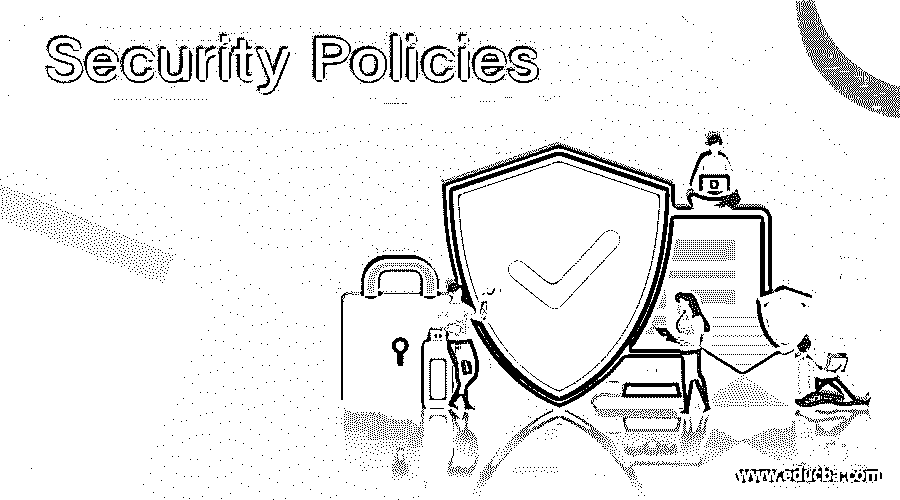
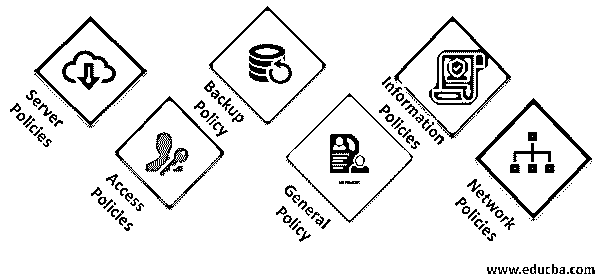

# 安全策略

> 原文：<https://www.educba.com/security-policies/>

## 安全策略介绍

以下文章概述了安全策略。安全策略可以定义为一组规则和程序，遵循这些规则和程序来保证系统或组织的安全性。它可以被视为必须在整个组织中实施的准则，以符合信息安全标准。政策因实体而异，所有实体都有独特的政策。不遵守其策略的系统被视为不合规，仍然容易受到严重违反。与此相反，所有实施这些策略的组织都有强大的基础来保护自己在未来免受攻击或数据泄露。

### 6 大安全策略

以下是 6 大安全策略:

<small>网页开发、编程语言、软件测试&其他</small>

#### 1.服务器策略

该策略适用于组织中用于多种目的的服务器，如存储数据、托管应用程序、DNS 服务器等。根据策略，服务器应该没有任何漏洞，并且用户应该根据他们的角色和职责只具有有限的访问权限。该策略规定，应该对服务器进行管理，以便它不会为攻击者打开入侵系统的大门。应该更新服务器上运行的操作系统，并在其中安装所有最新发布的补丁程序。服务器的可访问性是本政策中涉及的另一件事。它强调用户在服务器上的权利。

#### 2.访问策略

顾名思义，该策略关注用户对任何资源的访问。无权访问任何特定内容的用户不应绕过入口点的检查。在服务器方面，有一些权利或角色被分配给用户，这个策略规定用户不能执行任何不属于其权限范围的操作。此策略也适用于主机，因为在允许用户连接到本地网络之前，会对他们进行检查。对于本地主机，该策略规定，访问权限较低的用户不应以管理员或任何具有类似权限的帐户登录。

#### 3.备份策略

根据备份策略，数据备份应在特定时间间隔后创建。该政策的目的是确保数据的可用性，并支持 BCP(业务连续性计划)。BCP 指的是在自然灾害、火灾等情况下保持业务顺利进行所必须遵循的计划。即使现有位置的数据因任何原因被破坏，备份也将有助于恢复数据，确保数据的可用性，这些数据得到了 ISMS 中央情报局组件(信息安全管理系统)的认可。

#### 4.总方针

一般政策由适用于任何组织的所有员工的规则组成。例如，能够访问公共区域，能够在特定的域上发送邮件，等等。这些规则适用于组织中的每个成员。该政策还涵盖有权访问组织基础架构的第三方供应商的规则。它将所有的利益相关者聚集在一个页面上，共同遵守政策。

#### 5.信息安全政策

该策略可以定义为确保组织数据安全性的一套程序。它还包含各种策略来确保信息的安全性。

*   **清屏政策:**根据该政策，桌面必须保持干净，不得存放任何重要文件。桌面应该只包含不包含任何关键信息的普通文件。
*   清理办公桌政策:每个人都必须确保离开办公桌时不会留下任何重要文件或数据。笔、纸、手机的使用应限制在桌面上，这样就没有办法通过记录或点击它们的图片将数据从系统中取出。
*   **电子邮件政策:**官方 ID 不得用于任何个人用途。在向外部组织发送任何邮件之前，必须非常谨慎。应该非常谨慎地对待从外部来源收到的电子邮件，在内部用户信任发件人之前，不要点击该电子邮件的任何链接。
*   **密码策略:**所有在让用户进入之前需要验证检查的资源都应该遵守字符串密码策略。不应该允许用户创建一个弱密码，因为不安全的密码很容易被猜到，从而对组织构成威胁。
*   **信息** **共享策略:**任何信息都应该在应该访问该数据的人之间共享。例如，任何与特定项目相关的文件应该只在与该项目相关的人之间共享，而不是与任何其他方共享。像密码这样的东西不应该和任何人分享，不管是谁要求的。

#### 6.网络策略

网络策略确保网络的安全性，并帮助网络以最佳状态运行。该策略定义了不同用户对网络的可访问性，还定义了必须在网络级别部署的数据保护规则。网络由多个节点组成，该策略涵盖了所有节点的标准。互联网的带宽，网络的一部分，如 DMG 或本地网络设备，应该遵守他们的政策。简而言之，它涵盖了旨在覆盖网络中的对等体和资源的所有策略。

### 结论

世界各地都在实践这种方法，以保持系统强大，抵御可能破坏数据、诋毁组织等的攻击。此外，遵守这些策略会使组织抱怨信息安全标准，这被认为是在良好或全球级别运营业务的强制性标准。

### 推荐文章

这是一份安全策略指南。这里我们讨论 6 大安全策略，如服务器策略、访问策略、备份策略、常规策略等。您也可以浏览我们推荐的其他文章，了解更多信息——

1.  [网络安全框架](https://www.educba.com/cybersecurity-framework/)
2.  [安全技术](https://www.educba.com/security-technologies/)
3.  [什么是网络安全？](https://www.educba.com/what-is-network-security/)
4.  [网络安全面试问题](https://www.educba.com/network-security-interview-questions/)

