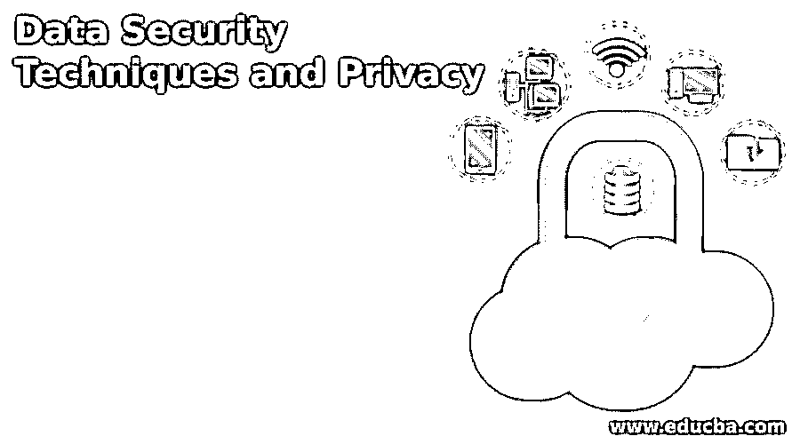
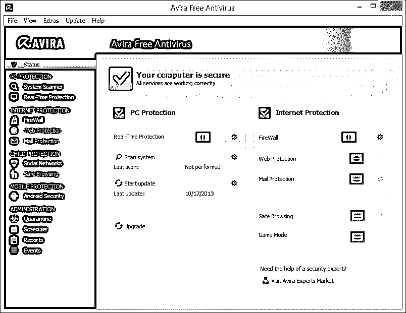
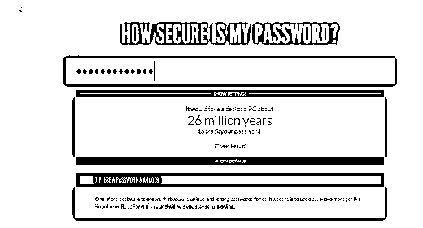
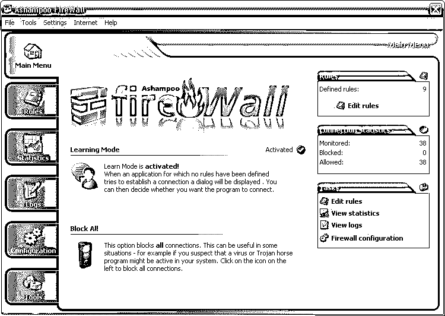

# 数据安全技术和隐私

> 原文：<https://www.educba.com/data-security-techniques/>

## 数据安全技术

如果说互联网和信息技术让我们的生活变得更加简单，那么它也催生了一些基于安全的威胁。因此，使用适当的数据安全技术和数据隐私来保护您的关键数据和其他信息变得同样重要。然而，你手头的第一个任务是确定你想要保护的机密数据不被泄露。只有在您仔细完成审计后，才能进行这种识别。一旦[理解了数据安全](https://www.educba.com/what-is-data-security/)的含义，你接下来的工作就是系统地了解你的数据中哪些部分容易受到攻击，需要明确的保护。

这些天来，[黑客](https://www.educba.com/hackers-vs-crackers/)、[网络钓鱼者和域名欺诈者](https://www.educba.com/phishing-and-pharming/)变得相当聪明，所以你需要比他们更聪明来消除任何存在的风险因素。数据安全技术全面强调了保持信息安全和完整所需采取的所有重要步骤。但重要的是要记住，并非所有的步骤都适用于每家公司。

<small>网页开发、编程语言、软件测试&其他</small>

### 数据安全的 8 大重要例子

让我们从数据安全技术和隐私的 8 个重要例子开始:

#### #1.数据安全技术-安装防病毒软件

在您理解了数据安全的含义之后，让我们从不断攻击计算机系统的不同种类的病毒和恶意软件威胁开始。因此，每个计算机系统都必须安装最新的防病毒软件，这是最好的数据安全范例之一。仅仅安装软件并不能解决你的目的，但是你需要定期更新，至少一周更新一次。您必须了解如何配置软件。然而，了解不同种类的病毒也是至关重要的。当然，他们是不受欢迎的客人，通过各种来源渗透您的计算机，如外部硬盘，包括受感染的笔式驱动器、CD 或 DVD，浏览不受保护的网站、电子邮件和其他文件和文档。一些病毒可以很容易地被杀毒软件检测到并清除，而另一些则是隐藏的，很难追踪到它们。除了病毒，电脑还会受到-

*   **木马**

一个希腊字母可能会带来恶意代码，如果它渗透到您的计算机中，可能会对重要文件和软件造成不利影响。[木马](https://www.educba.com/viruses-function/)木马基本上是在你从一个未知且未受保护的来源下载东西时攻击系统。因此，在开始下载文件之前，您需要检查网站的真实性。

*   **蠕虫**

根据安全专家的说法，蠕虫比病毒构成了更大的威胁，可以很容易地进入你的系统。他们通常通过欺诈邮件或虚假网站进行攻击，感染文件和文档。它们传播得更快，并同时攻击整个系统。

#### #2.安装最新的更新清除数据安全技术是通过一个，大多数微软软件，如操作系统像视窗 XP 有高度敏感的代码。这些代码有时可能会有一些难以理解的错误，但这也是最好的数据安全示例之一。这些错误主要包括代码运行不当、程序死锁等。它们往往会削弱安全性，黑客很容易利用这一点。他们可以访问受保护的文件，并经常通过不同的非法方法破坏数据。

然而，这种问题并不是不能解决的。您可以通过免费下载来使用更新和补丁。它们也被称为服务包。如果你留意程序更新，会有帮助的。最好不要使用微软操作系统或 MS Office 的旧版本，如 1998、2001、2003、XP、0W`ord doc、Powerpoint、Excel、 [Outl](https://www.educba.com/excel/courses/ms-office-course/) 等。

#### #3.数据安全技术–不要使用间谍软件和广告软件

作为一个电脑拥有者，你必须警惕病毒和蠕虫渗透电脑的威胁，以及对你的机密文件和文档的各种邪恶和危险的危害。最好是一个人浏览或者上网。注意不要让任何人窥探你的浏览习惯，从你的电脑上收集敏感信息。但在此之前，你应该知道什么是广告软件。

*   **广告软件**

广告软件通常是一种间谍软件，利用它人们可以知道你在互联网上访问什么样的网页。浏览互联网时，您可能会遇到弹出广告，它们基本上出现在不同的窗口中。如果你想消除这种不必要的，你需要固定 JavaScript 和 ActiveX 控件的一些部分。然而，假冒广告软件也有一些例外。这在很大程度上取决于软件的真实性及其许可协议。

*   **间谍软件**

另一方面，间谍软件就像不受欢迎的虫子，它会自己侵犯你的电脑。它们基本上是特洛伊木马或非法文件，即使你不想要，它们也会自动下载。它增加了你的信息和你的电脑活动，从而在你不知情的情况下将它们全部记录在硬盘上。这使得黑客的工作更容易，因为他们可以轻松地检测到机密信息，如密码、银行信息、ATM 卡 pin 码等。

#### #4.数据安全技术——总是选择不寻常的和棘手的密码

你一定读过很多次，黑客能够入侵电子邮件账户或网站，因为他们可以轻松破解密码。密码是保证你所有信息安全的重要工具之一。建议选择在字符方面具有良好强度的密码。您可能会抱怨复杂的密码很难记忆，而且人们经常会忘记它们。但是你可以把它记在某个地方。必须确保以下必要步骤来保护您的密码-

*   请始终将您的密码写在安全的地方，而不要写在计算机显示器屏幕上，因为这样很容易被人看到。
*   当你登录你的账户(电子邮件、脸书或推特)时，管理员通常会给你两个选项；记住密码，不要。千万不要选择第一个选项。这样，任何操作你电脑的人都可以看到你的密码。
*   不要把你的密码透露给任何人，甚至是你完全信任的最亲密的朋友或亲戚
*   如果你每隔几个月就更换一次密码，会有所帮助。不要为任何帐户保留太长时间的密码。
*   尝试为不同的帐户设置不同的密码。例如，您的电子邮件 id 的密码不应该与脸书匹配，反之亦然。假设你必须通过电子邮件发送 id；即使这样，密码也不应该相同。

#### #5.数据安全技术–创建强密码

强密码也在数据安全示例列表中，因为您知道创建不易被黑客发现的全长强密码的必要性。攻击者通常使用密码破解工具，如智能猜测、自动化和攻击字典。

**强密码的一些基本特征**

*   任何密码的理想长度都不少于八个字符。
*   它应该始终包含一个大写字母、小写字母、特殊字符(如(@、#、$)以及至少一个从 1 到 0 的数字。它非常适合将符号放在第二个或第六个位置。
*   请将这些作为您的密码；您的姓名、用户 id、出生日期、居住地、父母姓名、学校或机构名称、您的车辆号码、手机号码或任何非常简单的单词。

#### #6.数据安全技术——尽量避免电子邮件的危害

我们经常认为电子邮件是当今最重要和最有效的电子通讯手段之一。绝对正确。然而，人们也必须看到硬币的另一面。如果你不警惕，不留意你的电子邮件账户，那么你会陷入很多麻烦。网络专家认为，电子邮件可能是攻击者用来向办公室的大部分计算机系统发送病毒的最简单快捷的方法。以下是确保电子邮件安全和隐私的步骤。

*   **受密码保护的电子邮件**

密码保护几乎每个电子邮件 id，你需要输入用户名和密码登录。如果不知道密码，任何人都不能出于任何目的使用你的电子邮件帐户。

*   在按下发送键之前，请检查所有内容。

只需点击“发送”按钮，向任何人发送邮件都非常容易。然而，如果你在给任何人发电子邮件之前非常小心的话，这将会有所帮助。应确保您输入了正确完整的收件人电子邮件地址。作为公司的所有者，你有责任教导你的员工如何保护机密信息。

*   **维护隐私声明**

大多数大公司都在电子邮件中包含隐私声明。你通常会在邮件的结尾找到它，可能是以签名文本的形式。如果你问专家，他肯定会说这是你资产中的一个很好的工具。

*   **不要遭受网络钓鱼攻击。**

这些是黑客或网络钓鱼者使用的常见伎俩，他们通过伪造或恶作剧的电子邮件 id 来诱捕受害者，以了解一些敏感信息，如银行详细信息和其他财务信息。他们经常使用知名大公司的公司标识和电子邮件 id 来锁定受害者。这封邮件看起来完全可信，但它只是非法邮件。他们试图通过巨额现金奖励和其他奖励来吸引人们。请非常小心，不要回复任何这样的电子邮件。立即删除它们。

*   **使用电子邮件加密**

这是保护你的电子邮件免受黑客攻击的又一个有效和有用的方法，尤其是如果邮件的内容非常机密的话；在这种情况下，任何人都很难对内容进行解码，因为它是未加密的格式。

*   **利用垃圾邮件过滤器**

垃圾邮件是进入你收件箱的不必要或不想要的电子邮件，每次你都必须清理它们。然而，使用垃圾邮件过滤器，你可以摆脱这种不请自来的电子邮件，因为他们不会让他们来到你的收件箱。您知道大多数垃圾邮件都是与您的工作没有任何关联的假电子邮件。它们可以被故意发送并带有病毒，以破坏计算机系统。

#### #7.数据安全技术——安装防火墙的用处

安装防火墙也是数据安全的一个例子，因为当你使用互联网时，建立的连接是双向的。然而，在访问互联网时，您可能会在不知不觉中遇到一些未经授权的网页。因此，如果您有一个强大的安全工具来防止这种情况，将会很有帮助。实际上，防火墙总是扮演着保护你的系统免受虚假网站访问的重要角色。它会监视所有端口，并在您进入网站的未受保护区域时发出警告。

你可以以硬件或数据安全技术软件的形式安装重要的防火墙。谈到安装过程，软件防火墙总是更容易安装。但是，它们只能用于单个计算机系统。另一方面，硬件防火墙基本上保护计算机系统的整个网络。您可以使用的任何互联网连接；为你办公室的个人系统安装防火墙是很重要的。

#### #8.数据安全技术–锁定您所有重要的文件和文档

在数据安全示例中，锁定您的文件和文档也是数据安全技术的一个有用示例，因为电子数据可以从世界上的任何地方访问，所以如果您不希望每个人都访问您的所有文档，那么锁定并保护您的数据，无论它在哪里。但是，如果您记得保护数据的位置，会有所帮助。除此之外，保护您的服务器也很重要。

### 结论–数据安全技术

存储在计算机系统中的数据和其他重要信息对您和您的公司来说是非常敏感和机密的。随着网络威胁日益逼近，确保强大的安全数据和隐私变得非常重要。除了遵循这些步骤，您还应该在使用互联网时始终保持警惕和专注。

### 推荐文章

这是一个指南，它已经产生了几个基于安全的威胁。这里有 8 个基本方法来确保完整的数据安全技术和隐私。以下是与数据安全技术相关的外部链接。

1.  [网络安全工具](https://www.educba.com/cyber-security-tools/)
2.  [安卓安全应用](https://www.educba.com/android-security-applications/)
3.  [电子邮件安全](https://www.educba.com/email-security/)
4.  [安全架构](https://www.educba.com/security-architecture/)

