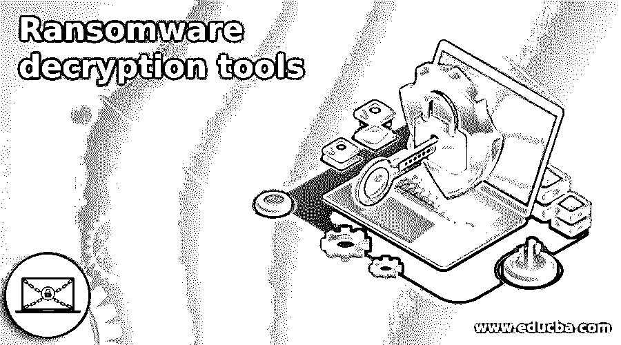

# 勒索软件解密工具

> 原文：<https://www.educba.com/ransomware-decryption-tools/>

## 勒索软件解密工具简介

勒索软件是一种恶意攻击，它攻击或加密您机器中的数据，并要求一定的回报。很少有工具可以解密被勒索软件攻击的文件。可以免费下载，使用起来没有任何瑕疵。一旦勒索病毒攻击发生，它会留下消息并破坏文件。每个攻击都有其特性，要解密这些文件并检索原始内容，许多解密工具都是免费的。

### 勒索软件解密工具

本文讨论了一些有效的勒索软件解密工具。

<small>网页开发、编程语言、软件测试&其他</small>

**1。AES_NI**

它在 2016 年 12 月的一次勒索软件攻击中应用，并在多个具有独特文件扩展名的用户中发现。为了加密文件，它合并了 RSA-2048 和 AES-256 属性。它创建一个本地公钥来加密文件，并与 C 文件夹中的私钥相结合，副本存储在 C&C 服务器中。因此，它以这种方式加密文件并检索原始数据，无需任何赎金。

**2。阿卡特兹储物柜**

当 2016 年 11 月发生勒索病毒攻击时，该软件用于通过 Base 64 编码和 AES 256 加密的组合来加密文件。被攻击的文件有一个扩展名。它会在用户桌面上的 ransomed.html 文件中留下一条信息

**3。天启**

勒索病毒攻击中部署的天启发生在 2016 年 6 月。在这里，攻击显示带有扩展名的文件名。FuckYourData”，或者”。加密”。重要的是，密码策略应该非常强大，确保没有人可以打破它。因为这种攻击发生在跨国公司的 RDP。

**4。坏块**

为了解密 badblock 勒索软件攻击，会使用组合清理技术，并在漫长的过程中将其删除，如扫描、检测、代码运行、解密和提取数据。badblock 不会重命名文件，也不容易被检测到，因此需要专业的自动恶意软件删除。文件解密后，显示的消息包含一个扩展名为“帮助 decrypt.html”的文件

**5。巴特**

Bart 是一种独特的恶意软件攻击，它通过钓鱼电子邮件加密文件，并要求比特币解密代码。如果任何用户点击一封可疑的邮件，代码将被下载并加密 Zip 格式的文件，并使用类似 bart.zip 的消息更改桌面图像。解密工具遵循暴力破解方法来猜测勒索软件存档中的密码，并遵循多个解密步骤来检索数据。Bart 攻击甚至在没有网络连接的情况下进行，解密工具遵循命令控制服务器和 RSA 公钥加密。

**6。BigBossRoss**

Bigbossross 的解密工具用于调试 AES128 加密的文件。它可以被识别出来，因为它留下的文件带有扩展名“.”。jpg“，”。bigbossross“或者”。obfuscated”并用黑客的联系方式开发#解密来索要赎金。它还会在每个文件夹中创建一个“read.me”文件。在少数解密工具中，数据无法检索，建议联系黑客以避免永久数据丢失。

**7 号。BTC 软件**

用于加密 BTCware 的解密工具应解密 AES 192 和 RC4 编码。这种恶意软件攻击有五种不同的变种，文件的扩展名为。沙瓦，。BTC 软件，。cryptowin，。密码字节，. onyon。

**8。Crypt888**

crypt888 攻击会改变系统壁纸，并在文件名的开头包含锁。假邮件将以你的银行、Paypal 和微软的名义发送，其中包含指向他的网站的重定向链接，这反过来为黑客打开了加密和锁定的大门。因此可以通过使用垃圾邮件过滤器来阻止它，并且可以禁用 office 产品中的宏。文件共享方法和变形的社交媒体图像也可能为 Crypt888 攻击铺平道路。因此，在这次攻击之后，在采取任何行动之前，应该从系统中删除损坏的文件，否则病毒可能会损坏整个文件。在 windows 中，选择任务管理器，杀死文件位置中的恶意进程，并选择 windows 修复注册表。

**9。Cryptomix**

出现了 Cryptoshield，通过 AES256 加密对文件进行加密。因此解密工具使用离线密钥处理文件并解密数据。如果生成的离线密钥没有加密数据，带有 mole 变体的解密器将检索数据，而不对原始文件进行任何修改。在这里，文件名随着扩展名。rmd，。rdmk，。scl，。莱斯莉。代码和。密码盾牌

10。孤岛危机

解密 Crysis 勒索病毒攻击，遵循非对称和 RSA-1024 的解密。

**11。增量**

要解密德尔塔，应该接着解码 RC4 加密和 RSA-2048。文件名以结尾。有几个随机字母的 delta。它把赎金信息放在“info.hta”文件中。

**12。加密磁贴**

为了解密这种恶意软件攻击，该工具设计用于 AES-128 加密。它窃取系统和用户之间的登录时间数据，然后离开。文件名末尾的 docencryptile。

13。FindZip

攻击发生在 Mac OS 上，加密发生在 ZIP 存档中。损坏的文件包括。在文档末尾查找 zip。它把文件名改成如何解密，并索要赎金。要解密文件，就要涉及到 Textwrangler，Xcode，pktrack 源代码，Xcode 命令行工具。它是自动化的，可以在 Mac Yosemite、Mac-Sierra 和 Windows 中解密。用户应该安装 Xquartz for Windows 和 Wine for Mac，以防止 Findzip 勒索软件攻击。

**14。Fonix**

该软件的解密工具应能破解 RSA-2048 会话密钥、ChaCha 加密、SALSA 加密和 RSA-4096 主密钥。这个工具是免费的，使用 RSA 主密钥来解密数据。加密文件的扩展名为“”。XINOF“或”。FONIX”。

### 结论

因此，为了防止这种类型的勒索攻击，用户应该有一个强大的防火墙，可靠的反恶意软件和安全的网络浏览器。我们不应该相信垃圾邮件，应该定期进行数据备份。

### 推荐文章

这是一个勒索软件解密工具指南。这里我们详细讨论一些有效的勒索软件解密工具。您也可以看看以下文章，了解更多信息–

1.  [VMware 工具](https://www.educba.com/vmware-tools/)
2.  [Pro Tools 插件](https://www.educba.com/pro-tools-plugins/)
3.  [Pro 工具快捷键](https://www.educba.com/pro-tools-shortcuts/)
4.  [云迁移工具](https://www.educba.com/cloud-migration-tools/)

