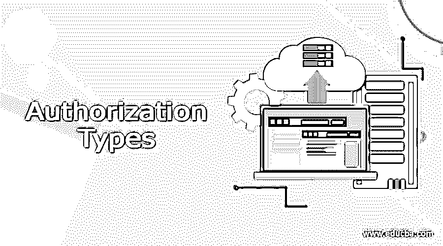

# 授权类型

> 原文：<https://www.educba.com/authorization-types/>

## 授权类型介绍

授权是定义对资源的访问权限/特权的过程，它与一般的信息安全，特别是计算机安全以及访问控制相关联。单个文件或项目的数据、计算机程序、计算机设备和计算机应用能力都是资源的例子。计算机用户、计算机软件和其他计算机硬件都是客户的例子。授权是策略定义阶段的一项功能，它在策略实施阶段之前，在策略实施阶段，根据之前定义的授权来接受或拒绝访问请求。

### 授权类型

有四种类型的授权——API 密钥、基本授权、HMAC 和 OAuth。

<small>网页开发、编程语言、软件测试&其他</small>

#### API 键

为了使用大多数 API，您必须首先注册一个 API 密钥。API 键是一个长字符串，通常包含在请求 URL 或标头中。API 密钥主要用于识别执行 API 调用的人(验证您是否可以使用 API)。API 密钥可能会链接到您已注册的特定应用程序。您可以从 API 接收公钥和私钥。公钥通常包含在请求中，而私钥主要用于服务器到服务器的通信，更像一个密码。当您登录到一些 API 文档站点时，您的 API 密钥会自动提供给示例代码和 API Explorer。

#### 基本认证

基本授权是另一种类型的授权。发送方使用这种方式将用户名:密码插入请求报头。Base64 是一种编码技术，它将登录名和密码转换为一组 64 个字符，以确保安全传输。支持基本 Auth 的 API 也将支持 HTTPS，它在 HTTP 传输协议中加密消息内容。(没有 HTTPS，黑客可以轻松破解用户名和密码。)API 服务器解密消息，并在收到消息时检查报头。它在解码字符串并评估用户名和密码后选择是接受还是拒绝请求。HTTP 基本身份验证(BA)实现是对 web 资源实施访问控制的最简单的技术，因为它不需要 cookies、会话标识符或登录页面；相反，HTTP 基本身份验证在 HTTP 头中使用标准字段。

#### HMAC

HMAC 代表基于散列的消息认证码。它是一种数字签名算法，旨在重用 MD5 和 SHA-1 等消息摘要算法，并提供高效的数据完整性协议机制。由于 HMAC 用于以安全的方式加密纯文本，所以它正被用于安全套接字层协议、SSL 证书，并且已被选择作为因特网协议(即 IP)的强制性安全实现。基于散列的消息认证码包括 7 个步骤。

步骤 1:使对称密钥的长度等于每个块中的几个比特。

第二步:用一个 pad 进行 XOR 对称运算。

步骤 3:将原始消息附加到 S1。

步骤 4:应用消息摘要算法。

步骤 5:用一个 pad 对对称密钥进行 XOR 运算。

第六步:在 S2 后面加上 H。

步骤 7:消息摘要算法。

重要的一点是，只有发送方和接收方可以访问密钥(这是重建散列所必需的)。该请求不包括密钥。当你想确保一个请求是可信的并且没有被篡改，你使用 HMAC 安全。

#### OAuth

另一种类型的授权是 OAuth，开放访问授权标准，允许互联网用户授权网站或应用程序访问他们在其他网站上的信息，而不必给他们密码。像亚马逊、谷歌、脸书、微软和推特这样的公司采用这种技术让用户与第三方应用程序或网站交换关于他们账户的信息。OAuth 代表资源所有者授予客户端对服务器资源的“安全委托访问”权限。它概述了资源所有者如何授权第三方访问他们的服务器资源，而无需提供凭据。OAuth 是一种协议，它允许授权服务器在资源所有者的许可下向第三方客户端提供访问令牌。它是专门为超文本传输协议(HTTP)而创建的。然后，第三方使用访问令牌来获得对资源服务器的受保护资源的访问。

### 结论

在本文中，我们讨论了四种类型的授权，如 API 密钥、基本授权、HMAC 和 OAuth。每种方法都以其自身的方式保护数据的安全。

### 推荐文章

这是授权类型的指南。这里我们分别讨论四种授权类型的介绍。您也可以看看以下文章，了解更多信息–

1.  [移动计算类型](https://www.educba.com/mobile-computing-types/)
2.  [PySpark SQL 类型](https://www.educba.com/pyspark-sql-types/)
3.  [Azure 实例类型](https://www.educba.com/azure-instance-types/)
4.  [手动测试类型](https://www.educba.com/manual-testing-types/)

