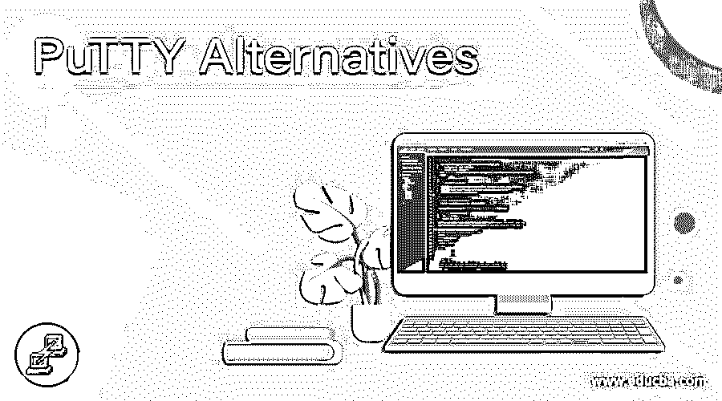

# 油灰替代品

> 原文：<https://www.educba.com/putty-alternatives/>

## 腻子替代品介绍

Putty.exe 是业界最常用的 SSH 客户端。Putty 是许多网络工程师和服务器管理员的传统默认选项，用于设置他们支持 SSH 的设备，从管理 Cisco 路由器到 VPS 或云服务器。我们最近已经看到了一些常见的 SSH/SCP 服务器，但是我们将在这篇文章中为那些需要更简单和更稳定的人讨论其中的一些替代方案。以下 Putty 替代品是导入版本的自由组合，其中一些还进行了付费更新，允许您通过 SSH 远程访问服务器。

### 腻子的替代品

让我们看看油灰的替代品

<small>网页开发、编程语言、软件测试&其他</small>

#### 1.小猫

通过许多附加组件，KiTTY 是原始 PUTTY 客户端的一个分支，是原始客户端的一个很好的替代品。KiTTY 有一些不错的功能，可以放在你的工具箱里。下面是 KiTTY 的一些特性:使用右键菜单，我们可以创建定义命令的快捷方式 Windows 注册表自动保存会话

#### 2.自作聪明

SmarTTYv3.0 在 Windows 上可用，并且可以下载。受保护的 SCS 文件传输也包含在这个基于 SSH 的终端模拟器中。几种 PuTTY 替代方法使用选项卡来允许您在同一个 GUI 面板中访问多个会话。然而，聪明人有一种不寻常的天性。这个工具的程序员把标签空间放在屏幕的右侧和底部，而不是搜索显示面板顶部的标签。当前会话中机器的目录布局显示在主终端面板左侧的索引栏中。该目录浏览器响应目录图标，允许您在文件存储中导航。

#### 3.z/范围

z/Scope 仿真终端是为在 Windows、web 浏览器和 Chromebook 上运行而编写的。该工具专门用于 IBM AS/400 链接和 Unix。这项服务不是永久的，但是 30 天的免费试用可以帮助你得到它。SSL/TLS 加密用于加密连接。z/Scope 版本有五个不同的版本，其中只有三个集成了 SSH。选项卡式界面允许两个迭代在同一个浏览器中同时查看几个会话。文件传输功能仅在 z/Scope 的 web 版本中使用。经典用户可以为添加文件传输支付额外费用。然而，可用的方法是 FTP，这是不安全的。

#### 4\. XSHELL6

XSHELL 可以在家里免费使用，还有一个高级版本可供组织使用。该工具在 Windows 上运行，因此可以与 Unix 和 Linux 等服务器连接。您可以在 SSH2 和 SSH1 之间选择安全选项。还提供 rlogin 替代方案。然而，这不提供加密，所以 SSH 会话解决方案更容易坚持。该工具帮助您通过终端访问远程计算机，并以加密格式存储定期访问的远程服务器的密码。

#### 5.iTerm2

iTerm2 框架支持 MAC。该软件将在 Mac OS 10.10 及更高版本上运行。此 GUI 允许您使用分屏系统并排平铺会话。活动面板显示全分辨率，以最大限度地减少不确定性，而其他面板则变暗。要轻松访问该工具的功能，您可以设置键盘快捷键。可以在会话窗口上部框架的搜索文本区域中扫描最新的会话文本。当输入新订单时，模拟器通常会调用之前的会话命令，并给出自动完整的反馈。

#### 6.超级财产

原始 PuTTYis SuperPuTTY 的特写副本。它只是 PuTTY 用户界面的替代品，用户界面需要安装和运行原始软件。这是一个基于 Windows 的发烧友软件，可以运行并免费下载。SuperPuTTY gui 会进行几个会话，每个链接都有一个标签页。SSH、rlogin、Telnet 和 RAW 是该程序的终端协议。SSH 是最好的选择，因为它包含了用户身份验证和加密。稳定的文件传输特性伴随着 SFTP 和 SCP 方法。

#### 7.WinSCP

WinSCPis 是 Windows 编写的文件传输实用程序。这些服务是免费的，迄今已被下载超过 1.13 亿次。它不提供在远程计算机 SCP 上发出命令的能力，SCP 是该工具所基于的协议，因此 PuTTy 替代品似乎不是理想的基础。这是一个通用的工具，它提供了比 SCP 更多的东西。该工具还涵盖了 SFTP、FTP 和 WebDAV 的部署。幸运的是，该工具为油灰替代品的研究提供了一个远程控制系统。这是一个受 SSH 保护的远程访问设备。

### 推荐文章

这是油灰替代品的指南。这里我们讨论油灰的各种替代品。您可以根据自己的需求选择任何一种。您也可以看看以下文章，了解更多信息–

1.  什么是 SFTP？
2.  [网络安全职业](https://www.educba.com/careers-in-cyber-security/)
3.  [密码类型](https://www.educba.com/types-of-cipher/)
4.  [什么是 LTE 网络？](https://www.educba.com/what-is-lte-network/)

