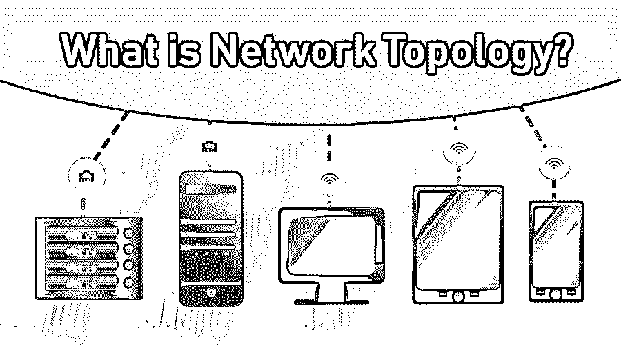

# 什么是网络拓扑？

> 原文：<https://www.educba.com/what-is-network-topology/>

## 网络拓扑介绍

[网络拓扑](https://www.educba.com/what-is-network-topology/)是计算机通信系统的组成部分的结构和排列。互联网是当今时代的关键技术，它依赖于网络拓扑结构。有几种类型的拓扑可用，例如总线拓扑、环形拓扑、星形拓扑、树形拓扑、点到多点拓扑、点对点拓扑、万维网拓扑。局域网(LAN)和广域网(WAN)是企业中安装和配置的常用网络拓扑。实施网络拓扑的一些优点是网络的正常运行、升级网络性能、降低操作、实施和维护成本、错误或故障检测、资源的有效利用。

### 什么是网络拓扑？

基本上，它是由两个词组成的，网络和拓扑。

<small>网页开发、编程语言、软件测试&其他</small>

*   **网络:**网络是两台或多台计算机(也称为节点)相互通信的一种安排。这些计算机或参与者节点积极地对通信过程做出贡献。
*   **拓扑:**拓扑就是这些节点如何相互作用的简单排列。它是一种控制各个节点之间数据流的拓扑。

因此，它是两个或多个节点相互通信的一种安排，通常通过特定的介质在互联网上进行通信。它有助于这些节点之间的通信。

**Note****:** It greatly governs how two nodes are available over the network and how each and every node communicate with each other.

### 网络拓扑的类型

大致可分为以下[种不同类型](https://www.educba.com/types-of-network-topology/)。

*   总线拓扑
*   [网状拓扑](https://www.educba.com/what-is-mesh-topology/)
*   [环形拓扑](https://www.educba.com/what-is-ring-topology/)
*   星形布局
*   树形布局
*   点到多点拓扑
*   点对点拓扑
*   万维网拓扑

#### 1.总线拓扑

*   总线拓扑是一种网络类型，其中用于通信的每个节点都连接到一条线上。
*   这条线路负责将消息从一个参与节点传输到另一个接收节点。
*   通常，这种电线被称为“主干”
*   连接线被恰当地称为主干网，因为网络的完全平稳运行依赖于主干网。
*   它有时也被称为线路拓扑。

**用途:**

*   它通常用于小型网络，如局域网。
*   这里，消息需要在有限数量的参与节点上传输。

**优点:**

*   易于使用和理解。
*   性价比高。
*   只需添加一个中继器，即可轻松扩展网络(中继器通常会增强信号，有助于传输到更远的距离)。

**缺点:**

*   一根电缆断裂就会导致总线拓扑崩溃。
*   过多的参与节点会使网络变慢。

**奖励积分:**

*   总线拓扑通常具有吸收信号的端子，从而不会发生信号的回声。
*   如果回声不受控制，那么相同的信号将来回重复。

#### 2.网状拓扑

*   顾名思义，网状拓扑通常由所有相互连接的节点组成。
*   在这里，每个节点都通过一条一对一的通信线路与其他节点相连。
*   每个节点之间有一对一的映射。

**用途:**

*   网状拓扑通常用于大型网络，其中单个节点的故障不会影响[整个网络](https://www.educba.com/introduction-to-computer-network/)。
*   它通常被当作路线、电线等中的单一故障来使用。不得妨碍完整的拓扑结构。

**优点:**

*   更好的容错能力。
*   一个参与节点或其它设备(如路由器)的故障不会影响整个网络。
*   如果两个节点之间的一条路径出现故障，则总有一条备用路径可用。

**缺点:**

*   由于有大量的参与节点，网络变得过于复杂。
*   由于建立了多条路径，成本变得很高。

#### 3.环形拓扑

*   顾名思义，环形拓扑通过连接参与者的节点形成一个环。
*   节点以这样一种方式连接，即单条线形成路径，其末端连接形成一个圆。
*   环形拓扑使用令牌概念，其中令牌与消息一起传输，以便正确传递消息。

**用途:**

*   环形拓扑通常被设计成在物理上或逻辑上形成环形网络。
*   这些环环绕校园或建筑物，形成一个高速、灵活、可靠的网络。

**优点:**

*   没有主从概念。
*   每个节点都有自己的职责。
*   可以在高容量网络中工作。

**缺点:**

*   单个节点故障会影响整个网络。
*   如果网络太大，有时很难排除故障。
*   添加或操作网络会影响其他参与者的节点。

#### 4.星形布局

*   星型拓扑通常由一个中心集线器组成。
*   每个参与者节点都直接连接到这个集线器。
*   Hub 充当中心点，从发送方节点接收消息，然后将其传输到其他参与节点。
*   节点之间没有直接连接。

**用途:**

*   星型拓扑的一般实现是以太网 10BaseT 网络。

**优点:**

*   单个节点故障不会影响整个网络。
*   只要中央集线器运行顺畅，网络就可以运行顺畅。
*   由于集中式网络大大降低了网络管理成本，因此更具成本效益。

**缺点:**

*   中央集线器的故障会破坏整个拓扑结构。
*   与总线拓扑相比，它的成本略高。

#### 5.树形布局

*   树形拓扑是一种特殊类型的网络，其中许多参与者节点连接在一起形成树形结构。
*   一般来说，有一个中央发起者节点可以比作树根。
*   这个根节点在进一步扩展时有不同的节点与之相连，这可以比作树的分支。
*   树状拓扑是总线拓扑和星型拓扑的组合。

**用途:**

*   它通常用于两个网络之间需要通信的地方。

**优点:**

*   易于扩展，因为添加新节点(叶节点)很容易。
*   叶节点可以容纳新节点，从而形成层次链。
*   如果特定节点发生故障，其他分层节点不会受到影响。
*   易于调试

**缺点:**

*   需要很长的导线来形成层级链。
*   需要大量的维护。

#### 6.点到多点拓扑

*   点对多点拓扑由一个充当发送方的节点组成，另一端是多个充当接收方的节点。
*   这种通信与点对点通信相反。

**用途:**

*   无线电频道广播或电视就是一个典型的例子。

**优点:**

*   快速的
*   当需要向大量节点广播时，容易传播消息。

**缺点:**

*   昂贵的
*   初始设置相当高。

#### 7.点对点拓扑

*   点对点拓扑由两个直接通信的节点组成。一个典型的例子是电话呼叫，其中两个节点被连接用于通信。
*   这种通信与点对多通信相反，点对多通信只有一个发送者和多个接收者。

**用途:**

*   电话呼叫双向无线电通信就是一个典型的例子。

**优点:**

*   又快又安全。
*   单个节点故障不会影响其他节点。

**缺点:**

*   昂贵的
*   维护成本高

#### 8.万维网拓扑

*   这是最流行和最广泛实现的拓扑类型之一。
*   这是一个由相互连接的[网页](https://www.educba.com/web-page-design-layout/)组成的庞大网络。
*   这些页面通常通过超链接连接。

**用途:**

*   蝶形模型和水母模型是模拟这种拓扑的两种尝试。

### 为什么我们需要网络拓扑？

*   **网络的正常运行—**为了使网络正常运行，每个节点都必须通过正确的拓扑类型与其他节点绑定在一起。实施的拓扑类型对设备的正确利用有很大影响。
*   **在网络运行中起着至关重要的作用—**为了使网络正常运行，正确发送和接收消息，选择正确的拓扑类型来实施是非常必要的。
*   **帮助我们理解网络概念—**为了更好地理解特定的网络以及通信是如何进行的，非常有必要学习和理解整个网络所基于的底层拓扑。
*   **在提升网络性能方面发挥着重要作用—**it 的正确实施可以极大地提高网络性能。性能更好的拓扑有助于稳步提高消息在网络上传输的速度。记住，网络越好，通信过程中的延迟就越小。
*   **降低运营、实施和维护成本—**正确选择要实施的拓扑类型在许多层面上都是有益的。首先，它降低了最初阶段的实施成本。甚至从长远来看，它大大降低了运营和维护成本。
*   **错误或故障检测很容易捕捉—**选择一个好的拓扑结构证明在各个方面都是有益的。即使调试或查找拓扑中的故障非常容易。
*   **资源的有效利用—**这种拓扑的良好实施也有助于正确使用网络上的每项资源。合理利用资源会自动降低运营成本。

### 这项技术将如何帮助职业发展？

当然，网络现在是一个非常热门和讨论的话题。对优秀网络工程师的需求相当高。需求大幅增长的根本原因是数字网络的发展。今天，每个公司，无论是传统的还是现代的，都在走向数字化。每个公司都对扩展其网络感兴趣。因此，需要优秀的网络工程师。

让我们简单看看网络工程师需求上升的原因。

*   **计算机网络的维护—**网络工程师最基本也是最重要的职责是正确操作网络中的数据流。它们负责快速安全的连接。
*   **网络设计—**考虑到组织的物理基础设施，网络工程师有时会负责网络的设计和布局。
*   **管理实施并保持其完整—**实施只进行一次，但保持其完整和可操作也是他的职责。

### 计算机网络中的不同角色前景

下面给出了一些重要的名称及其作用:

*   **网络管理员—**网络管理员的基本职责是根据情况需要管理和配置局域网和广域网。
*   **系统工程师—**有时被称为网络架构师，主要关注如何在两个参与节点之间进行数据通信或数据流。
*   **网络分析师—**网络分析师，通常被称为网络程序员，根据组织的需求开发计算系统。

### 结论

这是一项快速发展的技术。准确地说，不仅网络拓扑，而且整个网络都非常需要。此外，随着越来越多的组织在互联网上移动，这种需求预计还会增加。现在，即使是一个小组织或小药房也依赖互联网来完成日常计算任务。最近进行的许多调查也表明了同样的情况。到目前为止，我们希望您已经对它有了一个很好的了解，它是什么，为什么需要它，在哪里使用它，以及它的不同类型。

### 推荐文章

这是什么是网络拓扑的指南？在这里，我们讨论基本概念、需求、职业发展和网络拓扑类型及其用途、优点和缺点。您也可以浏览我们推荐的其他文章，了解更多信息——

1.  [计算机网络面试试题](https://www.educba.com/computer-network-interview-questions/)
2.  [什么是吉拉软件？](https://www.educba.com/what-is-jira-software/)
3.  [网络类型](https://www.educba.com/types-of-network/)
4.  [星形网络拓扑](https://www.educba.com/star-network-topology/)

