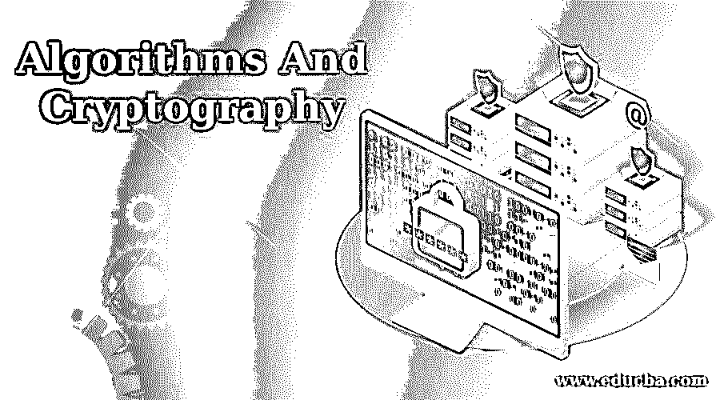
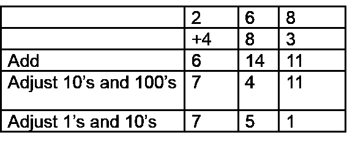
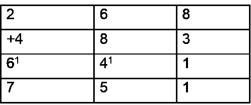
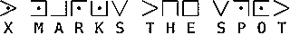

# 算法和密码学的最佳文章(示例)

> 原文：<https://www.educba.com/algorithms-and-cryptography/>

## 算法和密码学

算法和密码学是第一位的；在我开始自我吹嘘并把这篇博客变成一场无聊的单边对话之前，让我们先了解什么是算法，以及它们与密码学有什么关系。

### 算法

对于那些认为[算法只与计算机科学](https://www.educba.com/what-is-an-algorithm/)相关的人来说，你们错了。算法是解决问题的方法或公式。当我说问题时，它可以是任何类型的问题，可能是数学、科学公式，甚至是基于计算机的问题。让我给你一个简单的

<small>网页开发、编程语言、软件测试&其他</small>

**举例:**

(A+b)2= A2+2ab+b2

**或者可以像:**

应计金额=本金(1+R . o . I * 100 *时间)

是啊！凡是是公式的都可以当作算法。算法是一套解决问题的规则，如果处理得当，每次都会给出正确的答案。算法一般涉及一遍又一遍地重复一系列步骤，比如在借代和进位[算法](https://www.educba.com/algorithm-in-programming/)和长乘法和除法算法中。算法包括各种加减乘除。

但是在你开始认为我在这里上某种数学课之前，让我告诉你我不是。我在这里谈论与计算机科学相关的算法和密码学。但在我继续之前，让我给你一些简单算法的例子。

这些例子是为那些一生中从未做过任何算法工作的新手准备的。因此，如果你认为你足够聪明，你可以跳到密码学的下一部分，在进入下一个层次之前，我将再次介绍一些基础知识。

所以，这里有几个加法算法的例子，这会让你从现在开始，对算法有一个概念。让我们从基础数学开始:

#### 从左到右加法算法

从左边开始，逐列添加，并调整结果。  

对于一些人来说，这个过程变得如此自动，以至于他们从左边开始，一列一列地写答案，并在进行中进行调整，而不需要写任何中间步骤。如果让他们解释，他们会这样说:

 

200 加 400 是 600，但是(看下一列)我需要调整一下，所以写 7。那么，60 和 80 是 140，但这需要调整，所以写 5。现在，8 加 3 等于 11，不用做了，写 1。这种技巧很容易从操作经验中发展出来，例如十进制积木和钱，以及交换或交易游戏，并且与为阅读和写作而学习的从左到右的模式相一致。

现在有些人在读到这些时可能会发疯。所以，你可能需要谷歌一下这些东西，以确切了解这里到底发生了什么。

### 算法和密码学的密码学

密码学是以非人类可读的方式编写代码的艺术。它是一种以特定的形式存储和传输数据的方法，以便只有它的目标用户才能读取和处理它。你可以说密码学是密码学和密码分析学科的近亲。

密码术包括诸如微点、将文字与图像合并以及其他在存储或传输中隐藏信息的方法等技术。然而，在当今以计算机为中心的世界中，密码学通常与将明文(普通文本，有时也称为明文)加扰为密文(这一过程称为加密)然后再还原(称为解密)相关联。从事这个领域的人被称为密码学家。

加密技术已经使用了几千年。以下代码和密码可以学习并用于手动加密和解密消息:

#### 单字母密码

单字母密码在整个消息中使用相同的替换。例如，如果您知道字母 A 被加密为字母 K，这将适用于整个消息。这些类型的信息可以通过使用频率分析、有根据的猜测或试错法来破解。

**1。凯撒密码**

凯撒密码是最简单(也最容易破解)的加密方法之一。替换密码是用字母表中不同的字母替换秘密信息中的每个字母，这个字母在字母表中的位置是固定的。

因为信息中的每个字母直接翻译成另一个字母，频率分析可以用来破译信息。例如，字母 E 是英语中最常用的字母。

因此，如果秘密消息中最常见的字母是 K，那么 K 很可能代表 e。此外，常见的单词结尾如 ING、ly 和 ES 也提供了线索。一种尝试所有 25 种可能组合的强力方法也可以破译信息。

在这个例子中，明文消息中的每个字母在字母表中向下移动了 3 个字母。

*   **明文** : *这是一条秘密消息*
*   **密文** : wklv lv d vhfuhw phvvdjh

**2。Atbash 密码**

Atbash 密码是替换密码的一个特例，其中字母是颠倒的。换句话说，所有的 a 都换成 Zs，所有的 b 都换成 Ys，以此类推。

因为颠倒字母表两次将得到实际的字母表，所以可以使用完全相同的算法对信息进行加密和解密。

**举例:**

*   **明文** : *这是一条秘密消息*
*   **密文** : Gsrh rh z hvxivg nvhhztv

关键字密码与凯撒密码相同，只是使用的替换字母表可以用关键字来表示。

要从关键字创建替换字母表，首先要写下字母表。在这下面，你写下关键字(省略重复的字母)，然后是字母表中剩余的未使用的字母。

*ABCDEFGHIJKLMNOPQRSTUVWXYZ*

*keyword cfghianmqstuvxz*

要对明文信息进行加密，你需要将上面一行的所有字母转换成下面一行的相应字母(A 到 K，B 到 E，等等)。).

使用频率分析和一些有根据的猜测可以很容易地破解这些类型的简单替代密码。

**4。猪圈/共济会密码**

猪圈密码(有时称为共济会密码或共济会密码)是一种简单的替代密码，根据网格将字母替换为符号。该方案是由共济会在 18 世纪早期开发并用于记录和通信。示例键显示了将字母分配给网格的一种方式。

 

#### 多字母密码

在多字母密码中，替换可能在整个消息中改变。换句话说，对于消息的一部分，字母 A 可能被编码为字母 K，但是稍后，它可能被编码为字母 w。

**推荐课程**

*   XML 培训
*   CCNA 考试培训课程
*   [完成 UNIX & Linux OS 培训](https://www.educba.com/software-development/courses/linux-training-certification/)
*   HTML 5 培训包

**1\. Vigenere Cipher**

在凯撒密码中，字母表中的每一个字母都随着一定数量的位置移动；例如，在移位 3 的凯撒密码中，A 会变成 D，B 会变成 E，依此类推。Vigenere 密码由具有不同移位值的几个连续的凯撒密码组成。

为了加密，可以使用一个字母表，称为 tabula recta、Vigenere square 或 Vigenere table。它由在不同行中书写 26 次的字母表组成，每个字母表与前一个字母表相比循环地向左移位，对应于 26 种可能的凯撒密码。在加密过程的不同点上，密码使用不同于其中一行的字母表。每个点上使用的字母表取决于一个重复的关键字。

例如，假设要加密的明文是:

*攻击黎明*

发送消息的人选择一个关键字并重复它，直到它与明文的长度匹配，例如，关键字“LEMON”:

lemonlemole

通过在网格中寻找明文字母和关键字字母之间的交叉点来对每个字母进行编码。例如，明文的第一个字母 A 使用行 L 中的字母表进行加密，这是密钥的第一个字母。这是通过查看 Vigenere 正方形的 L 行 A 列中的字母，即 L 来完成的，同样，对于明文的第二个字母，使用密钥的第二个字母；E 行 T 列的字母是 x，其余的明文以类似的方式加密:

*   **明文**:攻击黎明
*   **键**:lemonlemole
*   **密文** : LXFOPVEFRNHR

在表格的一行中找到密文字母的位置，然后将它出现的列的标签作为明文执行[解密](https://www.educba.com/what-is-decryption/)。例如，在行 L 中，密文 L 出现在列 A 中，列 A 作为第一个明文字母。在表格的 E 行查找 X 解密第二个字母；它出现在 T 列中，被当作明文字母。

Gronsfeld 密码与 Vigenere 密码相同，只是只使用了 10 行，这允许关键字是数字而不是单词。

### 算法和密码学的隐写术

隐写术实际上是一门向窥探你的人隐藏信息的科学。这和加密的区别在于，潜在的偷窥者可能一开始就不知道有任何隐藏的信息。

例如，图片文件中通常有大量未使用的空间。这个空间可以用来发送隐藏的信息。如果你做加密研究，你可能会看到有时使用的术语[隐写术](https://www.educba.com/what-is-steganography/)。然而，它不是真正的加密(尽管它仍然非常有效)，因此，我在这里提到它只是为了完整。

所以，基本上，如果你想开始练习密码学，最好的方法是开始解决算法和密文以及隐写术。即使隐写术可能看起来很容易，而且它不是真正的加密，但当涉及到基础知识以及当您需要在很短的时间内以最好的方式编码时，它仍然是最常用的加密方法之一。

### 推荐文章

这里有一些文章可以帮助你获得更多关于算法和密码学的细节，所以只要浏览一下链接就可以了。

1.  [数据结构与算法面试题](https://www.educba.com/data-structures-and-algorithms-interview-questions/)
2.  [算法面试问题](https://www.educba.com/algorithm-interview-questions/)
3.  [学习算法](https://www.educba.com/learning-algorithms/)
4.  [数据结构和算法](https://www.educba.com/data-structures-and-algorithms/)

