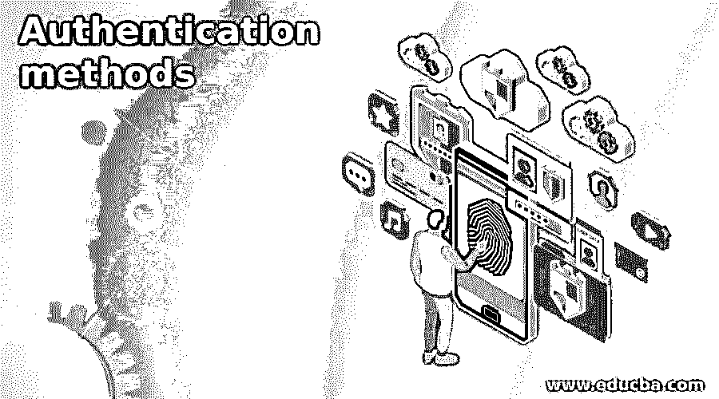

# 认证方法

> 原文：<https://www.educba.com/authentication-methods/>

## 身份验证方法简介

身份验证方法对于验证用户非常重要。这是任何处理用户数据或我们想要保护的任何受保护资源的应用程序的第一步。有许多方法和类型的身份验证可用于保护我们的资源。我们可以在许多社交网站和另一个平台上看到这种类型的用户安全，这确保了我们的数据不受外界影响。我们不能依靠密码来保护资源，现在我们有各种类型的身份认证方法可以使用，包括在线和物理方式，或者通过电子邮件、SWM 或令牌对用户进行身份认证，我们有更多可用的形式。在本教程的下一节中，我们将更深入地了解各种不同的身份验证方法，这些方法可以保护我们的资源免受外界的影响。

**认证方式的优势:**

<small>网页开发、编程语言、软件测试&其他</small>

1)它帮助我们验证用户访问。

2)它帮助我们保护我们的数据不受外界影响。

3)我们可以进行在线身份认证，也可以进行物理身份认证。

4)我们可以通过 OpenID connect 认证用户。

### 认证方法

在本节中，我们将详细讨论各种身份验证方法，以便初学者更好地理解它，所以让我们从每种方法开始吧

#### 1.多因素认证

首先，我们将详细讨论 MFA，即多因素身份认证，在这种类型的身份认证中，用户需要对自己进行多次身份认证，这意味着可以通过智能手机、任何令牌、验证码等进行身份认证。我们可以有许多多因素身份认证来对用户进行身份认证。此外，我们可以使用电子邮件来验证用户。这可以通过向用户注册的电子邮件 id 发送电子邮件来完成，他们必须验证它，一旦这个过程成功，用户就被允许访问资源。简而言之，它为用户资源增加了多层安全保护，让用户对自己的数据充满信心。

**优势:**

1.  a)它有助于通过认证机制的不同层来保护用户数据

**劣势:**

1.  a)如果手机丢失，可能会导致问题
2.  b)在这种情况下，他们将无法生成令牌或数字来进行身份验证。

#### 2.基于密码的认证

我们可以使用这种类型的身份验证过程来验证用户，这是最常见的，但不太安全，因为它只是根据用户提供的密码来更新用户，用户不需要额外的身份验证。密码 cerate 使用特殊字符，字母数字和许多。此外，它们可以是英尺字母等的组合。因此，我们始终建议使用不包含您的姓名、出生日期等信息的密码，并使用未指定信息的任意组合来增强密码的安全性。因此，这不是保护我们的数据不受外界影响的最佳方式。在这种情况下，人们总是为他们在网上拥有的帐户类型设置相同的密码，这可能会导致严重的问题，人们这样做是很难记住密码的。

让我们仔细看看这种身份验证的一些优点和缺点，详见下文；

**优势:**

a)容易记忆

b)不需要额外的认证来验证用户

c)不需要关心令牌

**劣势:**

a)基于密码认证非常不安全

b)我们的数据没有受到足够的保护，不会受到在线攻击

c)如果密码很简单，那么黑客可以通过尝试所有可能的组合很容易地猜出它们

#### 3.生物认证

让我们仔细看看这种称为“生物认证”的身份认证，顾名思义，它完全依靠个人的生物外貌或特征来进行身份认证。政府和私人组织使用的这种身份验证方法有助于他们轻松验证任何用户。生物认证进一步深入到更多的类型让我们来看看每一个细节，以便更好地理解见下文；

a)面部表情:在这种类型中，他们试图将面部的不同特征与允许获取资源的个人相匹配。这项技术可以防止欺骗。

b)指纹:顾名思义，它试图匹配手指的不同特征，以允许访问受保护的资源。这也是最安全的方式之一。

c)眼睛扫描仪:在这种类型的认证方法中，他们试图通过扫描仪对视网膜和虹膜进行重组来允许用户访问特定的资源。

#### 4.基于令牌的认证

在这种类型的身份验证中，我们为 see 生成一个令牌来访问任何资源。让我们了解一下这是如何工作的，首先，我们必须输入我们的凭据，然后它会尝试从中生成一个令牌，这个令牌是加密的。这个令牌是一长串随机字符。因此，我们可以使用这个令牌来访问一个资源，它表明您已经获得了对这个资源的访问权，并准备好使用它。我们不需要反复输入我们的凭据。但是这个令牌有一个过期时间，一旦令牌过期，我们需要生成新的令牌才能再次访问。这再次通过输入用户的凭证使用相同的过程来生成。

**优势:**

1.  它提供对资源的长期访问。
2.  不需要反复输入凭证。

### 结论

因为我们已经看到了这么多的认证方法来保护我们的资源，我们可以根据我们的需要和数据的隐私程度来选择其中的任何一种。所有的方法都很容易开发，并很容易与我们现有的任何语言集成，并为开发人员提供良好的在线支持。

### 推荐文章

这是认证方法指南。在这里，我们讨论不同的认证方法类型，以保护我们的资源免受外部世界的影响。您也可以看看以下文章，了解更多信息–

1.  [认证类型](https://www.educba.com/authentication-typesauthentication-types/)
2.  [Vue.js 认证](https://www.educba.com/vue-js-authentication/)
3.  [ASP.NET 认证](https://www.educba.com/authentication-in-asp-dot-net/)
4.  [烧瓶认证](https://www.educba.com/flask-authentication/)

