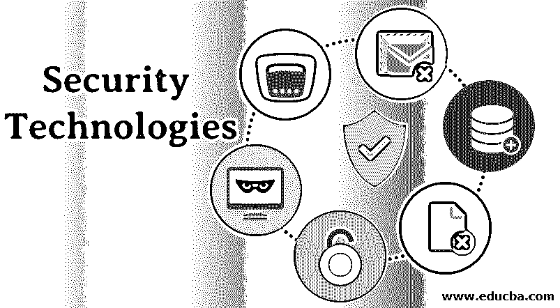

# 安全技术

> 原文：<https://www.educba.com/security-technologies/>

## 安全技术简介

下面的文章“安全技术”为您提供了安全领域最常用技术的概要。我们都知道互联网发展的速度。对于我们不得不旅行或长时间排队的一切，互联网让我们变得很容易，现在几乎所有的东西都在我们的指尖上。简单地说，我们可以说，没有互联网的一天是不容易想象的。众所周知，任何事物都有正反两面，互联网也是如此。随着互联网使用的快速增长，组织中发生的攻击也在增加。对于当代企业或组织来说，保护他们的身体免受网络攻击已经成为一种新的挑战。在这里，我们将讨论可用于保护组织免受网络攻击的技术，以便其运营流程保持顺畅。

### 安全技术

为了保护组织免受[网络攻击](https://www.educba.com/what-is-cyber-attack/)，有几种技术可以用来对抗它们。

<small>网页开发、编程语言、软件测试&其他</small>

以下是组织中经常使用的一些常用技术。

#### 1.数据丢失预防

数据丢失防护可以定义为与验证从组织发出的数据是否敏感到足以阻碍业务发展有关的技术。通常，数据通过电子邮件发送，在这种技术下，邮件受到监控，以确保不会将机密数据带出组织。凭借这项技术，所有电子邮件及其附件都受到严密监控，以确保发送到组织外部的所有数据都是适当的，而不是机密的。

#### 2.入侵检测系统

入侵检测系统(IDS)可以定义为监控所有进入组织的流量以确保这些流量不是恶意流量的技术。它也可以被视为一种工具，负责检查流量，并在发现恶意流量或流量似乎来自不可信来源时发出警报。这项技术主要关注的是提供流量的近距离视图，以确保组织应该允许它进入。

#### 3.入侵防御系统

[入侵防御系统](https://www.educba.com/types-of-intrusion-prevention-system/) (IPS)可以定义为对被 IDS 标记为恶意的流量采取行动的技术或工具。通常，IPS 会丢弃进入系统的被认为不可信的数据包。它是确保恶意流量不会进入组织网络的主要保护点。IPS 负责确保进入系统的所有流量都符合组织制定的策略，以免以任何方式影响系统的工作。

#### 4.安全事故和事件管理

它也被称为 SIEM。它主要关注的是一旦在组织的网络上发现任何异常情况，就发出警报。一些工具可以集成到 SIEM 中，以确保任何恶意行为都会生成警报，以便安全团队可以采取措施来应对，并保护内部环境。它还跟踪生成的日志，同时确保网络的安全性。它也可以被认为是一个中央系统，有其他工具与之相连。所有的工具都以各自的方式保护网络。

#### 5.防火墙

防火墙是任何系统或网络的第一层保护。基于角色，防火墙有多种[类型。为了保护互联网，使用网络防火墙，而为了保护 web 应用，有 web 应用防火墙。开发这种技术是为了确保内部网络免受异常流量的影响，没有任何恶意流量可以进入内部网络。该技术确保端口只对适当的通信开放，而不受信任的数据无论如何也不会攻击系统。防火墙可以允许流量进入，或者可以配置端口过滤，以确保通过它的所有流量对于任何特定端口上运行的服务都是有用的，](https://www.educba.com/types-of-firewall/)

#### 6.抗病毒素

反病毒是另一种用于网络安全的技术。顾名思义，它保护系统免受病毒侵害。病毒只不过是使主机或网络采取意外行动的恶意代码。它部署在网络中，也可以用作端点保护。所有连接到网络的设备都可以安装防病毒软件来保护自己免受病毒攻击。为了检测特定文件是否是病毒，反病毒程序使用该反病毒程序的存储库中存在的签名。最新的防病毒软件能够利用异常情况来检测病毒并采取相应措施。

### 结论

伴随着互联网的使用，与之相关的风险也在增长。如今，为了满足业务需求，web 应用程序或网络的体系结构应该是复杂的，而高复杂性也增加了系统被攻破的机会。为了确保系统免受任何安全事故的影响，组织应该认真采取所有措施，并使用技术来保护他们的系统。另一方面，复杂或高水平的安全漏洞也催生了高效的网络安全技术或工具，它们是确保系统安全的强大力量。这些工具可以用来保护系统，保持业务流程顺畅，并帮助企业专注于其运营，而不是继续关注其安全性。

### 推荐文章

这是安全技术指南。在这里，我们讨论了组织中经常使用的一些常见技术的基本概念。您也可以浏览我们推荐的其他文章，了解更多信息——

1.  [网络安全的类型](https://www.educba.com/types-of-cyber-security/)
2.  [安全测试工具](https://www.educba.com/security-testing-tools/)
3.  [网络安全框架](https://www.educba.com/cybersecurity-framework/)
4.  [什么是网络安全？](https://www.educba.com/what-is-network-security/)

