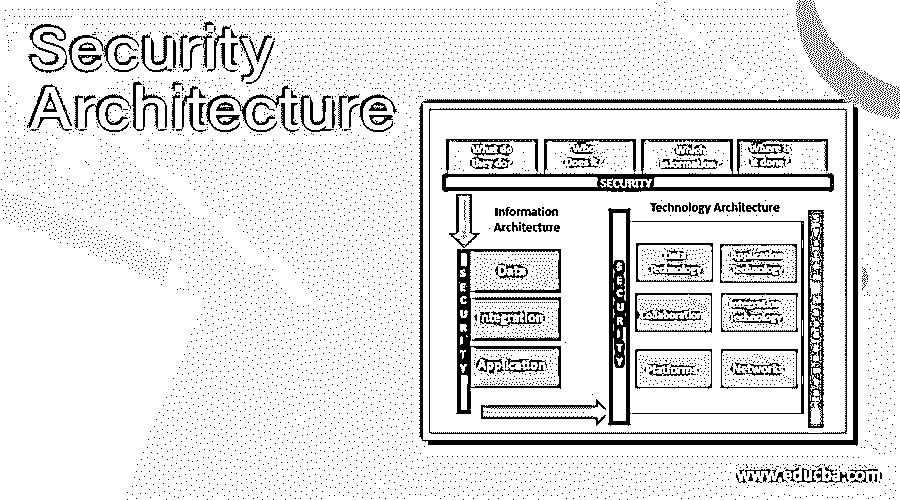
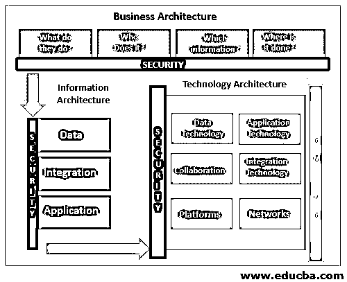

# 安全架构

> 原文：<https://www.educba.com/security-architecture/>

## 安全架构介绍

安全体系结构被定义为包括环境或特定场景中可能存在的所有威胁和潜在风险的体系结构设计。这也包括安全控制和安全控制的使用。对于安全体系结构，完成了适当的文档，包括所有的安全规范和关于体系结构的所有详细信息。组织使用他们的系统，使用它主要是因为该体系结构经济实惠且经济高效，并且组织可以轻松使用。

### 带图表的安全架构

这被定义为企业架构的一部分，是专门为解决信息系统和满足组织的安全需求而设计的。系统架构系统的作用是满足安全要求，并有助于保护公司的运营环境。这对公司是有益的，因为它包括其他活动，如需要持续改进的风险管理活动，并且安全架构有助于满足组织的需求。它定义了需要在组织中加强的适当的政策、规则和条例，并提供了关于它们的适当信息。该架构还用于分配技术安全控制，以便组织的信息系统能够得到适当维护。由于整个组织都可以遵循相同的规则，因此为每个员工定义通用的规则和标准有助于每个人都遵守规则并维护组织中数据的完整性和安全性。

<small>网页开发、编程语言、软件测试&其他</small>

在上图中，显示了系统架构的高层设计。这里给出了抽象。

### 安全架构的组件

为了使安全体系结构变得重要，设计中涉及了某些组件。组成部分是人员、流程和工具。所有这些组件结合起来有助于保护组织资产。定义组件后，下一步是制定策略和策略的强化技术。在其他重要步骤之后，是实现安全体系结构的方法和过程，以及如何实施该体系结构。这样，整体设计和体系结构是为组织设计的，可以在整个业务运营过程中保护他们。对于适当的安全体系结构，我们将简要讨论一些组件:

#### 1.指导

应该正确设计和实施作为指导的政策和程序。策略应包括文档，其中包含为组织设计体系结构、标准、策略、规则和法规的目的和目标，范围和功能的确定，以及其他安全策略的确定。

#### 2.身份管理

它是一种包括组织流程、技术和政策的系统，直接帮助用户访问在线应用程序和其他网络资源。对于组织来说，需要明确规定适当的职责和角色，并且需要为员工设计个人任务。

#### 3.包容与排斥

其他组件是包含和排除，包括保护公司资源的组织元素的安全性。公司资源包括网络资源、电子邮件服务器、私人人力资源数据和其他报告系统信息。应该只将访问权限授予授权用户，以便维护组织中的隐私和完整性。

#### 4.出入和边境管制

组织应该开发一种能够控制对业务资源的访问的体系结构，并且可以使用层系统为公司员工提供访问。只有经过授权的用户才能获得对系统的完全访问权限，而其他用户只能获得对系统的有限访问权限。

#### 5.架构验证

随着技术的进步，公司需要根据变化更新政策和法律，组织需要在这种变化中不断努力。为此，需要持续的监控，并据此对架构进行适当的更改。

#### 6.培养

对于组织来说，要维护隐私和完整性，安全架构系统是非常重要的。随着系统的不断变化，员工了解这些变化并接受适当的培训变得非常重要，这样他们就可以使用系统并保护公司的资产和元素。

#### 7.技术

为了加强安全体系结构，用于构建体系结构的软件和硬件对组织来说变得非常重要。由于技术的不断变化，要求系统不断变化，以便系统可以是最新的，并有助于使系统安全和保密。

### 使用安全架构的好处

下面提到了一些好处。

*   帮助保护重要的公司资产免受外部攻击，并为组织的重要资源提供安全保护。该体系结构为用户提供了有限的访问权限，从而可以保证机密数据的安全。
*   该体系结构定义了公司每个员工都可以使用的通用策略和标准，还定义了通用规则，以便任何人在使用该系统时都不会遇到任何困难。它有助于组织实现其目标，并轻松顺利地开展业务运营。
*   另一个好处是架构所涵盖的风险管理活动，因为风险管理活动需要持续的协助，也需要持续的改进，安全架构为他们提供了更好的解决方案。

### 结论

安全体系结构是企业体系结构的一种类型，对于组织保护公司资源免受外界影响非常重要。组织使用强大的安全架构来维护系统中的安全性和数据完整性，并且组织的员工遵循系统定义的策略和规则。

### 推荐文章

这是安全架构指南。在这里，我们还将讨论安全体系结构的介绍和组件以及好处。您也可以看看以下文章，了解更多信息–

1.  [QlikView 架构](https://www.educba.com/qlikview-architecture/)
2.  [Magento 建筑](https://www.educba.com/magento-architecture/)
3.  [春天的建筑](https://www.educba.com/spring-architecture/)
4.  [J2EE 建筑](https://www.educba.com/j2ee-architecture/)

