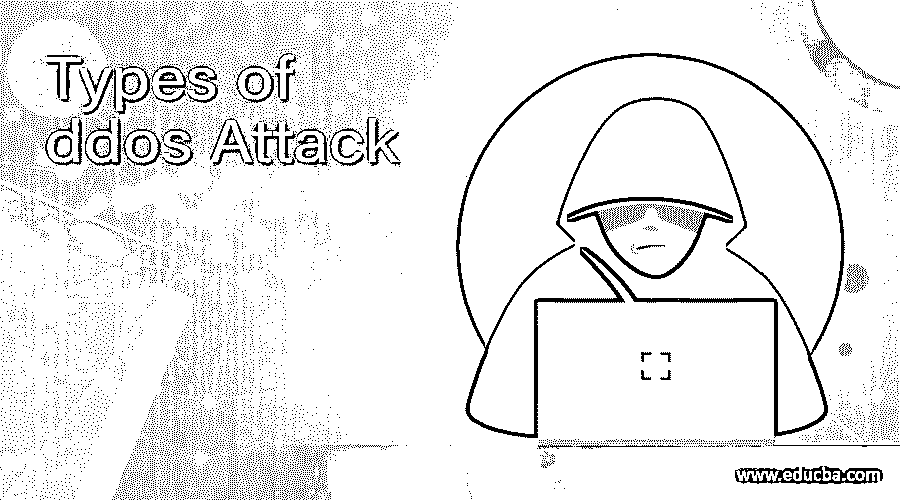

# ddos 攻击的类型

> 原文：<https://www.educba.com/types-of-ddos-attack/>

## ddos 攻击类型介绍

OSI 模型是揭示 DDoS 攻击类型的完美例子。OSI 层分为 7 种类型，根据它，不同类型的攻击属于 OSI 层的不同级别。由于所有的 DDoS 攻击都涉及目标基础或流量网络，因此攻击被分为三类，即应用层攻击、协议攻击和容量攻击。根据目标向量，攻击者计划使用一种或多种方法。

DDoS 攻击用于暂停在线服务，使最终用户无法使用这些服务。

<small>网页开发、编程语言、软件测试&其他</small>

### DDoS 攻击有哪些类型？

DDoS 攻击分为几种类型:

1.  应用层攻击
2.  协议攻击
3.  体积攻击

下面列出了一些常见的 DDoS 攻击:

1.  UDP 泛洪
2.  ICMP 洪水
3.  合成洪水
4.  死亡之平
5.  NTP 扩增
6.  HTTP 洪水
7.  Slowloris

### 解释 DDoS 攻击的不同类型？ **T2】**

1.  **应用层攻击**有时被称为第 7 层攻击，旨在破坏目标区域的可用资源。DDoS 攻击主要发生在通过请求创建和传输网页的领域(HTTPS)。客户端的 HTTP 请求可能太小，但服务器的响应可能太大，因为它可能包含多个文件和查询来构建网页。大多数情况下，这种类型的攻击很难保护，因为流量可能会被确定为恶意流量。

HTTP flood 就是一个例子，它在许多系统上的 web 引擎浏览器中一次又一次地应用按钮，使服务器发出大量请求，并对用户造成拒绝服务。HTTPS 洪水攻击的范围从一个到多个，即简单的实现访问一个 URL，复杂的实现使用攻击 IP 地址访问多个 URL。

2.  **协议攻击**主要利用协议栈的第 3 层和第 4 层，使目标不被访问。这些攻击消耗了 web 服务器和防火墙等的状态容量。

下面是一个 SYN Flood 的例子，其中请求没有得到响应，进程仍在继续。例如，供应室的工人从库房外得到一个包裹的请求。听到这个消息后，工人去拿包裹，等待最后的确认，然后把包裹从仓库里拿出来。当工人收到更多请求且没有确认时，流程没有得到响应，等待最后一步结束。

3.  **批量攻击**消耗使用目标和互联网网络的带宽。为了成功实施这种攻击，攻击者会使网站溢出恶意流量。这将导致合法流量的中断，并导致拒绝服务。

下面提到了一些 DDoS 攻击:

1.  UDP 或用户数据报协议是一种 DDoS 攻击，它是通过将大量 UDP 数据包转发到其他端口而发起的。远距离主机将相应地回复如下:

*   检查应用程序或没有应用程序监听该端口。
*   用 ICMP 数据包回复
*   通常，UDP flood 攻击工具有两种类型:低轨道离子炮和 UDP unicorn
*   可以通过在终端网络实施防火墙来过滤恶意流量，从而应对这些攻击。它使用具有静态或随机互联网协议地址的数据包攻击终端网络。

2.  ICMP Flood 或 Ping Flood 遵循与 UDP Flood 相同的原理，是一种常见的 DDoS 攻击，攻击者通过不断发送被称为 Ping 的请求来破坏受害者的系统。有几个 ping 命令，如 n、l、t，其中 n 命令是发送请求的次数，l 命令告诉我们数据包中发送的数据量，t 命令用于 ping 数据。
3.  TCP SYN Flood 是一种 DDoS 攻击，其中客户端和服务器建立三方握手，如下所述:

首先，客户端通过向服务器端发送 SYN 消息来请求连接。一旦服务器接收到连接请求，它就向客户机发回一条确认消息，客户机对此作出接受响应，从而建立了连接。

在这里，攻击者向服务器发送连续的消息(SYN ),大部分是虚假的 IP 地址。服务器收到未知数量的连接请求。无论哪种方式，受到恶意请求攻击的服务器都会发送确认，但它会等待来自客户端的确认。

4.  Slowloris 是一种高级攻击，在这种攻击中，一台服务器会关闭其他服务器，而不会妨碍同一网络上的服务。顾名思义，Slowloris 通过只发送部分请求来创建与目标服务器的连接。服务器保持此连接打开，稍后会溢出并导致拒绝服务。
5.  那些攻击者主要集中于由于某种意识形态、勒索、商业竞争等而发起的攻击。
6.  零基础 DDoS 攻击包括未知攻击，并且不会留下任何补丁。

### 结论

DDoS 攻击一直是目标服务器面临的一个挑战，因此需要制定解决方案。DDoS 攻击正在演变为一种网络威胁，并且侧重于短期目标持续时间。为了防范这些攻击，我们需要在网络外部构建解决方案，只有真正的流量经过过滤后才能进入。它不仅应该过滤掉威胁，还应该检测到威胁，并为这些攻击提供补救措施。DDoS 攻击是一种威胁，因为防火墙和路由器无法阻止这些攻击和恶意流量。

### 推荐文章

这是一个 ddos 攻击类型的指南。在这里，我们讨论了 DDoS 攻击的类型，并解释了它们的不同类型。您也可以看看以下文章，了解更多信息–

1.  [DDos 攻击缓解](https://www.educba.com/ddos-attack-mitigation/)
2.  [什么是 DDoS 攻击？](https://www.educba.com/what-is-ddos-attack/)
3.  [拒绝服务攻击](https://www.educba.com/denial-of-service-attack/)
4.  [DNS 放大攻击](https://www.educba.com/dns-amplification-attack/)

