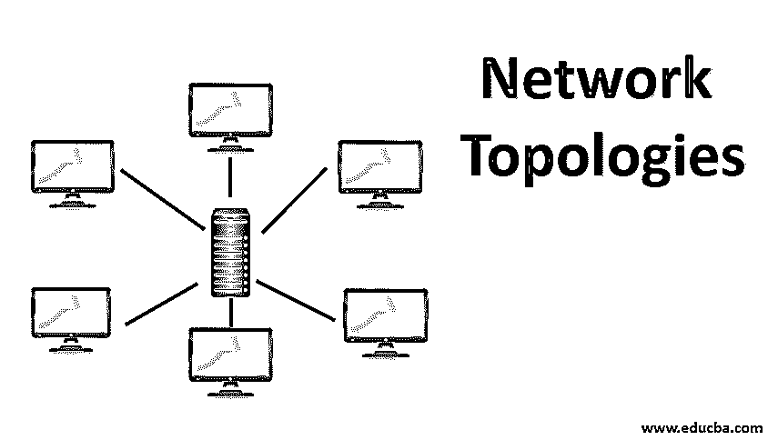

# 网络拓扑

> 原文：<https://www.educba.com/network-topologies/>

## 网络拓扑简介

网络拓扑是一种基于几个强制性参数来设置网络设计的技术，这些参数即节点或设备的物理位置、通过连接模式的所需数据流、节点、集线器、交换机和/或路由器之间的布线或电缆连接原型等。各种类型是“点对点”、“网状”、“总线”、“星形”、“环形”和“混合式”，其中网状还有两种网络，如“全网状拓扑”和“部分网状拓扑”。网状网络的另一个显著特点是传输方法，如路由方法和洪泛方法

网络设计涉及关键参数，如:

<small>网页开发、编程语言、软件测试&其他</small>

*   计算机/设备(节点)的物理位置。
*   描述数据的节点之间的逻辑连接。
*   节点与[网络设备](https://www.educba.com/types-of-network-devices/)如集线器/交换机/路由器之间通过电缆/电线/光纤等传输介质的物理连接。
*   网络管理参数，如控制/容错级别。
*   应用需求和用户期望。

组织的网络拓扑由上述参数决定。首先，我们将了解什么是网络拓扑。

### 什么是网络拓扑？

网络拓扑是网络的蓝图，描述不同计算机/设备的互连方式以及它们之间的通信方式。它解释了节点连接的各种方式，例如:

*   节点一个接一个地连续放置。
*   每个节点都与所有其他节点啮合。
*   所有节点都通过一个公共设备(集线器或交换机)它们是逻辑的和物理的。

**逻辑方面:**它突出了节点之间的数据流或信号流的路径，并且它独立于物理连接。

**身体方面:**

*   节点的地理位置和它们之间的距离。
*   有线或无线。
*   传输介质，如同轴电缆、电线和光纤。
*   信号类型。
*   传输速率。

两个相同的网络拓扑可能在物理方面有所不同，如节点之间的距离、物理连接、传输速率和信号类型。网络的逻辑和物理拓扑不必相同。此外，让我们分析网络的各种拓扑结构。

### 网络拓扑的类型

计算机网络中有几种[类型的拓扑](https://www.educba.com/types-of-network-topology/)可用，组织必须根据其需求和预算选择正确的类型:

#### 1.点对点

两个节点通过专用链路连接，该平台提供了一种简单方便的通信方式。它是根据需要动态建立的，主要用于电话网络，通过电路交换技术连接呼叫方和接收方。这样做的好处是在建立连接之后，节点之间的连接不会中断。

#### 2.网状物

该网络中的每个节点都以[点对点](https://www.educba.com/point-to-point-topology/)(非分层)模式直接连接到所有其他节点。如果有 n 台计算机，则该网络中的链路数是(n–1)的阶乘，即 n*(n-1)/2。

在这个网络中，数据传输有两种方式。

*   **路由:**该拓扑中的每个节点都有一个路由逻辑，绕过通过该路由发生的到接收方的错误数据传输，根据到接收方的最短距离到达接收方的最佳路由。
*   **洪泛:**在没有任何路由逻辑的情况下，要发送到接收者的数据被发送到网络中的所有节点，并且接收者选择尽管它提供了一种健壮且可靠的数据传输方法，但是网络上的负载通常很高。

有两类网状拓扑。

*   **全网状拓扑:**全网状用于关键主干，它提供冗余，但成本较高。
*   **部分网状拓扑:**与全外围网络通常通过部分网状连接不同，一些节点并不连接到所有节点，它们通过全网状主干连接。

#### 3.公共汽车

在总线拓扑中，所有单个节点通过引入线连接到总线，并用一根中心电缆(双绞线、同轴电缆)分接。所有通信都通过这条公共总线发送，连接在总线上的每个节点都接收它们，而实际的接收器只处理它们。为了避免不必要的干扰，中心电缆的端点用一种叫做终端器的装置封闭。

线性总线拓扑有一个带有两个端点的公共总线，而分布式总线拓扑通过向主网络添加分支而具有两个以上的端点。总线拓扑易于设置/配置，并且由于布线较少而更便宜。故障节点不会影响性能，而中心节点的故障会影响网络。

#### 4.星星

在这种拓扑结构中，公共网络设备集线器或交换机通过 UTP、同轴电缆或光纤介质将所有节点连接到其中心。任何通信都被发送到中央设备，反过来，它将消息转移到正确的接收器。中央集线器负责其节点之间的数据传输，监控节点的整体性能，检测任何故障并向管理员发出警报。在这个网络中可以很容易地添加新的节点。[星型拓扑网络](https://www.educba.com/star-network-topology/)易于安装和管理，但价格昂贵。中央集线器的故障会影响整个网络。

#### 5.戒指

在这个网络中，每个节点以环的形式与另外两个节点相连，以此类推。UTP 电缆被用作传输介质。来自一个节点的任何通信以顺时针方向传输到它的下一个节点，并重复直到它到达正确的接收器。它可以被解释为一个扩展的总线拓扑，其两端是环形的。

数据分组作为令牌从一个口袋传递到另一个口袋，并且没有数据冲突，并且令牌传递环形网络在高流量下比总线网络表现得更好。不需要控制或监视，因为每个节点都具有相同的功能。一个节点的故障会完全影响网络。这种拓扑用在电信网络中，并且网络中的通信也可以是双向的。

#### 6.混合物

大型混合网络是由多个异构拓扑组合而成的，这种网络具有累积的特性和功能。维护**比较复杂。**

### 优势

以下是网络拓扑的优势:

*   在网络运行中起着重要的作用。
*   增强网络的性能及其可管理性。
*   通过优化网络设备和电缆的使用来降低网络项目成本。
*   节省运营和维护成本。

### 结论

部署正确类型的网络拓扑有助于组织有效利用网络资源并提高网络性能。这将增强最终用户的体验，并增加其顶线和底线。

### 推荐文章

这是网络拓扑的指南。这里我们分别讨论网络拓扑的简要概述、各种类型和优点。您也可以浏览我们的其他相关文章，了解更多信息——

1.  [网络协议的类型](https://www.educba.com/types-of-networking-protocols/)
2.  [网络类型](https://www.educba.com/types-of-network/)
3.  [什么是网状拓扑？](https://www.educba.com/what-is-mesh-topology/)
4.  [混合网络拓扑](https://www.educba.com/hybrid-network-topology/)

