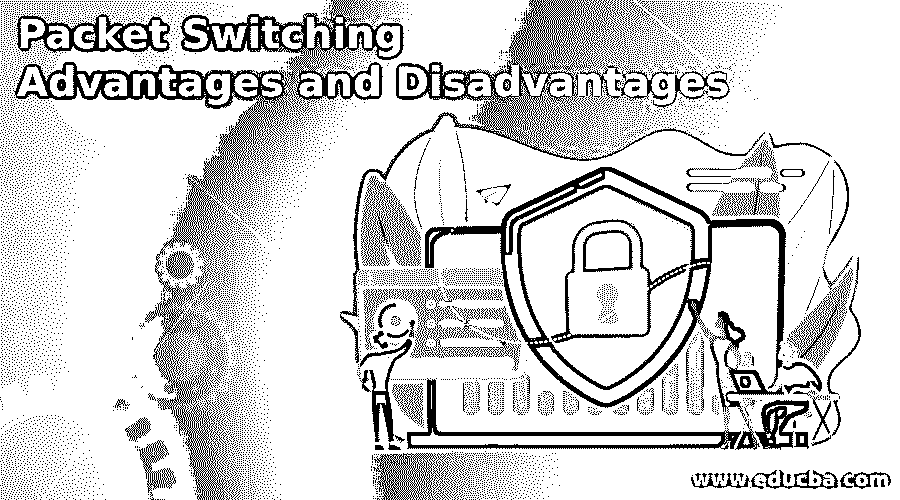

# 分组交换的优点和缺点

> 原文：<https://www.educba.com/packet-switching-advantages-and-disadvantages/>

## 分组交换优缺点介绍

分组交换的优点和缺点被定义为理解支持和反对分组交换技术的论点。分组交换是一种分段传输消息的模式，首先将消息分解成多个部分，每个部分通过独立的路由发送到目的地，选择的路由是每个分组的最佳路由，然后在目的地重新组合。

例如，如果一个 3GB 的文件必须发送到目标，它会被分解成大小最适合传输的片段，然后通过不同的路径路由到目标。每个数据包都包含传输所需的基本信息，如始发地和目的地的 IP 地址、数据包数量、序列号以及一些支持传输的附加信息。

<small>网页开发、编程语言、软件测试&其他</small>

### 各种分组交换的优点和缺点

为了理解优点和缺点，必须理解分组交换的类型和分组交换的过程，以便在选择这种传输数据的方法时，优点和缺点可以被有效地策划和用于确定接受点或拒绝点。

首先，让我们看看分组交换的过程。要传输的数据被分解成不同的部分，称为数据包。这些分组中的每一个都包括被称为报头和有效载荷的 2 个元素。顾名思义，报头包括寻址数据包的信息，并由中间路由器用于将数据包定向到目的地。

该报头包含源地址、目的地址、从源发送到目的地的数据包数量以及该部分的序列号等信息。除了报头中的元数据信息之外，有效载荷是要传输到目的地的实际数据。一旦节点上的数据包可用，就通过最佳路径传输。因为根据无连接或面向连接的体系结构，该路径是最佳的，所以传送数据的路由不必通过相同的路径。此外，当它到达目的地时，各部分可能不会按照传输的顺序到达，因此目的地必须根据顺序重新排序，然后检索原始消息。

在消息传输的适当过程中，可能会发生 4 种不同类型的延迟，了解潜在的优势或劣势非常重要，它们是:

*   **传输延迟:**传输延迟是指从源端发出所有数据包所用的时间，或者反过来说是接收端吸收所有数据所用的时间。这主要取决于数据包长度和网络的带宽容量。
*   **传播延迟:**这是数据遍历路径所花费的时间，换句话说，数据从源到达目的地所花费的总时间就是传播延迟
*   **排队延迟:**考虑到网络流量的性质，数据在实际执行传输之前会花费一些时间。
*   **处理延迟:**顾名思义，这是处理数据包所需的时间。这里花费时间来检查位错误，确定输出的链接，以及不属于传输、传播和排队范围的所有其他事情。

#### 优势:

*   一旦分组可用，它们就被传输，因此分组传递中的延迟较小。
*   数据包包含的数据大小是主存储器可以处理的最大长度，因此由于数据存储在主存储器中而不是磁盘中，访问延迟减少。
*   就成本而言，不需要巨大的二级存储，因此成本大大降低，因为设备不需要实际存储正在转发的数据。
*   有助于减少延迟的另一个因素是，需要建立从源到目的地的路径以及数据的即时传输。
*   如果路径中出现任何问题，如链路繁忙或链路故障，数据包会自动重新路由，以确保可靠的通信。
*   相同的信道可以在不同的用户之间同时共享，因为该方法以有效的方式照顾可用的带宽，并且以此确保带宽的最佳利用。各种用户共享资源是这种方法具有成本效益的另一个原因。
*   即使在公共网络无法传输的情况下，仍然可以进行分组交换来发送电子邮件和文本。

只有赞美在理想主义的世界里才是可能的，而在现实中，即使解决方案是最好的，也往往会有一些缺点。

#### 缺点:

*   在负载较重的情况下，由于排队时间较长，可能会有延迟。
*   尽管存储成本很低，但必须承担巨大的一次性安装成本。
*   这是一个复杂的传递协议，需要专业技术才能有效传递。
*   如果传输处理不当，可能会导致传送延迟、在数据包中引入错误，甚至丢失数据包，从而导致关键信息的丢失。
*   共享资源可能是伪装的大破坏，因为它可能导致潜在的安全威胁。

### 结论

通过这篇文章，我们对分组交换的过程有了一个粗略的了解，然后进一步讨论了它的优点和缺点，以将其映射到正确的过程节点，这样人们就可以根据本文中讨论的优点和缺点做出明智的决策

### 推荐文章

这是分组交换优缺点的指南。在这里，我们讨论介绍和各种优点和缺点。您也可以看看以下文章，了解更多信息–

1.  [分组交换优势](https://www.educba.com/packet-switching-advantages/)
2.  [切换技术](https://www.educba.com/switching-techniques/)
3.  [什么是电路交换](https://www.educba.com/what-is-circuit-switching/)
4.  [网络层](https://www.educba.com/network-layer/)

