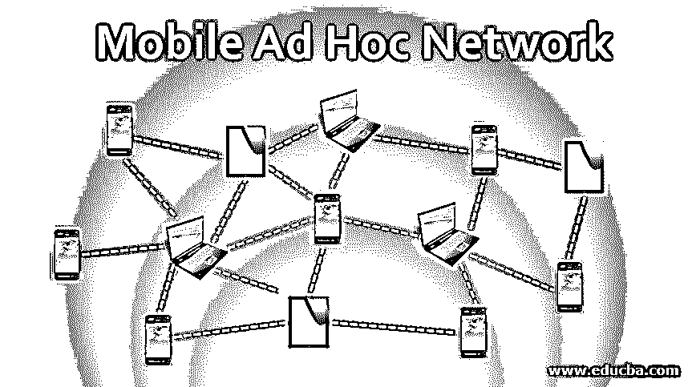

# 移动自组织网络

> 原文：<https://www.educba.com/mobile-ad-hoc-network/>

## 移动自组网简介

短语自组织网络中的术语“自组织”(临时的或当需要时)本身告诉我们自组织网络的含义。这意味着网络是临时的，或者在需要随机临时访问时立即建立。因此，Ad Hoc 网络是一组“本地可用”的设备，它们可以在任何需要的时候直接相互连接和对话，而不需要任何路由器或服务器。当所连接的设备离开网络时，即从网络断开时，该网络断开，因此网络随着自组织连接的关闭而断开。移动自组织网络(MANET)可以解释为一种可传输的网络，可以根据场景中设置的要求在需要时创建和实现，因此名称中有“自组织”一词。由于其重要的特征，如自动配置能力、作为无绳或无线网络的能力、当连接出现问题时的自我诊断能力等，它被广泛地选择。

这些网络使用设备到设备的通信，而不是使用传统网络中使用的硬件。这些网络跳过或避免了传统网络的硬件。这些是局域网(LAN ),允许一定范围内的设备彼此无线连接，而不是使用固定的服务器或路由器作为连接设备的中心枢纽。

<small>网页开发、编程语言、软件测试&其他</small>

**什么是网络？**

从电子学的角度来看，网络是一组设备或节点，如个人电脑、手机、平板电脑等。它们以这样的方式彼此连接，使得它们能够彼此共享资源和数据以进行通信，从而有益于终端用户，即我们

### 什么是移动自组网络？

我们只需要加上“移动”一词，这将把我们引向 MANET，即移动自组织网络。因此，MANETs 可以被定义为使用移动设备即移动无线设备(笔记本电脑、智能手机、iPads 等)的自组织网络。)作为他们联系和交流的节点。

MANET 的一个例子是 VANET(车载自组织网络),其中通信设备被安装在车辆内部以在车辆之间共享交通数据。此外，无线传感器网络是 MANETs 的一个例子。

### MANETs 特征

下面是一些功能。

*   没有硬件或固定的基础设施，涉及的移动设备相互之间自主地直接交谈和传输数据。
*   自我修复。
*   自动配置。
*   也称为无线自组织网络(WANET)、即时网络或自发网络。
*   每个设备本身充当路由器，并将数据包传输到另一个设备/节点。

### 马奈作品

移动自组网的工作原理如下。

*   作为一个独立的个体工作，或者作为一个像互联网一样的巨大网络的一部分在一个团体中工作。
*   没有接入点或硬件。
*   移动设备之间的直接和自主通信。
*   这些设备相互搜索并开始通信。
*   如果一个节点很远，那么源节点和目的节点之间的节点就充当路由器，一个一个地传输数据，使其到达目的节点。
*   设备可以在任何时候加入或离开网络，即发生动态节点添加或移除。
*   这些设备有自己的备用能源，就像它们有电池一样。

### 移动自组织网络的应用

MANETs 用于各种领域，例如:

*   **游戏服务:**用于学校、比赛等局域网中的协作游戏。
*   **军事服务**:用于立即向所有远程部队或营发送信息，用于会议等。
*   **商业用途:**当地会议、活动、研讨会。
*   工业部门。
*   紧急服务，如地震、救灾、消防、自然灾害，这些服务需要基础设施。
*   **教育部门:**学校、学院等的教室、实验室。用于分享讲座等。
*   蓝牙通信。

### **移动自组织网络的特征**

以下是下面解释的特征。

*   **无集中控制:**工作完全依赖于参与设备的行为和支持。
*   **设备的随机变化:**设备不断以巨大的速度自愿地进出网络。
*   网络拓扑的频繁变化，即网络中设备的排列
*   有限的电池电量
*   限制人为干扰
*   安全性更低:这些网络比有线网络面临更大的威胁。
*   如今，这些网络中的设备越来越小，很容易成为盗窃的受害者。
*   他们很容易受到攻击。
*   每台设备都充当路由器以及网络的前端，因此每台设备都扮演着双重角色。
*   **带宽有限:**这些网络的数据传输容量和范围都非常小。
*   内存电量、电池电量、备份等资源不足。
*   性能高，费用低，具有可扩展性优势。

### 结论

移动自组网充满了活力，这使得它成为通信领域快速变化的必要技术。随着笔记本电脑、手机、ipads 和 PDA 等移动设备的增加。像 MANETs 这样的网络意义重大，无法完全避免。

### 推荐文章

这是一个移动自组网络的指南。这里我们讨论移动自组织网络的主要特征、工作原理、应用和特点。您也可以看看以下文章，了解更多信息–

1.  [菊花链网络](https://www.educba.com/daisy-chain-network/)
2.  [DNN 神经网络](https://www.educba.com/dnn-neural-network/)
3.  [前馈神经网络](https://www.educba.com/feedforward-neural-networks/)
4.  [什么是 VLAN 网络？](https://www.educba.com/what-is-vlan-network/)

