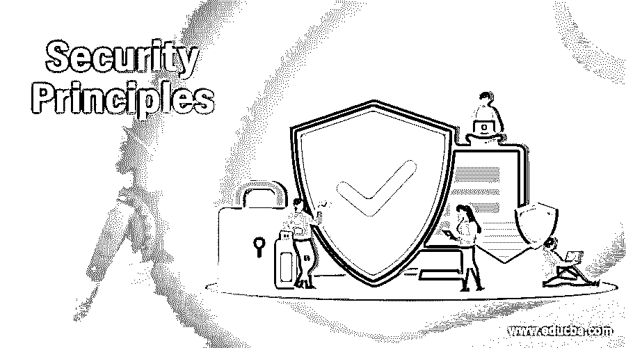

# 安全原则

> 原文：<https://www.educba.com/security-principles/>

## 安全原则介绍

为了管理任何系统的信息安全，理解安全原则是很重要的。安全原则是识别攻击类型和解决方案的基础。

这些标准旨在最大限度地降低系统和服务对攻击者的脆弱性，攻击者可能会未经授权访问敏感数据并滥用这些数据。

<small>网页开发、编程语言、软件测试&其他</small>

### 安全原则

下面是安全原则的列表

#### 1.机密

安全性的机密性原则规定，只有其预期的发送者和接收者才能够访问消息，如果未经授权的人访问该消息，则机密性会受到损害。例如，假设用户 X 想给用户 Y 发送一条消息，而 X 不希望其他人访问这条消息，或者即使其他人可以访问这条消息，他/她也不知道细节。但是如果用户 Z 以某种方式访问了这个秘密消息，这是不期望的，那么这个保密性的目的就失败了。这就导致了拦截。也就是说，如果用户 Z 在未经 X 和 Y 允许的情况下访问了用户 X 发送给 Y 的秘密消息或电子邮件，那么这被称为拦截。拦截导致消息机密性的丧失。

#### 2.证明

安全认证原则建立了身份证明，它确保文档或电子消息的来源被正确识别。例如，假设用户 Z 向用户 Y 发送消息，然而，问题是用户 Z 在向用户 Y 发送消息时伪装成用户 X。用户 Y 如何知道消息来自 Z，而不是 X。这导致了伪造攻击。例如

攻击者可以充当用户 X，向银行发送资金转账请求(从 X '帐户到攻击者帐户)，银行会将请求的金额从 X 的帐户转账到攻击者，因为银行认为资金转账请求来自用户 X。在没有适当的身份验证机制的情况下，伪造是可能的。

#### 3.完整

安全性的完整性原则声明消息不应被更改。换句话说，我们可以说，当消息的内容在发送者发送它之后，但在它到达预定接收者之前发生变化时，我们可以说消息的完整性丢失了。例如，假设用户 X 向用户 Y 发送了一条消息，攻击者 Z 在传输过程中以某种方式访问了这条消息，并更改了消息的内容，然后将其发送给用户 Y。用户 Y 和用户 X 不知道在用户 X 将消息发送给 Y 之后，消息的内容发生了更改。这导致了修改。修改会导致消息完整性的丧失。

#### 4.不可否认性

安全性的不可否认原则不允许消息的发送者反驳没有发送该消息的声明。在某些情况下，用户发送了一条消息，但随后拒绝承认是他/她发送了这条消息。例如，用户 X 通过互联网向银行发送资金转账请求。在银行根据用户 X 的请求进行资金转账后，用户 X 不能声称他/她从未向银行发送资金转账请求。这种安全原则消除了事后否认的可能性。

#### 5.访问控制

安全的访问控制原则决定了谁应该能够访问什么。也就是说，我们可以指定哪些用户可以访问哪些功能，例如，我们可以指定用户 X 可以查看数据库记录，但不能更新它们，而用户 Y 可以访问这两者，可以查看记录，并可以更新它们。这个原则与两个领域广泛相关——角色管理和规则管理，其中角色管理集中在用户端。即哪个用户可以做什么，规则管理集中在资源方面，即哪个资源可用。基于这个矩阵，列出了用户可以访问的条目列表。访问控制列表是访问控制矩阵的子集。

#### 6.有效性

安全性的可用性原则规定，资源应该在任何时候都可供授权人员使用。例如，由于另一个未授权用户 Z 的故意行为，授权用户 x 可能无法联系服务器 Y，这导致中断攻击，中断将资源的可用性置于危险之中。一个真实的例子是，假设攻击者或未经授权的人 Z 试图访问用户 X 的 FB 帐户，由于用户 Z 不知道用户 X 的密码，他/她试图使用随机密码登录 X 的帐户。在尝试了密码的最大限制之后，如果密码不正确，那么 X 的帐户将被阻止，因此由于未经授权的人 Z，用户 X 不能访问他的帐户。

#### 7.道德和法律问题

安全系统中的道德问题分为以下几类

*   隐私:它涉及个人访问个人信息的权利
*   **准确性:**它处理信息的认证、保真和准确性的责任
*   **属性:**它处理信息的所有者
*   可访问性:它处理组织有权收集哪些信息。

在处理法律问题时，我们必须记住，管理信息安全合法性的监管机构是分等级的，可以分为以下几类

*   国际的
*   联邦的
*   状态
*   组织

### 推荐文章

这是一份安全原则指南。在这里，我们讨论安全原则，这将有助于您更好地理解攻击，也有助于您思考应对攻击的可能情况。您也可以看看以下文章，了解更多信息–

1.  [什么是数据安全？](https://www.educba.com/what-is-data-security/)
2.  [安全架构](https://www.educba.com/security-architecture/)
3.  [嵌入式系统安全](https://www.educba.com/embedded-systems-security/)
4.  [网络安全事件](https://www.educba.com/cyber-security-incidents/)

