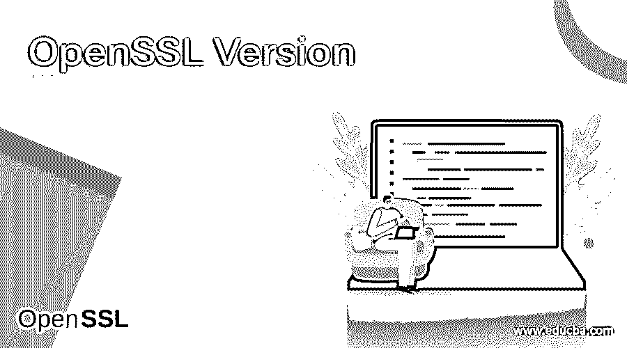

# OpenSSL 版本

> 原文：<https://www.educba.com/openssl-version/>

## OpenSSL 版本介绍

下面的文章提供了 OpenSSL 版本的概要。OpenSSL 是用于服务器上托管的应用程序的安全通信的软件。OpenSSL 软件有一些预定义的库，用于建立网络和识别任何类型的网络钓鱼活动、窃听、网络欺骗以及入侵流线型通信。所有支持 HTTPS 协议的主流网站都使用 OpenSSL，它同时拥有 SSL 和 TLS 协议。该软件在 C 语言的实现中还有一个独特的用法，因为整个 C 语言使用加密函数，允许 OpenSSL 作为其包装。

### 不同的 OpenSSL 版本

OpenSSL 的某些版本用于实现，并支持各种功能，其中一些功能已被弃用，如下所示:

<small>网页开发、编程语言、软件测试&其他</small>

#### 1.0.9.1 亿–0.9.1 亿

这个版本的 OpenSSL 版本于 1998 年 12 月 23 日发布，这标志着项目正式开始。此版本的 OpenSSL 中存在某些变化，如下所示:

*   在 crypto.h 中添加了 OPENSSL_VERSION_NUMBER，将 SSLeay 更改为 OPENSSL 版本字符串。
*   整合了一些流行的无 RSA/DSA 补丁，允许编译无 RSA 的 SSLeay。
*   对在编译时没有发现的错误 rsaref.h 进行了一些修复，因为 symlink 包含顶级文档上的修复。
*   增加了修改和操作的配置。
*   更新了自述文件。
*   修正了一些内存泄漏。
*   修复了测试中的一些数据，使其与其他数据集兼容。
*   重新编译了错误定义头文件和 Win32 链接器表。
*   添加了各种。cvsignore 存储库中的文件，以便在文件夹中更新它们。

#### 2.0.9.1 c–0.9.2 b

这个版本的 OpenSSL 是 0.9.1c 的后继版本，于 1999 年 3 月 22 日发布，在 1999 年 4 月 6 日做了一些小的改动。

此版本中的一些变化包括:

*   通过从软件中删除一些错误代码和带有 malloc 的遗留代码库，使 Malloc 免费。
*   修正了持续存在的安全漏洞，因为认证被绕过，在通过之前使用了一些错误的协议。
*   执行 rsa_oaep_test，在导致任何错误时返回非零值。
*   支持本地 Solaris 在库之间共享许多重要的组件。
*   在计算和执行某些组件时，在满足某些代码(如 p>q)的情况下，使用 OpenSSL 生成私有加密例程和密钥。
*   检查了一些 DES quad 校验和，然后计算了总和，这在此版本中得到修复。
*   所有的输出行都与这个版本的发布保持一致。

#### 3.0.9.3 安

这个 OpenSSL 版本是 1999 年 8 月 9 日发布的 0.9.2 b 的后续版本，其中包含一些更改和错误修复，如下所示:

*   当使用 RSAref 构建 OpenSSL 时，安装 libRSAglue.a 库。
*   Ifndef NO _ FP _ API pair 对包含在其中。
*   修正 ca 程序中缺少参数的开始日期和结束日期。
*   新函数 DSA_dup_DH 复制 DSA 参数或密钥，用于固定作为其一部分的重要因素。

#### 4\. 0.9.4

这个 OpenSSL 版本是 1999 年 8 月 9 日发布的 0.9.3a 的后续版本，有更多的更改和错误修复，包括。

*   修复了 i2d_DH 参数中的内存泄漏。
*   K-option 可以与要由多个接收者读取的加密消息相同。
*   增加了对 SPARC Linux 的更多支持。
*   在这个发布版本中，许多 C 实现和推送活动都已经用函数参数进行了调度。
*   MIPS III/IV 汇编模块重新实现。
*   使用更多的 DES 库清理，然后移除对 srand 的引用或删除任何未使用的文件。

#### 5.0.9.5 至 0.9.5 安

这个 OpenSSL 版本是 9.4 的后续版本，于 2000 年 2 月 28 日发布，在 2000 年 4 月 1 日做了微小的版本更改。

*   在此版本中，确保使用 _lrotl，而 _lrotr 仅使用 MSVC。
*   修复了 HMAC 的密钥长度大于 MD 块大小的问题。
*   解决方案中 des_quad_cksum 字节顺序的错误修复。
*   更新测试套件，使测试在非 rsa 配置中成功。

#### 6.0.9.5 安至 0.9.6 米

这个 OpenSSL 版本是 9.5 的后续版本，于 2000 年 9 月 24 日发布，对版本进行了微小的修改。

*   在 ssl_23_get 客户端中，使用带有 TLS 协议的初始 SSL 3.0 的初始版本生成错误消息。
*   为窗口的正常运行收集可靠的随机性。
*   兼容原因，如果标志 X509_V_FLAG_ISSUER check 未设置，则该消息未用新信息代码适当处理。
*   内容检查的检查正在与 pk7_smime.c 结构分离。

#### 7.9.6 年至 9.6 年

这个 OpenSSL 版本是 9.5 a 的后续版本，于 2001 年 7 月 9 日发布，并做了一些修改。

*   在 SSL ey/OpenSSL PRNG 中，其状态恢复可以通过输出一个 PRNG 请求来实现，然后更新某个值。
*   修正了一些 crypto /bn/asm/mips 3.5 的问题。
*   处理与 X509 打印相关的特殊情况。
*   修复 OAEP 检查。

#### 8.0.9 小时–0.9 小时

此 OpenSSL 版本是在 2002 年 12 月 31 日发布的 OpenSSL 9.7 之后发布的，它有以下更改:

*   修复 SSLv2 客户端代码中的会话 ID 处理，同时缓存会话 ID 以匹配客户端和服务器之间的行为。
*   更改和声明所需的 Kerberos 库以使用 EX_LIBS 而不是特殊的 LIBKRB5。
*   禁用对工作的 Hiemdal 支持。

#### 9\. 0.9.8 – 1.0.0

此 OpenSSL 0 . 9 . 8 版本于 2005 年 7 月 5 日发布，带有补丁，是 2010 年 3 月 29 日发布的 1.0.0 版本的后续版本，支持与容忍私钥值、处理压缩算法、更新 OCSP 请求代码以允许添加自定义头、在默认配置中禁用 MD2 相关的一些更改。

#### 10.1.0 . 1 吨和 1.0 . 1 升

OpenSSL 1 . 0 . 1 版本于 2016 年 9 月 22 日发布，其中包括 SCTP 支持、PSS 签名、允许证书通行、TLS 支持等更改。

#### 11\. 1.0.2 – 1.1.0

这个 OpenSSL 版本的 1.0.2 于 2019 年 12 月 20 日发布，后来于 2019 年 9 月 10 日发布，其中包括 CCM cipersuites、对扩展主机密的支持，以及对 DANE 和证书透明性的支持，以及对 BLAKE2 的支持。

#### 12\. 1.1.1

1.1.1 的这个 OpenSSL 版本于 2018 年 9 月 11 日发布，支持与 TLS 1.3 相关的大多数更改，支持 ARIA，支持多素数 RSA，删除了心跳。

#### 13\. 3.0.0

这个 3.0 版本的 OpenSSL 在 2021 年 2 月 18 日发布了一些功能和变化，比如不再使用这个版本中不再存在的过时的 EVP_PKEY_CTX_ukm()函数，增加了一个编译时选项，结合了一些选项，比如 no-ec，no-dh，默认密钥生成。

### 结论

OpenSSL 是一种软件，用于维护服务器上的网络接口，并维护主要支持 HTTPS 协议的网页，该协议进一步组成 TLS 协议来维护层次结构，因此它非常灵活和有用，因为它允许第三方入侵，但具有一些证书和安全预防措施来避免流量嗅探和欺骗。

### 推荐文章

这是一个 OpenSSL 版本的指南。为了更好的理解，我们在这里讨论一下介绍和不同的 OpenSSL 版本。您也可以看看以下文章，了解更多信息–

1.  [互联网安全协议](https://www.educba.com/internet-security-protocols/)
2.  [SSL 协议](https://www.educba.com/ssl-protocols/)
3.  [什么是 SSL？](https://www.educba.com/what-is-ssl/)
4.  [什么是 SSL 证书？](https://www.educba.com/what-is-ssl-certificate/)

