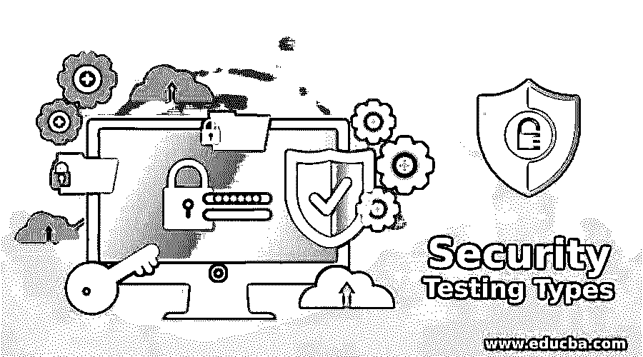

# 安全测试类型

> 原文：<https://www.educba.com/security-testing-types/>

## 安全测试类型介绍

软件测试包括软件的安全性。它保证程序免受所有内部和外部漏洞的影响。它检查程序是否有任何潜在的缺陷、错误或风险。在长期使用过程中，这些漏洞会破坏提交的稳定性或使其崩溃。应用程序崩溃导致的资源和知识的缺乏是巨大的。一个公司的失败从来都不是正当的，因为原因不同。安全测试的目的是发现软件框架中任何潜在的漏洞和缺陷，这些漏洞和缺陷可能会导致员工或外部人员的数据、收入或声誉损失。让我们讨论一下安全测试的类型。

### 安全测试的重要性是什么？

安全性测试也是软件测试过程的一个重要方面。测试程序有助于增强稳定性和功能性。对任何应用程序进行安全测试的目的是确保它是可靠和安全的。对于那些在软件开发行业工作的人来说，生产高质量的产品是很重要的。因为它不会造成安全威胁，所以可靠的应用程序是必要的。安全测试的主要目的是检测和量化系统中可能存在的缺陷，以便在遇到风险时，系统不会停止工作或被利用。它还有助于检测系统中任何潜在的安全威胁，以及通过编码帮助开发人员解决问题。

<small>网页开发、编程语言、软件测试&其他</small>

### 安全测试的类型

任何软件都应该经过测试过程，因为它有助于检测安全缺陷。不同形式的安全测试用于评估软件的任何部分。检查程序因应用而异。

下面列出了七种不同形式的安全性测试。《开源安全测试方法手册》符合这七个类别。

*   漏洞扫描
*   安全扫描
*   渗透测试
*   风险评估
*   安全审查或安全审计
*   道德黑客
*   姿势评估

#### 1.漏洞扫描

漏洞测试扫描使用自动化工具扫描整个应用程序。它通过比较弱签名来检测漏洞。

#### 2.安全扫描

在安全扫描过程中，应用程序和网络都会被扫描。为了识别风险，需要执行手动或自动扫描。然后识别、定义、评估风险，并提供解决方案。它包括评估网络和设备缺陷，然后提出减轻这些威胁的方法。这种扫描可以以两种方式完成，即手动和自动。

#### 3.渗透测试

这种形式的测试模拟了恶意黑客的攻击。这种测试包括评估一个特定的框架，以防外部黑客攻击。渗透测试模拟来自外部的黑客攻击。在危险或捕获过程中，它试图预测可能的坠落。渗透测试是一种流行的检测漏洞的方法。通过在应用程序中发出错误警报，您可能会暴露系统操作中的缺陷。

#### 4.风险评估

安全测试是风险管理的一个子集。根据风险，风险评估提出预防措施和控制措施。风险有三个级别:低、中、高。

#### 5.安全审查或安全审计

安全审计或安全审查是安全测试的一种方法。在审查每一行代码或规范的过程中发现的任何错误都由安全审计负责。

#### 6.道德黑客

道德黑客是渗透测试的对立面。虽然自动软件试图利用设备，但道德黑客被用来寻找安全漏洞。目的是渗透应用程序并从内部攻击它。

它包括侵入一个组织的软件程序。与为个人利益而窃取的恶意黑客不同，其目的是发现设备的安全漏洞。

#### 7.姿势评估

态势评估是道德黑客、风险评估和安全扫描的混合。它清楚地描述了安全状况，并展示了组织的整体安全态势。

### 对软件或应用程序执行安全性测试的步骤

这些是使安全测试透明的基本安全测试示例。

1.  尝试登录一个程序。
2.  使用您的密码或用户名犯了一个大错(如果访问被拒绝，应用程序在身份验证方面工作正常。)
3.  使用正确的密码登录 web 应用程序。
4.  然后退出程序。
5.  返回浏览器。
6.  如果您仍然能够登录，则该应用程序不安全。

### 结论

除了上面列出的所有形式的安全测试之外，对安全测试的价值的理解更有理由提倡将安全测试作为标准软件开发过程的一部分。当涉及到机密数据的保存以及安全性保留了客户的尊严、信誉和信任这一事实时，没有其他选择。在本文中，我们已经了解了什么是安全测试及其类型。

### 推荐文章

这是安全测试类型的指南。在这里，我们讨论一个简短的概述，它的不同类型，重要性和执行软件或应用程序安全测试的步骤。您也可以看看以下文章，了解更多信息–

1.  [安全工程](https://www.educba.com/security-engineering/)
2.  [安全原则](https://www.educba.com/security-principles/)
3.  [互联网安全协议](https://www.educba.com/internet-security-protocols/)
4.  [安全架构](https://www.educba.com/security-architecture/)

