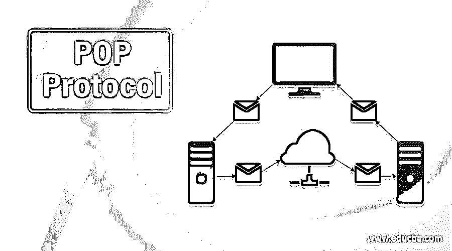

# POP 协议

> 原文：<https://www.educba.com/pop-protocol/>

## POP 协议简介

邮局的手续很简单。正如我们所知，SMTP 用于交换消息。使用 SMPT，您必须从客户端和目的节点向服务器发送消息。用户访问代理将邮件从收件人服务器发送到实际服务器。邮件访问代理中有两种类型的协议:POP3 和 IMAP。在本主题中，我们将学习 POP 协议。

### POP3 是什么？

POP3 是一个简单的协议，功能非常有限。在 POP3 的情况下，客户机 POP3 安装在接收者的网络上，而服务器 POP3 安装在接收者的邮件服务器上。1984 年，互联网技术工作组首次实现了邮局协议的变体 RFC 918。开发人员开发了一种简单有效的电子邮件协议，称为 POP3 协议，用于从服务器检索电子邮件。它离线访问邮件，而不是离线访问邮箱。

<small>网页开发、编程语言、软件测试&其他</small>

1985 年，RFC 937 采用了第 2 版邮政协议，但在 1988 年，它被 RFC 1081 的第 3 版邮政协议所取代。相反，在接下来的十年里，POP3 在发布前进行了修订。这是 1996 年发布的，直到完全完善。虽然对 POP3 协议进行了一些更改，但开发人员保留了一个基本概念，即在客户端和服务器之间进行电子邮件检索时遵循一个三阶段过程。这个协议非常简单，这种简单性使得它今天非常流行。

### 邮件是如何传输的？

比如说，把邮件交给收件人。第一封邮件被发送到发件人的邮件服务器。然后，邮件通过互联网从发件人的邮件服务器发送到收件人的邮件服务器。一旦从接收方的邮政服务器接收到邮件，邮件就被转发给客户。整个过程是使用电子邮件协议进行的。文章从发件人发送到发件人的邮件服务器，然后使用 SMTP 协议发送到收件人的邮件服务器。

POP 或 IMAP 协议将数据传输给收件人邮件服务器上的个人用户。SMTP 是一种推送协议，以便将请求从客户端发送到服务器。如上图所示，SMTP 将客户端的邮件传输到目的地的邮件服务器。电子邮件通信的第三阶段需要一个拉协议，POP 就是一个拉协议。一旦邮件从接收服务器发送到收件人，客户端就从服务器接收邮件。

### POP 3 的工作原理

POP3 服务器向 POP3 客户端请求用户名，以在 POP3 服务器和 POP3 客户端之间创建连接。如果 POP3 服务器用户名被识别，它将提交 ok 消息。然后，您询问 POP3 客户端的密码；然后，POP3 客户端发送 POP3 服务器密码。如果密码匹配，将从 POP3 服务器收到一条 OK 消息，这将创建一个连接。创建链接后，客户端将在邮件服务器 POP3 上看到邮件列表。

在邮件列表中，客户收到服务器的电子邮件号码和大小。然后，用户可以开始从该列表中检索邮件。一旦客户端从服务器收集了所有电子邮件，所有电子邮件都将从服务器中删除。我们可以假设电子邮件被限制在一台特定的机器上，这样在另一台机器上的相同邮件就不能被访问。将邮件设置设置为在邮件服务器上保留一份邮件副本将解决这一问题。

### POP 协议的优势

1.  它让用户离线阅读文本，甚至当从服务器上检索电子邮件时，这涉及到互联网连接。当从服务器上下载电子邮件时，下载的任何电子邮件都可以在没有互联网连接的情况下在我们的 Mac 或我们的计算机硬盘上访问。POP3 协议中也不需要永久的互联网接入。
2.  在本地计算机上本地收集所有邮件需要较少的磁盘空间。
3.  这是一个简单的协议，所以它是当今最流行的协议之一。
4.  我们接收或发送的电子邮件的大小没有限制。

### POP 协议的缺点

1.  默认情况下，如果从服务器访问电子邮件，所有电子邮件都会从服务器中删除。因此，如果没有安装服务器上的邮件副本，就无法访问来自其他计算机的邮件。
2.  尽管病毒攻击的可能性很高，但病毒扫描程序不会搜索本地机器上的所有附件。然后，病毒的攻击会摧毁机器。

### 推荐文章

这是 POP 协议的指南。这里我们讨论什么是 POP3 协议，它是如何工作的，以及它的优点和缺点。您也可以阅读以下文章，了解更多信息——

1.  [CIFS 协议](https://www.educba.com/cifs-protocol/)
2.  [协议测试](https://www.educba.com/protocol-testing/)
3.  [路由协议](https://www.educba.com/routing-protocol/)
4.  [SMTP 协议](https://www.educba.com/smtp-protocol/)

