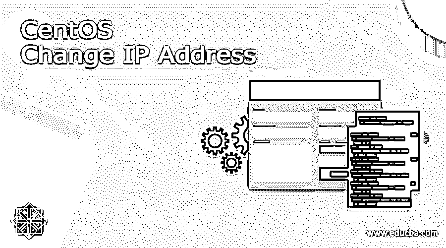
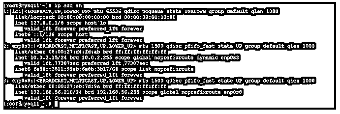
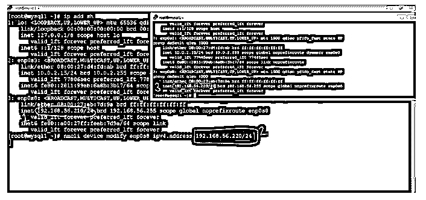
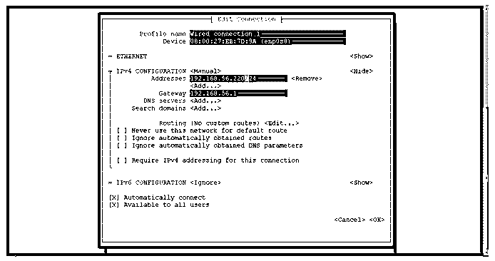

# CentOS 更改 IP 地址

> 原文：<https://www.educba.com/centos-change-ip-address/>

## CentOS 更改 IP 地址简介

在 CentOS 环境中，互联网协议(即 IP 地址)发挥着非常重要的作用。因为它是服务器级的操作系统。它将管理多个应用程序或作业级别的线程连接等。在 CentOS 操作系统中更改 IP 地址有多种方法。这取决于 CentOS 操作系统的安装方式，例如最小软件包安装或完整图形软件包安装。如果我们使用的是 CentOS 操作系统的图形模式，那么更改 IP 地址就有点容易了。但是，如果我们使用命令提示符或 CLI，那么这样做会更复杂。在 CentOS 环境中，如果我们使用 DHCP 服务器，即动态主机配置协议，那么我们不需要考虑更改系统的 IP 地址。

### CentOS 更改 IP 地址的语法

CentOS 更改 IP 地址的语法如下所示:

<small>网页开发、编程语言、软件测试&其他</small>

**对于 CLI**

`nmcli [OPTIONS...] {help | general | networking | radio | connection | device | agent | monitor} [COMMAND] [ARGUMENTS...]`

**用于用户界面**

`nmtui`

*   根据需要，我们可以在语法或命令中使用 nmcli 或 nmtui 关键字。它将接受不同选项、设备类型、命令、不同参数等参数。根据提供的输入，nmcli 或 nmtui 将 CentOS 系统的 IP 地址。nmcli 或 nmtui 命令也有助于管理不同的网络相关任务。
*   **选项:**根据需要，我们可以提供不同的标志作为与 nmcli 或 nmtui 命令兼容的选项。
*   **命令:**根据要求或需要，我们可以在 nmcli 或 nmtui 中使用该命令。
*   **ARGUMENTS:** 根据要求或需要，我们也可以使用 nmcli 或 nmtui 中的参数。

### CentOS 如何改变 IP 地址的工程？

在现实世界中，大多数发源都是使用 Linux 环境。根据需要或要求，我们需要选择部署所需的 Linux 版本。更改 IP 地址的方法可能因 Linux 版本而异。在 CentOS 环境中，有不同的方法来改变它。这将取决于您使用的 CentOS UI 类型，如图形 UI 或 CLI。如果我们使用图形用户界面，那么改变 IP 地址就有点容易了。如果我们使用 CLI，那么我们需要使用 nmtui 或 nmcli 实用程序。在 nmcli 中，我们还可以控制网络。这里，我们需要使用正确的命令和语法。nmcli 控制网络的语法是“nmcli networking { on | off | connectivity }[ARGUMENTS…]”

向 CentOS 操作系统分配 IP 地址有两种类型，如自动分配 IP 地址或手动分配 IP 地址。在自动过程中，我们确实需要处理任何事情，因为 DHCP 服务器将管理主机的 IP 地址分配。但在某些情况下，没有 DHCP 选项，我们需要手动为主机分配 IP 地址。

下面是与 nmtui 命令兼容的选项列表。请考虑以下网络控制命令选项。

*   **开，关:**在网络管理器的帮助下，它将有助于启用或禁用网络控制。所有 NIC 或网络接口都可以由 NetworkManager 管理。当网络被禁用时，它将被停用。
*   **连接性【检查】:**这将有助于获得主机的网络连接状态。这将是可选的检查参数，它将更新到 NetworkManager，以重新检查主机的连接或连接检查的最新状态。检查网络连接状态有不同的方法
    *   **无:**该选项将更新主机未连接到任何网络。
    *   **门户:**此选项将更新强制网络门户中的主机。它不会到达完整的互联网。
    *   **limited:** 该选项将表明主机已连接到网络。但是主机没有互联网连接。
    *   **full:** 该选项表示主机已连接到网络。但是主机有网络连接。
    *   **未知:**该选项将更新未知的主机状态。

### CentOS 更改 IP 地址的示例

示例了解 CentOS 更改 IP 地址 CentOS 更改 IP 地址:如何检查当前 IP 地址在 CentOS 环境中，我们能够检查主机的当前 IP 地址。

**命令:**

`ip add sh`

**说明:**

按照上面的命令，我们将获得与当前工作主机相关的 IP 地址列表。

**输出:**

**CentOS 更改 IP 地址:通过 nmcli 更改 IP 地址**

正如我们所讨论的，有不同的方法来改变 IP 地址。在这里，我们是在 nmcli 应用工具的帮助下完成的。

**命令:**

`nmcli device modify enp0s8 ipv4.address 192.168.56.220/24`

**说明:**根据上述命令，我们使用 nmcli 实用程序来更改主机的 IP 地址。

**输出:**

CentOS 更改 IP 地址:通过 nmtui 更改 IP 地址

与 nmcli 类似，我们也可以在 nmtui 的帮助下更改主机的 IP 地址。在这里，我们是在 nmtui 实用程序的帮助下完成的。

**命令:**

`nmtui`

**解释:**根据上面的命令，我们使用 nmtui 实用程序来更改主机的 IP 地址。

**输出:**

截图 1 (a)

截图 1 (b)

### 结论

我们已经看到了“CentOS 更改 IP 地址”的完整概念，以及带有不同输出的正确示例、解释和命令。实现它有不同的方法。根据要求或需要，我们可以选择我们需要选择相同的方法。

### 推荐文章

这是一个指南 CentOS 改变 IP 地址。在这里，我们还讨论了介绍和 CentOS 如何改变 IP 地址的工作？以及不同的示例及其代码实现。您也可以看看以下文章，了解更多信息–

1.  [在 Linux 中设置 IP 地址](https://www.educba.com/set-ip-address-in-linux/)
2.  IP 地址是如何工作的？
3.  [获取 PHP 中的 IP 地址](https://www.educba.com/get-ip-address-in-php/)
4.  [OSPF vs 瑞普](https://www.educba.com/ospf-vs-rip/)

