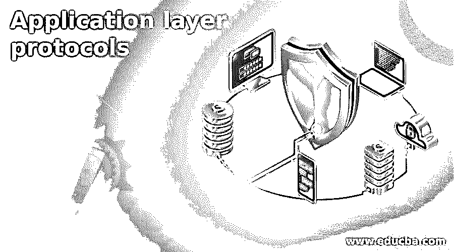

# 应用层协议

> 原文：<https://www.educba.com/application-layer-protocols/>

## 应用层协议简介

应用层是 OSI 模型的最后一层，也是第 7 层。这一层是抽象层，它通过 OSI 和 TCP/IP 模型处理计算机网络上的共享协议。在互联网协议簇中，应用层包含通信协议和接口方法，用于处理网络上的通信。应用层包含几种协议，即远程登录、FTP、TFTP、SMTP、SNMP、DNS 和 DHCP。

### 应用层协议

下面是应用层协议列表。

<small>网页开发、编程语言、软件测试&其他</small>

#### 1.用于远程联接服务的标准协议或者实现此协议的软件(可为动词)

Telnet 是一种应用协议。它提供双向交互式面向文本的通信功能。对于面向文本的通信，telnet 使用终端连接。使用 telnet 可以实现网络硬件的配置元素。在 TCP 中，信息与 Telnet 控制信息一起散布在面向 8 位字节数据连接的带内。Telnet 是一种客户端服务器协议，用于在远程计算机上打开命令行。

#### 2.文件传送协议

FTP 代表文件传输协议。它是一种应用层协议，用于将文件从一个位置转换到另一个位置，即从一台主机转换到另一台主机。它是由 TCP/IP 提供的标准机制。将文件从一个系统转换到另一个系统看起来非常简单，但是在转换文件之前需要处理一些问题。它使用 TCP 服务。它需要两个 TCP 连接。一个是控制连接，另一个是数据连接。对于控制连接，它使用众所周知的端口 21，对于数据连接，它使用众所周知的端口 20。

#### 3.普通文件传送协议(Trivial File Transfer Protocol)

TFTP 代表普通文件传输协议，是一种应用层协议，用于从服务器向客户端发送文件。简单文件传输协议使用 UDP 的概念在服务器和客户端之间共享文件。这里 UDP 代表用户数据报协议。它通常仅用于在本地 intranet 中设置的机器之间进行文件通信。小文件传输协议最重要的特点是它使用最少的内存。如果计算机没有硬盘，此应用层协议可用于传送引导文件。它一般使用协议 69；然而，用于通信的端口可以被定义为在设置小文件传输协议时使用。

#### 4.简单邮件传输协议

SMTP 代表简单邮件传输协议，用于传输邮件。它定义了命令和响应必须如何来回发送。它被使用两次，在发送者和发送者的邮件服务器之间以及在两个邮件服务器之间。为了在邮件传输代理客户端和邮件传输代理服务器之间传输邮件，简单邮件传输协议使用命令和响应。实际的邮件传递是通过 MTA 完成的，即邮件传递代理。系统必须具有客户端邮件传输代理和服务器邮件传输代理，以便将邮件从一个系统传输到另一个系统。

#### 5.简单网络管理协议(Simple Network Management Protocol)

SNMP 代表简单网络管理协议，用于收集和组织 IP 网络上被管理设备的数据。它还修改信息以改变设备的行为。SNMP 主要用于监控和管理网络。它由一组网络管理标准组成，包括应用层协议、数据库模式和一组数据对象。

#### 6.域名服务器(Domain Name Server)

DNS 代表域名系统，它是一种分散式命名系统，用于互联网上的计算机和其他设备，将互联网或任何其他专用网络上连接的设备的域名转换为数字 IP 地址，反之亦然。DNS 的优点是用户不需要记住域名的 IP 地址。DNS 支持 TCP 协议和 UDP 协议。DNS 服务器在端口 53 上工作。域分为三部分通用域，国家域和反向域，其中通用域根据其通用行为定义注册主机，国家域使用两个字符国家缩写，反向域映射地址。

#### 7.动态主机配置协议

DHCP 代表动态主机配置协议。它是应用层中的网络管理协议。在它的帮助下，互联网协议 IP 地址可以动态地分配给网络上的任何设备或节点，以便它们可以使用该 IP 进行通信。DHCP 协议的主要目标是为主机分配唯一的 IP 地址。除了唯一的 IP 地址，它还提供其他网络地址，如子网掩码、路由器地址、供应商类别标识符和 DNS 地址。DHCP 服务器有一个地址池，供设备获取有效的网络连接。

### 推荐文章

这是应用层协议指南。这里我们讨论了应用层的各种协议，如 Telnet、FTP、TFTP、SMTP、SNMP、DNS 和 DHCP。您也可以看看以下文章，了解更多信息–

1.  [SSL 协议](https://www.educba.com/ssl-protocols/)
2.  [互联网安全协议](https://www.educba.com/internet-security-protocols/)
3.  [物联网协议](https://www.educba.com/iot-protocols/)
4.  [路由协议类型](https://www.educba.com/routing-protocols-types/)

