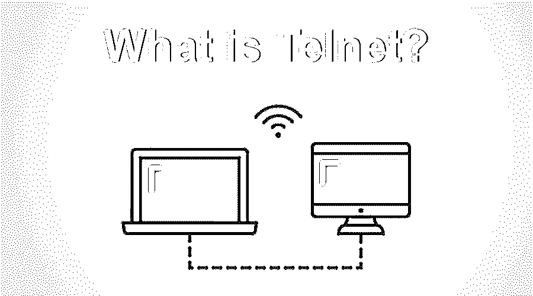

# 什么是 Telnet？

> 原文：<https://www.educba.com/what-is-telnet/>

## 什么是 Telnet 的介绍？

对于像 Internet 这样的 TCP / IP 网络，Telnet 是一个终端仿真程序。Telnet 软件在您的系统上运行，将您的个人计算机连接到网络服务器。它将所有数据转换为纯文本的事实被认为是易受攻击的。这意味着如果用户嗅探网络，你可以在传输过程中记录你的用户名和密码。它允许用户远程访问帐户或计算机。例如，消费者可以远程登录到网站主机来远程控制他们的文件。

### Telnet 是如何工作的？

*   它通过一个交互式的、双向的、面向文本的信息系统提供给用户一个有效的终端连接，其长度远远超过 8 个字节。
*   用户数据散布在 TCP 之上的带长的 telnet 控制信息中。它有助于以远程方式实现某些功能。
*   用户使用 TCP 协议加入[旁边的服务器，这意味着另一端的连接也是使用 telnet 主机名建立的。](https://www.educba.com/what-is-tcp-protocol/)

**语法:**

<small>网页开发、编程语言、软件测试&其他</small>

`telnet hostname port`

*   相应的用户在服务器上使用这些命令来完成所需的任务。这些命令用于结束 telnet 会话或注销会话或用户。
*   目前，虚拟终端和终端模拟器都可以用于 telnet，它基本上是一台现代计算机，通过相同的 Telnet 协议进行通信。该命令帮助 telnet 协议实现与远程设备的通信，主要是各种其他操作系统也为这些系统提供了大量的支持。

### 使用

以下是 telnet 的用法。

*   PuTTY 和 plink: CLI，这是免费的，为 Unix、Linux 和 windows 提供 SSH、rlogin、Telnet 和原始 TCP 客户端。
*   线路模式浏览器
*   范·代克软件公司安全中心
*   佐治亚软件公司 GSW 连接机器人。
*   ZOC 终点站
*   SyncTERM BBS 终端:一个支持 SSHv2，RLogin，Telnet，Serial，*nix，Windows 和 Mac OS X 平台和其他 BBS 终端仿真的程序
*   NetRunner BBS telnet 客户端:主要用于 ANSI-BBS。面向 SDL2 的仿真引擎用于提供非常精确和透明的仿真。
*   NCSA 远程登录
*   万亿术语
*   Rtelnet:它是 telnet 的 SOCKS 版本，为防火墙后的主机提供 telnet 的类似功能。
*   终端仿真器伦巴
*   Inetutils:它又由一个 telnet 客户机和服务器组成。
*   exe:Microsoft Windows 操作系统默认安装中包含的另一个 CLI 实用程序。

### 优势

下面是解释的一些优点。

*   它使自己适用于许多不同的操作系统。
*   它允许学校网络测试从设备到外部服务器上特定端口的访问。
*   使用它可以实现网络硬件的配置元素。
*   访问远程计算机:这个软件最大的优点是它同意远程访问不同的计算机。
*   它有助于节省大量的时间，建立连接，并在不同的计算机上立即完成任务。
*   路由器配置:修复问题在这里非常容易，因为它使用纯文本进行传输。因此，数据传输是通过更多的访问和更少的传输量来完成的。
*   通用:它可以灵活地部署在任何计算机上。即使不同的操作系统也可以相互连接，而不管它们的版本和发布时间。
*   它通过一个交互式的、双向的、面向文本的信息系统提供给用户一个有效的终端连接，其长度远远超过 8 个字节。用户数据散布在 TCP 之上的带长的 telnet 控制信息中。它有助于以远程方式实现某些功能。

### 所需技能

所需技能如下。

*   虚拟化
*   解决纷争
*   编程能力
*   存储管理部分
*   升级管理
*   Linux，FTP，DNS，SSH，SMTP， [DHCP](https://www.educba.com/dhcp-server-in-linux/)
*   SNMP、TCP/IP、VPN、ISUP、SCCP、IMAP
*   Linux 操作系统管理专家
*   操作系统和[相关硬件/软件](https://www.educba.com/hardware-vs-software/)的命令级故障排除
*   安装、移动和/或损坏系统
*   创建详细的技术报告和指标
*   提供详细的技术解决方案
*   执行系统构建
*   命令级数据库故障排除
*   [UNIX shell 脚本知识](https://www.educba.com/what-is-unix-shell/)
*   IPV6，视窗系统，网络电话，问题解决，红帽。

### 观众

*   这引起了观众的兴趣。
*   专业角色感兴趣的 telnet 开发人员。
*   它有助于推进打算做同样事情的专业人员的专业方面和技术技能。
*   面向 Telnet 开发的候选人。

### 结论

它(TN)强烈地将自己定位为一个网络协议和一个允许通过互联网系统访问远程终端和计算机的软件程序。一个灵活且可扩展的平台，并且被认为将会存在很长时间。

### 推荐文章

这是一个什么是远程登录的指南？.这里我们讨论定义、基本概念、工作、所需技能、优点和缺点。您也可以浏览我们推荐的其他文章，了解更多信息——

1.  [什么是 Linux？](https://www.educba.com/what-is-linux/)
2.  [什么是 RedHat？](https://www.educba.com/what-is-redhat/)
3.  [计算机硬件 vs 网络](https://www.educba.com/computer-hardware-vs-networking/)
4.  [什么是 IPv6？](https://www.educba.com/what-is-ipv6/)

