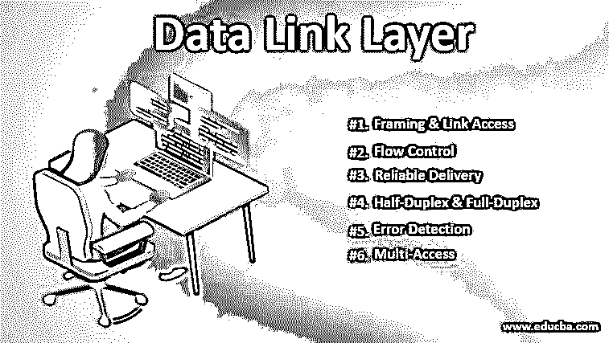

# 数据链路层

> 原文：<https://www.educba.com/data-link-layer/>

## 数据链路层简介

数据链路层是 OSI 模型的第二层，位于物理层和网络层之间。OSI 或换句话说，开放系统互连模型是一种概念模型，它广泛用于软件行业，尤其是通信领域，用于表征和标准化功能，而不涉及结构或技术中的内部结构。OSI 模型中的这一层定义了两台设备之间建立和终止连接的协议。该层被细分为 2 个子层，即媒体访问控制和逻辑链路控制。在下面几节中，我们将详细介绍这两个子层以及其他组件。

### OSI 模型的层次

在上一节中，我们已经大致了解了 OSI 模型，现在让我们看看这个概念模型中的其他层是什么。OSI 模型的 7 层是:

<small>网页开发、编程语言、软件测试&其他</small>

1.  物理层
2.  [数据链路层](https://www.educba.com/data-link-layer-osi-model/)
3.  网路层
4.  传输层
5.  会话层
6.  表示层
7.  应用层

现在来看数据链路层的子层，即媒体访问控制(MAC)和逻辑链路控制(LLC ),媒体访问控制有助于控制负责与传输媒体交互的硬件，逻辑链路控制充当 MAC 子层和网络层之间的连接，并使用多路复用机制来允许多个网络协议在多点网络中共存。划分为子层是为了引入标准化实践的模块化概念。

数据链路层的主要功能是通过单个链路传输数据报。现在，在本声明中，我们遇到了两个新术语，让我们先简要了解一下，然后再继续。其中一个术语是链路，链路是连接相邻节点的通信通道。对于另一个术语“数据报”，让我们从一个类似的情况来理解它。现在让我们准备一份从班加罗尔到西孟加拉邦某个偏远地方的行程表。整个旅行将涉及 3 种基本交通工具，即飞机、火车和公共汽车。现在，这三种交通方式是相互独立的，我们假设这种联系本质上是直接的，但是提供一种基本的服务，将你从一个地点转移到邻近的地点，以便你可以乘坐下一次服务。在这个类比中，旅行的人是数据报，旅行者旅行的每个传输段都类似于链路，使用的每种模式都是链路层协议。

### 数据链路层服务

现在我们对什么是链路、数据报以及在更高的层次上什么是数据链路层有了一个大致的概念，让我们来看看它们所提供的方面和服务，这将概括 OSI 模型中数据链路层的重要性。简而言之，数据链路层提供 6 种服务，它们是:

#### 1.成帧和链接访问

甚至在传输开始之前，每个网络帧都被层协议封装。前面我们讨论了由多个数据字段组成的帧，每个数据字段都包含插入的数据报。此处指定了帧的结构以及用于在链路上传输帧的信道接入协议。

#### 2.流控制

进行传输的站点可能具有不同的速度或容量，这一层确保数据流以相同的速度交换数据。在流不受控制的情况下，接收方缓冲区可能溢出，导致帧丢失。

#### 3.可靠交付

谈论传输而不谈论可靠的交付服务是不完整的，而这正是数据链路层通过传输和确认的概念来实现的。典型地，我们在传输中遇到问题的翻转位的问题。在本地检测错误，并尝试恢复原始数据以及发送方的错误报告机制。

#### 4.半双工和全双工

这种特性是为了在数据传输中提供灵活性。在全双工模式下，两个节点能够同时传输数据，而在半双工模式下，只有一个节点能够同时传输数据。

#### 5.误差检测

在错误检测中，数据链路层提供了一种机制，用于检测可能由信号衰减或噪声引起的一个或多个错误。这种检测功能可以通过在被传输的帧中使用错误检测比特来实现，并且可以基于这些比特来执行错误检查。

#### 6.多路存取

多路访问的功能非常重要，因为它避免了由于共享链路上的主机试图共享数据而可能发生的冲突。部署 CSMA/CD 机制是为了允许在多个系统之间访问共享介质。

### 数据链路层的优势

在前面的章节中，我们全面地介绍了数据链路层的不同方面，并深入探讨了它的重要性或功能。

1.  由于 OSI 模型非常通用，拥有一个标准化的模型有助于集成，而不会有太多的麻烦。
2.  具有隐藏协议允许任何协议实现，并且具有适应许多协议的灵活性。
3.  它通过面向连接的方法和无连接服务提供连接。当我们需要高可靠性并且不太关心速度时，使用连接服务，反之亦然，要求无连接传输。
4.  由于围绕错误检测和可靠传递有如此多的功能，消息不会无序到达。

### 结论

在本文中，我们全面深入了数据链路层，首先介绍了它是什么。总之，它负责将数据流一位一位地转换成信号，最后，信号被拾取并组装成可识别的帧格式。

### 推荐文章

这是数据链路层的指南。这里我们讨论数据链路层的服务和重要组件，并继续讨论数据链路层的不同功能。您也可以看看以下文章，了解更多信息–

1.  [什么是 OSI 模型？](https://www.educba.com/what-is-osi-model/)
2.  [OSI 模型 vs TCP/IP 模型](https://www.educba.com/osi-model-vs-tcp-ip-model/)
3.  [鱼模型](https://www.educba.com/fish-model/)
4.  [数据链路层 OSI 模型](https://www.educba.com/data-link-layer-osi-model/)

