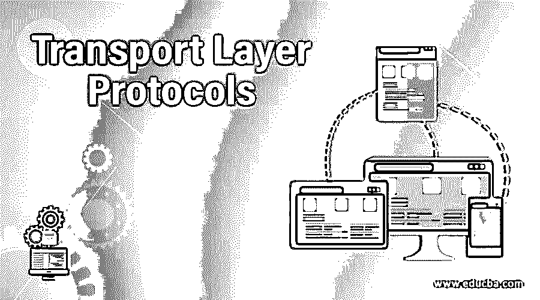
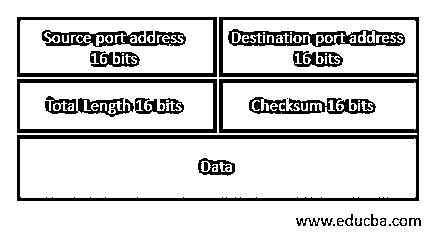
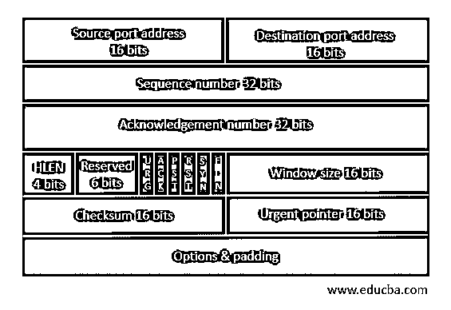

# 传输层协议

> 原文：<https://www.educba.com/transport-layer-protocols/>

## 传输层协议简介

随着互联网的日益复杂和计算机的广泛使用，几个程序同时在计算机上运行。计算机不断地发送和接收几条信息。发送和接收的计算机将信息从一台计算机传输到另一台计算机，也从一台计算机传输到另一台计算机。传输层协议可以是无连接的，也可以是面向连接的。每个数据段都被视为独立的第一个数据包，并以无连接方式传输到目的机器传输层。在源和目的地的传输层之间建立链路后，每个数据段都以连接驱动的方式传输。传输层是整个协议层次的中心。有两种协议显示传输层。
1。UDP
2。传输控制协议（Transmission Control Protocol）

### 什么是 UDP？

UDP 的完整形式是用户数据报协议。这是一个无连接协议。UDP 是传输层的端到端协议，它从顶层添加传输层地址、校验和中的错误控制以及数据长度。UDP 协议数据包称为用户数据报。下面的用户数据表中显示了一个 16 字节的标题:

<small>网页开发、编程语言、软件测试&其他</small>

在这里，您将看到以下组件

*   **目的端口地址:**指定接收消息的请求进程的地址。目的端口的地址是 16 位。
*   **校验和:**控制是用于检测错误的 16 位字段。
*   **总长度:**这决定了用户数据报的总长度，以字节为单位。这是一个 16 位的区域。
*   **源端口地址:**指定已经发送消息的应用进程地址。源端口的地址是 16 位。

UDP 服务和程序的例子有 DNS、IP 电话和 DHCP。

#### UDP 的缺点

1.  UDP 可以注意到有错误，但不会指出哪个数据包丢失了，因为它没有 ID 或数据序列号。
2.  3 它没有顺序或重新排序功能，当记录错误时，它不指示损坏的包装。
3.  UDP 提供了端到端传输交付所需的关键功能。

### 什么是 TCP？

TCP 也称为传输控制协议。它是面向连接的传输协议。TCP 是一种协议，它指定了如何开发和维护网络连接，在该协议下，应用程序可以共享数据。TCP 使用互联网协议(IP)来描述计算机如何相互传输数据包。使用 TCP 的服务和程序的例子有 HTTP、HTTPS、FTP 以及许多计算机游戏。

*   **控制位:**每个控制区独立运行。控制位指定数据段的操作，或者作为有效性测试用于某些字段。
*   **确认号:**其他通信设备的数据由一个 32 字段的确认号确认。如果 ACK 置 1，则指定接收方期望接收的序列号。
*   **报头长度:**将指定 32 位字的 TCP 报头。标题最小长度为 5 个字，最大长度为 15 个字。还有 60 个字节用于 TCP 报头，20 个字节用于 UDP 报头。
*   **源端口地址:**在源机器中用于指定应用的地址。这是一个 16 位的空间。
*   **序列号:**数据流分为两个或两个以上的 TCP 部分。32 位数字序列字段是数据在原始数据流中的位置。
*   **目的端口地址:**在目的机器中用来标识应用程序的地址。这是一个 16 位的字段。

#### TCP 协议的特点

*   **多路复用:**多路复用是一种在单独的计算机上从各种应用程序接收数据并将其转发到每个服务器的方法。数据被发送到接收端的正确设备。它被称为多路分解。通过使用称为端口的逻辑通道，TCP 将数据包传输到适当的程序。
*   **全双工:** TCP 提供全双工操作，即同时双向传输数据。TCP 是否可以发送和接收缓冲区，以便数据段可以在全双工服务中双向流动？TCP 是一种绑定的协议。假设进程 A 需要发送和接收来自进程 B 的数据。
*   **流量控制:**TCP 一旦接收到一个数据包，就返回给发送方显示字节数，而不会耗尽内部缓冲区。在 ACK 中，字节数作为最高序列号发送，这很容易获得。它也被称为窗口过程
*   **逻辑连接:**逻辑关系被称为套接字、序列号和窗口大小的组合。发送和接收进程使用的套接字对用于对每个连接进行分类。

### 结论

在本文中，我们已经了解了什么是传输层协议，它们的工作原理及其优缺点。

### 推荐文章

这是传输层协议指南。这里我们讨论一个传输层协议的介绍，什么是 UPD 和 TCP 的特点，优点和缺点。您也可以浏览我们的其他相关文章，了解更多信息——

1.  [路由协议类型](https://www.educba.com/routing-protocols-types/)
2.  [什么是网络协议](https://www.educba.com/what-is-networking-protocols/)
3.  [网络协议的类型](https://www.educba.com/types-of-networking-protocols/)
4.  [什么是浏览器？](https://www.educba.com/what-is-browser/)

