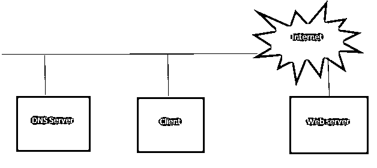

# 什么是网络协议

> 原文：<https://www.educba.com/what-is-networking-protocols/>

## 网络协议简介

网络协议是一组定义明确的规则，用户通过这些规则在 internet 或 intranet 上进行通信。通信信道的两端都遵守这些规则来进行适当的信息交换。协议是由基于行业的人、研究机构等开发的。然后通过国际会议的方式发表并被接受。这些协议基于多种基础进行分类；有些与传输层有关；有些与网络层有关。

### 了解网络协议

当我们试图定义[网络模型](https://www.educba.com/networking-interview-questions/)时，两种分层模型出现在网络根基所在的画面中

<small>网页开发、编程语言、软件测试&其他</small>

*   [OSI 模型](https://www.educba.com/osi-model-vs-tcp-ip-model/)
*   TCP/IP 模型

**OSI 模型是一个 7 层模型，由以下处理其任务的层组成:**

1.  应用层
2.  表示层
3.  会话层
4.  传输层
5.  网路层
6.  [数据链路层](https://www.educba.com/data-link-layer/)
7.  物理层

与 OSI 模型相比，TCP/IP 模型只包含 4 层，它们只处理任务:

1.  应用层
2.  传输层
3.  互联网
4.  网络存取

*   应用层拥有用户的数据，处理[编码](https://www.educba.com/encoding-vs-decoding/)机制。
*   传输层支持终端设备之间的通信。
*   互联网层提供逻辑寻址。
*   网络层控制路由器等硬件设备。
*   数据链路层负责 mac 寻址等。，并与物理层进行通信。
*   物理层承载硬连线层的所有内容。

现在，让我们了解什么是 IP 地址以及与之相关的网络协议。

IP 地址是二进制数的十进制表示，本质上对于每个设备都是唯一的，因此它充当连接到网络的设备的标识。与此相关的有两个协议，分别是 [IPv4 和 IPv6](https://www.educba.com/ipv4-vs-ipv6/) 。

*   在 [IPv4 寻址](https://www.educba.com/ipv4-header-format/)中，有公有和私有 IP。私有 IP 可以在网络内部访问，而公共 IP 可以通过互联网访问。

### 网络协议是如何工作的？

这里我们先来了解一下 DNS 的工作原理:

让我们来理解当你点击 www.google.com 时会发生什么；客户端在这里代表您系统的浏览器，您可以通过它在互联网上提交请求，一旦您点击这个 URL，通过信道的调用就会被传输到 DNS 服务器，它会询问“这个 URL 映射的地址是什么？”现在 [DNS 服务器](https://www.educba.com/what-are-the-types-of-dns-servers/)已经安装了缓存；它可能已经有了结果，或者在其他情况下，它将与其他 DNS 服务器通信并返回一个 IP。因此，在 IP 解析之后，来自客户端的请求到达该主机的 web 服务器。

### 网络协议的类型

下面是[不同类型的网络协议](https://www.educba.com/types-of-networking-protocols/)，如下:

#### 1.IPv6

指的是互联网协议版本 6，是未来的寻址格式，我们很快就会看到 IPv4 地址随着机器数量的增加而耗尽，正在构建的公共 IP 将进入版本 6。它为 3.4*10^34 提供了独特的地址组合，因此可以代表大量连接到互联网的机器。显然，一旦不得不引入它，[路由协议](https://www.educba.com/routing-protocol/)和硬件可能会在架构上看到大量的变化。

#### 2.IPv4

这已经是我们上面讨论过的现有技术。

#### 3.TCP/IP 协议

基于 TCP/IP 的协议进一步分为以下几类:

**a .网络协议**

*   **HTTP**–它代表超文本传输协议，消息的格式，传输，这个协议管理客户端和服务器端相关的 web 动作。万维网使用它。它在端口 80 上运行。
*   HTTPS:它代表超文本传输协议安全，所以它似乎只是增强了 HTTP。这用于安全通信；因此，无论何时你离开了当地的东道主世界，就走这条路。
*   **TLS**–代表传输层安全；这是一种加密协议，在网络上提供端到端的通信安全，通常用于交易中；通过防止伪造、防止数据泄漏等来维护安全性。
*   **SSL**–它代表安全套接字层，在浏览器和服务器之间建立加密链接，web 服务器需要 SSL 证书。公钥和私钥是以加密方式创建的。

**b .文件传输协议**

*   **FTP**–[文件传输协议](https://www.educba.com/what-is-ftp/)用于[计算机网络](https://www.educba.com/introduction-to-computer-network/)上客户端和服务器之间的文件传输。
*   **TFTP**–[琐碎文件传输协议](https://www.educba.com/tftp/)是客户端如何获取文件并将其放入远程主机，从局域网启动的节点使用它。
*   **SFTP**–SSH 文件传输协议提供了一个安全的连接，用于在本地和远程系统上传输文件和遍历文件系统。
*   **FTPS**——这是一个[安全文件传输协议](https://www.educba.com/what-is-sftp/)；这里增加了 TLS 支持和 SSL 我们没有使用安全的基于外壳的协议。
*   **SMB**–windows 使用的服务器消息块，允许同一网络内的计算机共享文件。
*   **NFS**–[网络文件系统](https://www.educba.com/nfs-in-linux/)是一种分布式文件系统[，一般用于 UNIX](https://www.educba.com/uses-of-unix/) 中，以访问同一网络上计算机之间的文件。

**c .电子邮件协议**

*   **SMTP**–[简单邮件传输协议](https://www.educba.com/simple-mail-transfer-protocol/)是发送电子邮件的推送协议、邮局协议或互联网消息访问协议，用于在接收方检索这些内容。它是在应用层实现的。

**d 管理协议**

*   **Telnet**——用于互联网和局域网上进行双向文本通信；它使用虚拟终端连接。
*   SSH 是一种安全的基于 shell 的远程登录，从一台计算机登录到另一台计算机。身份验证和安全性也可以考虑。
*   **SNMP**–简单网络管理协议用于收集和组织网络中设备的信息，并修改这些信息。

**媒体协议**

*   **RTP**–实时传输协议用于网络上的音频和视频通信。
*   **RTSP**–实时流协议是一种用于流式传输的协议；它在端点之间建立媒体会话。

### 结论

我们对可用的网络协议种类以及它们能为我们提供什么有一个肤浅的想法。讨论了 DNS 服务器如何工作以及如何帮助地址解析、IPv4、IPv6 和其他一些协议。

### 推荐文章

这是什么是网络协议的指南。这里我们讨论了概念，不同类型的网络协议。您也可以浏览我们推荐的其他文章，了解更多信息——

1.  [什么是神经网络？](https://www.educba.com/what-is-neural-networks/)
2.  [网络面试问题](https://www.educba.com/networking-interview-questions/)
3.  [什么是网络安全？](https://www.educba.com/what-is-network-security/)
4.  [FTP vs TFTP](https://www.educba.com/ftp-vs-tftp/)

