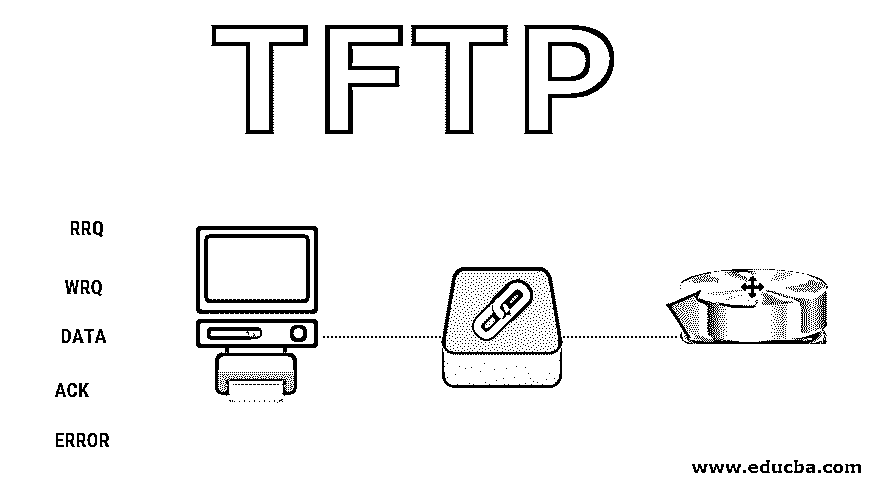

# 普通文件传送协议(Trivial File Transfer Protocol)

> 原文：<https://www.educba.com/tftp/>

## 什么是 TFTP？

TFTP 代表简单文件传输协议。当用户需要复制他们的文件时，使用该协议。换句话说，它允许用户从远程主机存储和访问他们的文件。它主要用于引导系统。为了理解这个概念，让我们举一个简单的例子，假设你有一个引导的无盘系统或路由器；为此，您需要下载引导文件和配置文件。在这种情况下，您需要一个协议来以更快的速度复制这些文件。在这里，TFTP 进入了画面。它被设计用来复制这些类型的文件。

它只需要 IP(互联网协议)和 UDP(用户数据报协议)。它执行两个操作，读和写，即。在读操作中，它从服务器端向客户端复制文件，而在写操作中，它的工作方式正好相反；它将文件从客户端复制到服务器端。

<small>网页开发、编程语言、软件测试&其他</small>

它在众所周知的端口 69 上使用 UDP 服务。

### TFTP 消息的类型

下面列出了五种类型的 TFTP 消息:

*   RRQ
*   WRQ
*   数据
*   命令正确应答
*   错误

#### 1) RRQ 消息

RRQ 代表读请求消息。客户端用它来创建一个从服务器端读取数据的连接。RRQ 消息有三个字段操作码、文件名和模式。操作码的大小是 2 字节；它包含 1 以显示 RRQ 消息。Filename 定义文件的名称。模式定义传输模式。传输模式对于 ascii 文件可以是 netascii，对于二进制文件可以是 octet。RRQ 的消息格式如下。

#### 2) WRQ 消息

WRQ 代表写请求消息。客户端使用它来创建一个从服务器端写入数据的连接。WRQ 消息具有与 RRQ 相同的字段，唯一的区别是操作码包含 2 来显示 WRQ 消息。这里我们可以看到 WRQ 报文格式。

#### 3)数据信息

客户端和服务器都使用数据消息来发送数据块。数据包含三个字段–操作码、块号和数据。操作码包含 3 来显示数据消息。块号是包含块号的 2 字节字段。所有块从 1 开始顺序编号。客户端和服务器使用该字段顺序发送数据，以便接收方使用该块号组合整个消息。数据为 512 字节。数据可以以 netascii (ASCII 文件)或 octet(二进制文件)的形式传输。数据消息格式如下所示。

#### 4)确认消息

ACK 代表确认消息。客户端和服务器都使用此 ACK 来确认数据块的接收。该消息有 4 个字节。它包含两个字段——操作码和块号。操作码包含 4 以显示 ACK 消息。块数是一个 2 字节的字段，包含接收的数据块数。ACK 消息也可以响应 WRQ 消息，该消息由服务器发送给客户端，用于指示服务器准备好从客户端接收数据。ACK 消息格式如下所示。

#### 5)错误信息

当客户端和服务器之间无法建立连接或者在数据传输过程中出现错误时，客户端和服务器使用错误消息。它对 RRQ 信息或 WRQ 信息发出了否定的回应。该消息包含三个字段——Oe、错误号和错误数据。操作码包含 5 来显示错误信息。错误号为 2 字节，包含错误号及其含义。错误消息格式如下所示。

以下是错误号及其含义的列表

0–未定义

1–找不到文件

2–访问冲突

3–磁盘已满或超出配额

4–非法操作

5–未知端口号

6–文件已经存在

7–没有这样的用户

错误数据字段包含文本格式的错误数据。它是一个 1 字节的字段，以 0 结束。

### TFTP 关系

它使用 RRQ 消息、WRQ 消息、ACK 消息和错误消息来建立连接。在终止连接时，TFTP 使用数据消息。

#### 1)连接建立

读取文件的连接建立过程不同于写入文件。

*   **读取:**客户端发送 RRQ 消息，建立读取连接。该消息包含文件的名称和文件的传输模式。一旦建立了连接，如果服务器能够传输文件，则服务器发送带有数据消息的肯定响应。假设它没有发送带有错误消息的否定响应。
*   **写:**客户端发送 WRQ 消息，建立写连接。该消息包含文件的名称和文件的传输模式。一旦建立了连接，如果服务器能够复制文件，服务器将发送一个带有 ACK 消息的肯定响应。假设它没有发送带有错误消息的否定响应。

下面是读写操作的表示

#### 2)连接终止

文件传输后，必须终止连接。它不使用特殊消息来终止连接。通过发送最后一个小于 512 字节的数据块来完成终止。

### 推荐文章

这是 TFTP 旅游指南。在这里，我们已经讨论了不同类型的 TFTP 消息的概述，TFTP 连接是如何建立的，以及便于理解概念的终止。您也可以阅读以下文章，了解更多信息——

1.  [FTP vs TFTP](https://www.educba.com/ftp-vs-tftp/)
2.  [FTP 命令](https://www.educba.com/ftp-commands/)
3.  [编程 vs 网页开发](https://www.educba.com/programming-vs-web-development/)
4.  [虚拟主机的类型](https://www.educba.com/types-of-web-hosting/)

