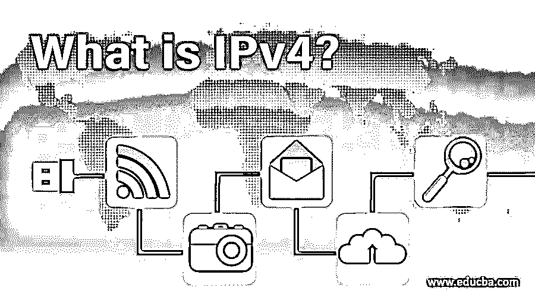
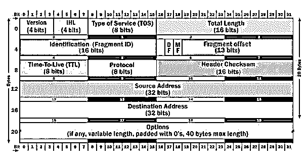

# 什么是 IPv4？

> 原文：<https://www.educba.com/what-is-ipv4/>

## IPv4 简介

IPV4 是互联网协议第 4 版，用于 TCP/IP 协议套件的 IP 层，以识别连接到互联网的每台设备。IPV4 地址是唯一和通用的，32 位长，具有 2^32 或 4，294，967，296 的地址空间，使用三种表示法来表示地址，二进制表示法(基数 2)，十六进制表示法(基数 16)，点分十进制表示法(基数 256)。IPV4 数据包报头由 14 个字段组成，其中 13 个字段是必需的，14 个是可选的。

### IPv4 的示例

以下是 IPv4 的示例:

<small>网页开发、编程语言、软件测试&其他</small>

IP 地址 105.249.119.16 代表 32 位十进制数，在二进制中为:

01101001.11111001.01110111.00010000.

*   它用于分组交换网络中，以实现不间断联网。
*   它有一种标准化的格式，可以将信息从一台设备传送到通过互联网连接的另一台设备。
*   为连接在网络之间的每个设备提供标识。
*   每种设备都有不同的配置方法，不同的网络类型也有不同的配置方法。
*   IPv4 定义了 32 位(4 字节)地址，它使用 3 类:A、B、c。
*   A 类用于较大的网络。它使用 8 位用于联网，24 位用于托管。
*   B 类用于中型网络。它使用 16 位用于联网，16 位用于托管。
*   C 类用于较小的网络。它使用 24 位用于联网，8 位用于托管。
*   此外，D 类用于多播，E 类用于实验目的。

#### 1.IP 地址

互联网协议地址(IP 地址)是分配给连接到使用互联网协议进行通信的网络的设备的数字标签。internet 层将下一跳地址的 IP 地址传递给网络层。这个地址被绑定[到一个物理地址](https://www.educba.com/what-is-a-physical-address/)，并且形成一个新的帧。原始帧的其余部分在通过通信信道发送之前封装在新帧中。网络层是 OSI 模型的主干，负责管理节点间数据传输的最佳逻辑路径。

通常，它由二进制值组成，并驱动互联网上所有数据的路由。

IP 地址有两个主要功能:

*   主机/网络接口标识
*   位置寻址

#### 2.互联网地址编码分配机构(Internet Assigned Numbers Authority)

IANA(互联网号码分配机构)和 5 个 rir(地区互联网注册管理机构)管理 IP 地址空间。他们负责将指定区域分配给本地互联网注册管理机构，如互联网服务提供商和其他最终用户。并且根据网络实践和软件特征，这种分配可以是静态的或动态的。

### IPv4 数据报报头

以下是数据报报头的图解说明:

下面以表格格式给出了 IPv4 数据报报头:

| **版本** | 这是一个 4 位字段，它告诉我们正在使用的 IP 版本。 |
| 伦 | 它给出了报头的长度。最小报头长度应该是 20 字节，因为 4 比特的最大报头大小是 15。如果我们使用选项字段，60 字节(20+40)将是最大的报头长度。 |
| **服务类型** | 前 3 位表示优先级，接下来的 4 位表示服务类型，最后一位不使用。4 位服务定义了延迟、吞吐量、可靠性和成本。 |
| **总长** | 总长度字段定义了数据报的总长度，包括报头。总长度可以计算为数据长度+报头长度或数据长度=总长度-16 位报头长度。 |
| **标识(片段 ID)** | 由于 IPv4 是一种数据报服务，这些位有助于唯一识别数据报数据包上的碎片何时结束。 |
| **标志** | 该标志使用标识字段来指示分段，基本上告知是否可以分段或者当前的分段是最终分段。 |
| **片段偏移量** | 每个片段的相邻位置从原始数据的开始以 8 字节为单位进行测量。 |
| **生存时间** | 这有助于误导数据报的事务。它测量数据报可以通过的路由器数量。它通过将值递减到 1 直到达到 0 来进行检查。数据报到达零时被丢弃。 |
| **协议** | IPv4 包含来自各种协议的数据。该字段有助于网络层了解哪些数据属于哪种协议。 |
| **报头校验和** | 该字段用于检测数据包或消息中的错误。 |
| **源 IP 地址** | 发送主机的 32 位地址。 |
| **目的 Ip 地址** | 接收主机的 32 位地址。 |
| **选项** | 每个数据报不指定选项字段。它是包含安全限制、路由等的规范列表。 |

### 限制

下面给出了提到的限制:

*   **地址空间不足:**随着接入互联网的设备数量快速增长，地址空间很快就会耗尽。
*   **弱协议可扩展性:**IP v4 报头大小不足，无法容纳所需数量的附加参数。
*   **通信的安全限制问题:**网络上托管的信息没有限制访问。最初是为孤立的军事网络设计的。后来改编为公共教育&研究网。
*   **缺乏高质量的服务支持:**由于这个原因，信息带宽和某些网络不支持延迟。
*   **地理限制:**由于它是在美国创建的，所以涉及到 IP 地址的分配，几乎有 50%是留给美国的。

### 利益

下面是提到的好处:

*   **可靠的安全性:**该地址包具有数据加密功能，以在公共媒体通信期间保持隐私&安全性。
*   **大型路由任务:**大量的功能路由器使其成为互联网的骨干，因而具有至关重要的网络分配。基础设施既依赖于分层的&扁平路由。在没有 NAT 的情况下，通过大型网络连接多个设备也变得很容易。
*   **视频图书馆和会议:**互联网用户数量的增加降低了在线数据传输的速度。这种通信模式提供了优质的服务&高效的数据传输。TCP &大多数情况下使用 UDP 服务；尽管功能有限，IPv4 地址被重新定义&允许数据加密。
*   **灵活性:** IPv4 路由更具可扩展性&高效，因为寻址是聚合的。具体来说，它适用于组织中跨网络的多播&数据通信。

### IPv4 的使用

地址分配在 5 个 rir 中建立，其 IP 地址为:

*   **非洲网络信息中心(AFRINIC):** 服务于非洲和印度洋部分地区。
*   **美国互联网号码注册局(ARIN):** 服务于加拿大、加勒比海部分地区、美国以及北大西洋群岛。
*   **亚太网络信息中心(APNIC):** 服务于亚洲和大洋洲的大部分地区。
*   **拉丁美洲和加勒比海网络信息中心(LACNIC):** 服务于拉丁美洲和加勒比海部分地区。
*   欧洲网络协调中心(RIPE NCC): 服务于欧洲、中亚和中东。

这些区域负责为该区域内的运营商和互联网用户分配 IP 地址。由于 IP 地址分配不足，RIR 的 IPv4 数量已经耗尽。为了解决 IP 地址短缺的问题，扩大地址在通信中的使用范围，以提高访问效率，IPv6 应运而生。由于 IPv4 中的地址耗尽，IPv6 的基础设施设计和处理有效负载的能力都有所提高。

### 推荐文章

这是一个什么是 IPv4 的指南？这里我们讨论 IPv4 和数据报报头的介绍及其局限性、优点和用法。你也可以看看下面的文章来了解更多-

1.  [IPv4 报头格式](https://www.educba.com/ipv4-header-format/)
2.  [IPSec 协议](https://www.educba.com/ipsec-protocol/)
3.  [什么是 IPv4？](https://www.educba.com/what-is-ipv4/)
4.  [什么是子网？](https://www.educba.com/what-is-subnet/)

