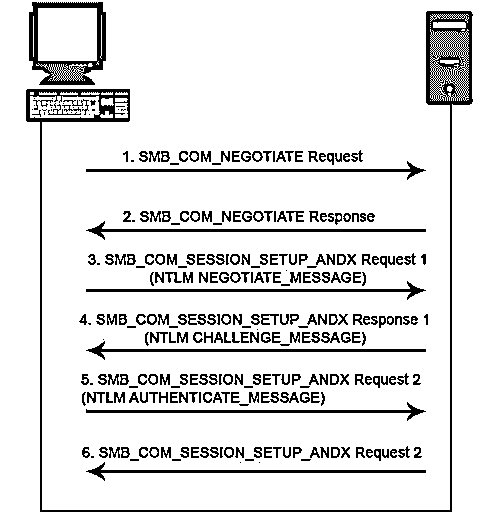

# CIFS 议定书

> 原文：<https://www.educba.com/cifs-protocol/>

## 《CIFS 议定书》概述

CIFS 协议代表通用互联网文件系统协议，顾名思义，是一种文件传输协议，允许用户访问网络中的文件。它包含三个主要组件，即客户端、服务器和用于放置和访问文件的应用程序。在其他类型的文件传输协议中没有观察到的 CIFS 协议中的一个附加协议是，借助于称为“子协议”的内置远程过程，文件可以被发送到打印队列

### 什么是 CIFS？

CIFS 是通过网络在同一文件和打印机之间访问的文件传输/共享协议。有权访问共享文件夹的用户可以读取、写入或编辑网络区域中的文件。它还为客户端用户提供了对打印队列的访问、服务之间的通信以及远程程序(称为子协议)的安全文件传输。

<small>网页开发、编程语言、软件测试&其他</small>

《CIFS 议定书》的缩写如下:

*   **常用:**是一种常用或普遍可用的联网系统。这是通过网络共享/访问文件的一种非常安全的方式。
*   **互联网:**它是文件共享发生的网络。
*   文件系统: CIFS 允许通过网络共享文件、目录、队列等。

有三个主要的实体来定义 CIFS。它们是客户端、服务器和应用程序。

*   **客户端:**客户端开始发起消息，协议建立。
*   **服务器:**在网络中存储消息，并且大部分实现功能在服务器中执行。
*   **应用:**这里客户端通过网络访问共享文件。

存在与 CIFS 相关联的子系统来执行通过网络实现 CIFS 协议以将安全文件传输到其他系统的功能。这些功能包括用户安全文件传输、分布式文件系统、远程过程调用。这些功能可以分离或集成为单个功能来实现 CIFS 协议。

### 《CIFS 议定书》的特点

以下是 CIFS 的特色。

1.  **认证传输:**客户端可以在网络内创建安全的文件传输，这样就不会发生数据丢失。
2.  **独立传输:**为了在客户端和服务器之间传递 SMB 消息，我们不需要任何外部传输协议。
3.  **资源访问:**客户端可以同时访问许多共享服务，如编辑文件、删除文件或服务器上的打印队列。
4.  RPC 传输: CIFS 为 RPC 和 RAP 等 RPC 协议提供认证文件传输。
    安全缓存:CIFS 支持记录跟踪并允许客户端缓存数据以获得更好的性能。
5.  扩展属性: CIFS 还支持非文件系统下的属性，如作者姓名、内容、描述。
6.  **文件访问:**客户端可以通过网络访问文件。访问包括读、写、编辑等。
7.  **通知:**当一个文件的内容被用户或客户端通过网络修改时，服务器会得到关于这个改变的通知。

### CIFS 协议是如何工作的？

CIFS 是通过网络访问文件的简单文件共享协议。以下是通过网络共享文件的过程:

1.  客户端向他想要访问的服务器发送请求。
2.  服务器接受请求。
3.  然后，服务器将响应发送回客户端。
4.  服务器与其他服务器相互连接，并与客户端共享文件。

### CIFS 机制示例

从客户端到共享服务器的文件拷贝:

使用的文件共享取自 Windows NT server OS。它被定向到 Windows 98 操作系统上的 Y 驱动器。这个文件传输是在 MS-DOS 操作系统中进行的。
C:\ >复制 file1.txt y:\file2.txt

### CIFS 与其他文件系统

下面详细解释了 CIFS 和其他文件系统的区别。

#### CIFS 对 NFS

NFS 是一种客户端-服务器协议，允许在服务器、笔记本电脑、台式机和其他设备之间传输认证文件。客户可以非常高效地保存、编辑、查看和替换文件中的内容。在这种情况下，客户端请求访问位于另一台计算机上的服务器中的文件。NFS 早期用于 Linux 和 Unix 操作系统，而 CIFS 用于 Windows 操作系统。

#### CIFS vs 中小企业

SMB 是 IBM 在 20 世纪 80 年代早期开发的网络层应用程序。 [SMB 帮助客户端](https://www.educba.com/what-is-smb/)通过本地网络读写文件。后来，在 Windows、Linux 操作系统的支持下，微软推出了 CIFS。CIFS 使用 [TCP/IP 协议](https://www.educba.com/what-is-tcp-ip/)，像 HTTP、FTP 等早期使用的协议。CIFS 很难管理，因为有许多子功能和命令要处理。

这种复杂性被微软开发的 SMB 所取代。后来发布了许多版本的 SMB，以逐年提高它们的性能。目前，SMB 3.1.1 适用于采用 AES 128 CCM 加密的 Windows 10 操作系统。它还具有用于预认证检查的 SHA-512 散列密钥，以保护网络上的数据。

### CIFS 服务器安全

根据业务需求，您可以更改 CIFS 服务器的安全设置。我们需要修改 Kerberos 安全设置，使用 LDAP 安全设置，启用 ASES 加密来保护网络上的文件传输。

### 结论

由于其强大的功能，包括轻松访问服务器，认证文件传输，安全的文件缓存，CIFS 是很好的使用。在这个时代使用 CIFS 协议还是有差距的。采取措施改进现有 CIFS 的规格。

CIFS 使用会话服务来发送和接收命令，以通过共享网络实现安全且经过身份验证的文件传输。我们也可以说 CIFS 是一种文件传输协议，允许在工作的网络节点之间共享文件。

### 推荐文章

这是 CIFS 协议指南。在这里，我们将讨论 CIFS 协议的 7 大功能，以及 CIFS 与 NFS、CIFS 与 SMB 文件系统之间的区别。您也可以阅读以下文章，了解更多信息——

1.  [FTP vs SFTP](https://www.educba.com/ftp-vs-sftp/)
2.  [网络协议](https://www.educba.com/what-is-networking-protocols/)
3.  [CIFS vs NFS](https://www.educba.com/cifs-vs-nfs/)
4.  [CIFS vs 中小企业](https://www.educba.com/cifs-vs-smb/)

