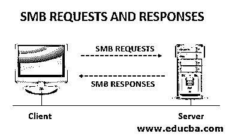

# 什么是 SMB？

> 原文：<https://www.educba.com/what-is-smb/>

## 服务器消息块(SMB)简介

IBM 在 20 世纪 80 年代首次创建了服务器消息块(SMB)协议。它是通过网络传输文件的通用互联网文件系统(CIFS)的版本之一。服务器消息块是一种网络通信传输协议，用于在网络之间提供对文件、打印机、端口的共享访问。

### 什么是服务器消息块？

SMB 是一种客户端-服务器交互协议，客户端请求文件，服务器将文件提供给客户端。它现在是一个基于 Windows 的网络，允许用户创建、修改和删除网络中的共享文件、文件夹和打印机。SMB 是一种应用层协议，使用 TCP 端口 445 进行通信。它还提供了一种基于 herborized 的相互通信机制，用于在客户端和服务器之间传输和共享文件。随着其版本的升级，用户或客户使用的服务更加增强和有效。

<small>网页开发、编程语言、软件测试&其他</small>

### SMB 是如何工作的？

服务器消息块是一种请求-响应协议，这意味着它在客户机和服务器之间传输多条消息来完成请求。

下图说明了它是如何工作的。在这里，客户端必须向服务器请求它的需求，并得到服务器的响应。服务器制造文件系统和其他服务，如文件、文件夹、打印机、端口等。，可供网络上的客户端或用户使用。

### 服务器消息块的特性

随着 SMB 版本的增加，性能水平也在提高。以下是中小型企业的几个重要特征:

*   SMB 提供了一种经过身份验证的相互通信过程机制，以在服务器内共享文件或资源(文件、文件夹、打印机)。
*   SMB 为客户端提供编辑文件、删除文件、共享文件、浏览网络、打印服务等功能。，通过网络。
*   SMB 版本 2 减少了用于通过网络传输文件的大量命令和子命令的使用。
*   SMB2 支持符号链接，作为 SMB 版本 1 的增强版本。

### 服务器消息块版本增强

以下是 SMB 版本的增强功能:

#### 1.SMB1

SMB1 非常类似于 CIFS 协议，它通过网络共享文件，以有效的方式在客户端之间访问这些文件。SMB 最初被引入运行在 NetBIOS 和 [TCP/IP 接口](https://www.educba.com/what-is-tcp-ip/)之上。SMB 版本 1 协议带来了性能问题，因为它使用了一种低效的网络资源方式。为了减少网络问题，临时版本的 SMB2 被引入。

#### 2.SMB2.0

微软随后推出了版本 2，以改善网络资源的不正确使用。通过将用于系统通信的命令和子命令的数量减少到 19 个，SMB2 减少了 SMB1.0 版本文件系统协议的“聊天性”。这个版本还有一个管道机制，在对前一个请求的响应到达之前发送一个额外的服务请求。这种机制提高了性能水平，这在以前的 SMB 1.0 版本中是滞后的。SMB1.0 使用 16 位数据大小，而 SMB2.0 使用更高级别的 32 或 64 位宽存储数据字段。这有助于存储更大的文件数据，并在更短的时间内通过网络传输大文件。

#### 3.SMB3.0

后来在 WINDOWS 8 Server 和 windows server 2012 中引入了 SMB3.0 版本。它的引入是为了提高端到端的加密级别。

#### 4.SMB3.1.1

此版本的 SMB 是在 Windows 10 Server 和 Windows server 2016 中推出的。SMB 3.1.1 版本使用 AES [加密算法，通过 SHA-512 哈希密钥实施](https://www.educba.com/encryption-algorithm/)预认证安全检查。

### CIFS VS 中小企业

CIFS 和中小型企业在其早期版本中的功能是相同的。也有人说 CIFS 是 SMB 版本 1 的一种形式。CIFS 通常用于较大的公司，在这些公司中，许多人处理客户或雇主需要的大量或更大的数据。我们需要一组用于传输的消息包来确定协议的版本，这被称为方言。一般认为 CIFS 是 SMB 的一种方言形式。

### 使用哪一个，CIFS 还是中小企业？

下面是一些比较，以确定 CIFS 或中小型企业的更好使用:

*   在这个世界上，随着所有技术的更新，CIFS 现在很少比中小企业使用。借助服务器中文件传输期间的高级别预认证检查，SMB 取代了 CIFS。在 Windows 服务器领域，SMB 更受青睐。SMB2 版本支持 Windows Vista 2006，SMB3 支持 Windows 8 和 Windows Server 2012。
*   命令和子命令用于通过网络传输客户端请求的文件。在 CIFS，仅仅是传输一个文件就要使用 100 多条命令。但是在 SMB 中，它已经减少到了将近 19 个命令，这是通过系统传输文件的一种有效方式。
*   与 CIFS 协议相比，SMB 中的数据存储容量更大。在 SMB 中，我们可以存储 32 位数据。
*   SMB 是一种应用程序接口网络协议，而 CIFS 是一种运行在服务器之上的 TCP/IP 协议。
*   最初，CIFS 是一个“聊天协议”，是一个错误，被认为有网络问题。SMB 通过使用管道机制克服了这个问题。
*   因此，基于上述考虑，我们使用 SMB 而不是 CIFS。

### SMB 认证协议

SMB 包含两个级别的安全检查。它们是用户检查和共享检查。共享通常是指客户端请求的文件或文件夹、将由客户端通过服务器访问的目录或打印机服务。用户被称为请求通过网络访问文件的客户端。有一个用户级身份验证检查，表明客户端正在访问服务器。

客户端应该提供用户名和密码，以便进行用户级身份验证检查。只有当身份验证完成后，用户才能访问服务器上的请求。共享级身份验证检查是指由通过网络分配给文件或共享的密码控制的访问。这种共享级别的身份验证检查不需要用户名就可以访问文件，但需要一个与安全链接的密码，因此在访问期间不会存储任何用户身份。

### 推荐文章

这是一个什么是中小企业的指南？这里我们讨论 SMB 的特性、版本和认证协议。您也可以看看以下文章，了解更多信息–

1.  [什么是网络协议](https://www.educba.com/what-is-networking-protocols/)
2.  [传输层协议](https://www.educba.com/transport-layer-protocols/)
3.  [路由协议类型](https://www.educba.com/routing-protocols-types/)
4.  [网络协议的类型](https://www.educba.com/types-of-networking-protocols/)

