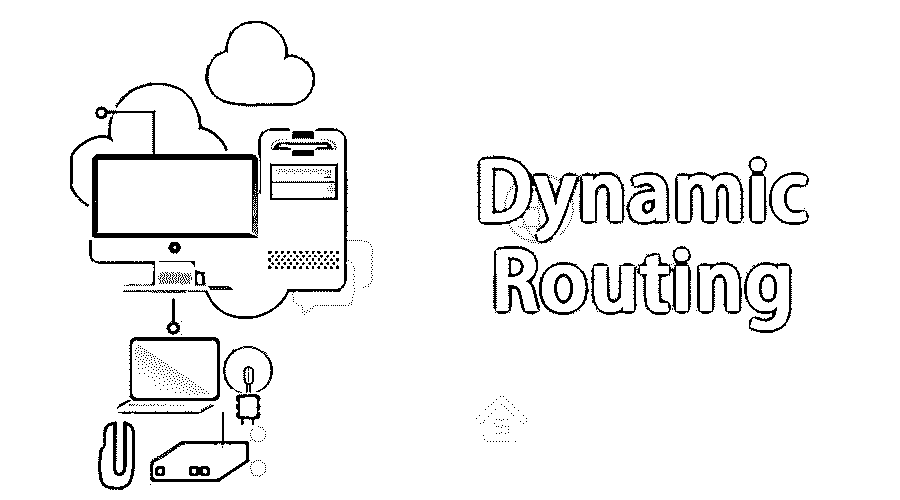

# 动态路由

> 原文：<https://www.educba.com/dynamic-routing/>

**

** 

## 什么是动态路由？

动态路由是一种网络路由过程，它便于路由器根据网络结构的逻辑变化实时挑选路由路径。这与典型的传统静态网络路由相反。这是一种自动化的路由技术，需要很少的管理和监督。这种路由方法中使用的各种协议包括开放最短路径优先(OSPF)、路由信息协议(RIP)、边界网关协议(BGP)和增强型内部网关路由协议(EIGRP)。

### 动态路由能做什么？

动态路由协议的工作原理解释如下:

<small>网页开发、编程语言、软件测试&其他</small>

*   路由器首先通过路由器接口发送路由消息，然后接收路由消息。
*   动态路由器消息还与使用完全相同协议的不同路由器共享信息。
*   然后，路由器会交换它们的路由信息，以便发现有关远程网络的数据。
*   当路由器发现拓扑结构发生[变化时，路由协议会向所有其他路由器通告该特定的拓扑结构变化。](https://www.educba.com/what-is-network-topology/)

在大型网络中，动态路由被认为很容易配置，而且在选择最佳路由、检测路由变化以及发现远程网络方面，它比静态路由更直观。

但是，由于路由器总是共享更新，它们消耗的带宽总是比静态路由消耗的多。路由器的 CPU 和 RAM 也面临着路由协议带来的负载。最后，动态路由被认为不如静态路由安全。

### 动态路由的优势

以下是提到的优点:

*   动态路由的自动化程度更高，路由会自动发送到所有其它路由器。
*   动态路由还涉及通知的改变，因为动态路由协议能够绕过拥塞的链路重新路由流量。
*   动态路由为用户提供了更长的正常运行时间，因为路由协议具有智能性，而且它的反应速度也更快；因此，用户可以看到更高的正常运行时间。
*   动态路由还处理更大的网络吞吐量，因为路由协议能够计算出可利用的响应最快的网络链路，并且用户可以看到网络中更少的延迟和更高的性能。
*   动态路由大大减少了管理员的工作量，因为当网络增长时，管理员不必担心网络上其它路由器的配置。相反，管理员会在新路由器上配置动态路由协议，与这些路由器通信，并让它们知道新路由器的网络。

### 动态路由协议

存在许多内部网关路由协议，即 IGP。这些是可以在网络中使用的协议。像 Windows 2003 Server 或 Linux 这样的服务器的每个路由器和操作系统都支持这些协议。一些协议解释如下:

#### 1.OSPF(开放最短路径优先)

这是一种非常著名的动态路由协议，目前仍在使用。OSPF 也是一种开放协议，以确保任何路由器甚至服务器操作系统都可以运行该协议。它通过使用成本作为度量来选择最佳路由。它也被认为是一个功能齐全的路由协议，也可以是复杂的；但是，它也可以扩展到网络中的任何规模。

#### 2.增强型内部网关路由协议

它被认为是思科的专有协议。仅供参考，只有 Cisco 设备使用 EIGRP。这是一个完整的协议，就像 OSPF 一样。它有一些惊人的功能，但在你确定你将有一个思科网络之前，建议使用开放协议(OSPF)。EIGRP 取代了它的前身 IGRP。选择通过 EIGRP 的[最佳路由所需的度量是使用一个公式计算的，该公式考虑了带宽、可靠性、链路延迟和负载。](https://www.educba.com/what-is-eigrp/)

#### 3.路由信息协议

RIP 被认为是一种开源协议。版本 2 是您现在应该使用的最新版本，因为它提供了 VLSM，即可变长度子网掩码支持。它是最简单、最容易配置的路由协议，尽管它的功能不如 OSPF。它被限制为用于少于 15 跳的网络的路由。这种协议非常适合不打算大规模扩展的小型网络。它的另一个很大的特点是最小的路由器和防火墙通常都支持它。

#### 4.边界网关协议

BGP 被认为是互联网的路由协议。它也是外部网关协议，即 EGP，这意味着路由器使用 BGP 来决定互联网上的路由。如果你家有互联网连接，你并不真的需要 BGP，甚至不需要运行它。如果路由器有多个专用连接，您可能需要运行。它是一种路径向量协议，这意味着与其他[路由协议](https://www.educba.com/routing-protocols-types/)相比，它可以选择最佳路由。BGP 使用“AS-PATH”作为路由度量，并选择在整个互联网中具有最短路径的路由。

### 结论

因此，我们可以得出结论，路由协议只是路由器用来与其它路由器交流路由信息的一组语言。使用路由协议的主要好处是它能够适应不断变化的网络拓扑。

### 推荐文章

这是动态路由的指南。在这里，我们将讨论动态路由的概念、优势以及我们可以做些什么。您也可以浏览我们推荐的其他文章，了解更多信息——

1.  什么是虚拟化？
2.  [什么是网络安全？](https://www.educba.com/what-is-network-security/)
3.  [什么是网络安全？](https://www.educba.com/what-is-cyber-security/)
4.  [Java 里的 Hibernate 是什么？](https://www.educba.com/what-is-hibernate/)

