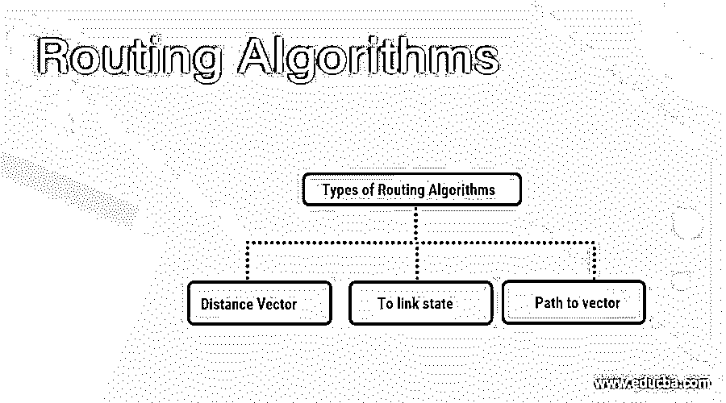
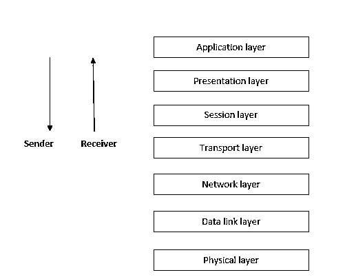
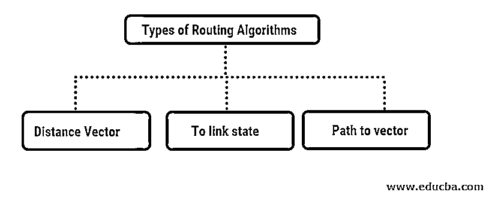

# 路由算法

> 原文：<https://www.educba.com/routing-algorithms/>

## 路由算法概述

在当今世界，任何事情的优化都是必不可少的。我们看到，如果我们全力优化，我们就在改进，这决定了我们实施这些事情的效率。说到网络，我们有一个不同类型的网络。网络中有不同类型的硬件，如路由器、网关、交换机、防火墙、网桥等。

如你所知，硬件没有逻辑；我们需要添加一些代码来工作。为了通过网络与这些不同的[网络设备](https://www.educba.com/networking-devices/)通信，路由器维护路由表。这不过是为这些设备分配的一些内存，用于存储从源到目的地的最佳路径的数据。

<small>网页开发、编程语言、软件测试&其他</small>

在真正开始学习路由算法之前，我们先来了解一下什么是路由器。路由器是一种用于连接互联网的设备。它是一种用于在计算机网络上传输数据包的设备。路由器一般做两件事一是数据包转发，二是路由。

### 什么是算法？

*   在计算机世界里，任何过程都是按部就班描述的。被称为算法。
*   IP 地址是虚拟世界中的地址。网络上的每个地址都有唯一的标识号。每个数据包都有这个唯一的地址，以便将数据传输到正确的目的地。每个设备都有一个唯一的 IP 地址。
*   IP 地址本身是一个单独的话题。目前，我们将坚持路由算法。如果你想了解更多关于 IP 地址的信息，你可以在网上找到很多资料。
*   路由算法:同样，路由算法是描述如何通过网络传输数据的逐步过程。

**什么是路由算法？**

该算法规定了如何通过计算机网络将数据包从源传输到目的地。这里路由器维护路由表。

### 谅解

*   你听说过 OSI 模型中的网络层吗？OSI 代表[开放系统互连(OSI)模型](https://www.educba.com/what-is-osi-model/)。
*   请参考以下 OSI 模型的示意图:

    

*   路由位于 OSI 模型的网络层。网络层是 OSI 模型的第三层。
*   在这一层，路由开始起作用。
*   它指定了通过网络将数据包从源发送到目的地的最佳路径。

### 解释路由算法

它有几个属性，比如:

*   正确性
*   简单
*   稳健性
*   稳定性
*   公平
*   效率

这些分为两大类。

1.  **非自适应路由算法:**非自适应算法一旦决定了自己的路由，就不匹配新路由。这种路由也被称为[静态路由](https://www.educba.com/what-is-static-routing/)。

这种路由进一步划分如下:

*   **泛洪:**这种路由，不需要网络。这种路由允许传入的数据包在每条链路上重新传输。每个数据包都有唯一的编号，因此重复的数据包很容易被丢弃。节点可以记住数据包，这样网络流量就平衡了。洪泛是一种非自适应算法，所以每个节点都要被访问。所有可能的路线都被检查了。我们可以说，泛洪是最简单的数据包转发形式。
*   **随机漫步:**顾名思义，它通过链路一个节点一个节点地发送。

2.  **自适应路由算法:**这种算法倾向于根据网络拓扑或流量负载的变化来改变其路由决策。自适应算法也称为动态路由算法。

### 类型

三种主要类型如下:

**1。距离矢量路由(distance-vector routing):路由器通常从路由表中获取数据。每台邻居路由器都会在特定的时间间隔内从其路由表中获取更新的信息。**

假设路由器在任何时候更新路由表时都获得了一条比以前更好的路由。每次都根据不希望、分组队列长度和时间延迟做出这个决定。

**例如**。距离矢量路由表如下所示:

| 网络 ID | 费用 | 下一跳 |
| ——— | ———————— | —————- |
| ——— | ———————– | —————- |

**2。到链路状态(link-state routing):** 链路步骤路由有以下步骤

*   链路状态路由发现节点，搜索它们的地址，并保存它们。
*   它测量两个相邻节点中的延迟。
*   它形成了消耗所有这些信息的分组。
*   它最终计算最短路径以获得最佳路线。
*   这种数据包使用选择泛洪。
*   通过识别唯一编号来避免重复
*   该算法主要用于变化不太频繁的较大环境。

**3。路径向量**(路径向量路由):这个例程对于域间路由非常有用。它作为存储更新信息的协议工作。

### 它是如何工作的？

让我们讨论一下它是如何工作的。

*   路由算法的作用是提高网络质量。在算法的帮助下，我们可以决定哪条路线最适合网络。
*   这适用于某些协议。我们也可以说它是一个应用在路线上的公式。
*   使用不同的算法有不同的方法来计算路线。根据网络的类型和用途，每种算法都得到了应用。

### 路由算法的需求是什么？

知道为什么需要他们。

*   路由对于不同系统之间的连接非常重要。所以我们可以通过网络与它交流。这就形成了互联网。路由器负责识别每台设备、其存在和结构，并发送数据包。这样一来，安全性就成了问题。
*   我们需要在几秒钟内通过网络传输数据。我们需要通过网络安全地传输数据。需要保持数据包的质量。所有这些工作都是由写在路由表中的算法来完成的。这确保了数据将按照要求通过网络传递。路由算法是最关键的部分。

### 结论

它们是网络的关键概念。如果你愿意从事网络方面的职业，你应该知道所有的路由算法以及如何实现它们。

### 推荐文章

这是路由算法的指南。这里我们分别讨论路由算法的概述、工作原理、类型和需求。您也可以浏览我们推荐的其他文章，了解更多信息——

1.  [什么是路由？](https://www.educba.com/what-is-routing/)
2.  [路由协议](https://www.educba.com/routing-protocol/)
3.  [计算机网络概论](https://www.educba.com/introduction-to-computer-network/)
4.  [什么是网络协议](https://www.educba.com/what-is-networking-protocols/)

